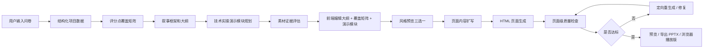
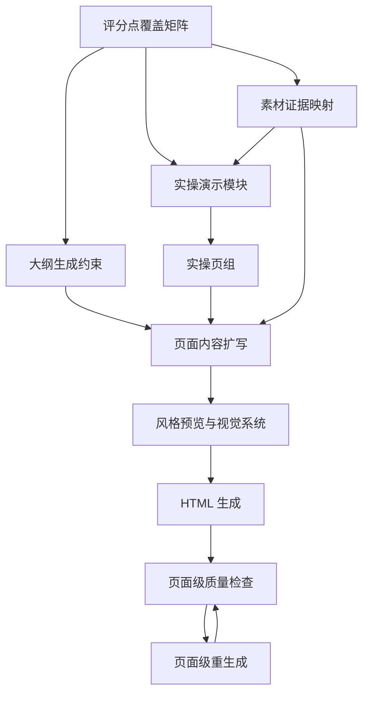

# AI PPT 路演级质量升级开发方案

面向用户：职业院校技能大赛参赛团队  
竞赛场景：技术实操 + 项目路演  
目标形态：从“能生成 PPT 式 HTML”升级到“能支撑真实比赛路演、能解释技术价值、能对齐评分点、能稳定交付”的生成系统。

## 1. 背景与目标

当前 AI 生成 PPT 式 HTML 的主流程已经具备基础闭环：

1. 用户填写问卷或项目信息。
2. 后端创建 PPT 生成任务。
3. AI 生成大纲。
4. 前端允许用户编辑大纲。
5. 用户确认后，后端生成页面内容和 HTML。
6. 前端预览，后端可导出 PPTX。

这个流程已经可以完成“资料到页面”的自动化，但距离职业院校技能大赛路演级 PPT 还差三类能力：

1. 评分点覆盖矩阵：保证生成内容不是泛泛而谈，而是逐项服务比赛评分。
2. 技术实操演示模块：把“做了什么、怎么做、为什么能体现能力”讲清楚。
3. 页面级质量检查和重生成：把 AI 输出从一次性生成改为可检测、可修复、可控质量的工程流水线。

在分析 `frontend-slides` 这个开源项目后，本方案进一步吸收 5 个最值得立刻借鉴的能力：

1. 风格预览三选一：让用户在生成全套页面前先看到真实视觉方向。
2. 内容密度限制：把“每页不要太满”变成可执行、可检测的生成规则。
3. 视口适配规则：强制 HTML 幻灯片完整适配 16:9 画布，不允许滚动和溢出。
4. 职业院校竞赛风格预设库：把视觉风格从 prompt 描述升级为结构化设计系统。
5. 实操素材优先：优先围绕截图、照片、数据图、视频关键帧等证据组织大纲和页面。

本方案围绕“三条质量主线 + 五个视觉与体验增强点”展开，要求每一步都能落地到现有前后端结构中，并且每一阶段必须通过明确验收标准后再进入下一阶段。

### 1.1 `frontend-slides` 可借鉴能力分析汇总

`frontend-slides` 本质上是一套 AI 生成 HTML 幻灯片的方法论和模板体系，它最值得借鉴的不是具体框架代码，而是“生成前先定风格、生成中控制密度、生成后保证播放体验”的工程化思路。

| 可借鉴能力 | `frontend-slides` 中的价值 | OREP 当前缺口 | 融入 OREP 的方式 |
| --- | --- | --- | --- |
| 风格预览三选一 | 用户先看 3 个视觉样张，再决定最终方向 | 当前直接进入全套 HTML 生成，用户对视觉结果不可预期 | 在大纲确认后、Round 4 前增加“视觉风格预览”步骤 |
| 内容密度限制 | 每页内容必须适合一屏演示，超量就拆页 | 当前 AI 容易堆文字、把讲稿塞进页面 | 在 Round 3/Round 4 和页面质检中加入密度规则 |
| 视口适配规则 | 幻灯片必须固定画布、无滚动、完整展示 | 当前 HTML 是页面形态，可能像网页而不像 PPT | 统一 1920×1080 画布、安全区、overflow 规则和渲染检测 |
| 风格预设库 | 用风格系统约束视觉，而不是靠一句“科技风” | 当前主题偏弱，缺少比赛场景风格体系 | 新增 `visual_style_profile` 和竞赛风格预设库 |
| 实操素材优先 | 图片/截图先被评估，再影响大纲和页面 | 当前问卷文本优先，证据素材没有进入生成主链路 | 增加素材上传、素材评估、证据映射和素材驱动页面生成 |

这 5 件事与原有三条主线的关系如下：

1. 风格预览三选一和风格预设库，主要增强 Round 4 之前的视觉决策。
2. 内容密度限制和视口适配规则，主要增强页面级质量检查和重生成。
3. 实操素材优先，主要增强评分点覆盖矩阵和技术实操演示模块。

融合后的目标不是把 OREP 改成单文件 HTML 生成器，而是在保留现有“问卷、大纲、编辑、生成、预览、导出 PPTX”链路的基础上，让系统更可控、更比赛化、更像真正的路演生产工具。

## 2. 当前系统落点

### 2.1 后端落点

当前 PPT 生成主逻辑位于：

1. `ai-scoring/app/routers/ppt_router.py`
2. `ai-scoring/app/services/ppt/ppt_service.py`
3. `ai-scoring/app/services/ppt/adapter_code/pipeline_coordinator.py`
4. `ai-scoring/app/services/ppt/prompts/round1_structurize.md`
5. `ai-scoring/app/services/ppt/prompts/round2_narrative.md`
6. `ai-scoring/app/services/ppt/prompts/round3_enrich.md`
7. `ai-scoring/app/services/ppt/prompts/round4_html_generation_optimized.md`

已有流程可理解为：


本次升级后，建议目标流程变为：



### 2.2 前端落点

当前用户侧主要落点：

1. `frontend/user/src/views/PptEditor.vue`
2. `frontend/user/src/stores/ppt.js`

建议新增或拆分组件：

1. `frontend/user/src/components/ppt/ScoreCoveragePanel.vue`
2. `frontend/user/src/components/ppt/PracticeDemoEditor.vue`
3. `frontend/user/src/components/ppt/PageQualityReport.vue`
4. `frontend/user/src/components/ppt/PageRegenerateDrawer.vue`
5. `frontend/user/src/components/ppt/VisualStylePreviewSelector.vue`
6. `frontend/user/src/components/ppt/MaterialEvidenceUploader.vue`
7. `frontend/user/src/components/ppt/ViewportQualityBadge.vue`

前端目标不是堆更多表单，而是让用户在关键节点知道：

1. 哪些评分点已经覆盖。
2. 哪些评分点证据不足。
3. 哪些实操步骤最适合上台演示。
4. 哪些页面质量不达标。
5. 哪些页面可以一键修复，哪些需要人工补资料。
6. 当前选择的视觉风格最终大概长什么样。
7. 哪些页面因为文字过密、溢出或滚动风险不适合上台播放。
8. 哪些素材可以作为实操证据，哪些素材质量不足或存在匿名风险。

## 3. 总体开发原则

### 3.1 不破坏当前主链路

所有新能力先以“增强字段 + 可选面板 + 后端兼容逻辑”接入，不能让原有生成流程因为缺少新字段而失败。

达标标准：

1. 老任务仍然可以恢复、确认、生成、预览。
2. 新任务可以生成新增质量数据。
3. 前端拿不到新增字段时展示空状态，而不是报错。
4. 后端新增服务失败时，主任务能降级继续或给出明确错误。

### 3.2 先结构化，再生成

面向路演级质量，不能直接让 AI “写得更好”。必须先把评分规则、证据、实操步骤、页面目标结构化，再让 AI 生成。

达标标准：

1. 每个评分点都有唯一 ID。
2. 每页内容能反查其服务的评分点。
3. 每个演示步骤能反查其证明的技术能力。
4. 每个质量问题能定位到页面、维度和修复建议。

### 3.3 质量标准要机器可检查

需要把“好不好”拆成可检测指标，例如：

1. 是否缺标题。
2. 是否缺核心论点。
3. 是否缺项目证据。
4. 是否缺技术实操步骤。
5. 是否存在空页面。
6. 是否文字过密。
7. 是否 HTML 渲染失败。
8. 是否评分点未覆盖。

达标标准：

1. 每次生成结束后都有质量报告。
2. 页面级问题能按严重程度排序。
3. 严重问题能触发重生成。
4. 前端能展示“为什么不达标”和“怎么修”。

### 3.4 先定视觉系统，再生成页面

AI 生成 HTML 幻灯片时，不能只靠一句“科技风”“商务风”。必须先确定结构化的视觉系统，再把它传给 Round 4。

视觉系统至少包含：

1. 风格 ID。
2. 适用赛项和项目类型。
3. 色彩 token。
4. 字体层级。
5. 常用页面布局。
6. 标志性视觉元素。
7. 动画策略。
8. 禁用规则。

达标标准：

1. 每个任务在进入 Round 4 前必须有 `visual_style_profile`。
2. 用户可以在前端看到至少 3 个风格预览样张。
3. Round 4 Prompt 不能只接收自然语言风格描述，必须接收结构化风格约束。
4. 生成结果必须能反查使用的风格预设版本。

### 3.5 素材优先于空泛描述

职业院校技能大赛强调“做过、会做、做得出来”。因此，截图、设备照片、数据图、系统界面、视频关键帧等素材应该成为生成逻辑的一等输入，而不是后期装饰。

达标标准：

1. 用户可以在大纲确认前上传或补充实操素材。
2. 系统能判断素材适合用于哪类页面。
3. 素材能绑定评分点、实操步骤和页面。
4. 素材质量不足、存在学校/姓名/Logo 等匿名风险时，必须提示用户。
5. 没有素材时系统可以继续生成，但必须标记证据不足风险。

## 4. 里程碑总览

| 阶段 | 名称 | 目标 | 是否阻断下一阶段 |
| --- | --- | --- | --- |
| M0 | 基线梳理与质量埋点 | 明确当前生成质量基线，补齐任务调试信息 | 是 |
| M1 | 评分点覆盖矩阵 | 建立评分点到页面、证据、话术的映射 | 是 |
| M2 | 技术实操演示模块 | 生成可用于比赛路演的实操演示结构 | 是 |
| M3 | 素材证据与风格预设 | 建立素材优先、风格预览、结构化视觉系统 | 是 |
| M4 | 页面级质量检查 | 对每页做内容、结构、视觉、HTML、密度、视口检测 | 是 |
| M5 | 页面级重生成 | 对不达标页面定向修复，不重跑全任务 | 是 |
| M6 | 前端体验整合 | 把矩阵、演示、风格、素材、质检融入编辑器 | 是 |
| M7 | 真实样例验收 | 用 3 到 5 个职业院校项目样例压测 | 是 |

## 5. M0：基线梳理与质量埋点

### 5.1 目标

在开发三大能力前，先确定当前系统到底生成到什么程度，避免凭感觉优化。

### 5.2 后端任务

1. 在 PPT 任务结果中保留完整中间产物。
2. 明确每一轮输出的 JSON 结构。
3. 为每个任务记录生成耗时、页数、失败原因、AI 原始返回摘要。
4. 增加一个轻量级质量摘要字段，例如 `quality_summary`。
5. 增加一个调试接口，返回任务的关键中间数据。

建议字段：

```json
{
  "quality_summary": {
    "slide_count": 18,
    "empty_page_count": 0,
    "html_success_count": 18,
    "html_failed_count": 0,
    "score_coverage_rate": null,
    "critical_issue_count": 0,
    "warning_issue_count": 0
  }
}
```

建议接口：

1. `GET /api/ppt/task/{task_id}/debug`
2. `GET /api/ppt/task/{task_id}/quality-summary`

### 5.3 前端任务

1. 在开发环境下为 `PptEditor.vue` 增加任务调试面板入口。
2. 展示当前任务 ID、状态、页数、失败信息。
3. 生成失败时展示更明确的失败阶段。

### 5.4 验证方式

1. 新建一个 5 页测试任务。
2. 新建一个 20 页测试任务。
3. 新建一个 40 页测试任务。
4. 分别检查任务状态、outline、enriched pages、HTML pages 是否可追踪。
5. 模拟 AI 返回空内容，确认系统能记录失败阶段。

### 5.5 进入下一阶段标准

必须同时满足：

1. 任意任务可以查到生成阶段和主要中间产物。
2. 前端失败提示能区分“大纲失败”“内容扩写失败”“HTML 生成失败”“导出失败”。
3. 生成完成后能得到页数、HTML 成功数、失败数。
4. 现有正常生成流程不受影响。

## 6. 事项一：评分点覆盖矩阵

### 6.1 为什么要做

职业院校技能大赛路演不是普通商业计划书。评委关心的不是“讲得完整”而是：

1. 是否符合赛项评分点。
2. 是否体现技术实操能力。
3. 是否有真实过程和证据。
4. 是否能讲出创新、价值、可落地性。
5. 是否能把项目成果和比赛要求精准对应。

当前生成流程主要围绕项目内容和叙事结构，缺少“评分点到内容”的硬映射。因此可能出现页面很多，但关键评分项没有被证明的问题。

### 6.2 目标形态

生成大纲前，系统先生成一份评分点覆盖矩阵。大纲、页面内容、演讲稿都必须引用这份矩阵。

矩阵核心问题：

1. 这个评分点是什么？
2. 用户已有材料中有没有证据？
3. 应该放在哪几页？
4. 应该用什么方式呈现？
5. 证据强度够不够？
6. 是否需要提醒用户补资料？

### 6.3 数据结构设计

建议新增结构：

```json
{
  "score_coverage_matrix": {
    "competition_type": "职业院校技能大赛",
    "project_type": "技术实操 + 项目路演",
    "dimensions": [
      {
        "dimension_id": "TECH_IMPLEMENTATION",
        "dimension_name": "技术实现与实操能力",
        "weight_level": "high",
        "expected_evidence": [
          "关键技术架构",
          "核心流程截图或演示步骤",
          "性能或效果数据",
          "异常处理或优化说明"
        ],
        "available_evidence": [
          {
            "evidence_id": "EV-001",
            "source": "questionnaire",
            "summary": "项目使用视觉识别完成缺陷检测",
            "strength": "medium",
            "missing_detail": "缺少模型指标和实操截图"
          }
        ],
        "target_pages": [5, 6, 7],
        "coverage_status": "partial",
        "risk_level": "high",
        "user_action_required": true,
        "suggested_user_prompt": "请补充核心实操流程、关键参数、效果数据或截图说明。"
      }
    ],
    "coverage_rate": 0.72,
    "critical_gaps": [
      "技术实现缺少可验证证据",
      "项目成果缺少量化指标"
    ]
  }
}
```

### 6.4 后端开发任务

建议新增文件：

1. `ai-scoring/app/services/ppt/quality/scoring_matrix_service.py`
2. `ai-scoring/app/services/ppt/prompts/scoring_matrix.md`
3. `ai-scoring/app/services/ppt/quality/models.py`
4. `ai-scoring/app/services/ppt/quality/material_evidence_service.py`

实现步骤：

1. 建立默认评分维度库。
2. 从问卷、结构化数据、知识库中抽取证据。
3. 从用户上传的截图、照片、图表、视频关键帧中抽取素材证据。
4. 调用 AI 生成评分覆盖矩阵。
5. 对 AI 返回做 schema 校验。
6. 将矩阵写入任务的 `outline_json` 或独立 JSON 字段。
7. 在 Round 2 生成叙事框架时注入矩阵。
8. 在 Round 3 页面扩写时要求每页绑定评分点和证据 ID。
9. 在 Round 4 HTML 生成时把评分点转成隐式页面目标，不必展示给终端观众。

第一版可以不建新表，先写入任务 JSON：

```json
{
  "outline_json": {
    "pipeline_context": {},
    "score_coverage_matrix": {},
    "outline": {}
  }
}
```

第二版再考虑新表：

1. `ppt_score_dimensions`
2. `ppt_score_evidence`
3. `ppt_page_score_mapping`
4. `ppt_material_assets`
5. `ppt_material_score_mapping`

素材证据字段建议：

```json
{
  "material_assets": [
    {
      "asset_id": "MAT-001",
      "type": "screenshot",
      "source": "upload",
      "filename": "model_training_result.png",
      "quality": "high",
      "privacy_risk": "low",
      "detected_content": "模型训练结果截图，包含准确率、召回率等指标",
      "recommended_usage": [
        "技术实操演示页",
        "成果数据页"
      ],
      "related_score_dimensions": [
        "TECH_IMPLEMENTATION",
        "RESULT_VALIDATION"
      ],
      "suggested_pages": [7, 13],
      "user_action_required": false
    }
  ]
}
```

### 6.5 Prompt 设计要求

`scoring_matrix.md` 必须明确要求：

1. 不允许编造用户没有提供的硬证据。
2. 可以提出“建议补充”的证据。
3. 每个评分点必须输出覆盖状态。
4. 每个高风险评分点必须输出用户补充建议。
5. 每个评分点必须映射到页面建议。

建议 Prompt 输出字段：

1. `dimension_id`
2. `dimension_name`
3. `importance`
4. `expected_evidence`
5. `available_evidence`
6. `missing_evidence`
7. `target_story_position`
8. `target_pages`
9. `coverage_status`
10. `risk_level`
11. `generation_guidance`
12. `user_action_required`

### 6.6 前端开发任务

建议新增 `ScoreCoveragePanel.vue`。

第一版展示：

1. 总覆盖率。
2. 高风险评分点数量。
3. 每个评分维度的覆盖状态。
4. 已有证据。
5. 缺失证据。
6. 建议放置页面。
7. 用户需要补充的信息。

第二版交互：

1. 用户可以为评分点补充证据。
2. 用户可以指定某评分点必须出现在某页。
3. 用户可以将评分点标记为“不适用”。
4. 用户修改后可触发大纲局部重排。

### 6.7 API 设计

建议新增：

1. `GET /api/ppt/task/{task_id}/score-matrix`
2. `POST /api/ppt/task/{task_id}/score-matrix/rebuild`
3. `PATCH /api/ppt/task/{task_id}/score-matrix/evidence`
4. `POST /api/ppt/task/{task_id}/outline/rebuild-with-score-matrix`

第一版可先不做全部接口，只要生成任务状态里能返回 `score_coverage_matrix`，前端先只读展示即可。

### 6.8 分步实施计划

#### Step 1：定义默认评分维度

任务：

1. 整理职业院校技能大赛常见路演评分维度。
2. 建立默认维度 JSON。
3. 允许未来按赛项覆盖不同维度。

建议默认维度：

1. 项目背景与问题洞察。
2. 技术方案与架构。
3. 技术实操过程。
4. 创新点与难点突破。
5. 成果数据与应用效果。
6. 团队分工与职业能力。
7. 商业价值或推广价值。
8. 路演表达与答辩准备。

完成标准：

1. 每个维度有 ID、名称、解释、期望证据、权重级别。
2. 后端能加载默认维度。
3. 单元测试能验证维度 ID 不重复。

验证方式：

1. 运行 Python 单元测试。
2. 用一份空问卷调用维度加载逻辑，不能报错。

进入下一步标准：

1. 默认维度稳定。
2. 字段命名和前端展示达成一致。

#### Step 2：抽取项目证据

任务：

1. 从 Round 1 的 `structured_data` 抽取项目证据。
2. 从用户问卷原始字段抽取证据。
3. 把证据归一化为 `evidence_items`。

完成标准：

1. 每条证据有来源、摘要、可信度、关联字段。
2. 不足证据不伪造，只标记缺失。
3. 能输出证据列表给评分矩阵生成器。

验证方式：

1. 输入包含技术方案、成果数据、团队分工的样例。
2. 检查至少抽取 8 条证据。
3. 输入缺少成果数据的样例，系统应标记缺失而不是编造数据。

进入下一步标准：

1. 证据抽取结果可读、稳定。
2. 缺失项能被识别。

#### Step 3：生成评分矩阵

任务：

1. 编写 `scoring_matrix.md`。
2. 实现 `ScoringMatrixService.generate(...)`。
3. 对 AI 返回做 JSON 解析和校验。
4. 失败时返回规则兜底矩阵。

完成标准：

1. 有效输入下能生成完整矩阵。
2. AI 返回不规范时能修复或降级。
3. 高风险缺口能被列出。

验证方式：

1. 用 3 个项目样例生成矩阵。
2. 人工检查评分点和证据映射是否合理。
3. 模拟 AI 返回 Markdown 包裹 JSON，解析仍成功。
4. 模拟 AI 返回空，系统返回兜底矩阵。

进入下一步标准：

1. 覆盖率计算稳定。
2. 每个评分维度都有状态。
3. 不出现无来源硬事实。

#### Step 4：注入大纲生成

任务：

1. 在 Round 2 前生成评分矩阵。
2. 将矩阵作为大纲生成约束。
3. 大纲每页增加 `score_dimension_ids`。
4. 大纲每页增加 `evidence_ids`。

完成标准：

1. 每个关键评分维度至少映射到 1 页。
2. 高权重维度至少映射到 2 页或 1 个重点演示模块。
3. 大纲中能看到页面服务的评分目标。

验证方式：

1. 生成 15 页左右项目路演大纲。
2. 检查技术实现、实操过程、成果数据是否被安排到核心页面。
3. 删除用户成果数据后重新生成，应出现补资料提示。

进入下一步标准：

1. 前端可展示页面与评分点映射。
2. 用户能理解哪些页在服务哪些评分点。

#### Step 5：前端展示评分覆盖

任务：

1. 在大纲编辑页加入评分覆盖侧栏。
2. 在每页卡片上显示关联评分点。
3. 对缺证据维度显示提醒。
4. 支持用户补充证据文本。

完成标准：

1. 用户无需打开调试信息即可看到覆盖情况。
2. 缺失证据有明确引导。
3. 补充证据后能保存在任务状态中。

验证方式：

1. 前端打开 outline_ready 任务。
2. 检查覆盖面板正常渲染。
3. 修改某评分点证据后刷新页面，数据不丢失。

进入下一步标准：

1. 前端无控制台错误。
2. 评分矩阵不影响原大纲编辑。
3. 用户可以知道“哪里不够比赛化”。

### 6.9 验收标准

评分点覆盖矩阵阶段必须达到：

1. 评分维度覆盖率不低于 90%。
2. 高权重评分维度覆盖率必须为 100%。
3. 每个高权重维度至少有 1 条证据或 1 条补充建议。
4. 不允许 AI 编造量化指标。
5. 每页大纲至少能映射到 1 个页面目标。
6. 前端能展示评分覆盖、缺口和补充建议。

## 7. 事项二：技术实操演示模块

### 7.1 为什么要做

职业院校技能大赛的路演通常不只是“讲项目”，还要体现学生的技术实操能力。评委会关心：

1. 你们是否真的做过。
2. 技术流程是否清楚。
3. 核心操作是否专业。
4. 难点如何解决。
5. 实操成果是否能被验证。

当前 PPT 生成容易把技术讲成概念介绍，比如“我们采用 AI 算法提升效率”。但路演级表达应该是“我们在第 3 步完成数据清洗，使用某模型训练，解决了某类误检，最终指标从 A 提升到 B”。

### 7.2 目标形态

系统自动生成一个“技术实操演示模块”，用于指导 PPT 页面和演讲稿。

模块包括：

1. 演示目标。
2. 演示场景。
3. 操作步骤。
4. 每一步体现的技术能力。
5. 页面呈现建议。
6. 需要截图、视频或数据证据的位置。
7. 演讲话术。
8. 失败兜底说法。

### 7.3 数据结构设计

建议结构：

```json
{
  "practice_demo_module": {
    "demo_title": "核心技术实操演示：从数据采集到智能识别",
    "demo_goal": "证明团队具备完整技术落地能力",
    "recommended_duration_minutes": 3,
    "related_score_dimensions": [
      "TECH_IMPLEMENTATION",
      "PRACTICAL_SKILL",
      "RESULT_VALIDATION"
    ],
    "steps": [
      {
        "step_id": "DEMO-01",
        "step_title": "采集并清洗原始数据",
        "operation_goal": "展示数据处理能力",
        "what_to_show": "展示数据来源、清洗前后对比、异常样本处理",
        "technical_points": [
          "数据采集",
          "异常值处理",
          "样本标注"
        ],
        "required_evidence": [
          "清洗前后截图",
          "样本数量变化",
          "异常处理规则"
        ],
        "available_evidence": [],
        "missing_evidence": [
          "缺少清洗前后截图"
        ],
        "target_pages": [6],
        "speaker_script": "这一页我们重点展示从原始数据到可训练数据集的处理过程...",
        "fallback_script": "如果现场无法展示系统，我们可以用这张流程图说明每一步操作..."
      }
    ]
  }
}
```

### 7.4 后端开发任务

建议新增：

1. `ai-scoring/app/services/ppt/quality/practice_demo_service.py`
2. `ai-scoring/app/services/ppt/prompts/practice_demo_planner.md`

接入点：

1. 在评分矩阵生成之后生成实操演示模块。
2. 在大纲生成时，将演示模块转为页面章节。
3. 在页面扩写时，将演示步骤转为每页内容。
4. 在 HTML 生成时，让页面呈现更像“现场展示”而不是纯文本说明。

### 7.5 前端开发任务

建议新增 `PracticeDemoEditor.vue`。

第一版功能：

1. 展示系统推荐的演示模块。
2. 展示演示步骤。
3. 显示每一步需要的证据。
4. 允许用户编辑步骤标题、说明、话术。
5. 允许用户标记某一步“现场可演示”或“仅 PPT 展示”。
6. 显示每一步推荐使用的素材，例如系统截图、设备照片、数据图。
7. 标记素材缺失或匿名风险。

第二版功能：

1. 支持上传截图或填写截图说明。
2. 支持选择某步骤对应页面。
3. 支持一键生成“实操演示页组”。
4. 支持生成答辩备问。
5. 支持从素材库拖拽素材到实操步骤。
6. 支持把某个素材标记为“必须出现在最终 PPT”。

### 7.6 API 设计

建议新增：

1. `GET /api/ppt/task/{task_id}/practice-demo`
2. `POST /api/ppt/task/{task_id}/practice-demo/rebuild`
3. `PATCH /api/ppt/task/{task_id}/practice-demo`
4. `POST /api/ppt/task/{task_id}/practice-demo/apply-to-outline`

第一版可以先把 `practice_demo_module` 作为任务状态的一部分返回。

### 7.7 分步实施计划

#### Step 1：定义实操演示模板

任务：

1. 总结不同项目类型的演示模板。
2. 至少支持通用技术项目模板。
3. 模板字段覆盖操作、证据、话术、页面建议。

建议模板类型：

1. 软件系统类：登录、核心流程、数据处理、结果展示。
2. 智能制造类：设备连接、参数设置、过程控制、结果检测。
3. AI 应用类：数据采集、模型训练、推理演示、效果评估。
4. 电商或服务类：用户场景、业务流程、后台管理、数据看板。
5. 文旅或设计类：调研过程、方案设计、作品呈现、用户反馈。

完成标准：

1. 至少有 1 个通用模板。
2. 至少有 3 个行业方向模板草案。
3. 每个模板都有步骤结构和证据要求。

验证方式：

1. 使用不同项目类型样例匹配模板。
2. 匹配不到时使用通用模板。

进入下一步标准：

1. 模板能覆盖大多数职业院校项目。
2. 模板不会强行要求用户没有的材料。

#### Step 2：生成实操演示模块

任务：

1. 编写 `practice_demo_planner.md`。
2. 实现 `PracticeDemoService.generate(...)`。
3. 输入评分矩阵、结构化数据、大纲草案。
4. 输入素材证据评估结果。
5. 输出可编辑演示模块。

完成标准：

1. 每个演示模块有 3 到 6 个步骤。
2. 每一步都说明操作目标、技术点、证据、页面建议。
3. 每一步都绑定至少 1 个评分维度。
4. 每一步能说明是否有可用素材支撑。

验证方式：

1. 用 AI 应用类项目测试，应出现数据、模型、推理、效果步骤。
2. 用软件系统类项目测试，应出现核心业务流程演示。
3. 用户材料不足时，应出现缺证据提醒。
4. 上传系统截图后，对应演示步骤应优先引用该截图。

进入下一步标准：

1. 实操模块能被前端展示。
2. 实操模块能影响大纲。

#### Step 3：将演示模块注入大纲

任务：

1. 在大纲生成或大纲优化阶段插入“实操演示页组”。
2. 页组建议包含 2 到 5 页。
3. 每页对应一个或多个演示步骤。
4. 页面类型建议使用流程图、步骤卡、前后对比、系统截图占位、指标卡。

完成标准：

1. 大纲中有明确的“技术实操演示”章节。
2. 关键演示步骤不会被挤压成一页文字。
3. 每个演示页都带有页面目标和讲稿要点。

验证方式：

1. 生成 15 页 PPT，大纲中至少有 2 页实操演示。
2. 生成 25 页 PPT，大纲中至少有 3 页实操演示。
3. 检查实操页不是空泛介绍，而是具体操作过程。

进入下一步标准：

1. 用户可以在前端编辑实操步骤。
2. 确认大纲后，实操步骤能传到内容扩写。

#### Step 4：优化实操页面内容生成

任务：

1. Round 3 页面扩写时为实操页生成更具体内容。
2. 每个实操页必须有“操作步骤、关键技术、证据呈现、讲解话术”。
3. 不足证据要用占位提示，不允许编造。

完成标准：

1. 实操页内容不低于 3 个具体操作点。
2. 实操页讲稿能指导现场讲解。
3. 证据不足时页面显示“建议补充截图/数据”，而不是虚构截图。

验证方式：

1. 检查生成的 enriched pages。
2. 检查 HTML 是否能明显看出实操流程。
3. 人工阅读演讲稿，判断是否能上台讲。

进入下一步标准：

1. 页面内容达到可讲解状态。
2. 实操页质量可进入页面级质检。

#### Step 5：前端实操编辑体验

任务：

1. 在大纲编辑页加入“实操演示”Tab。
2. 用户可编辑演示步骤。
3. 用户可标记证据状态。
4. 用户可选择“插入实操页组”。
5. 生成前给出实操模块完整性提示。

完成标准：

1. 用户能看懂系统建议的演示逻辑。
2. 用户能补充关键信息。
3. 用户未补充时系统也能生成，但会提示质量风险。

验证方式：

1. 打开 outline_ready 任务。
2. 修改演示步骤后刷新，数据不丢。
3. 确认生成后，HTML 页面反映修改后的步骤。

进入下一步标准：

1. 前端交互稳定。
2. 用户知道“怎么让 PPT 更像比赛路演”。

### 7.8 验收标准

技术实操演示模块阶段必须达到：

1. 每个项目至少生成 1 个实操演示模块。
2. 每个模块有 3 到 6 个演示步骤。
3. 每个步骤至少绑定 1 个评分维度。
4. 每个步骤有操作目标、技术点、证据要求、讲稿建议。
5. 大纲中必须出现实操演示页组。
6. 实操页不能只出现概念性描述，必须有具体操作或证据占位。
7. 用户能在前端编辑实操步骤。

## 8. 事项三：页面级质量检查和重生成

### 8.1 为什么要做

AI 生成内容最常见的问题不是“完全失败”，而是局部质量不稳定：

1. 某页空。
2. 某页文字过多。
3. 某页没有核心观点。
4. 某页与大纲不一致。
5. 某页 HTML 渲染失败。
6. 某页风格不统一。
7. 某页缺少评分点支撑。
8. 某页讲稿和画面内容不一致。

如果每次都重跑全任务，成本高、耗时长、体验差。因此需要页面级检查和页面级重生成。

### 8.2 目标形态

每页生成后都得到一份质量报告，系统自动判断：

1. 是否通过。
2. 存在哪些问题。
3. 问题严重程度。
4. 是否需要自动修复。
5. 应该重生成内容还是只修 HTML。

### 8.3 数据结构设计

建议结构：

```json
{
  "page_quality_reports": [
    {
      "page_index": 6,
      "page_title": "核心技术实操流程",
      "status": "warning",
      "score": 82,
      "checks": [
        {
          "check_id": "CONTENT_HAS_CORE_ARGUMENT",
          "name": "是否有核心论点",
          "status": "pass",
          "severity": "medium",
          "message": "页面包含明确核心论点"
        },
        {
          "check_id": "SCORING_DIMENSION_COVERED",
          "name": "是否覆盖目标评分点",
          "status": "fail",
          "severity": "high",
          "message": "页面目标包含技术实操能力，但内容缺少具体操作步骤",
          "suggested_fix": "补充 3 个操作步骤和对应证据"
        }
      ],
      "regeneration_strategy": "content_and_html",
      "can_auto_fix": true
    }
  ],
  "deck_quality_summary": {
    "average_score": 86,
    "pass_count": 16,
    "warning_count": 2,
    "fail_count": 0,
    "critical_issue_count": 0
  }
}
```

### 8.4 检查维度设计

建议分成五类：

#### 内容质量

1. 是否有标题。
2. 是否有核心论点。
3. 是否有页面摘要。
4. 是否有内容要点。
5. 是否有演讲稿。
6. 是否空泛。
7. 是否出现编造硬数据风险。

#### 比赛适配

1. 是否覆盖目标评分点。
2. 是否有项目证据。
3. 是否体现技术能力。
4. 是否有成果或价值表达。
5. 是否服务路演叙事节奏。

#### 实操表达

1. 实操页是否有操作步骤。
2. 是否有技术点解释。
3. 是否有截图或证据占位。
4. 是否有现场讲解话术。
5. 是否有异常或难点说明。

#### HTML 与视觉

1. HTML 是否可渲染。
2. 是否缺少基础结构。
3. 是否文字过密。
4. 是否疑似溢出。
5. 是否有明显空白。
6. 是否样式与整体风格冲突。
7. 是否固定 1920×1080 或等比例 16:9 画布。
8. 是否出现滚动条。
9. 是否超出安全区。
10. 是否误把讲稿内容渲染进页面。
11. 是否使用了任务选定的 `visual_style_profile`。

#### 内容密度

1. 普通内容页是否超过 5 个要点。
2. 实操流程页是否超过 6 个步骤。
3. 数据页是否超过 3 个核心数字。
4. 标题是否超过建议长度。
5. 单页正文是否超过建议字数。
6. 是否一页承担多个叙事目标。
7. 是否应该拆页或压缩。

#### 视口适配

1. 页面是否能完整适配 1920×1080。
2. 页面是否能在前端预览缩放容器中完整显示。
3. 是否设置 `overflow: hidden`。
4. 是否存在需要滚动才能看完的内容。
5. 图表、卡片、标题是否进入安全区。
6. iframe 预览和 PPTX 渲染是否使用一致画布。

#### 全局一致性

1. 页面标题是否与大纲一致。
2. 页数是否一致。
3. 页面顺序是否一致。
4. 术语是否一致。
5. 讲稿是否与页面内容一致。

### 8.5 后端开发任务

建议新增：

1. `ai-scoring/app/services/ppt/quality/page_quality_service.py`
2. `ai-scoring/app/services/ppt/quality/regeneration_service.py`
3. `ai-scoring/app/services/ppt/quality/viewport_quality_service.py`
4. `ai-scoring/app/services/ppt/quality/content_density_service.py`
5. `ai-scoring/app/services/ppt/visual_style/style_preset_service.py`
6. `ai-scoring/app/services/ppt/visual_style/style_preview_service.py`
7. `ai-scoring/app/services/ppt/prompts/page_quality_review.md`
8. `ai-scoring/app/services/ppt/prompts/page_regeneration.md`
9. `ai-scoring/app/services/ppt/prompts/style_preview_generation.md`

接入点：

1. Round 3 后做内容级检查。
2. Round 4 后做 HTML 级检查。
3. 生成完成前汇总整套质量报告。
4. 对严重问题执行最多 2 轮自动重生成。
5. 前端允许用户对单页手动重生成。
6. Round 4 前必须确定 `visual_style_profile`。
7. Round 4 后必须检查内容密度和视口适配。

### 8.6 API 设计

建议新增：

1. `GET /api/ppt/task/{task_id}/quality-report`
2. `POST /api/ppt/task/{task_id}/quality-check`
3. `POST /api/ppt/task/{task_id}/pages/{page_index}/regenerate`
4. `POST /api/ppt/task/{task_id}/pages/{page_index}/repair-html`
5. `POST /api/ppt/task/{task_id}/regenerate-failed-pages`
6. `GET /api/ppt/style-presets`
7. `POST /api/ppt/task/{task_id}/style-preview`
8. `PATCH /api/ppt/task/{task_id}/visual-style`
9. `POST /api/ppt/task/{task_id}/materials`
10. `GET /api/ppt/task/{task_id}/materials`
11. `POST /api/ppt/task/{task_id}/materials/analyze`

单页重生成请求示例：

```json
{
  "reason": "评分点覆盖不足，实操步骤太空泛",
  "strategy": "content_and_html",
  "keep_visual_style": true,
  "user_instruction": "请突出模型训练和现场推理过程"
}
```

风格预览请求示例：

```json
{
  "candidate_style_ids": [
    "competition-tech-dark",
    "operation-demo-board",
    "roadshow-pro-light"
  ],
  "preview_page_type": "cover",
  "outline_page_index": 1
}
```

素材分析请求示例：

```json
{
  "asset_ids": ["MAT-001", "MAT-002"],
  "analysis_goals": [
    "score_evidence_mapping",
    "practice_demo_usage",
    "privacy_risk_check"
  ]
}
```

### 8.7 分步实施计划

#### Step 1：实现规则型内容检查

任务：

1. 对 enriched pages 做基础字段检查。
2. 检查标题、摘要、内容点、讲稿是否存在。
3. 检查实操页是否有步骤。
4. 检查每页是否绑定评分点。

完成标准：

1. 不依赖 AI 即可完成基础检查。
2. 能输出页面级 pass/warning/fail。
3. 能统计整套 PPT 的问题数量。

验证方式：

1. 构造空页面，必须 fail。
2. 构造缺讲稿页面，必须 warning。
3. 构造实操页但无步骤，必须 fail 或 high warning。

进入下一步标准：

1. 规则检查误报可接受。
2. 检查结果结构稳定。

#### Step 2：实现 HTML 渲染检查

任务：

1. 对 HTML 字符串做静态检查。
2. 检查是否包含完整 HTML 或 slide 容器。
3. 检查是否存在明显错误标签。
4. 如果已有截图渲染能力，接入截图检测。
5. 检查文字长度和页面密度。

完成标准：

1. HTML 为空必须 fail。
2. HTML 缺 body 或主容器必须 warning 或 fail。
3. 超长文本页面必须 warning。
4. 渲染失败能定位到页。

验证方式：

1. 人为写入坏 HTML。
2. 人为写入超长页面。
3. 检查质量报告是否正确。

进入下一步标准：

1. HTML 问题能被识别。
2. 不会因为单页 HTML 坏掉导致整套质量检查崩溃。

#### Step 3：引入 AI 质量评审

任务：

1. 编写 `page_quality_review.md`。
2. 对规则检查通过但质量可疑的页面调用 AI 评审。
3. AI 评审重点判断空泛程度、比赛适配度、讲稿一致性。
4. 对 AI 评审结果做 schema 校验。

完成标准：

1. AI 只评审必要页面，控制成本。
2. 每个问题都有具体原因和修复建议。
3. AI 评审不能覆盖规则型严重错误。

验证方式：

1. 构造一页语义空泛但字段齐全的页面。
2. AI 应能识别“内容空泛”。
3. 构造一页与评分点无关的页面。
4. AI 应能识别“目标不匹配”。

进入下一步标准：

1. AI 评审结果稳定。
2. 修复建议可用于重生成。

#### Step 4：实现页面级重生成

任务：

1. 实现 `RegenerationService.regenerate_page(...)`。
2. 支持只重生成内容。
3. 支持只修复 HTML。
4. 支持内容 + HTML 重新生成。
5. 保留原页面版本用于回滚。

完成标准：

1. 单页重生成不影响其他页面。
2. 重生成后页码、标题、评分点映射不丢失。
3. 重生成后自动再次质检。
4. 最多自动重试 2 次，避免无限循环。

验证方式：

1. 对单页手动触发重生成。
2. 检查其他页面 HTML 不变。
3. 检查问题页质量分提升。
4. 重生成失败时保留原页面。

进入下一步标准：

1. 页面级重生成稳定。
2. 前端可以安全调用。

#### Step 5：生成完成前自动修复

任务：

1. 在整套 HTML 生成后运行质量检查。
2. 对 critical 问题自动重生成。
3. 对 warning 问题记录到报告，不阻断完成。
4. 自动修复后更新任务进度和质量摘要。

完成标准：

1. 空页面、HTML 失败页必须自动修复。
2. 自动修复最多 2 轮。
3. 修复失败要明确提示用户。
4. 任务最终状态不能假装成功。

验证方式：

1. 人为让某页 HTML 为空。
2. 系统应自动重生成该页。
3. 若重生成仍失败，任务应显示部分失败和原因。

进入下一步标准：

1. 自动修复不会显著拖垮整体生成。
2. 用户能看到修复过程。

#### Step 6：前端质量报告和重生成交互

任务：

1. 新增 `PageQualityReport.vue`。
2. 在预览页显示整套质量分。
3. 在页面缩略图上显示 pass/warning/fail。
4. 支持点击问题查看原因。
5. 支持单页重生成。
6. 支持用户输入重生成要求。

完成标准：

1. 用户知道哪些页有问题。
2. 用户知道问题原因。
3. 用户可以一键修复。
4. 修复中有 loading 和状态反馈。
5. 修复后预览自动刷新。

验证方式：

1. 打开带 warning 的任务。
2. 单页点击重生成。
3. 页面更新后质量状态变化。
4. 刷新页面后质量报告仍存在。

进入下一步标准：

1. 用户不用重新生成整套 PPT 就能修单页。
2. 质量报告不干扰正常预览。

### 8.8 验收标准

页面级质量检查和重生成阶段必须达到：

1. HTML 渲染成功率 100%，失败页必须被标出。
2. 空页面数量为 0。
3. 严重问题数量为 0 才允许标记最终完成。
4. Warning 页面不超过总页数的 15%。
5. 单页重生成成功率不低于 90%。
6. 单页重生成不能改变其他页面。
7. 每个质量问题必须有可读原因和修复建议。
8. 前端可查看质量报告并触发单页重生成。

## 9. 三件事之间的集成关系

这三件事不是并列插件，而是一条质量链：



开发时必须保证数据贯通：

1. 评分点 ID 贯穿大纲、页面内容、质量检查。
2. 证据 ID 贯穿评分矩阵、实操步骤、页面内容。
3. 实操步骤 ID 贯穿演示模块、页面内容、讲稿。
4. 质量问题 ID 贯穿后端报告和前端修复入口。
5. 素材 ID 贯穿素材库、评分矩阵、实操模块、页面内容和最终 HTML。
6. 风格 ID 贯穿风格预览、Round 4、质量检查和单页重生成。

## 10. 数据流详细规划

### 10.1 生成大纲前

输入：

1. 用户问卷。
2. 项目基础信息。
3. 赛项类型。
4. 默认评分维度。
5. 用户上传的实操素材。

输出：

1. `structured_data`
2. `score_coverage_matrix`
3. `practice_demo_module`
4. `material_assets`
5. 初版 `outline`

进入下一步标准：

1. 大纲页数合理。
2. 高权重评分点均有页面映射。
3. 实操演示模块存在。
4. 上传素材已完成用途分析和匿名风险检查。

### 10.2 用户编辑大纲时

前端展示：

1. 页面列表。
2. 每页内容摘要。
3. 每页评分点。
4. 评分覆盖总览。
5. 实操演示模块。
6. 缺资料提醒。
7. 素材证据面板。
8. 素材与评分点、实操步骤、页面的绑定关系。

用户可操作：

1. 修改页面标题。
2. 修改页面内容。
3. 修改页面顺序。
4. 修改评分点关联。
5. 修改实操步骤。
6. 补充证据。
7. 上传或删除素材。
8. 指定某个素材必须用于某页。

进入下一步标准：

1. 用户确认前，前端提示关键缺口。
2. 用户可以选择继续生成或返回补资料。
3. 提交给后端的数据包含用户修改后的矩阵、演示模块和素材绑定。

### 10.3 生成 HTML 前

输入：

1. 用户确认后的 outline。
2. 评分矩阵。
3. 实操模块。
4. 用户补充证据。
5. 素材证据映射。
6. 用户选择的 `visual_style_profile`。

输出：

1. enriched pages。
2. 页面讲稿。
3. HTML pages。
4. 初版质量报告。
5. 整套播放版 HTML 的生成数据。

进入下一步标准：

1. 每页都有内容。
2. 每页都有标题。
3. 每页都有页面目标。
4. 实操页有操作步骤。
5. 每页都有密度预算。
6. 每页都有视口适配目标。
7. Round 4 已拿到结构化风格预设。

### 10.4 生成 HTML 后

系统执行：

1. 页面级质量检查。
2. 自动修复 critical 问题。
3. 汇总质量报告。
4. 更新任务状态。
5. 生成或更新整套浏览器播放版 `deck.html`。
6. 检查密度、视口、滚动条、讲稿泄露和风格一致性。

进入完成标准：

1. 没有 critical 问题。
2. 没有空页面。
3. HTML 可预览。
4. 质量报告可展示。
5. 浏览器播放版可用。
6. 不存在需要滚动才能看完的页面。

## 11. 前端体验设计

### 11.1 大纲编辑页改造

建议从一个长页面改为三栏或多 Tab：

1. 左侧：页面目录。
2. 中间：当前页编辑。
3. 右侧：评分覆盖 / 实操建议 / 质量提示。

Tab 建议：

1. 页面大纲。
2. 评分覆盖。
3. 实操演示。
4. 缺口提醒。
5. 素材证据。
6. 视觉风格。

### 11.2 评分覆盖体验

展示方式：

1. 顶部显示总覆盖率。
2. 高风险维度用红色或醒目标识。
3. 已覆盖维度显示绿色。
4. 部分覆盖显示黄色。
5. 未覆盖显示灰色或红色。

用户动作：

1. 点击评分点，定位关联页面。
2. 点击缺失证据，打开补充输入框。
3. 点击“应用建议”，自动把评分点绑定到推荐页面。

### 11.3 实操演示体验

展示方式：

1. 使用步骤时间线。
2. 每一步显示操作目标和技术点。
3. 证据缺失显示提醒。
4. 可标记“现场演示”或“PPT 展示”。

用户动作：

1. 编辑步骤。
2. 添加步骤。
3. 删除不适用步骤。
4. 填写截图说明。
5. 应用到大纲。

### 11.4 质量报告体验

展示方式：

1. 预览页顶部显示整体质量分。
2. 页面缩略图显示状态标识。
3. 问题列表按严重程度排序。
4. 每个问题给出原因和修复建议。

用户动作：

1. 单页重生成。
2. 只修 HTML。
3. 重写内容。
4. 输入自定义修改要求。
5. 回滚到上一版。

### 11.5 风格预览三选一体验

展示方式：

1. 在用户确认大纲后展示 3 个风格候选。
2. 每个候选用同一页内容生成视觉样张，避免用户被内容差异干扰。
3. 每个风格卡片显示风格名称、适用场景、视觉关键词和风险提示。
4. 默认推荐最适合当前项目类型和赛项的风格。

用户动作：

1. 点击查看大图预览。
2. 选择一个风格作为整套 PPT 的视觉系统。
3. 可以重新生成风格预览。
4. 可以选择“保持默认推荐，继续生成”。

进入下一步标准：

1. 用户必须有一个已选择的 `visual_style_profile`。
2. 风格预览失败时可降级到默认风格。
3. 前端明确提示“该风格将影响全部 HTML 页面和单页重生成”。

### 11.6 素材证据体验

展示方式：

1. 素材以卡片形式展示，包括缩略图、类型、质量、匿名风险、推荐用途。
2. 每个素材显示已绑定的评分点、实操步骤和页面。
3. 高价值素材标记为“建议重点使用”。
4. 高风险素材标记为“建议处理后再使用”。

用户动作：

1. 上传图片、截图、PDF 截图或视频关键帧。
2. 手动修改素材说明。
3. 将素材拖拽或绑定到某个实操步骤。
4. 将素材标记为“不使用”。
5. 对匿名风险素材进行替换或确认。

进入下一步标准：

1. 素材不会阻塞生成主流程。
2. 但如果评分高权重维度缺证据，前端必须提示用户补素材或文字证据。
3. 用户确认生成前能看到“素材证据覆盖情况”。

## 12. 后端实现顺序建议

建议严格按照以下顺序开发，避免同时改太多导致难以定位问题。

### 12.1 第一批：只读增强

目标：不改变主生成结果，只生成附加分析。

任务：

1. 新增默认评分维度。
2. 新增评分矩阵生成。
3. 新增实操模块生成。
4. 新增素材证据分析。
5. 新增风格预设库。
6. 新增基础质量检查。
7. 把结果写入任务 JSON。

完成标准：

1. 主流程成功率不下降。
2. 附加分析失败不阻断任务。
3. 前端可读取分析结果。
4. 前端可读取风格预设和素材分析结果。

### 12.2 第二批：生成约束

目标：让评分矩阵和实操模块真正影响大纲和内容。

任务：

1. Round 2 注入评分矩阵。
2. Round 2 注入实操模块。
3. Round 2 注入素材证据。
4. Round 3 要求页面绑定评分点、演示步骤和素材 ID。
5. Round 4 根据页面目标和 `visual_style_profile` 优化 HTML 呈现。
6. Round 4 执行内容密度预算和视口适配约束。

完成标准：

1. 大纲结构明显更像比赛路演。
2. 实操页质量明显提升。
3. 页面内容能反查评分点。
4. 页面视觉风格一致。
5. 页面不再明显堆文字。

### 12.3 第三批：闭环修复

目标：把质量检查结果用于自动修复。

任务：

1. 实现页面级重生成。
2. 实现生成完成前自动修复。
3. 实现前端单页重生成。
4. 实现版本回滚。
5. 实现单页密度压缩。
6. 实现单页视口修复。
7. 实现保留当前风格的单页重生成。

完成标准：

1. 局部问题可局部修。
2. 用户不必重新跑全套生成。
3. 质量问题有闭环。

## 13. 测试方案

### 13.1 单元测试

覆盖：

1. 默认评分维度加载。
2. 证据抽取。
3. 评分矩阵 schema 校验。
4. 实操模块 schema 校验。
5. 页面质量规则检查。
6. 重生成策略选择。
7. 风格预设 schema 校验。
8. 内容密度规则检查。
9. 视口适配规则检查。
10. 素材证据映射检查。

通过标准：

1. 核心服务单元测试通过率 100%。
2. 异常输入不会抛出未捕获异常。
3. 空输入有合理兜底。

### 13.2 集成测试

覆盖：

1. 创建任务。
2. 生成大纲。
3. 获取评分矩阵。
4. 获取实操模块。
5. 上传并分析素材。
6. 生成并选择风格预览。
7. 确认大纲。
8. 生成 HTML。
9. 获取质量报告。
10. 单页重生成。

通过标准：

1. 5 页任务完整通过。
2. 15 页任务完整通过。
3. 30 页任务完整通过。
4. 失败时错误信息明确。

### 13.3 前端测试

覆盖：

1. outline_ready 状态恢复。
2. 评分覆盖面板展示。
3. 实操演示编辑。
4. 质量报告展示。
5. 单页重生成交互。
6. 刷新后状态恢复。
7. 风格预览选择。
8. 素材上传和绑定。
9. 密度/视口问题提示。

通过标准：

1. 无 Vue 编译错误。
2. 无控制台关键报错。
3. 刷新后关键数据不丢。
4. 用户操作有 loading 和结果提示。

### 13.4 人工评审

建议准备 3 到 5 个样例项目：

1. AI 视觉检测类。
2. 智能制造或物联网类。
3. 软件系统或管理平台类。
4. 电商、文旅或服务创新类。
5. 数据分析或数字化运营类。

人工评审维度：

1. 是否像真实比赛 PPT。
2. 是否能讲出技术实操。
3. 是否明显覆盖评分点。
4. 是否有证据而不是空话。
5. 是否页面可读、可讲、可展示。

通过标准：

1. 至少 80% 页面被评为可直接用于初稿。
2. 核心实操页被评为可讲解。
3. 不出现明显编造数据。
4. 不出现空页面。
5. 不出现大量文字堆砌。

## 14. 发布策略

### 14.1 灰度开关

建议增加配置：

```env
PPT_ENABLE_SCORE_MATRIX=true
PPT_ENABLE_PRACTICE_DEMO=true
PPT_ENABLE_MATERIAL_EVIDENCE=true
PPT_ENABLE_STYLE_PREVIEW=true
PPT_ENABLE_DENSITY_RULES=true
PPT_ENABLE_VIEWPORT_CHECK=true
PPT_ENABLE_PAGE_QUALITY_CHECK=true
PPT_ENABLE_AUTO_REGENERATION=false
```

发布顺序：

1. 先开启评分矩阵只读。
2. 再开启实操模块只读。
3. 再开启素材证据分析只读。
4. 再开启风格预览选择。
5. 再开启质量检查、密度检查、视口检查只读。
6. 再让矩阵、实操模块、素材和风格影响生成。
7. 最后开启自动重生成。

### 14.2 回滚策略

必须支持：

1. 关闭评分矩阵后仍可生成。
2. 关闭实操模块后仍可生成。
3. 关闭质量检查后仍可预览。
4. 自动重生成失败后保留原页面。
5. 单页重生成失败后不污染原 HTML。
6. 关闭风格预览后使用默认风格。
7. 关闭素材分析后仍使用问卷文本生成。

## 15. 风险与应对

### 15.1 AI 输出不稳定

风险：

1. JSON 不规范。
2. 字段缺失。
3. 页面数量不一致。
4. 内容空泛。

应对：

1. 所有 AI 输出必须 schema 校验。
2. 解析失败使用规则兜底。
3. 每轮输出都记录原始摘要。
4. 关键字段由规则补齐。

### 15.2 生成耗时变长

风险：

1. 新增评分矩阵和质量评审会增加 AI 调用。
2. 自动重生成可能拖慢任务。

应对：

1. 评分矩阵只调用一次。
2. 质量评审先规则检查，再按需调用 AI。
3. 自动重生成限制最多 2 轮。
4. 前端展示阶段进度，避免用户误以为卡死。

### 15.3 前端复杂度上升

风险：

1. 大纲编辑页信息太多。
2. 用户不知道先改哪里。

应对：

1. 默认只展示关键提醒。
2. 高级信息放在侧栏或 Tab。
3. 用“建议动作”代替纯报告。
4. 每个问题都给一键修复或补充入口。

### 15.4 评分点不适配不同赛项

风险：

1. 默认评分维度过泛。
2. 特定赛项有特殊要求。

应对：

1. 第一版使用通用维度。
2. 后续支持赛项模板。
3. 用户可手动调整评分点。
4. 管理端可维护评分维度库。

## 16. 最终验收总标准

系统整体达到以下标准，才认为升级完成：

1. 生成流程稳定：5 页、15 页、30 页任务均可完整生成。
2. 评分对齐：高权重评分维度覆盖率 100%，整体覆盖率不低于 90%。
3. 实操表达：每套 PPT 至少有 1 个技术实操演示模块，至少 2 页实操展示页。
4. 证据可信：缺少硬数据时系统提示补充，不编造指标。
5. 页面质量：空页面为 0，critical 问题为 0。
6. HTML 质量：页面可预览率 100%。
7. 局部修复：单页重生成不影响其他页面。
8. 前端体验：用户能看懂评分覆盖、实操建议、质量问题和修复路径。
9. 路演可用：人工评审中至少 80% 页面达到“可作为路演初稿”。
10. 可回滚：关闭新增能力后，原主流程仍可运行。
11. 风格可控：用户生成全套页面前可以看到并选择视觉风格预览。
12. 密度达标：普通内容页不超过 5 个要点，数据页不超过 3 个核心数字，超限页面必须提示或重生成。
13. 视口达标：最终 HTML 页面不出现滚动条，不超出 16:9 安全区。
14. 素材可追踪：关键素材能反查到评分点、实操步骤和页面。
15. 播放可用：浏览器整套播放版支持翻页、全屏和进度提示。

## 17. 推荐开发排期

### 第 1 周：M0 + 评分矩阵基础

目标：

1. 完成质量埋点。
2. 完成默认评分维度。
3. 完成证据抽取。
4. 完成素材证据字段设计。
5. 完成评分矩阵只读生成。

验收：

1. 后端能返回评分矩阵。
2. 前端能展示覆盖率和缺口。
3. 主生成流程不受影响。
4. 素材证据数据结构确定。

### 第 2 周：评分矩阵注入 + 实操模块基础

目标：

1. 评分矩阵影响大纲。
2. 生成实操演示模块。
3. 素材证据影响实操模块。
4. 前端展示实操步骤。

验收：

1. 大纲中能看到评分点映射。
2. 大纲中出现实操演示页组。
3. 用户可以编辑实操步骤。
4. 上传素材后能看到推荐用途。

### 第 3 周：风格预览 + 页面级质检

目标：

1. 实现职业院校竞赛风格预设库。
2. 实现风格预览三选一。
3. 实现规则型内容检查。
4. 实现 HTML、密度、视口检查。
5. 实现质量报告前端展示。

验收：

1. 空页面、缺讲稿、缺评分点能被识别。
2. 字数过密、滚动条、超出安全区能被识别。
3. 前端能展示每页质量状态。
4. 用户能选择视觉风格。
5. 质量报告可持久化。

### 第 4 周：页面级重生成

目标：

1. 实现单页内容重生成。
2. 实现单页 HTML 修复。
3. 实现自动修复 critical 问题。
4. 接入前端一键修复。
5. 实现单页密度压缩和视口修复。

验收：

1. 单页重生成不影响其他页面。
2. 修复后自动重新质检。
3. critical 问题为 0 后才完成任务。
4. 重生成后仍保持用户选择的视觉风格。

### 第 5 周：样例压测和路演评审

目标：

1. 用 3 到 5 个真实样例测试。
2. 修正 Prompt。
3. 调整前端体验。
4. 固化验收标准。

验收：

1. 80% 页面达到路演初稿标准。
2. 评分覆盖率稳定超过 90%。
3. 用户能完成从生成到修复的闭环。
4. 浏览器播放版和 PPTX 导出均可用。

## 18. 第一阶段最小可交付版本

如果希望先快速看到效果，建议 MVP 范围如下：

1. 后端生成评分点覆盖矩阵。
2. 后端生成实操演示模块。
3. 后端提供 3 个固定风格预设。
4. 前端只读展示评分覆盖和实操步骤。
5. 前端在生成 HTML 前允许选择风格。
6. 质量检查先做规则型检查、密度检查和视口检查。
7. 素材证据先支持上传说明文本或图片占位，不做复杂视觉识别。
8. 暂不做自动重生成，只做问题提示。

MVP 验收标准：

1. 不影响原生成流程。
2. 用户在大纲编辑页能看到“比赛评分缺口”。
3. 用户在大纲编辑页能看到“建议如何做实操演示”。
4. 用户在生成 HTML 前能选择视觉风格。
5. 生成后用户能看到“哪些页面质量有问题”。
6. 密度过高、疑似滚动、HTML 空页能被提示。
7. 所有新字段缺失时前端不报错。

## 19. 建议优先级

强烈建议优先级：

1. 先做评分点覆盖矩阵。
2. 再做技术实操演示模块。
3. 并行补入素材证据和风格预设库。
4. 再做风格预览三选一。
5. 再做页面级质量检查，优先检查密度和视口。
6. 最后做页面级重生成。

原因：

1. 评分点决定生成方向。
2. 实操模块决定路演竞争力。
3. 素材证据决定内容可信度。
4. 风格预览决定用户对最终结果的可控感。
5. 密度和视口检查决定页面是否真正能上台展示。
6. 重生成是质量闭环，但必须建立在检查结果可信的基础上。

## 20. 开发完成后的用户价值

完成后，用户体验会从：

“我填资料，AI 给我一套 PPT，但我不知道能不能比赛用。”

升级为：

“系统告诉我评分点覆盖到哪里、实操应该怎么讲、哪些素材能证明项目能力、最终视觉风格长什么样、哪几页质量不够、哪里需要补证据，并且能帮我单页修复。”

这才更接近职业院校技能大赛参赛团队真正需要的路演工具：不是单纯生成页面，而是帮助团队把项目能力翻译成评委能理解、能打分、能记住的展示材料。

## 21. `frontend-slides` 五项能力融入后的最终产品形态

融合这 5 项能力后，OREP 的 AI PPT 功能应形成一个更完整的比赛路演生产链：

1. 用户提交问卷和素材。
2. 系统抽取项目结构化信息。
3. 系统分析素材能证明什么。
4. 系统生成评分点覆盖矩阵。
5. 系统生成技术实操演示模块。
6. 系统生成并允许用户编辑大纲。
7. 系统生成 3 个视觉风格预览样张。
8. 用户选择风格后进入 HTML 生成。
9. 系统按风格预设、密度预算、视口规则生成页面。
10. 系统进行页面级质量检查。
11. 系统对问题页面进行定向修复。
12. 用户获得 PPTX、HTML 预览和浏览器播放版。

这条链路把 `frontend-slides` 的“视觉可控、播放可用、密度克制”与 OREP 的“评分对齐、实操证明、任务持久化、PPTX 导出”结合起来。最终目标不是做一个普通 AI PPT 工具，而是做一个面向职业院校技能大赛的路演作品生产系统。

## 22. 2.0 方案：职业院校技能大赛 60 分钟路演 + 实操垂类升级

本章节是基于真实生成结果问题复盘后的 2.0 方案，后续开发以本章节作为优先级依据。

2.0 的核心判断是：当前系统已经能生成一套 HTML 页面，但还没有稳定生成“竞赛路演作品”。差距不只是美观问题，而是“赛制理解、叙事顺序、评分点证据、页面视觉、质量门禁、用户可修复体验”六件事没有形成一个闭环。

### 22.1 目标用户与比赛口径

目标用户：

1. 职业院校技能大赛参赛团队。
2. 指导教师、学生队长、项目路演负责人。
3. 技术实操 + 项目路演一体化备赛场景。

比赛口径：

1. 路演不是 5 到 8 分钟商业 BP，而是面向 60 分钟赛制的“汇报 + 实操 + 讲解 + 答辩准备”材料。
2. 页面数量允许更长，但必须有节奏分配，不能在第 8 页就进入“成果总结”。
3. 讲稿不是装饰字段，而是每页必须有的现场表达脚本。
4. 每个章节必须回答“评委为什么给分”，而不仅是“项目是什么”。

### 22.2 官方评分表映射

2025 年世界职业院校技能大赛总决赛评分要素应作为生成系统的一等约束。

| 一级指标 | 权重 | 观测点 | 生成系统必须体现的内容 |
| --- | ---: | --- | --- |
| 技能水平 | 60 分 | 操作规范性 10 分 | 开发规范、行业标准、岗位要求、安全流程、操作流程图 |
| 技能水平 | 60 分 | 技能熟练度 15 分 | 实操步骤、工具链、任务进度、演示讲稿、关键截图 |
| 技能水平 | 60 分 | 任务难易度 15 分 | 复杂问题、技术挑战、难点拆解、解决路径 |
| 技能水平 | 60 分 | 技术先进性 15 分 | 新技术、新标准、新场景、数字化技术、技术选型依据 |
| 技能水平 | 60 分 | 现场讲解效果 5 分 | 逻辑主线、过渡话术、重点提示、60 分钟节奏 |
| 职业素养 | 10 分 | 职业道德与行为规范 4 分 | 知识产权、数据合规、诚信守法、职业伦理 |
| 职业素养 | 10 分 | 工匠精神 3 分 | 质量意识、细节优化、迭代记录、测试验证 |
| 职业素养 | 10 分 | 安全意识 3 分 | 开发安全、数据安全、设备安全、风险预案 |
| 应用价值 | 10 分 | 实用性 4 分 | 行业痛点、真实场景、社会价值、乡村振兴或产业升级 |
| 应用价值 | 10 分 | 经济性 3 分 | 成本收益、效率提升、资源利用 |
| 应用价值 | 10 分 | 可持续性 3 分 | 绿色低碳、长期运营、推广路径 |
| 团队合作 | 10 分 | 团队精神 5 分 | 共同目标、成员角色、岗位职责 |
| 团队合作 | 10 分 | 沟通协作 5 分 | 协作机制、任务分工、突发情况应对 |
| 创新创意 | 10 分 | 创新意识 4 分 | 原始创意、创新动机、团队创新能力 |
| 创新创意 | 10 分 | 创新成效 6 分 | 技术创新、流程改进、服务模式优化、应用性优化 |

生成标准：

1. 每套 PPT 必须生成 `score_coverage_matrix`。
2. 每个官方观测点必须有页面覆盖、证据覆盖或补充建议。
3. 高权重技能水平 60 分必须至少覆盖到 60% 以上页面的核心叙事。
4. 应用价值、职业素养、团队合作、创新创意不能只在结尾一页带过。

### 22.3 真实问题复盘与系统性修复方向

| 用户反馈问题 | 本质原因 | 2.0 修复方向 |
| --- | --- | --- |
| 首页像普通 HTML，不像 PPT | 缺少路演封面设计系统和视觉门禁 | 建立封面页强规则、视觉焦点、项目标签、竞赛场景感 |
| 缺少目录页面 | 大纲结构没有强制章节页 | P0 强制生成目录页和章节页 |
| 缺少政策依据和官方截图 | 政策证据未进入生成主链路 | 新增政策证据页、官方链接、网页截图素材位 |
| 项目定义页空旷且过渡生硬 | 叙事连接缺少桥接话术 | 每页生成 `transition_in` 和 `transition_out` |
| 团队页出现过早 | 故事线排序不符合比赛路演 | 团队放到“实施保障/团队协作”章节，而非开头 |
| 图表和卡片重叠 | HTML 视觉安全区与碰撞检测不足 | 质检增加布局重叠、溢出、安全区检测 |
| 痛点之后没有解决方案 | 章节逻辑断裂 | 强制“问题 -> 原因 -> 方案 -> 价值”链条 |
| 架构图没头没尾 | 页面缺少上下文和页面目标 | 每页必须有 `page_goal`、`why_now`、`next_bridge` |
| 未来路线过早 | 故事顺序错误 | 路线规划只能出现在成果、应用、推广之后 |
| 第 8 页过早成果总结 | 大纲节奏和质量检查未拦截 | 新增章节顺序质量门禁 |
| 技术栈页太简约 | 技术难度表达不足 | 技术页必须包含选型理由、复杂度、攻关点 |
| 流程图拥挤或空旷 | 页面布局模板缺少密度预算 | 不同页面类型设置内容密度与布局模板 |
| 多页无价值降级页 | fallback 页面被当成合格页面 | P0 禁止“无信息降级页”进入最终预览 |
| 架构图、指针、连接线漂移 | SVG/HTML 组件生成约束不足 | 图形组件增加固定坐标、边界、重叠检查 |
| 缺研发历程、产教融合、安全规范等 | 评分点章节缺失 | 章节骨架强制覆盖官方评分要素 |
| 预览页缺讲稿区域 | 用户无法按页排练和修正表达 | 预览调整页增加当前页讲稿和修复动作 |

### 22.4 2.0 标准故事线

60 分钟比赛路演建议使用“评分驱动型故事线”，不是普通商业 BP 顺序。

标准章节：

1. 封面页：项目名称、赛项定位、团队/学校占位、视觉冲击。
2. 目录页：完整展示 60 分钟汇报结构。
3. 政策与产业背景：国家/地方政策、行业需求、官方截图或链接证据。
4. 项目定义：一句话定义、服务对象、核心价值、与政策背景承接。
5. 行业痛点与需求：真实问题、需求强度、当前不足。
6. 解决方案总览：产品方案、技术路线、业务闭环。
7. 技术架构与先进性：系统架构、核心技术栈、选型理由、难点挑战。
8. 实操演示章节：操作流程、关键步骤、工具使用、现场演示讲稿。
9. 研发历程与工匠精神：迭代过程、测试验证、质量意识、问题修复。
10. 安全与规范：数据安全、开发规范、行业标准、知识产权。
11. 应用价值：实用性、经济性、可持续性、社会或产业贡献。
12. 创新创意：创新点、创新成效、技术或服务模式改良。
13. 产教融合与合作探究：校企合作、岗位能力、教学改革价值。
14. 团队分工与协作：岗位职责、协作机制、突发情况应对。
15. 成果展示与推广计划：当前成果、落地案例、未来路线。
16. 总结与答辩页：价值闭环、评委记忆点、答辩引导。

顺序门禁：

1. 目录页必须出现在第 2 页或第 3 页。
2. 政策背景必须早于项目方案。
3. 团队页不得早于背景、痛点、方案、技术介绍。
4. 未来路线不得早于技术方案、实操演示、应用价值。
5. 成果总结不得早于 70% 页面位置。
6. 每个章节必须有承上启下的话术。

### 22.5 页面质量 2.0 门禁

每页必须同时通过内容门禁、视觉门禁、比赛门禁。

内容门禁：

1. 必须有明确标题。
2. 必须有页面目标 `page_goal`。
3. 必须有 1 个核心论点。
4. 必须有 2 到 5 个支撑要点。
5. 必须有讲稿。
6. 必须有与上一页或下一页的逻辑连接。
7. 不允许只有泛化套话。

视觉门禁：

1. 页面必须固定 16:9 画布。
2. 不允许滚动条。
3. 不允许主要元素溢出安全区。
4. 不允许文字、图表、卡片、连线重叠。
5. 不允许空白面积超过页面 55%，除非是封面、章节页或转场页。
6. 不允许密集文字堆叠。
7. 封面、技术架构、实操、成果页必须有视觉焦点。

比赛门禁：

1. 页面必须映射至少一个评分观测点，封面和目录除外。
2. 技术页必须体现难度、先进性或实操能力。
3. 价值页必须体现实用性、经济性或可持续性。
4. 团队页必须体现岗位职责和协作机制。
5. 政策页必须包含官方证据来源。
6. 安全规范页必须覆盖安全意识和职业规范。

### 22.6 P0：立即修复项

P0 目标是防止系统继续生成“看起来完整但不适合比赛”的作品。P0 完成后，系统至少不会再把明显不合格页面交给用户。

P0.1 强制竞赛故事线骨架：

1. 在大纲生成或大纲确认后增加 `roadshow_storyline_check`。
2. 检查是否包含目录页、政策页、痛点页、方案页、技术页、实操页、安全规范页、应用价值页、创新页、团队页、总结页。
3. 检查团队、未来路线、成果总结是否过早。
4. 检查痛点后是否有解决方案承接。
5. 不达标时生成待办任务，并提示用户一键修复。

完成标准：

1. 新任务不会缺目录页。
2. 成果总结不会出现在前 70% 页面。
3. 团队页不会出现在前 25% 页面，除非用户明确要求。
4. 前 6 页必须形成“背景 -> 政策/需求 -> 项目定义 -> 痛点 -> 方案总览”的链条。

P0.2 禁止无价值降级页：

1. 识别“AI 未返回有效页面内容”“fallback”“默认模板页”“只有标题无内容”等页面。
2. 将这些页面标记为 critical。
3. 前端预览中给出明显风险提示。
4. 支持进入定向修复队列。

完成标准：

1. 空页、套壳页、无信息页不能被标记为 pass。
2. 页面质量报告中必须能看到具体页码。
3. 优化队列必须生成对应 P0 修复任务。

P0.3 政策证据页：

1. 增加政策页生成规则。
2. 支持政策标题、政策摘要、官方链接、截图占位。
3. 无法截图时必须生成“待补充官方截图”的证据位。
4. 政策页视觉上必须像证据板，而不是纯文字页。

完成标准：

1. 每套职业院校比赛项目至少有 1 页政策/产业背景。
2. 政策页必须有官方来源字段或补充提醒。
3. 页面质量检查能识别政策证据缺失。

P0.4 预览页讲稿区域：

1. 在用户端预览调整页显示当前页讲稿。
2. 讲稿随页码切换。
3. 讲稿区域显示页面目标、讲解重点、预计时长。
4. 提供“复制讲稿”“标记需修改”“进入页面修复”的入口。

完成标准：

1. 用户预览任意页面时都能看到对应讲稿。
2. 没有讲稿时明确提示“该页缺少讲稿，建议修复”。
3. 页面体验不遮挡 PPT 画面。

P0.5 视觉基础门禁：

1. HTML 生成后检测重叠、溢出、滚动、空旷、过密。
2. 对流程图、架构图、仪表盘增加组件级风险识别。
3. 对失败页进入优化队列。

完成标准：

1. 重叠页面不能静默通过。
2. 流程图超出页面或文字重叠时必须被标记。
3. 优化队列能按 P0/P1/P2 排序。

### 22.7 P1：路演质量增强项

P1 目标是从“不出大错”升级到“像一份严谨比赛汇报”。

1. 引入 60 分钟节奏规划，每个章节有建议时长。
2. 技术栈页升级为“技术难度证明页”，包含选型、难点、标准、工具链。
3. 实操流程页升级为“步骤 + 截图/占位 + 评分点”三栏结构。
4. 痛点页后必须自动生成解决方案页或方案总览卡。
5. 研发历程页体现迭代、测试、修复、质量意识。
6. 安全规范页覆盖开发规范、数据安全、操作安全、知识产权。
7. 应用价值页覆盖实用性、经济性、可持续性。
8. 创新页区分“创新意识”和“创新成效”。

### 22.8 P2：视觉表达增强项

P2 目标是让 HTML 真正具备 PPT 级展示效果，而不是网页式排版。

1. 为封面、目录、政策、架构、流程、数据、团队、总结分别建立页面模板。
2. 风格预设从“深色/浅色”升级为“竞赛科技深色、实操演示看板、专业路演浅色”等结构化主题。
3. 每页生成前先确定页面类型，再选择布局模板。
4. 图表和流程图使用固定安全区，不让 AI 自由漂移。
5. 关键页面加入视觉焦点，例如主图、数据大字、架构中枢、证据截图。
6. 页面留白使用阈值控制，过空和过满都进入质量修复。

### 22.9 P3：用户可控与长期能力

P3 目标是把生成系统变成可持续迭代的路演生产工具。

1. 历史任务可查看问卷、评分矩阵、大纲、HTML、讲稿、质量报告。
2. 优化队列的任务状态持久化，用户处理后刷新不丢。
3. 用户可上传政策截图、实操截图、系统界面、视频关键帧。
4. 用户可对单页发起定向修复，例如“更专业”“减少文字”“补政策证据”“修复图表重叠”。
5. 系统记录每次修复历史，支持回滚。
6. 管理端未来可维护赛项模板、政策模板、视觉模板。

### 22.10 开发顺序与门禁

开发从 P0 开始，严格按“能阻止坏结果 -> 能提升比赛逻辑 -> 能提升视觉 -> 能提升用户可控性”的顺序推进。

P0 开发顺序：

1. 完善 `roadshow_structure` 检查规则，加入目录、政策、章节顺序、60 分钟故事线。
2. 完善页面质量检查，禁止无价值降级页通过。
3. 在优化队列中新增 P0 任务类型：缺目录、缺政策、顺序错误、降级页、视觉重叠、缺讲稿。
4. 优化前端历史详情和预览调整页，显示讲稿、页面目标、当前页风险、可执行修复动作。
5. 跑真实任务样例，验证前 10 页故事线不再错乱。

进入 P1 标准：

1. 测试任务必须包含目录页和政策页。
2. 前 8 页不得出现成果总结、未来路线、团队页过早。
3. 所有无价值页都被标记为 critical 或进入优化队列。
4. 预览页能看到当前页讲稿。
5. 质量报告能解释为什么某页不适合比赛。

P1 开发顺序：

1. 强化评分矩阵与官方评分表映射。
2. 强化实操步骤、岗位职责、安全规范、应用价值、创新成效。
3. 强化每页讲稿和过渡话术。
4. 强化 60 分钟时长预算和章节时长提示。

进入 P2 标准：

1. 官方评分观测点覆盖率不低于 90%。
2. 技能水平 60 分相关内容必须成为主线。
3. 每个重点章节都有讲稿和证据建议。

P2 开发顺序：

1. 建立页面类型模板库。
2. 优化封面、目录、政策、架构、流程、技术栈、实操、数据成果页。
3. 增强布局碰撞检查和安全区修复。
4. 生成失败页自动进入定向修复。

进入 P3 标准：

1. 页面视觉明显接近 PPT，而非普通网页。
2. 重叠、溢出、空旷、拥挤问题能被检测。
3. 用户可通过优化队列处理主要质量问题。

### 22.11 2.0 最终验收标准

内容验收：

1. 每套 30 到 45 页作品必须包含目录、政策、项目定义、痛点、方案、技术、实操、安全、应用价值、创新、团队、成果、总结。
2. 每页必须有页面目标、核心信息、讲稿、过渡逻辑。
3. 不允许出现只有标题或无价值套话的页面。
4. 不能编造政策、数据和官方证据。

比赛验收：

1. 官方评分观测点覆盖率不低于 90%。
2. 技能水平相关页面占比不低于 45%。
3. 实操演示页不少于 4 页。
4. 职业素养、应用价值、团队合作、创新创意必须分别有独立表达。
5. 总时长估算在 50 到 60 分钟之间，允许用户按实际比赛压缩或扩展。

视觉验收：

1. 首页必须具备 PPT 封面级视觉冲击。
2. 目录页必须清晰展示章节结构。
3. 政策页必须像证据板，有截图、链接或官方来源占位。
4. 架构图、流程图、仪表盘不允许文字重叠、连线漂移、显示不全。
5. 页面不允许滚动、不允许主内容越界。

用户体验验收：

1. 用户能查看历史问卷、历史大纲、历史 HTML、讲稿、质量报告。
2. 用户能知道每页为什么不合格。
3. 用户能从优化队列进入具体修复动作。
4. 用户刷新页面后，优化任务处理状态不丢。
5. 用户能在预览调整页边看 PPT 边看讲稿。

工程验收：

1. 新功能不破坏旧任务恢复和预览。
2. 数据库表结构可重复执行。
3. 前端构建通过。
4. 后端核心服务语法检查通过。
5. 真实任务至少跑通一次 P0 检查闭环。
