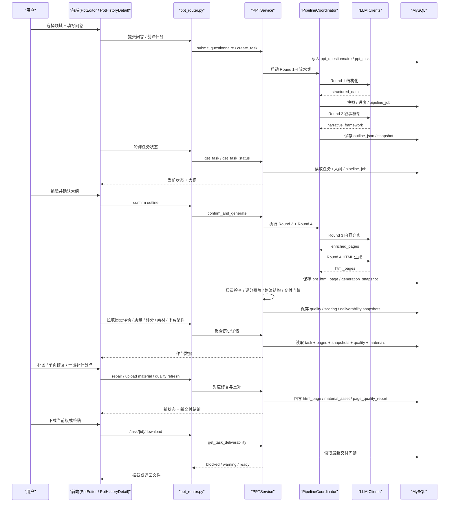
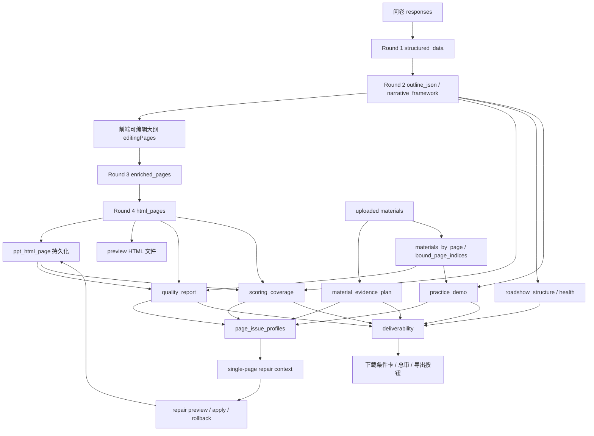
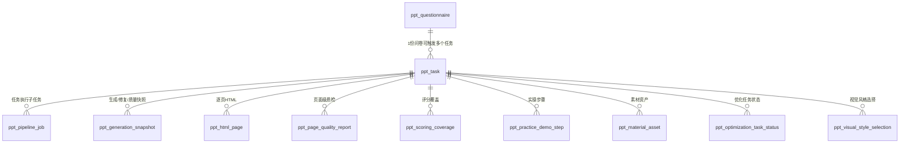

# OREP 里的 AI 生成 PPT 式 HTML 功能全量说明

> 文档目标：让一个**第一次看 OREP 项目的人**，能够完整理解这条功能的：
>
> - 设计思路
> - 业务逻辑
> - 前后端实现方式
> - AI 多轮流水线
> - 质量门禁与交付逻辑
> - 单页修复、素材证据、视觉审查机制
> - AI 约束与提示词体系
>
> 文档基于当前仓库真实实现整理，而不是抽象方案。

---

## 1. 这条功能到底是在做什么

OREP 里的“AI 生成 PPT 式 HTML”功能，不是一个普通的“输入文字，输出网页”的功能。

它的真实目标是：

1. 用户先填写结构化问卷，描述项目、技术、痛点、方案、团队、价值等信息。
2. 系统用 AI 把这些信息整理成**适合比赛路演**的大纲与故事线。
3. 用户确认或修改大纲。
4. 系统继续把大纲扩展为逐页内容，再生成**像 PPT 一样的 HTML 幻灯片页面**。
5. 系统对这些页面做：
   - 页面级质检
   - 评分点覆盖检查
   - 路演结构检查
   - 视觉审查
   - 单页修复
   - 素材证据绑定
   - 下载/交付门禁判断
6. 最终输出给用户一个“可预览、可修复、可导出”的比赛级 HTML/PPT 式成果。

一句话概括：

> 这是一条“**问卷 -> AI 结构化 -> AI 路演策划 -> AI 内容生成 -> AI HTML 幻灯片生成 -> 质量门禁 -> 页面修复 -> 交付下载**”的完整流水线。

---

## 2. 这条功能为什么不是简单的 Chat + HTML

因为它服务的不是普通网页场景，而是一个很强约束的比赛场景，尤其是“职业院校技能大赛 / 技术实操 + 项目路演”这类使用场景。

这个场景天然有 4 个特点：

1. **内容必须有比赛叙事结构**
   - 不能是普通商业 BP
   - 不能东一页西一页
   - 必须有政策、痛点、方案、技术、实操、价值、团队、总结等明确结构

2. **页面必须像 PPT，不像网页**
   - 固定 16:9
   - 强视觉焦点
   - 不能是长网页、文档流
   - 不能滚动

3. **需要可解释、可修复、可继续优化**
   - 不是一次生成完就结束
   - 用户需要看到问题，继续补图、改单页、补评分点

4. **必须有比赛级交付门禁**
   - 不是“生成成功 = 可以下载”
   - 还要判断：
     - 结构是否完整
     - 页面是否合格
     - 评分点是否覆盖
     - 实操闭环是否成立
     - 证据链是否足够

所以这条功能最终演化成了一个：

> “AI 生成 + AI 质检 + AI 修复 + 业务门禁”的系统，而不是一个简单的生成器。

---

## 3. 产品视角下的核心设计思路

从产品视角，这条功能的设计可以拆成 6 层：

### 3.1 输入层：问卷化收集，而不是自由聊天

用户不是直接和 AI 聊天，而是先填写结构化问卷。

这样做的原因：

- 便于标准化收集比赛必需信息
- 便于后端做缺失项判断
- 便于 AI 在 Round 1 做结构化提炼
- 便于后续评分点、证据、页面角色与内容模块的绑定

相关实现文件：

- `/Users/liuyixing/项目/OREP/ai-scoring/app/services/ppt/questionnaire_schema.py`
- `/Users/liuyixing/项目/OREP/ai-scoring/app/routers/ppt_router.py`
- `/Users/liuyixing/项目/OREP/frontend/user/src/stores/ppt.js`

### 3.2 策划层：先做项目画像和故事线，不直接生成页面

系统不会直接把问卷变成 HTML。

它先做两步策划：

1. Round 1：结构化项目画像
2. Round 2：逐页路演叙事框架

这是整条链路非常关键的设计思想：

> **先策划，再写页；先定义故事线，再定义页面。**

这样后续页面才不会一上来就乱。

### 3.3 生成层：逐轮递进，而不是一次性生成

系统采用四轮流水线：

1. Round 1：Structurize
2. Round 2：Narrative
3. Round 3：Enrich
4. Round 4：HTML Generation

优点：

- 每轮职责清晰
- 容易定位问题
- 允许中间态检查和人工确认
- 适合做恢复、重试和局部修复

### 3.4 评估层：不是“生成成功”，而是“生成后质检”

生成完 HTML 后，系统还会继续做：

- 页面基础质量检查
- 评分覆盖检查
- 路演结构检查
- 实操闭环检查
- 素材证据检查
- 视觉模型审查
- 交付门禁判断

所以这条链路的终点不是“HTML 生成出来”，而是：

> “HTML 达到比赛级可交付标准”。

### 3.5 修复层：允许单页重做，而不是整套重来

系统支持：

- 单页修复预览
- 单页确认采用
- 批量修复
- 修复历史
- 回滚历史版本
- 单页结构重做
- 素材证据补图

这意味着系统不是一次性静态产物，而是“**带工作台能力的生成系统**”。

### 3.6 交付层：导出不是默认开放，而是受门禁控制

下载按钮是否可用，不由“任务是否 completed”决定，而由：

- deliverability（交付门禁）决定

这套机制把任务分成：

- `blocked`：不可直接交付
- `warning`：可下载当前版，但建议继续补强
- `ready`：可交付

---

## 4. 整体系统架构

可以用下面这张图理解：

## 4.1 新人 onboarding 推荐先看这 2 张图

第一次接手时，建议先看下面两张图：

1. **时序图**：看清“谁先调用谁、谁产出什么”
2. **数据流图**：看清“问卷、大纲、HTML、质量报告、素材证据”是怎么在系统里流转的

## 4.2 时序图：从问卷到交付

## 4.3 数据流图：系统内部主要数据流转

---

## 5. 核心代码文件与职责分工

下面是这条功能最关键的文件。

## 5.1 后端

### 路由入口

- `/Users/liuyixing/项目/OREP/ai-scoring/app/routers/ppt_router.py`

负责：

- 表单配置
- 问卷提交
- 任务创建
- 获取任务
- 重试大纲
- 确认大纲
- 下载 PPT
- 获取 HTML 页面
- 历史详情
- 质量报告
- 路演体检
- 评分覆盖
- 单页修复
- 批量修复
- 素材上传
- 视觉审查

这是整个功能的 API 门面。

### 核心业务服务

- `/Users/liuyixing/项目/OREP/ai-scoring/app/services/ppt/ppt_service.py`

这是最核心的业务大脑。

它负责：

- 问卷提交与任务创建
- 启动/恢复四轮流水线
- 生成大纲与 HTML
- 保存快照
- 生成预览 HTML 文件
- 质量检查
- 路演结构检查
- 评分覆盖检查
- 实操闭环检查
- 素材证据规划与绑定
- 页面级修复
- 批量修复
- 视觉审查
- 交付门禁判断
- 构建历史详情页所需的全部聚合数据

可以理解为：

> `ppt_router.py` 是门面，`ppt_service.py` 是总调度中心。

### 四轮流水线协调器

- `/Users/liuyixing/项目/OREP/ai-scoring/app/services/ppt/adapter_code/pipeline_coordinator.py`

负责：

- Round 1-4 的顺序执行
- 每轮进度汇报
- 每轮超时
- 重试与恢复
- 中间产物挂在 `PipelineContext`

关键概念：

- `PipelineStage`
- `PipelineContext`
- `ProgressCallback`

它是“生成流水线”的核心协调器。

### 大模型客户端封装

- `/Users/liuyixing/项目/OREP/ai-scoring/app/services/ppt/qwen_client.py`
- `/Users/liuyixing/项目/OREP/ai-scoring/app/services/ppt/llm_factory.py`

负责：

- OpenAI-compatible 调用
- 文本生成
- HTML 生成
- 视觉审查
- JSON 修复
- HTML 提取
- 连接池和超时控制

虽然类名叫 `QwenClient`，但现在实际已经是：

> 一个通用的 OpenAI-compatible 客户端封装，可接不同服务商。

### 评分与规则

- `/Users/liuyixing/项目/OREP/ai-scoring/app/services/ppt/scoring_checker.py`
- `/Users/liuyixing/项目/OREP/ai-scoring/app/services/ppt/scoring_rules_v2.py`

负责：

- 评分标准定义
- 页面覆盖判断
- 缺失评分点提示

### HTML 生成与渲染

- `/Users/liuyixing/项目/OREP/ai-scoring/app/services/ppt/html_generator.py`
- `/Users/liuyixing/项目/OREP/ai-scoring/app/services/ppt/html_renderer.py`
- `/Users/liuyixing/项目/OREP/ai-scoring/app/services/ppt/pptx_renderer_html.py`

负责：

- HTML 页面构建
- 页面截图
- 最终输出与渲染桥接

### 视觉检察官

- `/Users/liuyixing/项目/OREP/ai-scoring/app/services/ppt/vision_judge_service.py`

负责：

- 对 HTML 截图做视觉审查
- 输出严格 JSON 问题清单
- 给单页修复提供视觉问题上下文

---

## 5.2 前端

### 生成主流程页

- `/Users/liuyixing/项目/OREP/frontend/user/src/views/PptEditor.vue`

负责：

- 领域选择
- 问卷填写
- 生成等待
- 大纲编辑
- 实时预览

现在已经拆出很多子组件，`PptEditor.vue` 更像流程壳。

### 生成状态 Store

- `/Users/liuyixing/项目/OREP/frontend/user/src/stores/ppt.js`

负责：

- 当前任务状态
- 问卷数据
- 大纲数据
- pipelineData
- 轮询
- 预览页数据
- readinessReport
- 历史任务恢复

它是前端主状态中心。

### 历史详情 / 工作台

- `/Users/liuyixing/项目/OREP/frontend/user/src/views/PptHistoryDetail.vue`

负责：

- HTML 预览
- 当前页工作台
- 质量报告
- 路演结构
- 评分覆盖
- 实操演示
- 素材证据（高级）
- 下载条件
- 终稿总审

这页已经从“超大页面文件”拆成了：

- `PptDownloadReadinessCard.vue`
- `PptHtmlWorkbench.vue`
- `PptQualityReportPanel.vue`
- `PptRoadshowPanel.vue`
- `PptScoringCoveragePanel.vue`
- `PptPracticeDemoPanel.vue`
- `PptMaterialsAdvancedPanel.vue`

同时也拆出了多个 composable：

- `usePptDownloadReadiness.js`
- `usePptCurrentPageWorkspace.js`
- `usePptRepairWorkspace.js`
- `usePptWorkbenchNavigation.js`

---

## 6. 端到端业务流程

下面按真实业务顺序，讲这条功能是如何跑起来的。

## 6.1 第一步：用户选择领域并填写问卷

前端通过：

- `GET /api/ppt/forms/{domain}`

获取问卷配置。

问卷 schema 来自：

- `/Users/liuyixing/项目/OREP/ai-scoring/app/services/ppt/questionnaire_schema.py`

问卷不是“随便写”，而是包含这些结构：

- 项目基本信息
- 问题与解决方案
- 技术与创新
- 成果与数据
- 团队信息
- 输出配置

作用：

- 规范化输入
- 让后端做资料完整度判断
- 方便后续 AI 结构化

## 6.2 第二步：问卷提交与任务创建

接口：

- `POST /api/ppt/questionnaire/submit`
- `POST /api/ppt/task/create`

后端先做两件事：

1. 保存问卷
2. 创建 PPT 任务

此时任务进入生成流程。

## 6.3 第三步：生成前资料完整度评估

接口：

- `POST /api/ppt/v2/questionnaire/readiness`

这是生成前的“体检”。

目标：

- 判断用户资料是否足够支撑比赛级路演
- 提示缺什么
- 允许：
  - 补资料再生成
  - 直接先生成草稿

这个阶段不直接生产页面，而是先给出：

- 资料完整度评分
- 缺失项
- 风险提示

## 6.4 第四步：Round 1 - 结构化项目画像

Prompt 文件：

- `/Users/liuyixing/项目/OREP/ai-scoring/app/services/ppt/prompts/round1_structurize.md`

输入：

- 问卷数据
- AI 辅助生成项（如市场、痛点等）

输出：

- 结构化项目画像 JSON

核心内容包括：

- project
- industry
- team
- achievements
- stories
- tech
- meta.missing_fields
- meta.safety_alerts
- meta.confidence_score

关键原则：

- 不编造数据
- 缺什么就标注缺什么
- 扫描并移除敏感信息

这一轮的本质是：

> 把“原始问卷”变成“机器和后续 Prompt 可稳定消费的项目画像”。

## 6.5 第五步：Round 2 - 路演叙事框架生成

Prompt 文件：

- `/Users/liuyixing/项目/OREP/ai-scoring/app/services/ppt/prompts/round2_narrative.md`

输入：

- Round 1 的结构化 JSON
- 比赛规则约束

输出：

- 逐页框架

每页会带：

- 页面角色 `slide_role`
- 页面目标 `page_goal`
- 标题
- 核心论点
- 讲稿
- 转场 `transition_in / transition_out`
- 图表需求
- 图片需求
- 时长
- 评分维度
- 视觉焦点
- 布局意图

Round 2 里最重要的是：

### P0 结构门禁

例如：

- 第 2/3 页必须有目录
- 前几页必须形成：
  - 政策/背景 -> 项目定义 -> 痛点 -> 方案
- 团队页不能过早
- 总结/未来不能过早
- 必须有：
  - 安全与规范
  - 应用价值
  - 创新成效
  - 研发历程
  - 产教融合
  - 团队分工

这一轮的本质是：

> 不直接写 HTML，而是先把整套路演“编剧化”。

## 6.6 第六步：用户确认和编辑大纲

前端在 `PptEditor` 里给用户展示：

- 大纲结构
- P0 结构检查
- 风格样张
- 页级编辑能力

用户可以：

- 调顺序
- 改标题
- 改要点
- 应用故事线守卫

接口：

- `POST /api/ppt/task/{task_id}/outline/storyline-guard`
- `POST /api/ppt/task/{task_id}/confirm`

这一步的设计思想是：

> 允许用户在“结构层”介入，而不是等到 HTML 全生成后再痛苦返工。

## 6.7 第七步：Round 3 - 内容充实

Prompt 文件：

- `/Users/liuyixing/项目/OREP/ai-scoring/app/services/ppt/prompts/round3_enrich.md`

输入：

- 用户确认后的逐页框架
- Round 1 原始数据

输出：

- 完整的逐页内容

每页会进一步充实为：

- 精炼 PPT 文本
- 口播稿
- 图表定义
- 图片占位
- 视觉焦点
- 页面讲解支点
- 实操闭环（如果是实操页）

Round 3 的核心原则：

- PPT 文本短，讲稿完整
- 图表定义具体
- 缺资料时不能硬编
- 页面必须保有比赛服务目标

## 6.8 第八步：Round 4 - HTML 生成

Prompt 文件：

- `/Users/liuyixing/项目/OREP/ai-scoring/app/services/ppt/prompts/round4_html_generation_optimized.md`

输入：

- Round 3 完整内容

输出：

- 1920×1080 单页 HTML

Round 4 的核心目标不是“网页”，而是：

> “像专业 PPT 幻灯片的 HTML 页面”

关键约束：

- 固定 16:9 画布
- `body overflow:hidden`
- 无滚动
- 强视觉焦点
- 目录页要像目录
- 政策页要像证据板
- 技术页要像架构页
- 实操页要像操作演示页
- 不允许普通网页式长文档

---

## 7. AI 模型角色分工

当前系统不是单模型单职责，而是多角色分工。

## 7.1 文本推理模型

工厂函数：

- `create_ppt_text_client()`

用于：

- Round 1
- Round 2
- Round 3
- 评分点文本补强
- 路演结构推理

职责：

- 理解项目
- 建构故事线
- 生成页面内容结构

## 7.2 HTML 生成 / 修复模型

工厂函数：

- `create_ppt_html_client()`

用于：

- Round 4 HTML 初稿
- 单页修复
- 单页结构重做

职责：

- 生成单页 HTML
- 按策略修页面
- 根据 repair context 执行定向重设计

## 7.3 视觉审查模型

工厂函数：

- `create_ppt_vision_client()`

用于：

- 页面截图后视觉检察官审查

职责：

- 看截图
- 输出结构化视觉问题 JSON
- 不直接决定最终页面，只作为修复输入

---

## 8. AI 提示词体系与约束设计

这是理解系统逻辑的重点。

系统不是只有一个 prompt，而是按阶段拆了不同职责。

## 8.1 Round 1 Prompt：信息结构化

文件：

- `/Users/liuyixing/项目/OREP/ai-scoring/app/services/ppt/prompts/round1_structurize.md`

关键约束：

- 不编造
- 缺失项明确列出
- 敏感信息剔除
- 输出严格 JSON

适合解决的问题：

- 原始问卷松散
- 字段命名不统一
- 后续无法直接用

## 8.2 Round 2 Prompt：路演编剧

文件：

- `/Users/liuyixing/项目/OREP/ai-scoring/app/services/ppt/prompts/round2_narrative.md`

关键约束：

- 以比赛叙事为中心
- 逐页明确职责
- 必须通过 P0 结构门禁
- 必须输出讲稿和转场
- 必须包含评分章节

适合解决的问题：

- 页面顺序乱
- 讲故事不成立
- 比赛逻辑不严谨

## 8.3 Round 3 Prompt：内容充实

文件：

- `/Users/liuyixing/项目/OREP/ai-scoring/app/services/ppt/prompts/round3_enrich.md`

关键约束：

- 讲稿详细
- PPT 文字克制
- 图表定义明确
- 实操页必须形成闭环
- 无价值页必须补内容

适合解决的问题：

- 页面只有标题没有内容
- 技术页太空
- 实操页只有流程图

## 8.4 Round 4 Prompt：HTML 幻灯片生成

文件：

- `/Users/liuyixing/项目/OREP/ai-scoring/app/services/ppt/prompts/round4_html_generation_optimized.md`

关键约束：

- 固定 1920×1080
- 强安全区
- 强布局规范
- 图表节点上限
- 连接线不漂移
- 页面角色有不同视觉组件要求

适合解决的问题：

- 生成结果像网页不像 PPT
- 技术页不稳定
- 视觉焦点不足
- 图表漂移、重叠

## 8.5 单页修复 Prompt

构造函数：

- `PPTService._build_ai_page_repair_prompt()`

特点：

- 不是盲修
- 会带上：
  - 当前页元信息
  - 当前质检失败项
  - page_issue_profile
  - 前端 repair_context
  - target_points
  - 版式合同
  - 实操闭环约束
  - 已绑定素材

特别关键的设计：

### target_points 是硬约束

例如用户点“一键补评分点”，系统会把：

- 市场规模
- 竞争优势
- 融资需求

之类的目标评分点写进 repair context，修复 Prompt 必须落实。

### repair_route / strategy 决定修法

不是所有问题都继续修 HTML。

系统会区分：

- `html`
- `structure`
- `evidence`

如果是 `structure_rebuild`，Prompt 明确要求：

> 整页重做，而不是局部补丁。

---

## 9. 后端业务逻辑分层

## 9.1 任务创建与执行

核心方法：

- `create_task()`
- `create_task_v2()`
- `_generate_outline_v2_async()`
- `_generate_content_async()`
- `_generate_ppt_async()`

业务含义：

- 问卷进来后创建任务
- 异步启动流水线
- 大纲和 HTML 分阶段生成

## 9.2 状态回写与轮询

前端轮询：

- `/api/ppt/task/{task_id}`
- `/api/ppt/task/{task_id}/status`

后端维护：

- `status`
- `progress`
- `current_step`
- `outline_json`
- `deliverability`
- `preview_recommendations`

这保证前端能实时知道：

- 当前在哪一轮
- 是否已有大纲
- 是否已有 HTML
- 当前是否可下载

## 9.3 快照与可恢复性

系统会存很多快照：

- generation snapshot
- page repair snapshot
- deliverability report
- quality report

目的是：

- 允许恢复
- 允许修复历史查看
- 允许回滚版本
- 允许分析每次修复有没有收益

## 9.4 质量报告

核心方法：

- `_build_quality_report()`
- `_analyze_html_page_quality()`

会评估：

- HTML 是否有效
- 是否有占位词
- 是否有跨行业污染
- 是否模板化
- 是否版式重叠
- 是否内容空洞
- 是否实操闭环不足

## 9.5 评分覆盖

核心方法：

- `_build_scoring_coverage_report()`
- `_merge_outline_with_html_for_scoring()`

设计思想：

- 评分不是只靠大纲
- 要按当前 HTML 和当前页面内容重算

这也是为什么后来修复了“一键补评分点没效果”的问题。

## 9.6 路演结构检查

核心方法：

- `_build_task_roadshow_structure_report()`
- `_evaluate_roadshow_modules()`
- `_evaluate_roadshow_sequence()`
- `_evaluate_roadshow_pacing()`

会检查：

- 是否缺目录页
- 是否缺政策页
- 是否缺应用价值页
- 是否缺团队页
- 痛点后是否接方案
- 总结是否太早
- 时长节奏是否合理

## 9.7 交付门禁

核心方法：

- `assess_task_deliverability()`
- `get_task_deliverability()`

输出三种状态：

### blocked

不能直接交付，典型原因：

- P0 未清
- 质量 fail
- 占位词未清
- 跨行业污染
- 结构缺页

### warning

可下载当前版，但仍建议补强：

- 路演体检未 ready
- 还有软风险页
- 页面基础质量仍需打磨

### ready

达到了可交付状态。

---

## 10. 页面级修复机制

这是系统很重要的一层。

## 10.1 为什么要有单页修复

因为一套 PPT 里往往只有几页差，不应该整套重跑。

所以系统支持：

- 单页预览修复
- 单页确认采用
- 批量修复
- 修复历史
- 回滚修复版本

## 10.2 单页修复的核心流程

方法：

- `repair_html_page()`
- `_run_single_page_repair_pass()`
- `_generate_ai_repaired_html_page()`

流程：

1. 读取当前页 HTML
2. 读取当前页最新质检结果
3. 读取 page_issue_profile
4. 决定 repair strategy
5. 构造 AI repair prompt
6. 生成修复预览
7. 评估修复收益
8. 必要时自动升级为 `structure_rebuild`
9. 用户确认采用

## 10.3 修复收益评估

方法：

- `_assess_page_repair_gain()`

会比较：

- 分数变化
- failed checks 是否减少
- HTML 是否真的变化
- 是否还有下一步建议

这一步的设计目的是：

> 避免“连续修很多次，但其实没有收益”。

## 10.4 修复历史推荐

方法：

- `get_page_repair_history()`
- `_build_page_repair_history_recommendation()`

作用：

- 如果历史里有更好版本，可以推荐恢复
- 如果问题是证据型，不建议继续空修
- 如果问题是结构型，建议升级重做

---

## 11. 素材证据机制

这条功能不是只会生成文字，也在做证据绑定。

## 11.1 为什么证据机制很重要

因为比赛页不是只有“说”，还要“证明”。

比如：

- 政策页要有政策截图/来源
- 实操页要有系统截图/操作截图
- 技术页要有架构图/指标图
- 团队页要有协作过程证据

## 11.2 后端怎么做证据规划

核心方法：

- `get_task_material_evidence_plan()`
- `_build_material_evidence_packs()`
- `refresh_task_material_bindings()`

设计思路：

1. 先按页面质量结果判断哪些页缺证据
2. 再把“逐页缺口”收敛成“证据包”
3. 再把用户上传的素材反向绑定到页面

这样避免用户觉得自己要给 20 多页逐页传图。

## 11.3 证据包的价值

它让系统从：

- 第 17 页缺图
- 第 18 页缺图
- 第 19 页缺图

转成：

- 你缺一组“工程过程证据”
- 覆盖第 17/18/19 页

这更符合用户心智。

## 11.4 测试素材与真实素材

系统也支持“测试阶段临时演示图”逻辑。

方法：

- `_is_testing_demo_asset()`

用途：

- 测试时先验证视觉效果
- 不强制用户一开始就上传真实素材

---

## 12. 视觉审查机制

系统不是只做文本质检，还做截图级视觉审查。

核心服务：

- `PPTVisionJudgeService`

流程：

1. 渲染 HTML 页面为截图
2. 把截图交给视觉模型
3. 视觉模型输出 JSON：
   - score
   - needs_repair
   - problems
   - repair_instruction
   - repair_brief
4. 再把这些视觉问题回灌给单页修复

设计思想：

> 让视觉模型担任“检察官”，而不是直接生成全部页面。

---

## 13. 前端主流程的业务逻辑

## 13.1 PptEditor：生成期主流程

前端 Store：

- `/Users/liuyixing/项目/OREP/frontend/user/src/stores/ppt.js`

负责状态：

- `currentStep`
- `taskId`
- `taskStatus`
- `taskProgress`
- `outlineData`
- `pipelineData`
- `editingPages`
- `readinessReport`

流程大致是：

1. 选领域
2. 填问卷
3. 做 readiness 检查
4. 创建任务
5. 轮询任务状态
6. 大纲生成
7. 用户确认大纲
8. 内容与 HTML 生成
9. 进入预览

## 13.2 PptHistoryDetail：工作台

这是“生成后继续加工”的主工作台。

目前已经形成几个主分区：

- HTML 预览
- 当前页工作台
- 质量报告
- 路演结构
- 评分覆盖
- 实操演示
- 素材证据（高级）
- 下载条件
- 终稿总审

设计思想是：

> 让用户围绕“当前页”和“下载条件”工作，而不是在无数 tab 里迷路。

---

## 14. 下载与交付逻辑

这是当前系统最复杂也最关键的一块。

## 14.1 为什么下载不能简单开放

因为生成成功不代表比赛可交付。

所以下载会先看：

- `deliverability`

只有不是 `blocked` 才允许下。

## 14.2 下载语义分三种

### blocked

- 按钮会拦住
- 系统带用户进入“先处理并继续下载”流程

### warning

- 可以下载当前版本
- 但会继续建议用户补强

### ready

- 可直接下载终稿

## 14.3 下载流程现在的用户体验设计

已经被收口成一条明确语境：

- 想下载
- 如果被拦，系统记住“你是来下载的”
- 先处理一项
- 继续回到下载流程
- 当前版可下时，允许先下载
- 还可继续补强
- 最后进入 ready

这条链路的核心目标是：

> 用户不会因为被拦住，就丢失“我原本是来下载的”这个主语境。

---

## 15. 实现层面的关键数据对象

第一次接手时，建议把下面这些对象当成最关键的业务实体理解。

## 15.1 任务 Task

包含：

- 基础状态
- progress
- current_step
- outline_json
- deliverability
- preview_recommendations

## 15.2 Outline

是用户确认前后的中间核心产物，后续几乎所有分析都以它为基础。

## 15.3 HTML Pages

每页一个 HTML。

不仅用于预览，还用于：

- 质量检查
- 评分覆盖
- 视觉审查
- 修复

## 15.4 Quality Report

描述整套页面基础质量。

## 15.5 Scoring Coverage

描述评分点覆盖情况。

## 15.6 Roadshow Structure / Health

描述故事线、节奏、时长、关键模块是否合理。

## 15.7 Material Assets

素材资产，带：

- 文件
- 类型
- 分析结果
- 推荐绑定
- 显式页码绑定

## 15.8 Page Issue Profile

这是“单页问题档案”。

它会汇总：

- 质量问题
- 视觉问题
- 修复历史
- 证据缺口
- 评分风险

是单页重设计闭环的关键。

## 15.9 数据库表 / 持久化对象总览

如果把这条功能当成一个完整系统来看，后端真正依赖的持久化对象主要有下面这些：

| 表名 / 对象 | 作用 | 主要内容 |
|---|---|---|
| `ppt_questionnaire` | 保存用户问卷 | 项目基础信息、问卷 responses |
| `ppt_task` | 保存任务主状态 | status、progress、outline_json、theme、questionnaire_id |
| `ppt_pipeline_job` | 保存流水线子任务 | Round 级/批次级状态、心跳、输入输出摘要 |
| `ppt_generation_snapshot` | 保存生成/修复/质量快照 | snapshot_type、stage、version、payload |
| `ppt_html_page` | 保存逐页 HTML | page_index、title、section、html_content、source |
| `ppt_page_quality_report` | 保存页面级质量结果 | status、score、checks、regeneration_strategy |
| `ppt_scoring_coverage` | 保存评分点覆盖结果 | point_id、covered、page_indices、evidence |
| `ppt_practice_demo_step` | 保存实操步骤模块 | step_id、目标页、所需证据、缺口 |
| `ppt_material_asset` | 保存用户上传素材 | 文件、分析结果、绑定建议、bound_page_indices |
| `ppt_optimization_task_status` | 保存优化任务状态 | queue task 的 done/in_progress 状态 |
| `ppt_visual_style_selection` | 保存风格样张选择 | style_id、is_selected |
| `ppt_template` | 模板主题/视觉配置 | 默认主题、系统模板 |

这些表不是互相独立存在的，而是围绕 `ppt_task.id` 形成一棵任务树。

## 15.10 核心关系图：任务是整个系统的主轴

可以把 `ppt_task` 理解成一棵树的根节点：

- 问卷产生任务
- 任务产生大纲
- 任务产生 HTML
- HTML 产生质量报告
- 质量报告产生修复动作
- 修复动作和素材上传又继续回写任务

## 15.11 每个表在业务流程里的角色

### `ppt_questionnaire`

这是“原始事实来源”。

作用：

- 保存用户最初输入
- 供 Round 1 结构化使用
- 供后续重试/恢复时再次提取原始信息

### `ppt_task`

这是“任务主状态表”。

通常会包含：

- `questionnaire_id`
- `status`
- `progress`
- `current_step`
- `outline_json`
- `theme`
- 各类生成结果的引用信息

这是前端轮询最常读的一张表。

### `ppt_pipeline_job`

这是“细粒度进度追踪表”。

作用：

- 把 Round 内部的子任务、批次、心跳持久化
- 让前端等待面板不只显示一个假进度，而是显示真实子任务状态

这是后续支持更真实等待体验的关键表。

### `ppt_generation_snapshot`

这是“历史追溯表”。

它会记录很多类型：

- 大纲快照
- 质量报告快照
- 评分覆盖快照
- 页面修复快照
- 素材上传快照
- deliverability 快照

用途：

- 历史详情页
- 修复历史
- 回滚
- 问题排查
- 收益比较

### `ppt_html_page`

这是“最终页面内容表”。

每页一条。

用途：

- 当前预览
- 单页修复覆盖
- 下载前页面汇总
- 评分检查、质检、视觉审查输入

### `ppt_page_quality_report`

这是“每页质检结果表”。

每页保存：

- `status`
- `score`
- `checks`
- `regeneration_strategy`
- `can_auto_fix`

这是页面工作台、下载条件卡、自动修复分流的关键来源。

### `ppt_scoring_coverage`

这是“评分点覆盖矩阵表”。

不是简单地存总分，而是存：

- 哪个评分点
- 有没有覆盖
- 被哪些页覆盖
- 证据支撑是什么

这让前端可以做到：

- 缺哪些必备评分点
- 优先补哪几个
- 哪几页承担了这些评分点

### `ppt_practice_demo_step`

这是“实操演示模块表”。

它把实操链路结构化成步骤：

- step_id
- step_order
- step_title
- technical_points
- required_evidence
- missing_evidence
- target_pages

这就是实操页为什么能做“输入-操作-输出-证据闭环”的原因。

### `ppt_material_asset`

这是“素材资产表”。

存的不只是文件，还包括：

- `asset_type`
- `description`
- `analysis_result`
- `file_url`
- `quality`
- `privacy_risk`

其中 `analysis_result` 很关键，里面会有：

- 推荐绑定页
- 推荐步骤
- 是否测试素材
- 建议用途

所以素材不是纯文件仓库，而是“可分析、可绑定的证据对象”。

### `ppt_optimization_task_status`

这是“优化任务状态表”。

它的意义不在于“列出问题”，而在于：

- 用户点开某个阻塞项进入处理中
- 某个优化任务完成了
- 某个下载条件还剩多少项

前端能保持一致体验，靠的就是这类状态回写。

### `ppt_visual_style_selection`

这是“样张选择 / 风格选择”状态表。

它用来支撑：

- 风格样张预览
- 当前选中的视觉样式
- 任务主题回写

## 15.12 数据库持久化对象与前端工作台的对应关系

对于第一次接手的人，最容易乱的是：

> “前端看到的这一块，到底读的是哪张表？”

可以按下面理解：

| 前端区域 | 主要后端来源 |
|---|---|
| 生成中等待面板 | `ppt_task` + `ppt_pipeline_job` |
| 大纲编辑 | `ppt_task.outline_json` |
| HTML 预览 | `ppt_html_page` |
| 质量报告 | `ppt_page_quality_report` + `quality_report snapshot` |
| 评分覆盖 | `ppt_scoring_coverage` |
| 实操演示 | `ppt_practice_demo_step` |
| 素材证据 | `ppt_material_asset` + `material_evidence_plan` |
| 修复历史 | `ppt_generation_snapshot`（type=page_repair / rollback） |
| 下载条件 / 总审 | `deliverability` + quality/scoring/roadshow/practice/materials 聚合结果 |

## 15.13 为什么要同时有“表”和“快照”

第一次看这个功能时，常见疑问是：

> 既然有 `ppt_html_page`、`ppt_page_quality_report` 这些表，为什么还要 `ppt_generation_snapshot`？

因为两者解决的是不同问题：

### 表

解决“当前状态是什么”。

例如：

- 当前第 26 页 HTML 是什么
- 当前评分覆盖是多少
- 当前任务状态是什么

### 快照

解决“它是怎么变成现在这样的”。

例如：

- 第 26 页修过几次
- 哪一次修复收益最大
- 质量报告上一版和这一版差在哪
- 任务是在哪个阶段卡住过

所以：

- 表是当前态
- 快照是历史态

这也是这条功能能做“恢复、回滚、历史详情、收益判断”的根本原因。

---

## 16. 第一次接手这个功能，建议怎么读代码

如果你第一次接手，不建议一上来就读 `ppt_service.py` 全文件。

建议按这个顺序：

### 第 1 步：看产品入口

先看：

- `/Users/liuyixing/项目/OREP/frontend/user/src/stores/ppt.js`
- `/Users/liuyixing/项目/OREP/frontend/user/src/views/PptEditor.vue`

先理解用户怎么开始生成。

### 第 2 步：看后端 API 门面

再看：

- `/Users/liuyixing/项目/OREP/ai-scoring/app/routers/ppt_router.py`

把接口按功能分组记住。

### 第 3 步：看四轮流水线

再看：

- `/Users/liuyixing/项目/OREP/ai-scoring/app/services/ppt/adapter_code/pipeline_coordinator.py`
- 四个 prompt 文件

先理解：

- 为什么是四轮
- 每轮输入输出是什么

### 第 4 步：看 `ppt_service.py` 的关键方法

优先看这些：

- `create_task`
- `confirm_and_generate`
- `get_task_deliverability`
- `run_task_quality_check`
- `get_task_scoring_coverage`
- `get_task_material_evidence_plan`
- `repair_html_page`
- `assess_task_deliverability`
- `get_task_history_detail`

### 第 5 步：看前端工作台

最后看：

- `/Users/liuyixing/项目/OREP/frontend/user/src/views/PptHistoryDetail.vue`
- 各个 `components/ppt/*`
- 各个 `composables/*`

这样会容易很多。

---

## 17. 当前这套设计的优点

客观说，这套设计并不简单，但有几个明显优点：

1. **不是一次性黑盒生成**
   - 中间态可看、可改、可修

2. **比赛逻辑非常强**
   - 从问卷到交付都围绕比赛结构设计

3. **可恢复、可回滚**
   - 快照体系做得比较完整

4. **页面级修复能力强**
   - 不必整套重跑

5. **质量与交付是两层概念**
   - 不是“生成成功 = 可交付”

6. **素材证据已经不是附属功能**
   - 已经被纳入业务主链路

---

## 18. 当前这套设计的复杂点与注意事项

这套设计的代价就是复杂度高。

第一次接手最容易踩坑的点：

1. `warning` 和 `blocked` 不要混
2. 下载条件和总审、交付结论要保持同口径
3. 评分覆盖不能只看旧大纲，要看当前 HTML
4. 证据已补但旧提示残留，是典型状态同步问题
5. 单页修复不能总走同一路径，要分：
   - html
   - structure
   - evidence
6. 不要让内部修复痕迹污染正式质检

---

## 19. 用一句话总结这个功能的真实本质

> OREP 的 AI 生成 PPT 式 HTML 功能，本质上不是一个“AI 写网页”功能，而是一套“比赛级路演内容生产系统”。

它结合了：

- 结构化输入
- 四轮 AI 流水线
- 页面级 HTML 生成
- 质量门禁
- 评分覆盖
- 素材证据
- 视觉审查
- 单页修复
- 交付下载

所以理解它最好的方式不是把它看成“一个页面”，而是把它看成：

> “一个围绕比赛交付目标组织起来的生成、检查、修复、交付闭环”。

---

## 20. 相关关键文件索引

### 后端

- `/Users/liuyixing/项目/OREP/ai-scoring/app/routers/ppt_router.py`
- `/Users/liuyixing/项目/OREP/ai-scoring/app/services/ppt/ppt_service.py`
- `/Users/liuyixing/项目/OREP/ai-scoring/app/services/ppt/adapter_code/pipeline_coordinator.py`
- `/Users/liuyixing/项目/OREP/ai-scoring/app/services/ppt/qwen_client.py`
- `/Users/liuyixing/项目/OREP/ai-scoring/app/services/ppt/llm_factory.py`
- `/Users/liuyixing/项目/OREP/ai-scoring/app/services/ppt/scoring_checker.py`
- `/Users/liuyixing/项目/OREP/ai-scoring/app/services/ppt/scoring_rules_v2.py`
- `/Users/liuyixing/项目/OREP/ai-scoring/app/services/ppt/questionnaire_schema.py`
- `/Users/liuyixing/项目/OREP/ai-scoring/app/services/ppt/vision_judge_service.py`

### Prompt

- `/Users/liuyixing/项目/OREP/ai-scoring/app/services/ppt/prompts/round1_structurize.md`
- `/Users/liuyixing/项目/OREP/ai-scoring/app/services/ppt/prompts/round2_narrative.md`
- `/Users/liuyixing/项目/OREP/ai-scoring/app/services/ppt/prompts/round3_enrich.md`
- `/Users/liuyixing/项目/OREP/ai-scoring/app/services/ppt/prompts/round4_html_generation_optimized.md`

### 前端

- `/Users/liuyixing/项目/OREP/frontend/user/src/stores/ppt.js`
- `/Users/liuyixing/项目/OREP/frontend/user/src/views/PptEditor.vue`
- `/Users/liuyixing/项目/OREP/frontend/user/src/views/PptHistoryDetail.vue`
- `/Users/liuyixing/项目/OREP/frontend/user/src/components/ppt/`
- `/Users/liuyixing/项目/OREP/frontend/user/src/composables/`
