# OREP AI评分记忆与竞赛校准优化方案

> 目标：解决同一团队、同一项目多轮 AI 评审时，“上轮问题全部修复后系统误给 100 分”的问题。  
> 核心结论：**问题修复完成度不等于正式比赛满分能力。OREP 需要把“训练闭环”和“比赛预测”拆成两套口径，再由评分裁决器合成最终结果。**

---

## 0. 重要修正：以官方评分表为准，技术水平和现场演示是主轴

本方案必须以项目现有的官方评分表和梯度评分规则为准，而不是泛化的商业路演评分模型。

OREP 当前项目中已经内置了 **2025 世界职业院校技能大赛总决赛评分模板**。它的核心权重是：

| 一级维度 | 分值 | 权重 | 业务含义 |
|---|---:|---:|---|
| 技能水平 | 60 | 60% | 技术能力、操作规范、熟练度、任务难度、技术先进性、现场讲解 |
| 职业素养 | 10 | 10% | 职业规范、工匠精神、安全意识 |
| 应用价值 | 10 | 10% | 实用性、经济性、可持续性 |
| 团队合作 | 10 | 10% | 团队精神、沟通协作 |
| 创新创意 | 10 | 10% | 创新意识、创新成效 |

因此，连续评分记忆不能只围绕“商业模式、路演表达、市场验证”判断。真正的主轴应该是：

```text
技术实现能力
+ 现场实操演示
+ 技术证据链
+ 官方评分表
+ 梯度评分规则
+ 历史问题复检
+ 比赛上限校准
```

尤其要注意：

```text
技能水平 60 分是大头。
现场演示是技术能力的重要证据。
只靠口头讲得好、PPT 做得好，不能拿到技术高分。
```

如果一个团队第二次把上轮 PPT、表达、商业逻辑都改好了，但现场演示仍然不稳定，或者关键技术没有真实运行证据，系统绝不能给到接近满分。

---

## 1. 背景与问题定义

OREP 当前会议室与 AI 评分链路已经可以完成一次完整的评审：

1. 会议室获取音视频。
2. 实时转写 ASR。
3. 抽取关键帧。
4. 本地录制上传。
5. 进行语音、画面、PPT、表达与内容分析。
6. 调用大模型与评分规则生成分数、报告、训练建议。
7. 可进一步调用 16 人格/评审团做多视角复核。

单次评分是可成立的，但连续评分会出现一个关键业务问题：

```text
第一次学校评了 80 分。
系统指出 6 个扣分项。
学校第二次把 6 个扣分项全部解决。
系统如果简单把扣掉的 20 分加回，就会给 100 分。

但真实比赛里，100 分是现场裁判对冠军级项目的定义。
修完上轮问题，只能说明“上轮训练任务完成”，不能说明“已经达到比赛满分”。
```

因此，OREP 需要从“单次 AI 打分系统”升级为：

```text
连续训练评估系统
+ 历史问题复检系统
+ 比赛满分标杆校准系统
+ 多人格评审团审计系统
```

---

## 2. 核心设计原则

### 2.1 分清两个满分

系统里必须区分两类 100 分：

| 类型 | 含义 | 是否能代表比赛满分 |
|---|---|---|
| 训练闭环完成度 100% | 上一轮指出的问题全部完成修复 | 否 |
| 正式比赛预测分 100 | 当前表现已达到真实比赛满分项目标准 | 是 |

第二次评审的合理输出应该是：

```text
正式比赛预测分：88
上轮问题闭环率：100%
相比上轮提升：+8
满分差距：12
系统结论：上轮问题已全部修复，但项目仍未达到冠军级满分标准。
```

### 2.2 历史问题只能控制“修复奖励”，不能直接决定总分

错误公式：

```text
本次分数 = 上次分数 + 上次扣分项修复分
```

正确公式：

```text
最终比赛预测分 =
min(
  本轮独立竞赛评分 + 历史问题修复奖励 - 本轮新增问题扣分,
  竞赛上限分
)
```

也就是：

```text
FinalScore = min(
  CurrentScore + RecoveryBonus - NewIssuePenalty,
  CompetitionCeilingScore
)
```

### 2.3 每一次加分都必须有证据

系统不能因为学生口头说“我们已经改了”就加分。每个修复项都必须绑定证据：

```text
1. 转写片段
2. 关键帧
3. PPT 页面识别结果
4. 语音表达指标
5. 答辩回应内容
6. 评审团共识意见
```

### 2.4 100 分必须由“满分标杆库”控制

上轮问题全修复，只能说明旧问题闭环。是否接近 100，需要和高分项目标准比较。

因此必须引入：

```text
Competition Benchmark Library
比赛满分标杆库
```

它定义 90、95、100 分项目分别应该具备什么特征。

---

## 3. 总体业务流程图

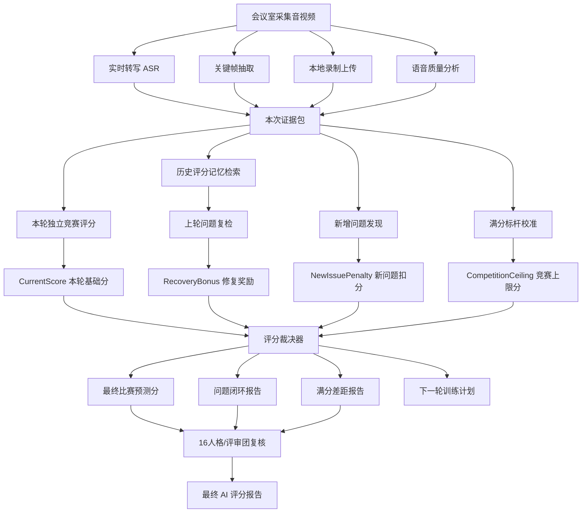

---

## 4. 会议室证据采集逻辑

### 4.1 实时转写

会议室开始 AI 评分后，前端录制组件创建评分会话，并开启实时 ASR WebSocket。

业务逻辑：

```text
1. 用户进入会议室。
2. 点击开始 AI 评分。
3. 前端创建 ai scoring session。
4. 混合本地与远端音频。
5. 将音频转为 16k PCM。
6. 通过 WebSocket 持续发送音频块。
7. ASR 服务返回实时识别事件。
8. 服务端写入 transcript jsonl。
9. 最终评分时优先使用实时转写。
10. 如果实时转写质量不足，则回退到文件 ASR。
```

图片：

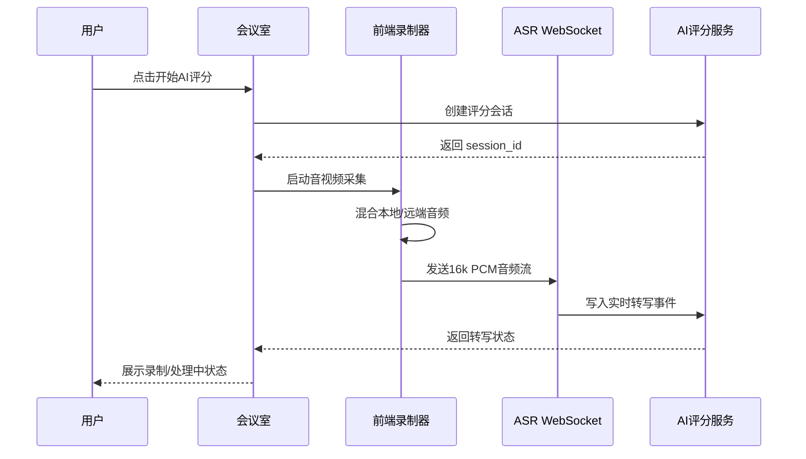

### 4.2 关键帧抽取

关键帧不是简单每秒截图，而是分为三类：

| 类型 | 触发方式 | 用途 |
|---|---|---|
| start frame | 录制开始 | 记录开场画面 |
| interval frame | 固定间隔，例如每 8 秒 | 稳定采集 PPT/画面信息 |
| scene frame | 画面变化超过阈值 | 捕捉翻页、切屏、重要变化 |
| stop frame | 录制结束 | 记录结束状态 |

关键帧用于：

```text
1. PPT 页面识别
2. 页面内容与讲述一致性检查
3. 关键节点回放
4. 评审报告证据引用
5. 历史问题复检证据
```

图片：

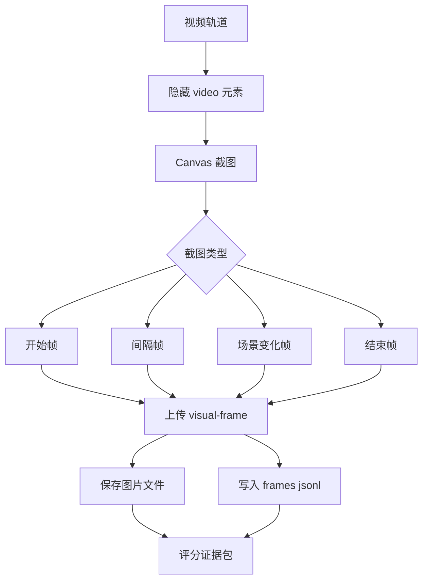

### 4.3 本地录制上传

本地录制上传用于保证评分完整性。即使实时转写或关键帧过程中出现不完整，最终仍可通过完整录制文件重新分析。

业务逻辑：

```text
1. 前端录制混合音频和选中的视频轨道。
2. MediaRecorder 每秒产生录制 chunk。
3. 结束时合并为 webm 文件。
4. 上传到 /api/ai/upload-audio。
5. AI 服务保存文件。
6. 启动后台评分流水线。
7. 如果上传失败，前端自动下载本地备份文件。
```

图片：

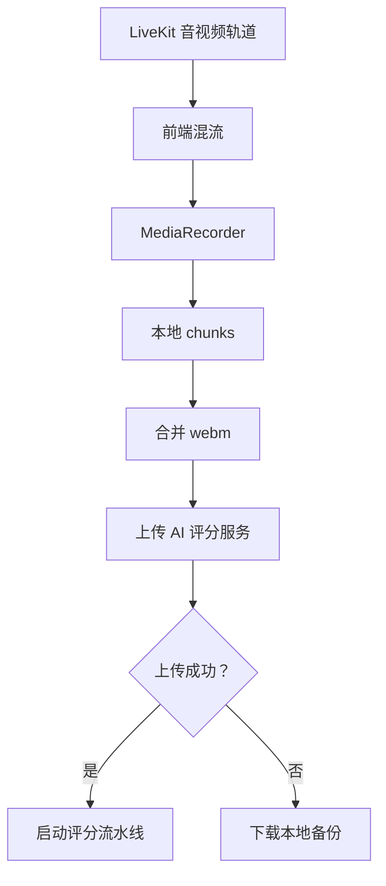

---

## 5. AI 评分流水线优化

### 5.1 当前建议流水线

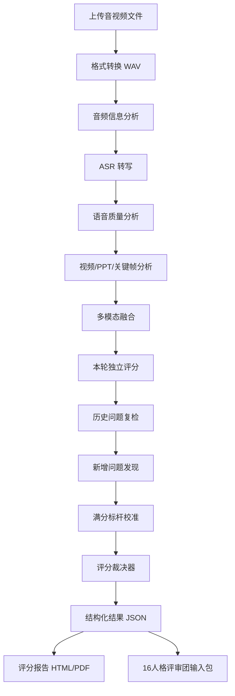

### 5.2 报告不建议一次性生成

为了稳定性和可审计性，报告应该分阶段生成。

| 阶段 | 产物 | 是否可重试 |
|---|---|---|
| 证据结构化 | transcript、frames、speech、video analysis | 是 |
| 本轮独立评分 | current_score.json | 是 |
| 历史问题复检 | remediation_review.json | 是 |
| 新增问题扫描 | new_issues.json | 是 |
| 满分标杆校准 | ceiling_review.json | 是 |
| 评分裁决 | final_verdict.json | 是 |
| 正式报告 | report.pdf / report.html | 是 |
| 评审团复核 | jury_result.json / jury_report.pdf | 是 |

图片：

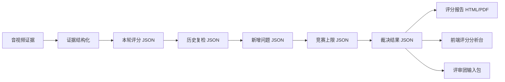

---

## 6. 评分记忆系统

### 6.1 为什么不能只靠大模型记忆

不建议把连续评分做成“把上一份报告塞给大模型，让它自己判断”。

原因：

```text
1. 不稳定：模型可能漏掉旧扣分项。
2. 不可审计：无法解释某个加分从哪里来。
3. 不可控：可能把问题修复奖励直接加成满分。
4. 不可追踪：多轮之后无法管理问题状态。
5. 不可复核：评审团无法基于同一份结构化记忆判断。
```

正确方案：

```text
结构化评分台账
+ 证据锚点
+ 向量检索
+ 时间图谱
+ 评分裁决器
```

### 6.2 评分记忆实体图

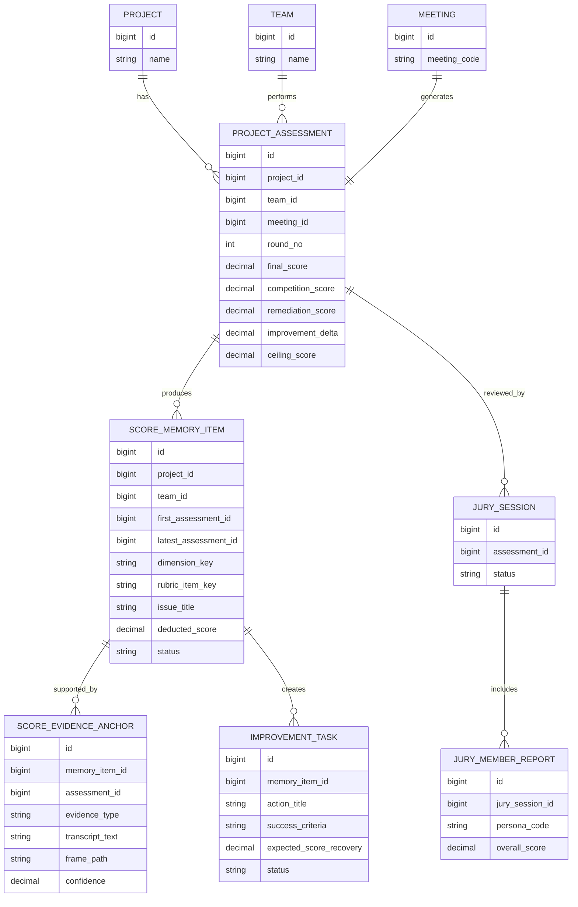

### 6.3 扣分项记忆表

```text
score_memory_item
- id
- project_id
- team_id
- first_assessment_id
- latest_assessment_id
- dimension_key
- rubric_item_key
- issue_title
- issue_detail
- deducted_score
- severity
- status
- created_at
- updated_at
```

状态定义：

| 状态 | 含义 |
|---|---|
| open | 未解决 |
| partially_resolved | 部分解决 |
| resolved | 已解决 |
| regressed | 本轮再次恶化 |
| obsolete | 问题已过期或不再适用 |

### 6.4 证据锚点表

```text
score_evidence_anchor
- id
- memory_item_id
- assessment_id
- evidence_type
- start_time
- end_time
- frame_path
- transcript_text
- model_observation
- confidence
```

证据类型：

```text
transcript：转写片段
frame：关键帧
speech_metric：语音指标
ppt_observation：PPT 识别
video_event：视频/表达事件
jury_comment：评委意见
```

### 6.5 训练任务表

```text
improvement_task
- id
- memory_item_id
- action_title
- success_criteria
- required_evidence
- expected_score_recovery
- status
```

---

## 7. 历史问题复检机制

### 7.1 复检流程

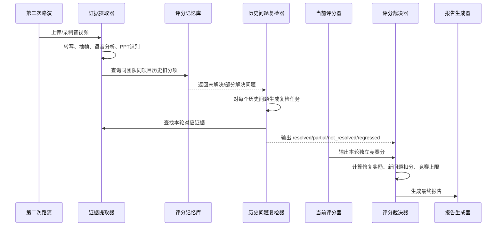

### 7.2 复检判断标准

每个旧问题都需要定义：

```text
1. 上次为什么扣分
2. 扣了多少分
3. 建议怎么改
4. 本轮应该出现什么证据才算改
5. 证据是否充分
6. 最多能加回多少分
```

示例：

```text
旧问题：市场规模数据不足
上次扣分：4
修复建议：补充目标市场规模、细分市场、数据来源、客户匹配逻辑

本轮复检：
1. 是否出现新的市场规模数据
2. 是否给出数据来源
3. 是否区分 TAM/SAM/SOM
4. 是否和目标客户匹配
5. 是否在 PPT 或讲述中清晰呈现
```

复检输出：

```json
{
  "memory_item_id": "issue_001",
  "previous_issue": "市场规模数据不足",
  "previous_deduction": 4,
  "status": "partially_resolved",
  "recovered_score": 2.5,
  "confidence": 0.82,
  "reason": "本轮补充了市场规模和目标客户，但缺少数据来源和细分测算。",
  "new_evidence": [
    {
      "type": "transcript",
      "time": "08:21-09:10",
      "text": "我们预计目标市场规模约为..."
    },
    {
      "type": "frame",
      "time": "08:33",
      "frame_id": "frame_0833_market_slide"
    }
  ]
}
```

### 7.3 修复奖励上限

历史问题修复奖励必须满足：

```text
RecoveredScore <= PreviousDeductedScore
```

更细公式：

```text
RecoveredScore =
PreviousDeductedScore
× ResolutionRatio
× EvidenceConfidence
```

示例：

```text
上次扣分：4
解决程度：80%
证据置信度：90%

加回分：
4 × 0.8 × 0.9 = 2.88
```

---

## 8. 新增问题发现机制

第二轮不能只复检旧问题，还必须重新按完整评分规则发现新问题。

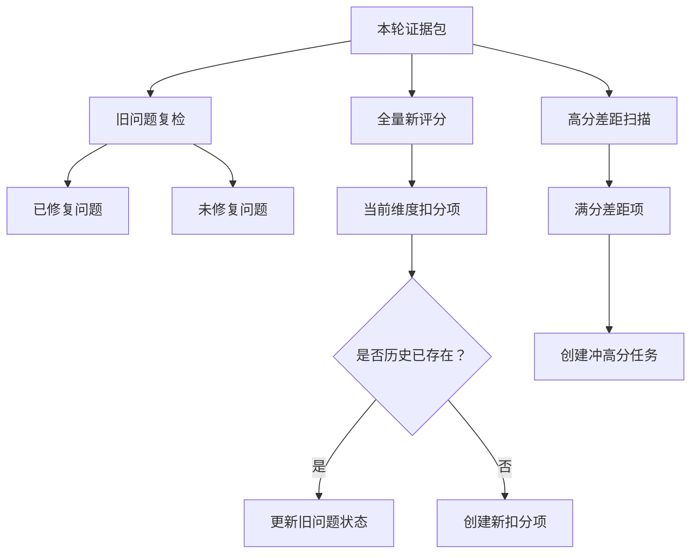

新增问题分两类：

| 类型 | 说明 | 示例 |
|---|---|---|
| 普通新增扣分项 | 本轮新暴露出的明显问题 | 答辩跑题、PPT 数据不一致 |
| 冲高分差距项 | 不是低级错误，但影响 95+ | 商业壁垒不够硬、现场压迫感不足 |

---

## 9. 比赛满分标杆库

### 9.1 目的

比赛满分标杆库解决这个问题：

```text
即使上轮问题全部改完，为什么本轮仍然不是 100？
```

它定义高分项目应该满足的必要条件。

### 9.2 满分项目特征

```text
95-100 分项目特征：
- 痛点定义清晰且真实
- 解决方案有明显差异化
- 技术或模式壁垒可信
- 市场规模和目标客户明确
- 竞品对比有说服力
- 商业模式可闭环
- 财务预测有现实约束
- 团队能力与项目匹配
- 路演表达强，有现场感染力
- 答辩抗压稳定
- PPT 视觉、叙事、数据一致
```

### 9.3 竞赛上限规则

示例规则：

```text
如果缺少真实用户验证，最高不超过 88。
如果商业模式未闭环，最高不超过 85。
如果竞品壁垒不清晰，最高不超过 89。
如果财务模型过于理想化，最高不超过 90。
如果答辩证据不足，最高不超过 92。
如果 PPT 与讲稿不一致，最高不超过 90。
```

图片：

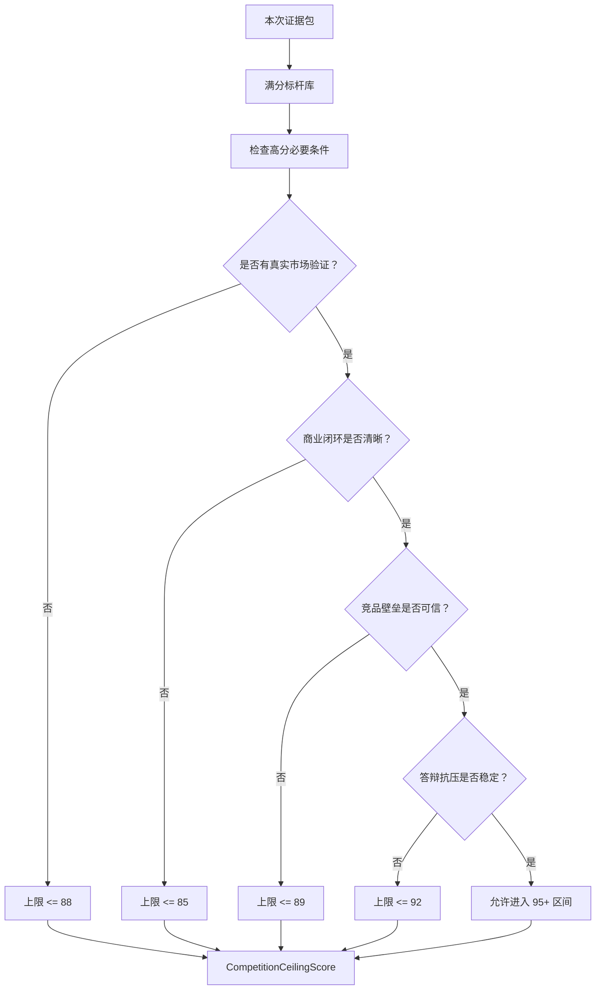

---

## 10. 评分裁决器

### 10.1 输入

```text
1. 本轮独立评分 CurrentScore
2. 历史问题修复奖励 RecoveryBonus
3. 本轮新增问题扣分 NewIssuePenalty
4. 竞赛上限分 CompetitionCeilingScore
5. 证据置信度 EvidenceConfidence
6. 评审团分歧 JuryDisagreement
```

### 10.2 输出

```text
1. 最终比赛预测分 FinalScore
2. 训练闭环完成度 RemediationScore
3. 成长增益 ImprovementDelta
4. 满分差距 CeilingGap
5. 分数解释 ScoreExplanation
6. 下一轮训练计划 TrainingPlan
```

### 10.3 示例

```text
第一次：80

第二次：
本轮独立评分 CurrentScore = 91
上轮问题全部修复 RecoveryBonus = +6
本轮新增问题 NewIssuePenalty = -2
竞赛上限 CompetitionCeilingScore = 88

最终：
FinalScore = min(91 + 6 - 2, 88)
FinalScore = 88
```

结论：

```text
上轮问题闭环率：100%
正式比赛预测分：88
满分差距：12
```

---

## 11. 16人格/评审团优化

### 11.1 16人格的业务定义

16 人格不应该只是 16 种“说话风格”，而应该是 16 种评审偏好。

| 人格 | 评审定位 | 关注重点 |
|---|---|---|
| ISTJ | 严谨保守型 | 数据、证据、逻辑一致性 |
| ISFJ | 用户关怀型 | 用户需求、服务体验 |
| INFJ | 愿景洞察型 | 社会价值、长期意义 |
| INTJ | 战略拆解型 | 壁垒、路径、系统性 |
| ISTP | 实操验证型 | 技术可行性、落地 |
| ISFP | 体验敏感型 | 表达、视觉、感受 |
| INFP | 价值理想型 | 初心、使命、故事 |
| INTP | 逻辑怀疑型 | 推理漏洞、假设边界 |
| ESTP | 现场反应型 | 答辩、临场、说服力 |
| ESFP | 感染表达型 | 路演感染力、观众感受 |
| ENFP | 创新联想型 | 创意、机会空间 |
| ENTP | 辩论挑战型 | 反驳、竞品、边界条件 |
| ESTJ | 执行管理型 | 计划、团队、里程碑 |
| ESFJ | 关系协同型 | 客户、伙伴、推广路径 |
| ENFJ | 影响力型 | 愿景表达、组织动员 |
| ENTJ | 商业裁判型 | 规模、增长、商业闭环 |

### 11.2 评审团工作流

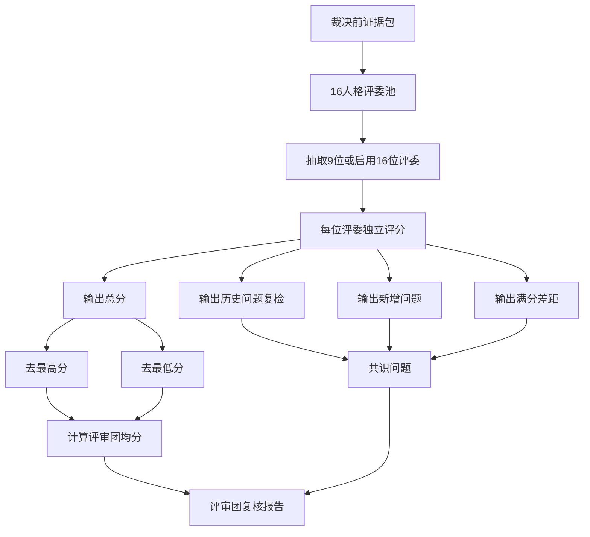

### 11.3 每位评委输出格式

```json
{
  "persona": "ENTJ",
  "overall_score": 87,
  "prior_issue_reviews": [
    {
      "memory_item_id": "issue_001",
      "status": "resolved",
      "recovered_score": 3.5,
      "reason": "市场数据已补充，但商业化验证仍不足。"
    }
  ],
  "new_issues": [
    {
      "title": "商业壁垒仍不够强",
      "deduct_score": 4,
      "evidence": "答辩中未能说明竞品复制成本。"
    }
  ],
  "ceiling_opinion": {
    "max_reasonable_score": 88,
    "reason": "虽然上轮问题修复，但尚未达到95+项目所需的商业闭环强度。"
  }
}
```

### 11.4 评审团与官方 AI 分的关系

评审团不应该直接读取最终官方分，否则容易被锚定。推荐输入：

```text
允许输入：
- 转写
- 关键帧
- 语音质量
- PPT识别
- 融合分析
- 历史扣分项
- 历史训练任务

不允许输入：
- 官方最终分
- 官方报告结论
- 官方综合评价
```

评审团输出后，再由系统做对比：

```text
官方 AI 分：88
评审团去高低均分：86.7
分歧：-1.3
共识：上轮问题已修复，但商业壁垒和市场验证仍不足。
```

---

## 12. 报告结构优化

建议最终报告结构如下。

### 12.1 总览

```text
正式比赛预测分：88
训练闭环完成度：100%
相比上轮提升：+8
满分差距：12
当前竞赛段位：省赛优秀 / 国赛入围边缘 / 国赛强竞争
```

### 12.2 分数构成

```text
本轮独立评分：91
历史问题修复奖励：+6
新增问题扣分：-2
竞赛上限限制：88
最终比赛预测分：88
```

### 12.3 上轮问题复检

| 上轮扣分项 | 上轮扣分 | 本轮状态 | 加回分 | 证据 |
|---|---:|---|---:|---|
| 市场规模数据不足 | 4 | 部分解决 | 2.5 | 08:21 转写 + 市场页关键帧 |
| 路演结构混乱 | 5 | 已解决 | 4.6 | 章节过渡清晰 |
| 答辩回应不直接 | 3 | 已解决 | 2.8 | 答辩片段 |

### 12.4 本轮新增问题

```text
1. 商业壁垒仍不够强，扣 4 分。
2. 财务增长假设偏理想化，扣 2 分。
3. 竞品复制成本说明不足，扣 3 分。
```

### 12.5 为什么不是 100

```text
虽然上轮问题已全部闭环，但本轮仍未达到 95+ 项目的必要条件：

1. 缺少真实市场验证数据。
2. 商业模式闭环证据不足。
3. 核心壁垒不够硬。
4. 财务预测缺少约束条件。
5. 答辩抗压水平尚未达到冠军项目标准。
```

### 12.6 下一轮训练计划

| 优先级 | 训练目标 | 验收标准 | 预期提分 |
|---|---|---|---:|
| P0 | 强化商业壁垒 | 能说明竞品复制成本与防御路径 | +3 |
| P0 | 补充市场验证 | 至少 3 类真实客户或用户反馈证据 | +4 |
| P1 | 优化财务模型 | 增加保守/中性/乐观三种预测 | +2 |
| P1 | 答辩抗压训练 | 对 10 个高压问题快速回应 | +2 |

---

## 13. 前端交互建议

AI 评分结果页不要只展示一个大分数，而要展示四张核心卡片：

```text
正式比赛预测分：88
训练闭环完成度：100%
较上轮提升：+8
满分差距：12
```

图片：

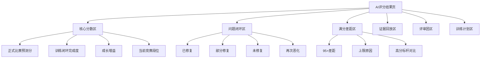

建议交互：

```text
1. 点击正式比赛预测分，展开分数构成。
2. 点击训练闭环完成度，展开上轮问题复检表。
3. 点击满分差距，展开为什么不是 100。
4. 点击每个扣分项，回放对应转写和关键帧。
5. 点击评审团分歧，查看不同人格的意见。
```

---

## 14. 技术架构建议

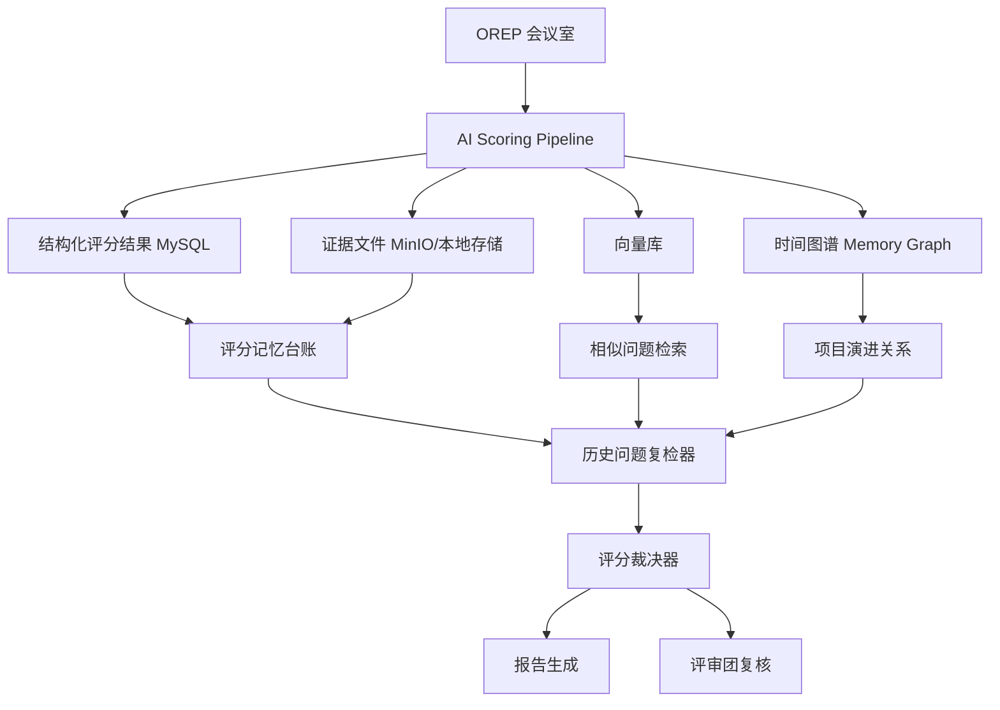

组件建议：

| 组件 | 建议 | 用途 |
|---|---|---|
| MySQL | 必须 | 结构化评分台账，最稳定 |
| MinIO/文件系统 | 已有即可 | 存关键帧、录制、报告 |
| 向量库 | 建议 | 检索相似扣分项、历史证据 |
| Graphiti/Zep | 推荐二期加入 | 做项目随时间演进的图谱记忆 |
| Mem0 | 可选 | 轻量记忆，不适合作为评分主账本 |
| Cognee | 可选 | 文档/PPT/报告知识图谱 |
| Letta | 暂不推荐作为核心 | 更适合状态型 Agent，不适合作为评分审计账本核心 |

参考开源项目：

- [Graphiti / Zep](https://github.com/getzep/graphiti)：时间知识图谱，适合做项目演进记忆。
- [Mem0](https://github.com/mem0ai/mem0)：通用 AI Agent 记忆层，适合轻量记忆。
- [Cognee](https://github.com/topoteretes/cognee)：文档和知识图谱记忆，适合沉淀 PPT、报告、材料关系。
- [Letta](https://github.com/letta-ai/letta)：状态型 Agent 框架，更适合长期智能体，不建议作为 OREP 评分账本核心。

---

## 15. 推荐落地阶段

### 第一阶段：解决误给 100 分

目标：

```text
先把“训练闭环完成度”和“正式比赛预测分”拆开。
```

实现内容：

```text
1. 增加 CompetitionCeilingScore。
2. 增加 RemediationScore。
3. 增加 ImprovementDelta。
4. 报告中区分训练完成度和比赛预测分。
5. 在评分报告中增加“为什么不是 100”模块。
```

结果：

```text
学校看到：
上轮问题已全部解决，但正式比赛预测分是 88，不是 100。
```

### 第二阶段：评分记忆闭环

目标：

```text
让系统稳定知道上轮扣了什么、本轮改了什么、还能加回多少分。
```

实现内容：

```text
1. 保存每轮扣分项。
2. 保存证据锚点。
3. 保存训练建议。
4. 下一轮自动复检旧问题。
5. 计算修复奖励。
6. 识别新增问题。
```

### 第三阶段：评审团复核

目标：

```text
让 16 人格评审团参与历史问题复检和满分差距判断。
```

实现内容：

```text
1. 给评审团输入历史问题包。
2. 每个人格独立判断修复情况。
3. 每个人格判断满分差距。
4. 聚合共识问题。
5. 形成多视角复盘报告。
```

### 第四阶段：时间图谱记忆

目标：

```text
让系统能看懂项目的长期演进。
```

实现内容：

```text
1. 项目实体：团队、项目、问题、训练任务、评分轮次。
2. 关系：发现、修复、复发、增强、替代。
3. 时间线：第 1 轮、第 2 轮、第 3 轮。
4. 检索：查询某项目长期演进。
```

---

## 16. 最终产品效果示例

学校第二次评分后，报告不再写：

```text
你已获得 100 分。
```

而是写：

```text
本轮正式比赛预测分：88

上轮问题闭环率：100%
说明：第一次评审中发现的 6 个主要扣分项，本轮均已提供有效修复证据。

相比上轮提升：+8
说明：主要提升来自市场数据补充、路演结构优化、答辩回应更直接。

为什么不是 100：
1. 商业壁垒仍不够强。
2. 市场验证证据仍偏弱。
3. 竞品复制成本说明不足。
4. 财务增长假设缺少约束。
5. 答辩表现尚未达到高压现场满分水平。

下一轮训练目标：
从“修复明显问题”进入“冲击高分壁垒建设”。
```

---

## 17. 技术水平与现场演示优先的修正版方案

前文的“连续记忆 + 裁决器”框架仍然成立，但在 OREP 当前比赛场景下，评分主逻辑必须进一步校准为：

```text
官方评分表优先
+ 技能水平 60 分优先
+ 现场演示证据优先
+ 梯度评分规则优先
+ 历史问题复检辅助加分
+ 满分标杆负责防止误给 100
```

### 17.1 官方评分表应作为最终分数骨架

系统最终不能先生成一个大模型综合分，再反推各维度。正确方式是先按官方评分表生成 15 个评分项，再汇总成总分。

```text
总分 100：

一、技能水平 60
- 操作规范性 10
- 技能熟练度 15
- 任务难易度 15
- 技术先进性 15
- 现场讲解效果 5

二、职业素养 10
- 职业道德与行为规范 4
- 工匠精神 3
- 安全意识 3

三、应用价值 10
- 实用性 4
- 经济性 3
- 可持续性 3

四、团队合作 10
- 团队精神 5
- 沟通协作 5

五、创新创意 10
- 创新意识 4
- 创新成效 6
```

图片：

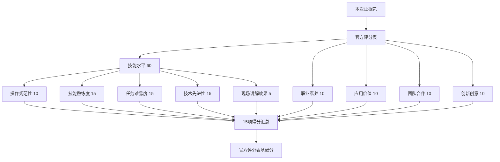

### 17.2 梯度评分规则必须绑定证据等级

项目现有梯度规则已经明确：每个观测点按证据充分程度给分。这个规则应该成为 AI 评分的硬约束。

| 证据通道 | 含义 | 可支撑的分数区间 |
|---|---|---|
| 纯口头 | 只在讲述中提到 | 通常只能支撑基准分的 40%-60% |
| 口头 + PPT | 有页面、架构图、流程图、数据表 | 通常支撑 60%-80% |
| 口头 + PPT + 现场演示 | 真实操作系统、设备、流程、功能 | 可支撑 80%-95% |
| 口头 + PPT + 现场演示 + 数据/测试 | 有运行结果、性能、准确率、日志、测试报告 | 才有资格进入 95%-100% |

这条规则很重要：

```text
没有现场演示，技能水平一般不应给高分。
没有测试数据或运行结果，技术先进性和任务难易度不应接近满分。
```

### 17.3 现场演示识别应成为独立流水线

现场演示不是普通关键帧分析的附属品，而应该成为一个独立的分析结果。

系统需要从屏幕共享、摄像头、关键帧、转写和完整录制中识别：

```text
1. 是否真的进入系统/设备/作品进行操作。
2. 是否展示关键功能，而不是只播放 PPT。
3. 操作流程是否完整。
4. 操作是否流畅，有无卡顿、报错、中断。
5. 是否展示关键技术点的运行效果。
6. 是否展示测试数据、性能指标、日志、结果页面。
7. 遇到异常时是否有应急处理和团队协作。
8. 演示内容是否与口头描述和 PPT 一致。
```

图片：

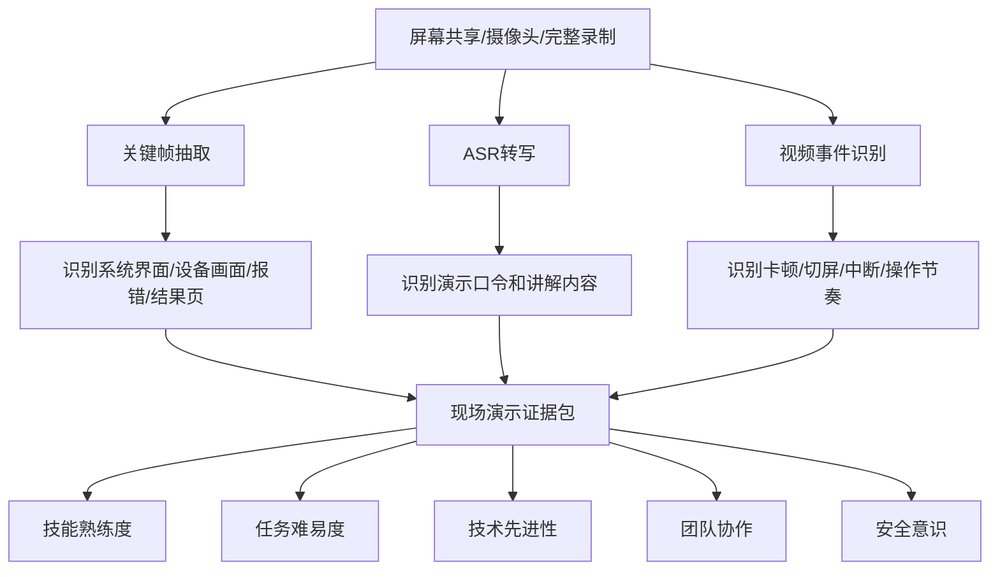

### 17.4 技术类历史问题不能只靠文字判断已修复

连续评分里，技术类扣分项必须按“证据类型”复检。

| 历史扣分项类型 | 不能算解决的情况 | 必须出现的修复证据 |
|---|---|---|
| 技能熟练度不足 | 只说“我们优化了演示流程” | 本轮真实操作更流畅，卡顿/报错减少，有完整演示片段 |
| 任务难易度不足 | 只在 PPT 上增加技术词 | 展示关键技术实际运行、架构复杂度、核心模块交互 |
| 技术先进性不足 | 只写“接入 AI/大模型/物联网” | 展示技术选型依据、运行效果、对比数据、实际调用或设备联动 |
| 操作规范性不足 | 只补一句“符合规范” | 展示标准名称、流程、合规对照、操作记录或测试报告 |
| 安全意识不足 | 只说“数据安全可靠” | 展示权限、脱敏、加密、日志、漏洞扫描或应急机制 |
| 演示稳定性不足 | 只优化讲稿 | 本轮演示无重大中断，有备用方案和异常处理 |

技术类复检输出示例：

```json
{
  "memory_item_id": "tech_issue_003",
  "dimension": "技能水平",
  "rubric_item": "技能熟练度",
  "previous_deduction": 5,
  "required_evidence": ["现场演示", "关键帧", "操作流畅度", "报错次数"],
  "status": "partially_resolved",
  "recovered_score": 2.8,
  "reason": "本轮演示完成了核心流程，但仍出现一次较长等待，且未展示备用方案。",
  "evidence": [
    {
      "type": "demo_segment",
      "time": "12:10-14:35",
      "observation": "完成登录、数据采集、结果展示流程"
    },
    {
      "type": "frame",
      "time": "13:42",
      "observation": "结果页成功显示"
    }
  ]
}
```

### 17.5 技术上限规则

原方案中的 CompetitionCeilingScore 需要扩展为两个上限：

```text
CompetitionCeilingScore：综合比赛上限
TechnicalCeilingScore：技术/演示上限
```

最终公式改为：

```text
FinalScore = min(
  OfficialRubricScore + RecoveryBonus - NewIssuePenalty,
  CompetitionCeilingScore,
  TechnicalCeilingScore
)
```

技能与演示上限建议：

```text
如果没有现场演示，技能水平原则上不应超过 42/60，总分通常不应超过 85。
如果现场演示只跑通普通功能，没有关键技术展示，技能水平原则上不应超过 48/60，总分通常不应超过 88。
如果现场演示存在严重中断或核心功能失败，技能水平原则上不应超过 38/60，总分通常不应超过 78。
如果技术先进性只停留在 PPT 和口头，没有真实运行或测试证据，技术先进性原则上不应超过 10/15。
如果任务难易度描述很高，但演示很基础，任务难易度原则上不应超过 8/15。
如果演示有完整流程、关键技术运行、测试数据、多模态一致，技能水平才有资格进入 55+/60，总分才允许进入 95+。
```

图片：

```mermaid
flowchart TD
  A["本次证据包"] --> B["官方评分表"]
  A --> C["梯度证据规则"]
  A --> D["现场演示识别"]

  B --> E["15项基础分"]
  C --> F["证据等级校验"]
  D --> G["技术/演示上限"]

  G --> H{"是否有现场演示？"}
  H -- "否" --> H1["总分上限 <= 85"]
  H -- "是" --> I{"核心功能是否跑通？"}
  I -- "否" --> I1["总分上限 <= 78"]
  I -- "是" --> J{"关键技术是否展示？"}
  J -- "否" --> J1["总分上限 <= 88"]
  J -- "是" --> K{"是否有测试/数据佐证？"}
  K -- "否" --> K1["总分上限 <= 92"]
  K -- "是" --> L["允许进入 95+ 区间"]

  E --> M["评分裁决器"]
  F --> M
  H1 --> M
  I1 --> M
  J1 --> M
  K1 --> M
  L --> M
```

### 17.6 AI 评分流水线修正版

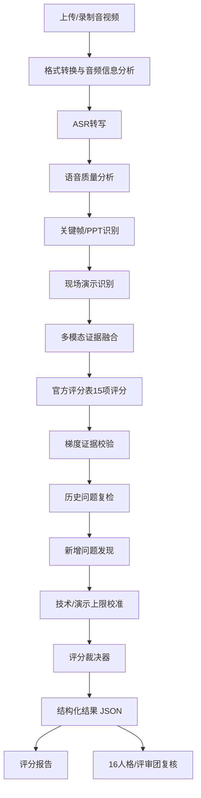

### 17.7 报告结构修正版

报告首页不要只显示总分，建议显示：

```text
正式比赛预测分：88
技能水平：50/60
现场演示等级：主流程跑通，测试证据不足
训练闭环完成度：100%
较上轮提升：+8
满分差距：12
```

分数构成：

```text
官方评分表得分：88

技能水平：50/60
- 操作规范性：8/10
- 技能熟练度：12/15
- 任务难易度：13/15
- 技术先进性：12/15
- 现场讲解效果：5/5

职业素养：8/10
应用价值：8/10
团队合作：9/10
创新创意：8/10

历史问题修复奖励：+6
新增问题扣分：-2
技术/竞赛上限限制：88
最终比赛预测分：88
```

为什么不是 100：

```text
1. 技能水平 60 分仍未达到满分状态。
2. 现场演示跑通了主流程，但没有展示异常处理、稳定性和测试结果。
3. 技术先进性缺少与传统方案的量化对比。
4. 任务难易度的复杂性主要停留在架构描述，实操证据不足。
5. 应用价值和创新成效有亮点，但不是当前主要失分来源。
```

下一轮训练计划：

| 优先级 | 训练目标 | 验收标准 | 预期提分 |
|---|---|---|---:|
| P0 | 固化现场演示链路 | 3 分钟内稳定跑通核心流程，无报错、无长停顿 | +4 |
| P0 | 补充关键技术测试数据 | 展示性能、准确率、稳定性、异常处理结果 | +4 |
| P0 | 强化技术先进性论证 | 给出新旧方案对比、技术选型理由、实际运行证据 | +3 |
| P1 | 完善安全与规范证据 | 展示权限、脱敏、日志、标准对照或测试报告 | +2 |
| P1 | 补充应用价值验证 | 至少 3 类真实用户/场景反馈证据 | +2 |

### 17.8 16人格/评审团修正版

16 人格评审团也要围绕官方评分表工作。尤其要安排技术与演示视角：

| 人格 | 修正版评审重点 |
|---|---|
| ISTJ | 规范、标准、证据一致性 |
| ISTP | 现场实操、演示稳定性、工具熟练度 |
| INTP | 技术逻辑、架构漏洞、假设边界 |
| INTJ | 技术路线、系统架构、长期壁垒 |
| ESTP | 现场反应、故障应对、临场操作 |
| ENTJ | 技术成果转化、规模化、商业闭环 |
| ENTP | 反驳压力、竞品挑战、技术边界 |
| ESTJ | 项目管理、交付路径、团队执行 |

每位评委输出中必须增加：

```json
{
  "official_rubric_scores": {
    "skill_level": 50,
    "professional_quality": 8,
    "application_value": 8,
    "teamwork": 9,
    "innovation": 8
  },
  "demo_review": {
    "demo_completed": true,
    "core_function_passed": true,
    "stability": "minor_delay",
    "technical_evidence_level": "口头+PPT+演示，缺少完整测试数据"
  },
  "ceiling_opinion": {
    "max_reasonable_score": 88,
    "reason": "虽然上轮问题修复，但技能水平证据尚未达到95+项目所需的完整技术证据链。"
  }
}
```

### 17.9 修正版最终效果

学校第二次评分后，报告应该写：

```text
本轮正式比赛预测分：88
技能水平：50/60
现场演示：主流程跑通，但缺少完整测试与异常处理证据

上轮问题闭环率：100%
说明：第一次评审中发现的 6 个主要扣分项，本轮均已提供有效修复证据。

相比上轮提升：+8
说明：主要提升来自核心演示流程跑通、技术架构讲解更清晰、操作熟练度提高。

为什么不是 100：
1. 技能水平 60 分仍未达到满分状态。
2. 现场演示只覆盖主流程，异常处理和稳定性未充分展示。
3. 关键技术缺少性能、准确率、稳定性等测试数据。
4. 技术先进性有表述，但缺少新旧方案量化对比。
5. 应用价值与创新成效仍有提升空间，但不是本轮主要短板。

下一轮训练目标：
从“修复明显问题”进入“技术证据链补强与现场演示冲高分”。
```

---

## 18. 一句话总结

OREP 的连续 AI 评分不能让“旧问题全部修完”直接等于“比赛满分”。正确架构是：

```text
官方评分表
+ 梯度证据规则
+ 现场演示识别
+ 本轮独立评分
+ 历史问题复检
+ 新问题扫描
+ 技术/满分标杆校准
+ 评分裁决器
+ 16人格评审团复核
```

这样既能保证：

```text
学校改了的问题一定被看见、被加分。
```

也能避免：

```text
系统把训练任务完成度误判成正式比赛 100 分。
```
