# 竞赛大脑 在线路演评审平台全面产品需求文档

文档版本：V2.0  
编制日期：2026-07-07  
编制方式：基于当前 竞赛大脑 本地代码、前后端路由、Controller、实体、SQL、部署配置、AI scoring 服务与成熟 PRD 框架整理  
适用对象：产品、研发、测试、交付、学校管理员、项目汇报与后续迭代评审  
文档形态：Markdown 可编辑版，图表使用 Mermaid 可编辑语法

## 0. 文档依据与写法

### 0.1 外部 PRD 框架参考

本文按照 PRD 写法：

- Atlassian 的 PRD 思路强调：明确目标、用户需求、功能范围、成功标准和团队协作上下文。
- Aha 的 PRD 思路强调：产品愿景、用户画像、用例、能力边界、需求分解和优先级。
- ProductPlan 的 PRD 思路强调：把业务目标、功能说明、验收标准、约束和实施依据放在同一个事实源中。

### 0.2 本地取证范围

本文取证自以下当前项目文件与模块：

- 根目录说明：`README.md`
- 用户端路由：`frontend/user/src/router/index.js`
- 管理端路由：`frontend/admin/src/router/index.js`
- 后端 Controller：`backend/src/main/java/com/竞赛大脑/backend/controller`
- 后端实体：`backend/src/main/java/com/竞赛大脑/backend/entity`
- AI 服务：`ai-scoring/app/routers`、`ai-scoring/app/services`
- 数据库脚本：`sql`、`deploy/sql`、`dockerrun/sql`
- 部署配置：`dockerrun/docker-compose.offline.yml`
- 技术栈配置：`backend/pom.xml`、`frontend/user/package.json`、`frontend/admin/package.json`

### 0.3 文档边界

本文是“全面产品需求文档”，不是单页 UI 设计稿，也不是开发详细设计。本文会定义：

- 产品定位与目标
- 用户角色与权限
- 信息架构
- 核心业务流程
- 功能需求
- 数据模型与核心 ER
- 接口与系统集成边界
- 非功能需求
- 验收口径
- 优先级与迭代建议

本文不会定义：

- 最终 UI 视觉稿细节
- 每个接口的完整字段级 OpenAPI 文档
- 大模型 Prompt 的全部文本
- 生产环境密钥、部署账号和真实学校数据

## 1. 执行摘要

竞赛大脑 是面向职业院校技能竞赛、项目制教学、创新创业路演和训练评审场景的在线路演评审与学生能力成长平台。系统不是单纯会议软件，也不是单纯 AI 评分工具，而是围绕“学习准备、项目组队、材料生成、在线路演、录制留痕、人工评分、AI 评分、16 人格评审团复核、问题整改、下一轮训练”的闭环平台。

系统当前由用户端、管理端、Spring Boot 后端、AI scoring/PPT agent 服务、会议与录制组件、数据库和部署脚本组成。用户端覆盖课程学习、考试练习、项目团队、在线会议、AI 报告、PPT 与讲稿、统计和个人中心；管理端覆盖用户、组织、会议、评分、问题、课程、考试、PPT、资源、首页轮播、数据分析和监控；后端提供认证、权限、业务数据、文件、评分、报告、PDF、录制、AI 回调和监控接口；AI 服务承担音视频分析、语音转写、视觉帧提取、规则评分、报告生成、AI 问答、PPT 生成与项目准备分析。

产品目标不是“把更多功能摆出来”，而是把备赛链路变短，把评分依据变硬，把改进动作变清楚。好的 竞赛大脑 应该让学生知道下一步该做什么，让老师知道哪个团队卡住了，让评审看到证据，让管理员能管住组织、资源和数据。

## 2. 背景与问题

### 2.1 业务背景

职业技能大赛和项目路演训练存在明显的过程断点：

1. 学生学习、练习、项目准备、材料制作、路演训练分散在不同工具中。
2. 老师指导依赖经验和线下沟通，缺少持续记录。
3. 路演会议即使有录制，也难以转化为可执行的评分证据和整改任务。
4. 评分结果常停留在总分和主观评语，扣分依据、证据片段、可恢复分值和训练计划不清楚。
5. 学校层面缺少组织、课程、团队、项目、路演、评分、问题和能力数据的统一管理。
6. AI 能力如果只输出漂亮报告而没有证据链，会在真实评审和答辩复盘中站不住。

### 2.2 核心问题

竞赛大脑 要解决的不是“如何在线开会”，而是：

- 如何把一次路演训练转化为可复盘、可评分、可整改、可再训练的数据资产。
- 如何让 AI 评分从“结论生成”变成“证据驱动的辅助评审”。
- 如何让学生、老师、评审、专家和管理员围绕同一条备赛闭环协作。

### 2.3 产品判断

竞赛大脑 的核心价值链应定义为：

```text
学习与练习形成基础能力
项目团队承载协作与材料
会议录制采集真实路演证据
人工评分提供专家判断
AI 评分分析证据并输出分数、扣分项和建议
AI 评审团从多视角复核，提高可信度
问题和任务驱动整改
下一轮训练验证改进结果
```

## 3. 产品定位、目标与成功指标

### 3.1 一句话定位

竞赛大脑 是面向职业院校和项目制教学场景的在线路演评审与竞赛备赛成长平台。

### 3.2 产品愿景

让每一次路演训练都沉淀为可解释的评分证据、可执行的改进任务和可持续的学生能力画像。

### 3.3 产品目标

| 目标编号 | 产品目标 | 解释 |
|---|---|---|
| G1 | 建立线上路演训练闭环 | 支持会议创建、参会、录制、回看、评分、报告和问题闭环 |
| G2 | 建立证据驱动的评分体系 | 人工评分、AI 评分、证据链、扣分项、评审团复核互相支撑 |
| G3 | 支持备赛前置流程 | 课程学习、题库练习、项目准备、团队任务、PPT 和讲稿 |
| G4 | 沉淀能力数据 | 学习、考试、团队、会议、评分、问题、材料和报告形成长期画像 |
| G5 | 支持学校级管理 | 多角色、多组织、多租户、资源管理、数据监控和权限控制 |

### 3.4 成功指标

[待验证] 当前项目未提供线上真实业务基线，以下指标作为后续产品度量建议。

| 指标 | 当前基线 | 目标 | 观察周期 |
|---|---:|---:|---|
| 完整路演闭环完成率 | 未知 | 60% 会议在结束后生成评分或 AI 报告 | 发布后 30 天 |
| AI 报告有效阅读率 | 未知 | 50% 报告查看者进入证据或行动页 | 发布后 30 天 |
| 报告到整改任务转化率 | 未知 | 30% 报告产生至少 1 个整改任务 | 发布后 30 天 |
| 课程到训练转化率 | 未知 | 40% 学习用户进入考试/会议/PPT 任一备赛动作 | 发布后 30 天 |
| 管理端误删高风险事件 | 未知 | 0 起会议/用户/课程高影响误删 | 持续监控 |
| AI 评分可信反馈 | 未知 | 80% 老师认为报告证据可用于复盘 | 试点访谈 |

## 4. 用户角色与权限

### 4.1 角色定义

| 角色 | 典型用户 | 核心诉求 | 关键权限 |
|---|---|---|---|
| 平台管理员 ADMIN | 平台负责人、运维人员 | 管全局、管配置、看监控 | 全局用户、组织、资源、监控、课程、考试、PPT、会议、评分 |
| 学校管理员 SCHOOL_ADMIN | 学校竞赛办、教务管理员 | 管本校组织与资源 | 本校用户、组织、课程、题库、会议、资源、统计 |
| 教师 TEACHER | 指导老师、课程老师 | 组织训练、看团队、看问题 | 课程/考试维护、团队指导、会议创建、评分查看 |
| 学生 STUDENT | 参赛学生、课程学生 | 学习、准备、路演、改进 | 学习、练习、团队、会议、报告、PPT、讲稿 |
| 评审员 REVIEWER | 校内外评委 | 评分与复盘 | 会议评分、报告查看、问题跟踪 |
| 专家 EXPERT | 行业导师、外聘专家 | 指导与复核 | 指导、复核、问题建议、报告查看 |

### 4.2 权限矩阵

| 功能域 | ADMIN | SCHOOL_ADMIN | TEACHER | STUDENT | REVIEWER | EXPERT |
|---|---|---|---|---|---|---|
| 用户与组织 | 全局管理 | 本校管理 | 部分管理 | 查看个人 | 无 | 无 |
| 课程管理 | 全部 | 本校 | 可维护 | 学习 | 查看相关 | 查看相关 |
| 考试题库 | 全部 | 本校 | 可维护 | 答题 | 查看相关 | 查看相关 |
| 项目团队 | 全部 | 本校 | 指导管理 | 参与 | 查看相关 | 指导 |
| 在线会议 | 全部 | 本校 | 创建/控制 | 加入 | 加入/评分 | 加入/指导 |
| 人工评分 | 查看/导出 | 本校查看 | 查看/评分 | 查看自己 | 评分 | 评分/复核 |
| AI 评分 | 配置/查看 | 本校查看 | 发起/查看 | 发起/查看 | 查看 | 查看/复核 |
| AI 评审团画像 | 配置 | 配置 | 无或只读 | 无 | 只读 | 只读 |
| 问题跟踪 | 全部 | 本校 | 处理/分派 | 查看/整改 | 提出/处理 | 提出/处理 |
| 数据监控 | 全部 | 部分 | 无 | 无 | 无 | 无 |

## 5. 信息架构

### 5.1 用户端信息架构

```mermaid
flowchart TD
  U[用户端] --> Public[公开入口]
  Public --> Intro[引导页]
  Public --> Login[登录页]

  U --> Workbench[备赛工作台]
  Workbench --> Dashboard[首页]
  Workbench --> Stats[统计]
  Workbench --> Profile[个人中心]

  U --> Learn[学习训练]
  Learn --> CourseList[课程学习]
  Learn --> LessonPlayer[课程播放]
  Learn --> ExamHome[考试系统]
  Learn --> WrongBook[错题本]
  Learn --> Favorites[收藏题]
  Learn --> Practice[专项练习]
  Learn --> ExamTaking[正式考试]

  U --> Project[项目准备与团队]
  Project --> ProjectTeam[项目团队]
  Project --> TrackMatch[赛道匹配]
  Project --> PrepChat[项目准备会话]

  U --> Roadshow[路演会议]
  Roadshow --> MeetingList[在线会议列表]
  Roadshow --> MeetingRoom[会议房间]
  Roadshow --> MeetingHistory[会议历史详情]
  Roadshow --> Recordings[我的录制]

  U --> AIScore[AI评分与复盘]
  AIScore --> Upload[视频评分上传]
  AIScore --> Report[AI评分报告]
  Report --> Overview[概览]
  Report --> Dimensions[维度]
  Report --> Evidence[证据]
  Report --> Voice[声音]
  Report --> Presentation[展示]
  Report --> Actions[行动]
  Report --> Jury[评审团]
  AIScore --> Chat[AI复盘问答]

  U --> Content[材料生成]
  Content --> Resources[资源中心]
  Content --> PptGen[PPT生成]
  Content --> PptEditor[PPT编辑]
  Content --> PptHistory[PPT历史与质量修复]
  Content --> ScriptList[讲稿列表]
  Content --> ScriptEditor[讲稿编辑]
```

### 5.2 管理端信息架构

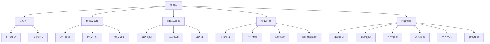

## 6. 总体业务闭环

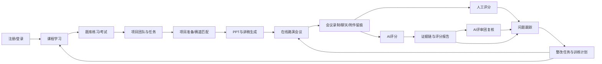

### 6.1 业务原则

1. 所有路演数据都应尽量可追溯到会议、录制、材料、评分和证据。
2. 所有评分结论都应尽量能关联到评分规则、评分项、证据片段和整改建议。
3. 所有整改建议都应尽量变成任务，而不是停留在报告文本。
4. 所有用户可见数据都必须受角色、租户、组织和资源归属控制。

## 7. 核心用例图

```mermaid
flowchart TB
  Student((学生))
  Teacher((教师))
  Reviewer((评审员))
  Expert((专家))
  Admin((管理员))

  UC1[学习课程]
  UC2[参加练习/考试]
  UC3[参与项目团队]
  UC4[准备PPT和讲稿]
  UC5[加入路演会议]
  UC6[查看AI评分报告]
  UC7[执行整改任务]

  UC8[创建课程/题库]
  UC9[管理项目团队]
  UC10[创建并控制会议]
  UC11[查看评分与问题]
  UC12[人工评分]
  UC13[AI评审团复核]

  UC14[管理用户组织]
  UC15[管理资源/PPT/轮播]
  UC16[查看数据监控]
  UC17[配置AI评审画像]

  Student --> UC1
  Student --> UC2
  Student --> UC3
  Student --> UC4
  Student --> UC5
  Student --> UC6
  Student --> UC7

  Teacher --> UC8
  Teacher --> UC9
  Teacher --> UC10
  Teacher --> UC11
  Teacher --> UC12

  Reviewer --> UC5
  Reviewer --> UC12
  Reviewer --> UC11

  Expert --> UC5
  Expert --> UC11
  Expert --> UC13

  Admin --> UC14
  Admin --> UC15
  Admin --> UC16
  Admin --> UC17
  Admin --> UC8
```

## 8. 功能需求

### 8.1 登录、账号与个人中心

#### 8.1.1 功能说明

系统当前提供用户端引导页、用户端登录/账号申请、个人中心、管理端登录和无权访问页。用户端路由守卫会将未登录用户引导到 `/intro`，已登录用户访问 `/intro` 或 `/login` 时返回首页；管理端根据 ADMIN、SCHOOL_ADMIN、TEACHER、EXPERT、REVIEWER 等角色控制可访问菜单。

**模块功能描述**

业务功能：登录、账号与个人中心

页面：用户端引导页

(1）模块功能描述
进入用户端未登录状态或访问 `/intro` 时，页面展示“竞赛大脑”产品介绍、学习考试、AI 评分、PPT 材料、评审团和备赛流程等能力说明。页面提供【进入登录】【开始使用】等入口，点击后进入用户端登录页；已登录用户访问引导页时系统自动回到用户端首页。

页面：用户端登录页

(1）模块功能描述
用于用户登录和账号申请。页面包含“登录/申请账号”两个 tab，登录表单显示账号、密码、忘记密码和【进入工作台】按钮；账号申请表单显示申请人基础信息并提交申请。用户可返回产品介绍页；登录成功后进入用户端首页，失败时显示错误提示。

页面：个人中心页

(1）模块功能描述
用于查看账号身份信息并维护登录密码。页面显示头像、用户名、邮箱、角色、所属组织等基础信息，并提供修改密码表单。用户可提交旧密码、新密码和确认密码完成密码变更。

页面：管理端登录页

(1）模块功能描述
用于进入“竞赛备赛大脑管理控制台”。页面展示管理端能力提示、账号和密码输入框、管理员登录按钮。登录成功后按照角色进入第一个可访问的管理页面；登录失败时展示错误提示。

页面：无权访问页

(1）模块功能描述
当账号无管理后台访问权限或访问受限页面时展示。页面提示“无权访问管理后台”，并提供返回登录入口。

#### 8.1.2 需求清单

| 编号 | 需求 | 优先级 | 验收口径 |
|---|---|---|---|
| AUTH-01 | 用户可通过邮箱验证码注册 | P0 | 可发送验证码、校验验证码、创建账号 |
| AUTH-02 | 用户可通过账号密码登录 | P0 | 返回 token、角色、用户信息 |
| AUTH-03 | 用户端未登录访问业务页进入引导页 | P0 | `/` 根据 token 进入首页或引导页 |
| AUTH-04 | 管理端按角色分配可访问菜单 | P0 | 无权限角色跳转无权限页或首个可访问页 |
| AUTH-05 | 修改密码 | P1 | 修改后旧密码不可登录 |
| AUTH-06 | 受保护资源下载需携带认证 | P0 | 录制、报告、附件不可裸链越权访问 |

### 8.2 首页

#### 8.2.1 功能说明

用户端首页当前是登录后的工作台页面，数据来自 `/api/home/dashboard`、`/api/project-teams/my` 和 `/api/courses`。页面不是单纯菜单宫格，而是围绕当前项目、任务、课程和团队动态提供继续推进入口。

**模块功能描述**

业务功能：首页

页面：用户端首页

(1）模块功能描述
登录后访问 `/` 进入首页。页面显示问候语、当前项目标题、项目摘要、项目状态、优先任务、快捷入口、项目任务和团队动态。用户可点击【查看项目详情】进入任务管理页，可点击【查看项目资料】进入文件中心，可通过快捷入口进入在线路演、PPT 制作、学习中心、考试中心等页面。首页内容以首页接口、我的项目团队接口和课程接口返回的数据为基础，缺省时展示空状态或降级内容。

页面：用户端左侧导航与账号菜单

(1）模块功能描述
用户端主导航固定显示：首页、在线路演、PPT制作、讲稿制作、文件中心、学习中心、考试中心、评分总结、任务管理、选题策划。左下角显示当前版本和账号信息，账号菜单提供【个人资料】【产品介绍】【退出登录】入口，并展示当前登录状态。

页面：首页轮播管理页

(1）模块功能描述
管理端通过【内容资源】->【首页轮播】维护用户端首页或引导页运营位。页面以卡片和列表方式展示轮播标题、副标题、图片、主按钮、次按钮、跳转路径、排序和状态。管理员可新增轮播、编辑轮播、上传图片、启用/停用、删除和批量删除。

#### 8.2.2 需求清单

| 编号 | 需求 | 优先级 | 验收口径 |
|---|---|---|---|
| HOME-01 | 展示用户当前身份、团队和项目状态 | P0 | 登录后可看到与本人相关的团队/项目摘要 |
| HOME-02 | 推荐 1-3 个下一步动作 | P0 | 来自课程、问题、PPT、会议、报告等真实状态 |
| HOME-03 | 展示最近一次路演或 AI 评分结果 | P1 | 可跳转到报告或会议历史 |
| HOME-04 | 展示待处理问题和任务 | P1 | 可进入项目团队或问题详情 |
| HOME-05 | 支持首页轮播或运营内容配置 | P2 | 管理端配置后用户端展示 |

### 8.3 学习中心

#### 8.3.1 功能说明

课程学习由用户端学习中心、课程详情、课时播放器和管理端课程管理组成。用户端读取 `/api/courses`、课程详情、播放地址、学习进度和课时完成接口；管理端维护课程、章节、课时、视频、封面和附件。

**模块功能描述**

业务功能：学习中心

页面：学习中心

(1）模块功能描述
用户点击【学习中心】进入课程学习页。页面展示课程学习标题、推荐课程、本周学习计划、课程筛选 tab、分类筛选、搜索关键词、课程卡片、学习进度和课程资料入口。用户可按全部/进行中/已完成等状态查看课程，点击课程进入详情，点击课程按钮继续学习。

页面：课程详情页

(1）模块功能描述
用户从课程列表点击课程后仍在课程学习页面展示详情视图。页面显示课程标题、课程摘要、课程章节、课程目录、课程介绍、学习记录和课程资料 tab。用户可继续学习第一节可用课时、展开章节、进入课时播放器、查看学习进度和课程附件。

页面：课程播放页

(1）模块功能描述
用户从课程详情点击课时后进入课时播放器。页面显示返回按钮、当前课时标题、视频播放器、学习进度、章节目录、学习笔记和课后动作。系统通过课时播放地址接口获取视频流地址，支持标记课时完成、保存进度、切换下一课时，并提供“完成章节练习”“生成一次阶段测评”“回到课程详情”等动作。

页面：课程管理页

(1）模块功能描述
管理端通过【内容资源】->【课程管理】维护学习内容。页面显示课程名称、类型、分类、状态、排序和操作按钮，支持新建课程、编辑课程、删除课程、批量删除、上传课程封面。选中课程后可维护章节、课时、课时视频和课程附件，章节和课时支持新增、编辑、删除，附件支持上传、查看、删除和批量删除。

#### 8.3.2 用户端需求

| 编号 | 需求 | 优先级 | 验收口径 |
|---|---|---|---|
| COURSE-U-01 | 查看课程列表和课程详情 | P0 | 展示课程分类、封面、进度、章节 |
| COURSE-U-02 | 播放课时视频 | P0 | 支持浏览器 Range 请求和受保护播放地址 |
| COURSE-U-03 | 记录学习进度 | P0 | 进度随学习状态更新 |
| COURSE-U-04 | 标记课时完成 | P1 | 完成后课程进度同步变化 |
| COURSE-U-05 | 下载或查看课程附件 | P1 | 附件可按权限访问 |

#### 8.3.3 管理端需求

| 编号 | 需求 | 优先级 | 验收口径 |
|---|---|---|---|
| COURSE-A-01 | 新增/编辑/删除课程 | P0 | 表单保存后用户端可见 |
| COURSE-A-02 | 维护章节和课时 | P0 | 章节、课时排序正确 |
| COURSE-A-03 | 上传课程封面和视频 | P0 | 用户端可正常展示和播放 |
| COURSE-A-04 | 上传和删除附件 | P1 | 附件状态与课程一致 |
| COURSE-A-05 | 批量删除 | P2 | 删除前有确认和影响提示 |

### 8.4 考试中心

#### 8.4.1 功能说明

考试中心当前包含训练任务、正式考试、错题本、收藏题、专项练习、正式答题和管理端考试管理。用户端通过 `/api/exams`、`/api/exams/wrong-questions`、`/api/exams/favorites`、考试开始、提交、收藏和切屏记录接口完成答题闭环。

**模块功能描述**

业务功能：考试中心

页面：考试中心首页

(1）模块功能描述
用户点击【考试中心】进入“练习与考试”页面。页面展示推荐训练、练习与考试 tab、题库分类、训练任务、正式考试和错题沉淀区域。用户可点击【开始推荐训练】进入错题或收藏专项练习，可点击正式考试卡片开始考试，可进入错题本和收藏题页面。

页面：错题本页

(1）模块功能描述
用户从考试中心点击错题本进入复盘页。页面标题为“错题本”，用于展示客观题错题数量、题干、答案、解析和筛选结果。页面从 `/api/exams/wrong-questions` 获取数据，用户可按题型筛选、查看解析、收藏重点题，并进入错题专项练习。

页面：收藏题页

(1）模块功能描述
用户从考试中心点击收藏题进入重点题库页。页面标题为“收藏题”，用于展示个人收藏题数量、题干、答案和解析。页面从 `/api/exams/favorites` 获取数据，用户可考前复习重点题，并进入收藏题专项练习。

页面：专项练习页

(1）模块功能描述
用户从错题本或收藏题进入专项练习。页面显示返回入口、当前题干、选项或文本答案区、上一题、下一题、完成练习按钮、练习卡和练习说明。用户答题后可完成练习并查看正确率、错题明细和解析。

页面：正式考试页

(1）模块功能描述
用户点击考试卡片后进入正式考试页。页面显示返回考试系统、试卷标题、题目、选项或文本答案区、上一题、下一题、收藏题目、检查并交卷、答题卡、考试状态和剩余时间。系统在开始考试时创建 attempt，交卷后提交答案并显示得分结果；页面监听切屏并调用切屏记录接口。

页面：考试管理页

(1）模块功能描述
管理端通过【内容资源】->【考试管理】维护题库、考试和人工评阅。页面包含题库管理、考试管理、人工评阅三个 tab。题库管理显示题干、题型、分类、难度、分值、状态和操作；考试管理显示考试名称、时长、及格线、防作弊、状态和操作；人工评阅显示待评阅试卷、用户、当前得分、总分、提交时间和评阅入口。

#### 8.4.2 需求清单

| 编号 | 需求 | 优先级 | 验收口径 |
|---|---|---|---|
| EXAM-01 | 学生查看可用试卷 | P0 | 只展示发布状态或本人可见试卷 |
| EXAM-02 | 开始考试并生成 attempt | P0 | 记录开始时间、截止时间、题目 |
| EXAM-03 | 提交答卷并计算客观题得分 | P0 | 返回得分、正确数、题数 |
| EXAM-04 | 记录切屏离开次数 | P1 | attempt 中记录 screenLeaveCount |
| EXAM-05 | 维护错题本 | P1 | 错题可进入专项练习 |
| EXAM-06 | 收藏题 | P1 | 收藏/取消后列表更新 |
| EXAM-07 | 人工评阅主观题 | P1 | 管理端可评分并保存 |
| EXAM-08 | 管理题库和试卷 | P0 | 支持题目、试卷 CRUD 和批量删除 |

### 8.5 任务管理

#### 8.5.1 功能说明

任务管理当前在用户端以【任务管理】页面呈现，主视图围绕项目任务清单、今日安排、任务状态筛选和右侧任务详情组织协作。页面数据来自 `/api/project-teams/my`、团队 dashboard、任务、提交、材料、路演绑定等接口。

**模块功能描述**

业务功能：任务管理

页面：任务管理页

(1）模块功能描述
用户点击左侧导航【任务管理】进入任务管理页。页面顶部显示当前项目名称、当前阶段和待审核/过期任务提示，例如“智慧养老项目 · 复盘提升阶段，2 项待审核，4 项已过期需处理”。页面右上提供【智慧养老项目】项目切换按钮和【新建任务】按钮。主体左侧为任务概览卡片，显示今日待办、我的任务、已完成、已过期等统计；中间区域显示“今日任务”，按上午、下午、晚上三个时间段归类当天任务；下方显示“全部任务”，支持按全部、我的、待处理、进行中、已完成、已过期筛选。任务列表展示任务类型标识、任务标题、说明、状态、负责人和日期。用户点击任务后，右侧详情卡展示任务类型、标题、说明、负责人、任务类型、阶段、优先级、截止时间、来源等信息，并提供【查看任务】等操作。

页面：任务筛选与任务详情区

(1）模块功能描述
在任务管理页中，用户可通过任务筛选按钮切换不同状态的任务集合。任务来源包括团队任务、项目资料、评分扣分项和复盘建议等。列表中的任务状态包括已过期、待处理、待审核、需修改、已通过等。右侧任务详情区随当前选中任务变化，用于查看当前任务的完整信息和下一步操作；当任务来自 AI 评分或复盘建议时，详情中会保留评分报告来源、处理要求和待补齐证据说明。

#### 8.5.2 需求清单

| 编号 | 需求 | 优先级 | 验收口径 |
|---|---|---|---|
| TEAM-01 | 创建项目团队 | P0 | 团队含名称、简介、赛道、创建人 |
| TEAM-02 | 管理团队成员和岗位 | P0 | 可添加成员、设置岗位、变更角色 |
| TEAM-03 | 阶段管理 | P1 | 团队可进入选题、材料、路演、整改等阶段 |
| TEAM-04 | 创建与分配任务 | P0 | 任务可指派、提交、更新状态 |
| TEAM-05 | 任务提交与审核 | P0 | 提交有内容/文件，老师可审核 |
| TEAM-06 | 材料上传与审核 | P0 | 材料关联团队并可被审核 |
| TEAM-07 | 绑定路演记录 | P0 | 团队和会议形成训练记录 |
| TEAM-08 | 生成能力证据 | P1 | 成员能力快照可关联学习、评分、任务证据 |
| TEAM-09 | 问题转整改任务 | P0 | 报告/评分问题可进入项目任务或问题池 |

### 8.6 选题策划

#### 8.6.1 功能说明

当前代码中 `/track-match` 已重定向到首页，未形成独立赛道匹配页面。项目准备实际由用户端【选题策划】入口承载，页面路径为 `/script-editor?tab=topic`，并通过项目准备接口获取团队、方向、会话、材料、文档和任务。

**模块功能描述**

业务功能：选题策划

页面：选题策划页

(1）模块功能描述
用户点击【选题策划】进入项目准备工作台的 topic tab。页面左侧为项目准备导航，包含选题策划、材料库、PPT 准备、讲稿制作、路演准备、版本记录。选题策划区域用于围绕团队项目补充赛项、设备条件、团队基础或已有想法，系统展示 AI 对话、方向池、证据缺口、研究来源和候选方向。用户可选择方向、生成任务、生成草稿，并将生成的任务同步到项目团队。

页面：文件中心页

(1）模块功能描述
用户点击【文件中心】或进入 `/script-editor?tab=materials` 打开材料库。页面显示全部材料、赛项文件、团队项目材料、调研资料、成果证明、PPT/讲稿素材、公共资源、待处理等分类，支持列表/图标视图切换、搜索、预览、下载、上传文件和新建文件夹。材料数据来自 PPT 模板/资源接口和项目准备上下文。

页面：PPT 准备、讲稿制作和路演准备占位页

(1）模块功能描述
在当前线上试用状态下，`/script-editor?tab=ppt`、`/script-editor?tab=script`、`/script-editor?tab=roadshow` 等准备页会显示“当前为线上试用账号，此功能暂不开放”等状态提示，或展示已有资源、讲稿、会议和任务的列表。文档中应把这类页面描述为当前可见状态与后续可开放能力，不能写成已经完整开放的生成编辑流程。

页面：版本记录页

(1）模块功能描述
用户进入 `/script-editor?tab=versions` 后查看项目准备过程中产生的方向、策划文档、讲稿和 AI 运行记录。页面在暂无数据时显示“暂无版本记录”，有数据时以列表卡片展示文档、讲稿和 AI 运行结果，并支持查看正文或进入讲稿详情。

#### 8.6.2 需求清单

| 编号 | 需求 | 优先级 | 验收口径 |
|---|---|---|---|
| PREP-01 | 初始化项目准备工作台 | P1 | 返回团队、方向、任务、文档基础上下文 |
| PREP-02 | 项目准备会话 | P1 | 支持消息提交和 AI 回复 |
| PREP-03 | 方向分析与选择 | P1 | 可选择推荐方向并沉淀理由 |
| PREP-04 | 任务生成 | P1 | 可围绕方向生成团队任务 |
| PREP-05 | 文档生成与查看 | P1 | 项目准备成果可保存和读取 |
| PREP-06 | 选题策划与方向池 | P2 | 展示候选方向、证据缺口、研究来源和任务建议 |

### 8.7 PPT制作、讲稿制作与文件中心

#### 8.7.1 功能说明

PPT制作、讲稿制作与文件中心在当前平台中分成两类入口：一类是用户端主导航中的【PPT制作】【讲稿制作】【文件中心】，另一类是路由中已存在的 PPT 生成、PPT 编辑、PPT 历史详情、路演资源中心和讲稿编辑页面。文档需要区分“当前主导航可见入口”和“路由中已存在但不一定作为主导航展示的能力”。

**模块功能描述**

业务功能：PPT制作、讲稿制作与文件中心

页面：路演资源中心页

(1）模块功能描述
用户访问 `/resources` 进入路演资源中心。页面展示资源文件列表，显示文件名、文件类型、大小、上传时间等信息，并提供下载按钮。数据来自 `/api/ppt-template`，用于下载路演模板、资料或 PPT 资源。

页面：PPT生成页

(1）模块功能描述
用户访问 `/ppt-generator` 进入 AI PPT 智能生成页。页面按步骤展示技术领域选择、项目信息表单、大纲预览、视觉风格选择、生成状态、生成完成和历史生成记录。页面调用 PPT 主题、表单、问卷提交、任务创建、任务状态、确认和下载等接口。

页面：PPT编辑页

(1）模块功能描述
用户访问 `/ppt-editor` 进入智能 PPT 生成工作台。页面显示路演 PPT/论文 PPT 类型切换、材料准备方式、材料上传、问卷抽屉、模型/模板配置、生成进度、日志、预览、历史抽屉、文本编辑、重新生成、下载和取消生成等操作。页面通过 `/api/ppt/health`、providers、templates、upload、generate、status、preview、history、download 等接口工作。

页面：PPT 历史详情页

(1）模块功能描述
用户访问 `/ppt-history/:id` 查看某次 PPT 生成任务详情。页面包含终稿总审、总报告、HTML 预览、质量报告、路演结构、评分覆盖、实操演示、素材证据、历史大纲、历史问卷和生成快照等 tab。用户可运行路演健康检查、生成优化任务队列、预览 HTML 页面、查看质量问题、执行页面修复、查看修复历史并触发下载流程。

页面：讲稿制作页

(1）模块功能描述
用户通过【讲稿制作】进入 `/script-editor?tab=script`。当前线上试用状态下，该入口可能显示暂不开放提示；在有讲稿数据时，页面可列出讲稿卡片、从模板新建、另存模板、查看正文或进入讲稿详情。

页面：讲稿编辑页

(1）模块功能描述
用户进入 `/script-editor/detail/:scriptId` 或模板详情后打开讲稿编辑页。页面显示讲稿标题输入、保存为模板、导出 PDF、章节结构、团队角色、章节标题、预计时长、讲稿步骤、讲解要点、动作提示和补充说明。用户可新增/删除章节、新增角色、调整步骤顺序、保存讲稿并导出 PDF。

页面：管理端 PPT 资源页

(1）模块功能描述
管理端【内容资源】->【PPT 资源】用于维护可下载的 PPT 资源文件。页面显示文件名、大小、类型、上传人、上传时间和操作，支持上传、下载、删除和批量删除。

页面：管理端 PPT 任务页

(1）模块功能描述
管理端【内容资源】->【PPT 任务】用于监控智能 PPT 生成任务。页面展示任务统计、状态筛选、领域筛选、任务 ID、项目名称、创建者、领域、状态、进度、创建时间和操作。管理员可刷新任务、下载已完成任务、查看大纲预览。

#### 8.7.2 需求清单

| 编号 | 需求 | 优先级 | 验收口径 |
|---|---|---|---|
| PPT-01 | 浏览资源/PPT 模板 | P0 | 用户端可按类别查看、预览、下载 |
| PPT-02 | 后台上传和管理 PPT 模板 | P0 | 管理端可上传、删除、批量删除 |
| PPT-03 | AI 生成 PPT | P0 | 提交配置后生成任务，支持查询状态和下载 |
| PPT-04 | PPT 历史详情 | P0 | 展示任务、页面、快照、质量报告 |
| PPT-05 | 页面级质量检查 | P1 | 识别占位词、缺图、模板化、评分支撑不足等问题 |
| PPT-06 | 自动修复与回滚 | P1 | 支持按页修复和历史版本恢复 |
| PPT-07 | 下载门禁 | P1 | 下载前提示未满足项，可继续修复或确认下载 |
| PPT-08 | 讲稿列表与编辑 | P0 | 用户可创建、编辑、保存、导出讲稿 |
| PPT-09 | PPT 页面与讲稿同步 | P1 | 页面改动后讲稿同步状态可追踪 |

### 8.8 在线路演

#### 8.8.1 功能说明

在线路演由用户端【在线路演】、会议房间、会议历史、我的录制和管理端会议管理组成。页面真实支持会议号/密码加入、创建会议、参与记录、LiveKit 音视频、聊天附件、评分面板、问题列表、录制启动/停止、录制回放和流式播放。

**模块功能描述**

业务功能：在线路演

页面：在线路演页

(1）模块功能描述
用户点击【在线路演】进入路演会议接入页。页面显示加入已有会议、创建会议室、最近参与和参与记录。加入区支持输入会议号和密码并调用加入接口；创建区支持填写会议标题、密码和时长并创建会议；参与记录可进入会议历史详情、进入 AI 报告或跳转上传视频评分。

页面：会议房间页

(1）模块功能描述
用户进入 `/meeting/:id` 后进入会议房间。页面显示会议标题、连接状态、主视频区域、参会者视频/屏幕共享、聊天面板、附件上传、评分面板、问题列表和底部控制栏。用户可开关麦克风、摄像头、屏幕共享，切换布局，发送聊天，上传附件，提交评分，查看/解决问题，启动或停止录制并退出会议。

页面：会议历史详情页

(1）模块功能描述
用户进入 `/meeting-history/:id` 查看会议复盘。页面显示会议标题、状态、时长、参会信息、AI 评分入口、团队扣分项入口、上传视频评分入口，并通过 tab 展示聊天记录、评分结果和问题列表。用户可打开聊天附件、导出问题 PDF、进入 AI 报告或返回参与记录。

页面：我的录制页

(1）模块功能描述
用户进入 `/my-recordings` 查看本人可访问的录制文件。页面显示录制状态筛选、刷新、搜索、录制卡片、会议标题、录制时间、文件类型、文件大小、展开详情、播放、下载、复制链接、关联会议、AI 评分和删除等操作。页面支持视频、屏幕、音频等文件类型的流式播放。

页面：会议管理页

(1）模块功能描述
管理端【路演评审】->【会议管理】用于创建、分发和控制路演会议。页面显示会议标题、会议号、密码、状态、时长、创建时间和操作，支持创建会议、复制会议号、复制密码、复制邀请、开始会议、结束会议、删除、批量删除、按状态和关键词筛选。

页面：管理端文件中心页

(1）模块功能描述
管理端【内容资源】->【文件中心】用于管理用户端文件中心资料。页面显示文件夹分类、关键词、文件类型、文件名、文件夹、大小、类型、上传人、上传时间和操作，支持下载、删除、批量删除，并在右侧展示选中文件详情。

#### 8.8.2 需求清单

| 编号 | 需求 | 优先级 | 验收口径 |
|---|---|---|---|
| MEET-01 | 创建会议 | P0 | 生成会议号、密码、时长、状态 |
| MEET-02 | 会议号和密码加入 | P0 | 验证成功后记录参会 |
| MEET-03 | 开始/结束会议 | P0 | 状态变更并记录时间 |
| MEET-04 | 会议房间音视频 | P0 | 获取 LiveKit token 并进入房间 |
| MEET-05 | 会议聊天与附件 | P1 | 聊天留痕，附件可受保护访问 |
| MEET-06 | 参会记录 | P1 | 记录加入、离开、参与时长 |
| MEET-07 | 录制启动/停止 | P0 | 调用录制服务并回传状态 |
| MEET-08 | 录制上传与回调 | P0 | bot-complete 后记录录制文件 |
| MEET-09 | 我的录制与会议录制 | P1 | 用户可查看有权限录制 |
| MEET-10 | 录制播放/流式访问 | P0 | 支持 video/camera/screen/audio 等文件访问 |
| MEET-11 | 会议历史详情 | P0 | 展示参会、录制、聊天、评分和报告入口 |

### 8.9 评分查看与问题跟踪

#### 8.9.1 功能说明

人工评分发生在会议房间内，管理端通过评分查看页按会议查看评分明细；问题跟踪由会议房间、会议历史和管理端问题跟踪共同承载。评分和问题接口分别为 `/api/score/*` 与 `/api/issue/*`。

**模块功能描述**

业务功能：评分查看与问题跟踪

页面：会议房间评分面板

(1）模块功能描述
在会议房间中，用户点击底部【评分】打开评分面板。页面从评分项接口加载评分项，评审可按评分项输入得分并提交评分。提交后系统按会议记录评分明细，供会议历史和管理端评分查看页汇总。

页面：管理端评分查看页

(1）模块功能描述
管理端【路演评审】->【评分查看】用于按会议查看评分结果和复盘信号。页面显示会议选择器、评分人、角色、评分类别、评分项、得分、评语和评分时间，并提供导出 PDF 操作。

页面：会议问题列表

(1）模块功能描述
在会议房间和会议历史中，系统展示关联会议的问题列表，支持全部、待解决、已解决筛选。用户可刷新问题、查看问题标题、描述、状态、创建时间，并对未解决问题执行标记解决。

页面：管理端问题跟踪页

(1）模块功能描述
管理端【路演评审】->【问题跟踪】用于把评分和会议复盘转化为可处理事项。页面显示问题标题、描述、关联会议、所属团队、指导老师、提出人、分类、状态、创建时间和操作，支持按状态与关键词筛选、刷新问题和标记解决。

#### 8.9.2 需求清单

| 编号 | 需求 | 优先级 | 验收口径 |
|---|---|---|---|
| SCORE-01 | 初始化评分项 | P0 | 评分项符合 2025 世界职业院校技能大赛维度 |
| SCORE-02 | 查看评分项 | P0 | 评审可按会议获取评分项 |
| SCORE-03 | 提交评分 | P0 | 生成 score_record 和 score_detail |
| SCORE-04 | 查看评分结果 | P0 | 按会议汇总评委、明细、总分 |
| SCORE-05 | 导出评分 PDF | P1 | 按会议导出可下载报告 |
| ISSUE-01 | 问题列表 | P0 | 可按会议、状态、类别查看 |
| ISSUE-02 | 未解决问题 | P0 | 首页/团队可引用 |
| ISSUE-03 | 解决问题 | P0 | 记录解决时间和解决会议 |
| ISSUE-04 | 问题 PDF 导出 | P1 | 支持汇报和归档 |

### 8.10 评分总结与 AI 评分报告

#### 8.10.1 功能说明

评分总结与 AI 评分报告当前由上传视频评分页、评分总结页、AI 报告框架及其子页面组成。报告 tab 来自前端 composable，真实显示为：总览、五维评分、证据链、表达节奏、现场呈现、改进方案、AI评审团。

**模块功能描述**

业务功能：评分总结与 AI 评分报告

页面：上传视频评分页

(1）模块功能描述
用户进入 `/ai-score-upload` 后看到“上传视频评分并生成 AI 评分报告”。页面包含返回、关闭、视频上传、项目信息/评分配置、上传进度、评分会话、AI pipeline 阶段、错误提示和【查看评分状态】入口。创建成功后跳转 `/ai-score/report/{sessionId}` 查看报告。

页面：评分总结页

(1）模块功能描述
用户点击【评分总结】进入 `/statistics`。页面标题为“选择一场路演评分报告”，提供【发起路演评分】【上传视频评分】按钮，并按“我参与的/我创建的/全部”等范围展示报告列表。用户点击报告后按 sessionId、reportId 或 meetingId 进入 AI 报告。

页面：AI 评分报告框架页

(1）模块功能描述
AI 报告框架页负责加载报告、展示加载/失败状态，并承载报告导航。报告导航包含总览、五维评分、证据链、表达节奏、现场呈现、改进方案、AI评审团；支持按 sessionId、reportId 和 meetingId 三类入口访问。

页面：总览页

(1）模块功能描述
总览页展示整体评分、等级判断、关键扣分影响、证据定位、语音转写、规则命中、评分依据与维度影响、五维评分等内容。用户可点击维度进入五维评分，点击扣分证据进入证据链，点击【生成团队工作项】进入改进方案。

页面：五维评分页

(1）模块功能描述
五维评分页展示各评分维度的得分、满分、扣分项、观察记录、评分表和证据入口。用户可切换维度，查看该维度下的评分项、观察说明和相关证据，并跳转证据链页定位证据。

页面：证据链页

(1）模块功能描述
证据链页展示证据准备按钮、观察关联证据、筛选 chip、时间线、证据详情、关联评分项、可用操作、风险提示和证据表。用户可准备 evidence bundle、搜索证据、按类型筛选、上一条/下一条切换、复制证据并定位关联扣分项。

页面：表达节奏页

(1）模块功能描述
表达节奏页分析语音表达问题，展示问题句、原句、建议话术、训练建议、通过线和训练清单。用户可按筛选条件查看表达问题，点击【加入训练清单】或复制建议话术。

页面：现场呈现页

(1）模块功能描述
现场呈现页分析路演现场展示问题，展示问题时间点、关键画面、扣分原因、怎么改、页面标注点和通过线。用户可按问题类型筛选，并将呈现问题加入后续训练计划。

页面：改进方案页

(1）模块功能描述
改进方案页把报告扣分项整理为可执行动作。页面展示 P0/P1/P2 筛选、扣分项列表、为什么扣分、怎么改、交付物、验收标准、加入团队任务和查看团队任务入口。用户可选择当前扣分项并同步为团队工作项。

#### 8.10.2 状态机

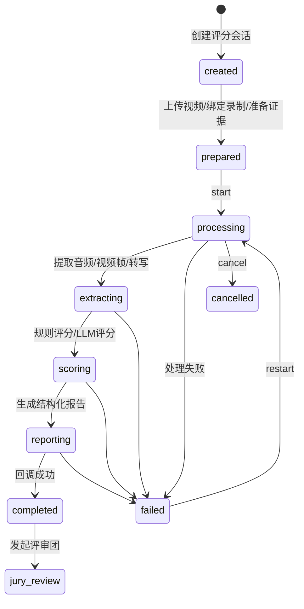

#### 8.10.3 需求清单

| 编号 | 需求 | 优先级 | 验收口径 |
|---|---|---|---|
| AI-01 | 创建 AI 评分会话 | P0 | 记录 sourceType、meetingId、recordingId、track、rubric |
| AI-02 | 上传视频评分 | P0 | 上传文件后创建 session 并启动 pipeline |
| AI-03 | 从会议/录制发起评分 | P0 | 可基于 meetingId 或 recordingId 进入报告 |
| AI-04 | 查询会话状态 | P0 | 前端可轮询进度、阶段和错误 |
| AI-05 | 证据准备 | P0 | 生成 evidence bundle 和 snapshot |
| AI-06 | 结构化结果入库 | P0 | report、observations、deductions、anchors 可查 |
| AI-07 | 多入口报告访问 | P0 | 支持 sessionId、reportId、meetingId |
| AI-08 | PDF 下载 | P0 | 按 session 或 meeting 下载，认证路径可用 |
| AI-09 | 报告概览/维度/证据/声音/展示/行动 | P0 | 前端 tabs 展示完整报告 |
| AI-10 | 证据链强度 | P0 | 扣分项关联 evidence anchors 和 evidenceLevel |
| AI-11 | 失败重试/取消 | P1 | 可取消、重启并保留状态 |

### 8.11 AI 评审团

#### 8.11.1 功能说明

AI 评审团当前是 AI 报告的一个 tab，同时管理端提供 AI 评审团画像维护页。用户端支持启动复核、加载复核结果和展示成员观点；管理端维护 16 个 AI 评委视角。

**模块功能描述**

业务功能：AI 评审团

页面：AI 报告评审团页

(1）模块功能描述
用户在 AI 报告中点击【AI评审团】进入复核页。若当前会话未生成复核，页面显示“当前评分会话暂未生成 AI 评审团复核”并提供发起按钮；生成中显示生成状态；完成后展示总判断、成员画像、成员分数、评审观点、分歧点、共识建议、答辩准备清单等内容。

页面：AI 评审团画像管理页

(1）模块功能描述
管理端【路演评审】->【AI评审团】用于维护 16 个 AI 评委视角。页面显示类型、评委画像、关注点、核心特质、重点评分项、启用状态和操作，支持刷新、恢复默认、编辑画像名称、短标签、启用状态、评审视角提示词、核心特质、证据偏好、评分风格、敏感风险、高/低分原因、反馈风格、重点维度和重点观测点。

#### 8.11.2 需求清单

| 编号 | 需求 | 优先级 | 验收口径 |
|---|---|---|---|
| JURY-01 | 管理评审画像 | P0 | 管理端可查看、编辑、重置 persona |
| JURY-02 | 从 AI 报告发起复核 | P0 | sessionId 可启动评审团 |
| JURY-03 | 会议维度兼容入口 | P1 | meetingId 旧入口可继续使用 |
| JURY-04 | 生成成员报告 | P0 | 每个 persona 有独立观点和分数 |
| JURY-05 | 聚合报告 | P0 | 输出 trimmed avg、分歧、共识、建议 |
| JURY-06 | 前端展示多视角 | P0 | 报告页可看到画像、分歧点、复核建议 |
| JURY-07 | 状态轮询 | P0 | processing 到 completed 可被前端感知 |

### 8.12 AI 复盘问答

#### 8.12.1 功能说明

AI 复盘问答当前页面路径为 `/roadshow-chat/:meetingId`，从会议历史进入。页面围绕会议创建或获取 AI 问答会话，支持建议问题、文本输入、流式回复和语音模式提示。

**模块功能描述**

业务功能：AI 复盘问答

页面：AI 复盘问答页

(1）模块功能描述
用户从会议历史进入 AI 复盘问答页。页面显示返回按钮、标题“AI 复盘问答”、重新开始、帮助、消息列表、建议问题、输入框、发送按钮、语音模式、剩余轮次和使用说明。系统先获取会议最新 AI 会话，没有会话时创建会话；用户提交问题后通过流式接口展示 AI 回复，回复内容围绕评分依据、扣分项、证据和训练建议。

#### 8.12.2 需求清单

| 编号 | 需求 | 优先级 | 验收口径 |
|---|---|---|---|
| CHAT-01 | 创建或获取会议最新 AI 问答会话 | P1 | meetingId 可获取 latest session |
| CHAT-02 | 流式 AI 回复 | P1 | 前端可展示逐步输出 |
| CHAT-03 | 消息历史保存 | P1 | 后端回调后可查询历史 |
| CHAT-04 | 建议问题 | P2 | 根据评分报告生成推荐追问 |
| CHAT-05 | 证据引用 | P1 | 回答尽量引用报告、扣分项或视频时间点 |

### 8.13 管理端工作台、用户与组织

#### 8.13.1 功能说明

管理后台当前采用左侧分组菜单：工作台、用户与组织、路演评审、内容资源、数据运营。菜单按角色显示，页面功能以管理端路由和各页面表格/弹窗为准。

**模块功能描述**

业务功能：管理端工作台、用户与组织

页面：统计概览页

(1）模块功能描述
管理端首页【统计概览】用于优先处理影响训练闭环的事项。页面显示创建或管理会议、查看问题跟踪等主操作，展示统计卡片、快捷操作、评分相关提示和最近会议列表，数据来自统计概览和会议列表接口。

页面：用户管理页

(1）模块功能描述
管理端【用户与组织】->【用户管理】用于维护账号、角色和组织归属。页面显示用户名、邮箱、角色、组织归属、用户组、租户、注册时间和操作，支持关键词、角色、学校、学院、班级、用户组筛选，支持新增用户、批量删除、编辑组织归属、修改角色和删除用户。

页面：组织架构页

(1）模块功能描述
管理端【用户与组织】->【组织架构】用于维护学校、学院、班级。页面显示组织名称、类型、上级组织、下级数量、编码、创建时间和操作，支持组织名称/类型查询、展开/折叠、刷新、新增学校、新增学院、新增班级、修改和删除。

页面：用户组页

(1）模块功能描述
管理端【用户与组织】->【用户组】用于维护横向用户分组。页面显示用户组名称、说明、创建时间和操作，支持关键词搜索、刷新、新增用户组、修改用户组和删除用户组。

页面：管理端顶部栏与权限菜单

(1）模块功能描述
管理端布局页显示当前页面标题、说明“统一管理会议、用户、内容资源与评分闭环”、只读模式标记、当前账号和退出登录按钮。左侧菜单根据用户角色动态显示可访问页面，不具备权限时路由到无权访问页或第一个可访问页面。

#### 8.13.2 管理端功能清单

| 模块 | 需求 | 优先级 |
|---|---|---|
| 统计概览 | 展示用户、会议、评分、问题、活跃等核心数据 | P0 |
| 用户管理 | 新增用户、编辑组织、修改角色、删除、批量删除 | P0 |
| 组织架构 | 管理学校/学院/班级层级 | P0 |
| 用户组 | 管理专家组、学生组、教师组等横向分组 | P1 |
| 会议管理 | 创建、开始、结束、复制会议号、删除、批量删除 | P0 |
| 评分查看 | 查看人工/AI 评分记录和报告入口 | P0 |
| AI 评审团画像 | 编辑 persona 和重置默认 | P0 |
| 问题跟踪 | 过滤、处理、导出问题 | P0 |
| 数据分析 | 分数趋势、学习表现、问题类型分析 | P1 |
| 数据监控 | 在线用户、访问日志、心跳、异常 | P1 |
| 资源管理 | 上传、分类、删除、下载资源 | P1 |
| 文件中心 | 全局文件查询、预览、清理 | P1 |
| 首页轮播 | 配置用户端运营内容 | P2 |
| 课程管理 | 课程、章节、课时、视频、附件 | P0 |
| 考试管理 | 题库、试卷、人工评阅 | P0 |
| PPT 管理 | 模板上传、预览、删除 | P0 |

### 8.14 数据分析与数据监控

#### 8.14.1 功能说明

数据运营当前包含数据分析和数据监控两个管理端页面。数据分析以统计概览接口为基础展示训练质量、评分分布和问题处理效率；数据监控读取监控 dashboard、在线用户和访问日志。

**模块功能描述**

业务功能：数据分析与数据监控

页面：数据分析页

(1）模块功能描述
管理端【数据运营】->【数据分析】用于查看训练质量、评分分布和问题处理效率。页面展示概览指标和图表区域，包含柱状图、饼图、折线图等分析视图，并提供刷新分析操作。当前数据主要来自 `/api/statistics/overview`。

页面：数据监控页

(1）模块功能描述
管理端【数据运营】->【数据监控】用于查看在线用户、访问来源和操作日志。页面展示监控总览、在线用户列表和日志列表。在线用户表显示状态、ID、用户、角色、最近 IP、IP 归属地、当前页面、当前路由、操作数、最近活跃和查看记录；日志表支持按来源、操作类型、用户筛选，显示时间、用户、来源、类型、操作、前端路由、接口路径、IP、归属地、状态码和耗时。

#### 8.14.2 需求清单

| 编号 | 需求 | 优先级 | 验收口径 |
|---|---|---|---|
| MON-01 | 用户行为埋点 | P1 | 记录访问路径、事件、时间、用户 |
| MON-02 | 用户在线状态 | P1 | 能查询当前在线与最近心跳 |
| MON-03 | 监控面板 | P1 | 管理端展示用户、日志、行为 |
| MON-04 | 异常记录 | P1 | 关键失败状态可追踪 |

## 9. 关键流程与时序图

### 9.1 用户备赛主流程

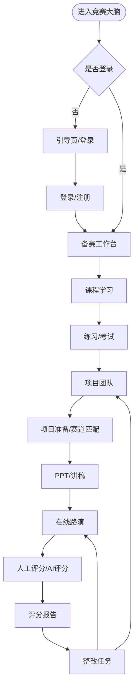

### 9.2 在线路演与录制时序图

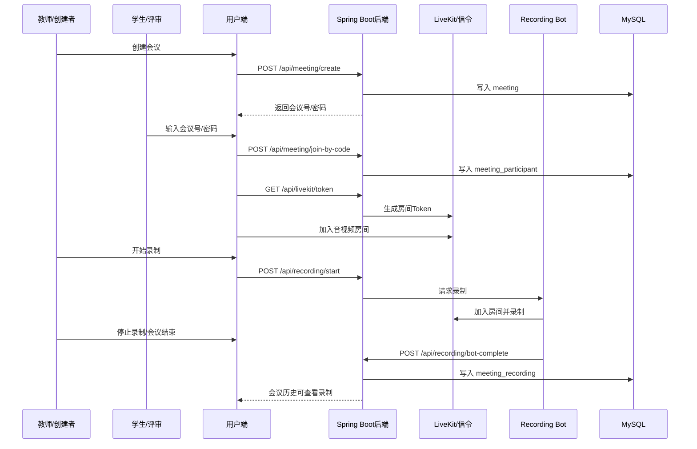

### 9.3 AI 评分时序图

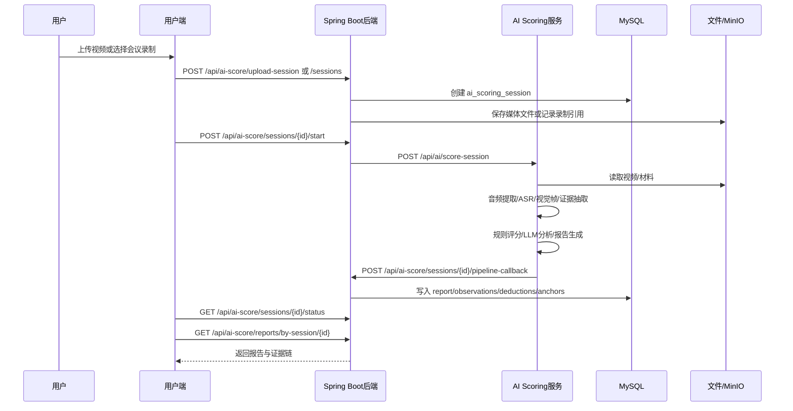

### 9.4 AI 评审团时序图

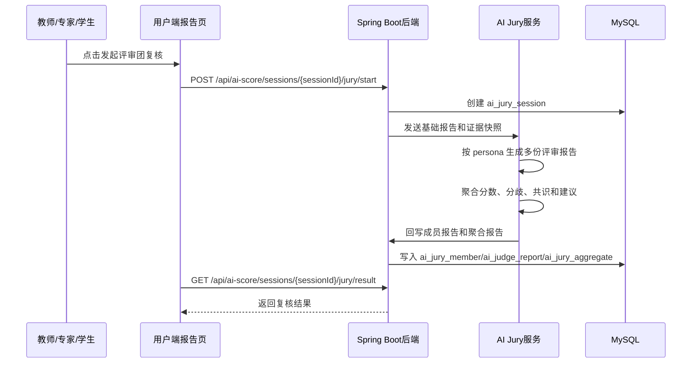

### 9.5 PPT 生成与质量修复时序图

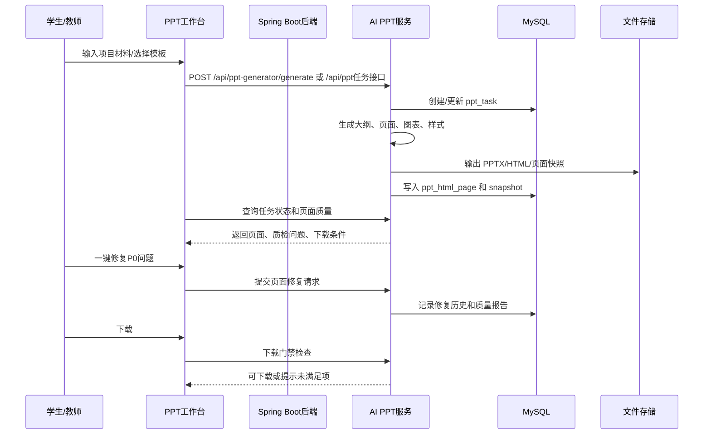

## 10. 数据模型与 ER 图

### 10.1 主要数据域

| 数据域 | 核心表/实体 | 说明 |
|---|---|---|
| 租户与用户 | tenant、users、organization_unit、user_group、user_group_member | 学校级组织和账号权限 |
| 课程学习 | course、course_chapter、course_lesson、course_attachment、course_learning_progress | 课程、章节、课时、附件、进度 |
| 考试练习 | exam_question、exam_paper、exam_paper_question、exam_attempt、exam_attempt_answer、exam_favorite、exam_wrong_question | 题库、试卷、答题、错题、收藏 |
| 项目团队 | project_team、project_team_member、project_task、project_task_submission、project_material、project_review_issue、member_ability_snapshot | 团队协作、任务、材料、问题、能力 |
| 会议录制 | meeting、meeting_participant、chat_message、meeting_recording | 会议、参会、聊天、录制 |
| 人工评分 | score_template、score_item、score_record、score_detail、issue | 评分模板、评分项、评分记录、问题 |
| AI 评分 | ai_scoring_session、ai_score_report、ai_score_media_asset、ai_score_transcript_segment、ai_score_frame、ai_score_evidence_anchor、ai_score_observation、ai_score_deduction | AI 会话、媒体、证据、报告、扣分 |
| AI 评审团 | ai_judge_persona、ai_jury_session、ai_jury_member、ai_judge_report、ai_jury_aggregate | 画像、复核会话、成员报告、聚合 |
| PPT/讲稿 | ppt_task、ppt_html_page、ppt_generation_snapshot、ppt_page_quality_report、ppt_scoring_coverage、ppt_script_page、script、script_template | PPT 生成、页面、质检、讲稿 |
| 资源与监控 | resource、resource_category、home_banner、user_activity_log、user_online_status | 资源、轮播、行为、在线状态 |

### 10.2 核心 ER 图

```mermaid
erDiagram
  TENANT ||--o{ USER : owns
  TENANT ||--o{ MEETING : owns
  USER ||--o{ MEETING : creates
  USER ||--o{ MEETING_PARTICIPANT : joins
  MEETING ||--o{ MEETING_PARTICIPANT : has
  MEETING ||--o{ CHAT_MESSAGE : has
  MEETING ||--o{ MEETING_RECORDING : records

  MEETING ||--o{ SCORE_RECORD : scored_by
  USER ||--o{ SCORE_RECORD : submits
  SCORE_RECORD ||--o{ SCORE_DETAIL : contains
  SCORE_ITEM ||--o{ SCORE_DETAIL : item
  SCORE_TEMPLATE ||--o{ SCORE_ITEM : defines
  SCORE_DETAIL ||--o{ ISSUE : creates

  USER ||--o{ COURSE_LEARNING_PROGRESS : learns
  COURSE ||--o{ COURSE_CHAPTER : contains
  COURSE_CHAPTER ||--o{ COURSE_LESSON : contains
  COURSE ||--o{ COURSE_ATTACHMENT : has
  COURSE ||--o{ COURSE_LEARNING_PROGRESS : progress

  EXAM_PAPER ||--o{ EXAM_PAPER_QUESTION : includes
  EXAM_QUESTION ||--o{ EXAM_PAPER_QUESTION : used_in
  EXAM_PAPER ||--o{ EXAM_ATTEMPT : attempted
  USER ||--o{ EXAM_ATTEMPT : takes
  EXAM_ATTEMPT ||--o{ EXAM_ATTEMPT_ANSWER : has
  EXAM_QUESTION ||--o{ EXAM_ATTEMPT_ANSWER : answered
  USER ||--o{ EXAM_FAVORITE : favorites
  USER ||--o{ EXAM_WRONG_QUESTION : owns

  PROJECT_TEAM ||--o{ PROJECT_TEAM_MEMBER : has
  USER ||--o{ PROJECT_TEAM_MEMBER : member
  PROJECT_TEAM ||--o{ PROJECT_TASK : owns
  PROJECT_TASK ||--o{ PROJECT_TASK_SUBMISSION : submitted
  PROJECT_TEAM ||--o{ PROJECT_MATERIAL : owns
  PROJECT_TEAM ||--o{ PROJECT_ROADSHOW_BINDING : binds
  MEETING ||--o{ PROJECT_ROADSHOW_BINDING : linked

  AI_SCORING_SESSION ||--o| AI_SCORE_REPORT : generates
  MEETING ||--o{ AI_SCORING_SESSION : source
  MEETING_RECORDING ||--o{ AI_SCORING_SESSION : source
  AI_SCORING_SESSION ||--o{ AI_SCORE_MEDIA_ASSET : has
  AI_SCORING_SESSION ||--o{ AI_SCORE_TRANSCRIPT_SEGMENT : has
  AI_SCORING_SESSION ||--o{ AI_SCORE_FRAME : has
  AI_SCORING_SESSION ||--o{ AI_SCORE_EVIDENCE_ANCHOR : has
  AI_SCORE_REPORT ||--o{ AI_SCORE_OBSERVATION : includes
  AI_SCORE_REPORT ||--o{ AI_SCORE_DEDUCTION : includes

  AI_SCORE_REPORT ||--o{ AI_JURY_SESSION : reviewed_by
  AI_JURY_SESSION ||--o{ AI_JURY_MEMBER : has
  AI_JURY_MEMBER ||--o{ AI_JUDGE_REPORT : writes
  AI_JURY_SESSION ||--o| AI_JURY_AGGREGATE : aggregates
  AI_JUDGE_PERSONA ||--o{ AI_JURY_MEMBER : persona

  PPT_TASK ||--o{ PPT_HTML_PAGE : pages
  PPT_TASK ||--o{ PPT_GENERATION_SNAPSHOT : snapshots
  PPT_TASK ||--o{ PPT_PAGE_QUALITY_REPORT : quality
  PPT_TASK ||--o{ PPT_SCRIPT_PAGE : script_pages
  SCRIPT ||--o{ PPT_SCRIPT_PAGE : contains
```

## 11. 系统架构与集成

### 11.1 高层架构图

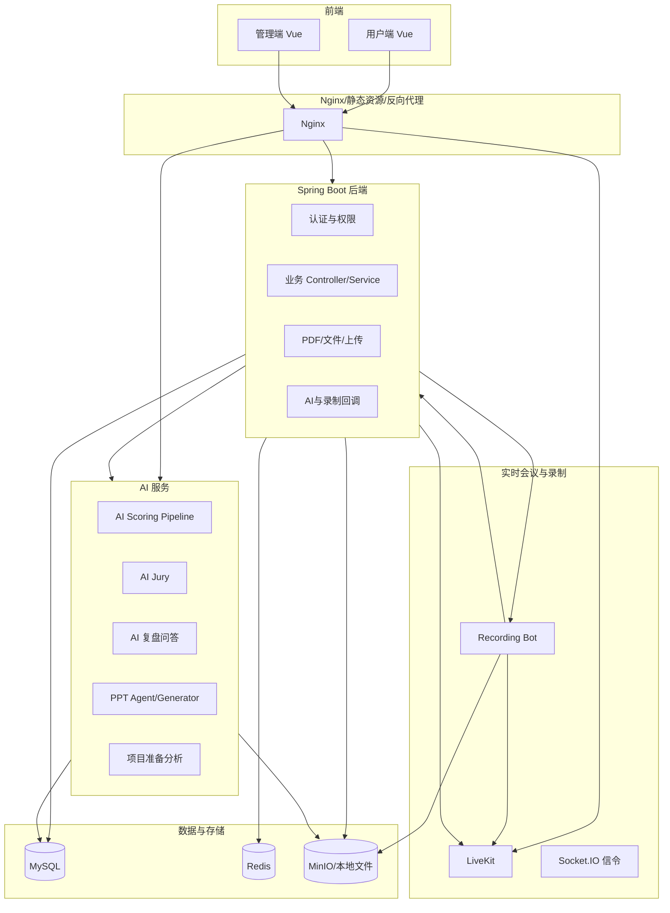

### 11.2 技术栈摘要

| 层级 | 技术 |
|---|---|
| 用户端 | Vue 3、Vite、Element Plus、Pinia、ECharts、LiveKit client、React/Konva PPT 编辑能力 |
| 管理端 | Vue 3、Vite、Element Plus、Pinia、ECharts |
| 后端 | Spring Boot 3.2.5、Java 21、MyBatis-Plus、JWT、Redis、Mail、OpenPDF、MinIO |
| AI 服务 | FastAPI/Python、音视频分析、ASR、LLM scoring、PPT agent |
| 实时通信 | LiveKit、Socket.IO/WebSocket、Recording Bot |
| 数据库 | MySQL 8.0 |
| 缓存 | Redis 7 |
| 部署 | Docker Compose、Nginx、MinIO、LiveKit |

## 12. 主要接口域

| 接口域 | 路径前缀 | 说明 |
|---|---|---|
| 认证 | `/api/auth` | 验证码、注册、登录、检查、改密 |
| 用户组织 | `/api/user` | 用户、角色、组织、用户组 |
| 首页 | `/api/home` | 用户首页、后台轮播 |
| 课程 | `/api/courses`、`/api/admin/courses` | 用户学习与后台课程管理 |
| 考试 | `/api/exams`、`/api/admin/exams` | 用户考试与后台题库/试卷/评阅 |
| 项目团队 | `/api/project-teams` | 团队、任务、材料、路演绑定 |
| 项目准备 | `/api/project-prep`、`/api/prep` | 准备会话、方向、任务、文档、AI 分析 |
| 会议 | `/api/meeting` | 会议创建、加入、历史、参会 |
| LiveKit | `/api/livekit` | 房间 token |
| 录制 | `/api/recording` | 启停、状态、回调、播放、流式访问 |
| 人工评分 | `/api/score` | 评分项、提交、结果、PDF |
| 问题 | `/api/issue` | 问题列表、未解决、解决、导出 |
| AI 评分 | `/api/ai-score`、`/api/ai/score-session` | 评分会话、上传、状态、报告、PDF、回调 |
| AI 评审团 | `/api/ai-score/sessions/{id}/jury`、`/api/admin/ai-jury/personas` | 复核、结果、画像 |
| AI 问答 | `/api/ai-chat`、`/api/ai/chat` | AI 复盘问答、历史、回调 |
| PPT | `/api/ppt`、`/api/ppt-generator`、`/api/admin/ppt` | PPT agent、生成、管理 |
| 讲稿 | `/api/script`、`/api/script-template`、`/api/slide-script` | 讲稿与 PPT 页面讲稿 |
| 文件 | `/api/upload`、`/api/file-preview`、`/api/ppt-template` | 上传、预览、模板下载 |
| 统计监控 | `/api/statistics`、`/api/monitor`、`/api/admin/monitor` | 统计、埋点、在线状态 |

## 13. 用户故事与验收条件

### 13.1 学生故事

```text
作为参赛学生，
我想在首页看到今天最该推进的学习、材料或整改任务，
以便不用在多个模块中寻找下一步。

Given 我已登录并存在团队、课程或报告数据
When 我进入用户首页
Then 系统展示与我相关的下一步动作，并能跳转到对应页面
```

```text
作为参赛学生，
我想上传或选择一次路演视频生成 AI 评分报告，
以便知道我的扣分原因、证据和训练优先级。

Given 我有可访问的视频或会议录制
When 我发起 AI 评分
Then 系统创建评分会话、展示处理进度，并在完成后展示报告
```

### 13.2 教师故事

```text
作为指导老师，
我想创建团队任务并关联路演后的问题，
以便把评分反馈变成可执行整改。

Given 某团队有未解决问题或 AI 报告扣分项
When 我创建或分派整改任务
Then 团队成员能看到任务、提交结果，老师能审核
```

```text
作为指导老师，
我想从会议历史进入录制、评分、AI 报告和问题，
以便完整复盘一次路演。

Given 一场会议已结束
When 我打开会议历史详情
Then 系统展示参会、录制、评分、AI 报告和复盘入口
```

### 13.3 评审/专家故事

```text
作为评审员，
我想按评分项提交评分和评语，
以便系统形成可汇总的评分结果。

Given 我有会议评分权限
When 我提交评分
Then 系统生成评分记录和评分明细，并可在评分结果页查看
```

```text
作为专家，
我想查看 AI 评审团的多视角复核结果，
以便判断 AI 报告是否存在明显偏差。

Given AI 报告已生成并发起评审团
When 复核完成
Then 系统展示成员观点、聚合分、分歧点和优化建议
```

### 13.4 管理员故事

```text
作为学校管理员，
我想维护用户、组织和用户组，
以便不同学院、班级、教师和学生只能访问自己的数据。

Given 我具备管理权限
When 我新增用户或调整组织归属
Then 用户登录后只看到角色和组织允许的数据
```

```text
作为平台管理员，
我想查看数据监控和行为日志，
以便定位系统异常和用户使用情况。

Given 系统持续采集心跳和行为日志
When 我打开数据监控
Then 能看到在线用户、访问日志和异常状态
```

## 14. 非功能需求

### 14.1 安全与权限

1. 所有受保护接口必须校验 token。
2. 管理端必须按角色控制路由和接口权限。
3. 文件播放、下载、PDF 导出和证据包访问必须避免裸链越权。
4. AI 回调、录制回调应具备来源校验或共享密钥。
5. 删除和批量删除必须有确认、影响提示和可审计记录。

### 14.2 性能

1. 首页、课程列表、会议列表、报告摘要等高频页面应在常规网络下 3 秒内首屏可用。
2. 视频、录制和课程播放必须支持 Range/stream，避免一次性加载大文件。
3. AI 评分、PPT 生成等长任务必须异步执行，前端轮询状态或接收进度。
4. 大型报告和 PPT 历史应分页或按需加载，避免一次拉取全部历史。

### 14.3 可用性

1. 长任务必须展示阶段、进度、失败原因和重试路径。
2. 报告必须先给结论，再给证据，再给行动。
3. 后台表格要支持筛选、搜索、批量操作和明确的空状态。
4. 学生端不应被管理术语干扰，教师端应突出团队和任务。

### 14.4 可靠性

1. AI 评分失败不应破坏已有会议、录制和人工评分数据。
2. AI pipeline 回调重复到达时应尽量幂等处理。
3. 录制上传失败应保留失败状态和错误信息。
4. PPT 修复和回滚应保留版本记录。

### 14.5 可维护性

1. 前端用户端、管理端、后端和 AI 服务应保持清晰接口边界。
2. AI 评分规则、赛道配置、证据 schema 应版本化。
3. 评分报告结构应保持向后兼容，支持 sessionId、reportId、meetingId 多入口。
4. 管理端配置项应避免写死在前端。

## 15. 优先级与迭代路线

### 15.1 P0 必须稳定的核心闭环

1. 登录与权限
2. 用户/组织管理
3. 课程学习基础闭环
4. 题库/考试基础闭环
5. 项目团队、任务、材料
6. 会议创建、加入、录制、历史
7. 人工评分和问题跟踪
8. AI 评分会话、报告、证据链、PDF
9. AI 评审团复核
10. PPT/讲稿基础生成和管理

### 15.2 P1 增强能力

1. 首页下一步推荐
2. 能力画像
3. AI 复盘问答证据引用
4. PPT 质量修复和下载门禁
5. 项目准备 AI 分析
6. 监控与行为分析
7. 跨模块数据关联分析

### 15.3 P2 运营与体验优化

1. 首页轮播和运营内容
2. 赛道匹配解释优化
3. 报告可视化细节优化
4. 模板市场/资源分类增强
5. 多端适配与移动端细节

## 16. 验收总表

| 验收域 | 验收标准 |
|---|---|
| 账号权限 | 各角色登录后只能访问允许菜单和数据 |
| 学习闭环 | 后台课程创建、视频上传后，用户端可学习并记录进度 |
| 考试闭环 | 题目、试卷、答题、提交、错题、收藏、人工评阅可用 |
| 团队闭环 | 团队、成员、任务、提交、审核、材料、路演绑定可用 |
| 会议闭环 | 创建、加入、开始、结束、录制、历史、参会记录可用 |
| 人工评分 | 评分项、提交、结果、明细、PDF 导出可用 |
| AI 评分 | 上传或录制发起评分、状态轮询、报告、证据、PDF 可用 |
| AI 评审团 | persona 配置、复核启动、成员报告、聚合结果可用 |
| PPT/讲稿 | 模板、生成、历史、质检、修复、下载、讲稿编辑可用 |
| 问题跟踪 | 问题列表、未解决、解决、导出和整改任务关联可用 |
| 监控 | 行为日志、在线状态、心跳和管理端展示可用 |

## 17. 风险与对策

| 风险 | 影响 | 对策 |
|---|---|---|
| 功能多但入口分散 | 用户不知道下一步 | 首页改为备赛工作台，围绕任务和状态推荐 |
| AI 报告缺少证据 | 老师和评审不信任 | 报告强制展示 evidence anchors、时间点、扣分依据 |
| sessionId/meetingId/reportId 混用 | 报告入口和下载容易错 | 统一报告路由和后端访问层，保留兼容入口 |
| 长任务失败不可见 | 用户焦虑、重复操作 | 所有长任务必须有状态、阶段、错误、重试 |
| 批量删除误操作 | 数据损坏 | 删除确认、影响提示、软删除或审计日志 |
| PPT 工作台过复杂 | 学生不会用 | 收敛为生成、修复、下载三个主动作 |
| 多租户隔离不足 | 数据越权 | DataScope 与接口层双重校验 |
| 大文件播放/下载不稳定 | 课程和录制不可用 | Range/stream、鉴权下载、失败提示 |

## 18. 开放问题

1. 学校级租户与学院/班级组织的最终数据隔离规则是否已经完全确认？
2. AI 评分结果在正式评审中是辅助意见、训练意见，还是可作为正式分数来源？
3. AI 评审团的“16 人格”是否面向用户显性展示，还是包装成“多视角评审”？
4. PPT 生成系统是作为 竞赛大脑 内置能力长期维护，还是作为独立子系统接入？
5. 能力画像是否需要面向学生展示，还是只给老师和管理员看？
6. 是否需要为每个赛道维护独立评分规则、证据 schema 和报告模板？
7. 是否要求完整审计日志覆盖用户、会议、评分、报告和删除操作？

## 19. 结论

竞赛大脑 当前已经具备一个完整竞赛备赛平台的骨架：学习、考试、项目团队、会议、录制、人工评分、AI 评分、AI 评审团、PPT/讲稿、问题跟踪、后台治理和监控。后续产品建设的关键不是继续堆模块，而是把这些模块真正连成闭环。

最重要的产品方向是：

1. 首页从功能入口变成“下一步推进”。
2. 路演从一次会议变成可复盘训练记录。
3. AI 评分从生成报告变成证据驱动的评分系统。
4. 评审团从炫技能力变成可信度校验能力。
5. 问题跟踪从列表变成团队整改任务。
6. PPT 和讲稿从孤立生成变成路演材料质量闭环。

STATUS: DONE_WITH_CONCERNS

关注点：本文基于代码和配置做静态分析，未连接生产数据库验证真实数据规模、真实用户路径和线上指标。上线验收前仍需结合实际环境做端到端走查。
