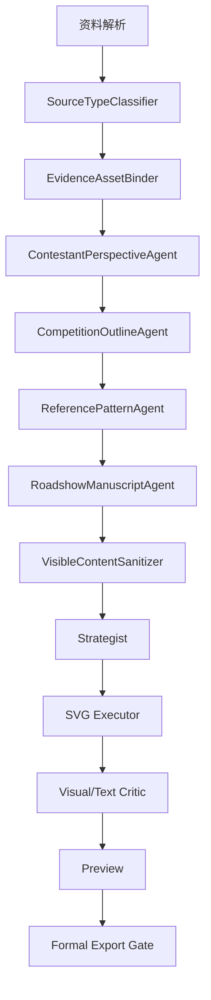

# 职业院校技能大赛路演 PPT 参考样本分析与下一步优化方案

分析时间：2026-05-18  
分析对象：8 份真实/参赛相关 PPT/PDF 样本 + 当前任务 `52be31161fe1` 生成结果  
目标：提炼可复用的参赛级 PPT 生成逻辑，让系统不再像“文件分析 PPT”，而更像“选手可以带去现场讲解和实操的比赛 PPT”。

## 0. 分析方法

本次做了两类分析：

1. **视觉节奏分析**
   - 对 PPTX 解析 slide XML、文本框、版式结构和内嵌素材，生成缩略图 contact sheet。
   - 对 PDF 使用本地 poppler 渲染页面缩略图。
   - 对 `52be31161fe1` 使用最终 SVG 渲染 contact sheet。

2. **内容结构分析**
   - 提取每份材料的页数、标题、关键词、页面类型分布。
   - 对比真实参赛稿与当前生成稿在“选手视角、现场实操、证据呈现、价值表达、视觉节奏”上的差异。

> 说明：PPTX 的缩略图是结构级重建，足够观察页面节奏、章节结构、素材密度和排版类型，但不作为像素级还原依据。PDF 与 `52be31161fe1` SVG 渲染更接近真实视觉。

## 1. 样本概览

| 样本 | 页数 | 主要特点 | 可学习点 |
|---|---:|---|---|
| AI 智护银龄 | 36 | 养老场景，研发历程和实施过程较完整 | 场景痛点 -> 研发链路 -> 技术模块 -> 应用价值 |
| 康乐360 | 65 | 最接近完整比赛现场稿，截图/代码/测试/成果密集 | “模块四连页”、现场导航、真实证据上屏 |
| 渝乡益农 | 10 | 短路演稿，结构简洁 | 快速验证型结构 |
| 智能海洋水情监测 | 38 | 政策背景、总体思路、技能要点、成果创新完整 | 38 页标准长度下的章节节奏 |
| 智造领航 | 37 | 制造系统主题，技术优势和团队效率表达明显 | 企业问题 -> 技术路线 -> 应用价值 |
| 一键成型 | 27 | 偏赛事/教学改革表达 | 产教融合、职业素养、团队合作表达 |
| 智养新篇技领未来 | 23 | 康养/实训主题，岗位任务链明显 | 岗位 -> 任务 -> 技能的转换方式 |
| 智创绿动校园站 | 52 | APP 项目，角色分工、功能展示、成果页多 | 长篇现场稿的导航和章节重复机制 |

参考缩略图：

- [52be 当前生成稿 contact sheet](../outputs/ppt_reference_analysis/current_52be_contact.jpg)
- [康乐360 contact sheet](../outputs/ppt_reference_analysis/contact_sheets/康乐360.jpg)
- [智能海洋水情监测 contact sheet](../outputs/ppt_reference_analysis/contact_sheets/智能海洋水情监测.jpg)
- [智创绿动校园站 contact sheet](../outputs/ppt_reference_analysis/contact_sheets/智创绿动校园站.jpg)
- [智造领航 contact sheet](../outputs/ppt_reference_analysis/contact_sheets/智造领航.jpg)

## 2. 对 `52be31161fe1` 的诊断

### 2.1 已经改善的地方

`52be31161fe1` 相比前一版有明显进步：

- 页面已经形成 38 页完整结构。
- 没有再把大量内部字段直接画到页面上。
- SVG 可见文字没有命中“评分要素、采分点、操作角色、口令、导出门禁”等禁词。
- 页面整体干净，信息框架完整，技术架构、实操过程、证据链、成果页都有覆盖。

当前正式导出被拦截的原因是：

```json
{
  "status": "blocked",
  "blocking_findings": [
    "存在团队/赛事/日期/联系方式等占位符，正式版导出已拦截。",
    "实操/证据/数据页面仍有 `待补充` 证据，不能作为正式版导出。"
  ]
}
```

这说明“合规拦截”方向是对的，但“参赛级表达”仍未达到。

### 2.2 核心问题

当前生成稿的问题不是单纯视觉不好，而是 **Agent 仍然站在资料分析者视角，而不是参赛选手视角**。

它更像：

- 我读了你的资料。
- 我帮你整理出项目背景、技术方案、实操流程、成果价值。
- 我把它做成一套干净的说明型 PPT。

但真实比赛 PPT 更像：

- 我们团队为什么做这个项目。
- 我们调研发现了什么真实问题。
- 我们怎么分工研发。
- 我们现场能展示什么设备/系统/代码/测试。
- 每个模块由谁负责、解决了什么难点、有什么可验证结果。
- 评委此刻应该看屏幕、看设备、看日志、看测试结果，进而相信这是一个真实完成的作品。

所以 `52be` 最大缺口是：

| 维度 | 当前生成稿 | 真实参赛稿 |
|---|---|---|
| 叙事身份 | 系统总结资料 | 选手讲述自己的项目 |
| 页面目的 | 解释概念和方案 | 服务现场讲解、演示、证明 |
| 证据呈现 | 多为抽象流程/清单 | 大量真实截图、代码、设备、日志、测试表 |
| 模块展开 | 模块一页或几页概括 | 每个核心模块按“价值 -> 代码/技术 -> 测试 -> 小结”展开 |
| 视觉气质 | 干净、统一、报告感 | 真实项目痕迹重，截图/流程/代码/证书混排 |
| 现场感 | 弱 | 强，能看出讲解和操作节奏 |

### 2.3 输入资料也是重要原因

`52be` 使用的资料是 `GPT55_职业院校技能大赛路演PPT生成母稿_智能温室项目.pdf`。它本质上是“生成母稿”，不是一个真实项目资料包。

这类资料提供了：

- 项目设定。
- 模块设定。
- 章节设定。
- 证据应该有什么。
- PPT 应该怎么规划。

但它缺少真实参赛稿最关键的东西：

- 真实 APP / 后台 / 设备截图。
- 真实代码截图。
- 真实测试记录。
- 真实日志导出。
- 真实调研记录。
- 真实成果证明。
- 真实团队开发过程材料。

因此即使提示词很强，模型也只能生成“看起来合理的图解”，而不能生成“能让评委相信的作品证据”。

结论：当前效果不达标，原因是 **输入资料不足 + Agent 视角不对 + 页面合同没有强制 proof object**，不是某一个模板或某一句提示词的问题。

## 3. 真实参赛 PPT 的通用规律

### 3.1 它们不是“资料总结”，而是“现场表演脚本的可视化”

真实参赛 PPT 的页面通常不是为了把资料讲全，而是为了配合现场行动：

- 开场建立项目身份。
- 背景页说明“为什么必须做”。
- 总体思路页告诉评委“系统怎么组成”。
- 技能要点页进入“我负责的模块怎么做”。
- 实操页配合设备/系统/代码演示。
- 成果页拿出证据和价值。
- 创新页讲出区别于普通项目的亮点。

这和普通路演最大的区别是：**每页都隐含一个现场动作**。

例如：

- 这页讲政策和行业痛点。
- 这页切到 APP 首页。
- 这页展示代码函数。
- 这页运行测试用例。
- 这页展示异常处理。
- 这页展示成果证明。

我们的 Agent 当前只知道“这页要表达什么”，还不够；它必须知道“这页上台时要完成什么动作”。

### 3.2 样本里的核心章节不是随意的

多数样本都围绕下面结构展开：

1. 项目背景
2. 总体思路 / 研发思路
3. 技能要点 / 实施过程
4. 主要成果
5. 项目创新 / 应用价值

你之前给的逻辑图“项目背景、研发历程、实施过程、创新设计、应用价值”是正确方向，但需要进一步变成页面生成合同：

| 大章节 | 页面真正要回答的问题 | 典型页面 |
|---|---|---|
| 项目背景 | 为什么这个项目值得做 | 政策背景、市场/行业痛点、用户故事、调研发现 |
| 研发历程 | 团队如何从问题走到方案 | 分工、任务拆解、技术路线、开发计划、安全规范 |
| 实施过程 | 选手真正做了什么 | UI、代码、接口、设备、数据流、测试、异常处理 |
| 创新设计 | 为什么不是普通系统 | 技术创新、流程创新、模式创新、服务创新 |
| 应用价值 | 做出来后有什么用 | 企业/学校/用户/社会/团队成长/知识产权 |

### 3.3 “技能要点/实施过程”通常是最厚的章节

真实样本里，尤其是 `康乐360`、`智创绿动校园站`，中间大量篇幅都给了实施过程：

- 需求分析。
- 原型设计。
- 前端页面。
- 后端接口。
- 数据库。
- 代码还原。
- 功能测试。
- 运行截图。
- 模块小结。

这说明比赛 PPT 的重点不是漂亮封面，也不是宏大背景，而是 **证明选手真的会做、真的做了、现场能演示**。

当前系统虽然有实操页，但还偏“流程说明”。下一步要变成“模块作战单元”：

```text
模块价值页 -> 技术实现页 -> 代码还原页 -> 产品测试页 -> 证据/小结页
```

### 3.4 真实样本大量使用“证据对象”

真实参赛稿常见 proof object：

- APP 页面截图。
- 后台管理系统截图。
- 设备连接截图。
- 代码编辑器截图。
- 流程图。
- 数据库表结构。
- 测试结果。
- 日志记录。
- 证书/报告/合作证明。
- 实地调研照片。
- 成果应用照片。

这些对象带来的效果是：评委不只是听你讲，还能看到“作品存在过、运行过、测试过”。

当前生成稿最大短板就是 proof object 不够真实。它有流程图，但缺少“真实作品痕迹”。

### 3.5 页面上会有“比赛导航系统”

很多样本会反复出现顶部或侧边导航：

- 项目介绍
- 总体思路
- 技能要点
- 主要成果
- 项目创新

进入技能要点后，还会有模块内部导航：

- 需求分析
- 原型设计
- 前端开发
- 后端开发
- 测试运行

这不是单纯装饰，它的作用是让评委在 55 分钟里始终知道：

- 现在讲到哪一部分。
- 当前模块属于哪个技能链条。
- 选手正在从“设计”进入“实现”还是“测试”。

我们的生成稿现在有章节，但缺少这种“现场方位感”。

### 3.6 可学习，但不能照抄的点

样本中也有一些不应直接照抄的地方：

- 有些 PPT 出现真实姓名、照片、学校、赛事年份。我们的产品要求不能生成这些个人/学校信息。
- 有些页面文字过多，像把讲稿塞到页上。我们应学习“章节和证据结构”，不学习文字堆叠。
- 有些页面审美并不高级，但真实感很强。我们的目标不是复制低审美，而是保留真实证据密度，同时提高设计质量。
- 有些页面出现“评分项”式表达。我们的系统应该把评分逻辑留在后台，不显性写给评委。

## 4. 可以沉淀进系统的通用页面模式

下面这些模式应进入 roadshow 分支的 Reference Pattern Library。

### 4.1 开场页：项目身份而不是模板封面

必须回答：

- 作品名称是什么。
- 解决什么真实场景问题。
- 属于什么技术/岗位方向。

页面要素：

- 项目名。
- 一句话任务。
- 项目场景视觉。
- 匿名团队/通道，不出现个人身份。

禁止：

- 空泛科技背景。
- 只有标题没有场景。
- 直接用论文/资料截图当底图。

### 4.2 目录页：现场路线图

不是罗列章节，而是告诉评委今天怎么证明作品：

```text
背景为什么成立 -> 方案怎么设计 -> 现场怎么演示 -> 结果怎么验证 -> 创新价值在哪里
```

建议字段：

- section_name
- judge_takeaway
- proof_object_hint

### 4.3 背景页：政策/行业/用户三证合一

真实样本常用结构：

- 政策依据。
- 行业痛点。
- 走访/调研发现。
- 项目切入点。

这类页不能只写“国家政策支持”，还要落到项目：

```text
政策要求 -> 现场问题 -> 我们的任务
```

### 4.4 研发历程页：岗位任务链

真实比赛非常强调职业能力。研发历程不应是普通时间线，而应是：

```text
岗位 -> 任务 -> 技能 -> 产出
```

例如：

| 岗位任务 | 技能动作 | 可见产出 |
|---|---|---|
| 设备接入 | 协议配置、数据解析 | 设备连接截图、原始数据帧 |
| 前端开发 | 页面设计、状态管理 | APP 页面截图 |
| 后端开发 | 接口、数据库、日志 | API 返回、日志记录 |
| 测试工程 | 用例、异常、复测 | 测试表、缺陷修复记录 |

### 4.5 技术架构页：不是五层卡片，而是系统怎么跑起来

真实参赛稿里的架构图通常服务于后续实操：

- 哪端采集。
- 哪端处理。
- 哪端展示。
- 哪端留证。
- 出错怎么处理。

建议架构页主视觉：

```text
设备/输入 -> 数据处理 -> 业务判断 -> 前端展示 -> 证据留存
```

每个节点要绑定后续演示页，而不是孤立介绍。

### 4.6 模块四连页

这是最应该沉淀的模式。

每个核心模块至少由 3-5 页组成：

1. 模块价值：解决哪个具体痛点。
2. 技术实现：关键流程、接口、算法或数据结构。
3. 代码还原：关键函数/配置/协议/SQL/接口。
4. 产品测试：输入、操作、输出、日志、截图。
5. 模块小结：本模块证明了什么能力。

当前系统经常一页讲完一个模块，导致像“功能介绍”，不像“技能展示”。

### 4.7 实操页：输入-操作-输出-证据

实操页必须有四件事：

| 项目 | 说明 |
|---|---|
| 输入 | 设备数据、用户操作、测试用例、图片、接口请求 |
| 操作 | 选手在现场做什么，内部使用，不直接显示口令 |
| 输出 | 页面状态、告警、报告、日志、数据库记录 |
| 证据 | 截图、日志编号、测试表、导出记录 |

可见页应显示“操作闭环”，而不是显示“操作角色B听口令”。

### 4.8 成果页：结果必须绑定来源

真实样本里的成果页通常分多类：

- 用户价值。
- 企业价值。
- 教学/学校价值。
- 团队成长。
- 社会价值。
- 知识产权/证书/合作。

我们的系统应把成果页分成：

```text
已验证成果 -> 测试中成果 -> 待采集证明
```

没有来源的数据不能包装成正式 KPI。

### 4.9 创新页：创新要讲“差异”和“成效”

真实样本里的创新页不是只写“技术创新、模式创新、服务创新”，而是要回答：

- 原来怎么做。
- 我们怎么改。
- 改完有什么结果。

建议结构：

```text
传统方式 -> 本项目方式 -> 带来的变化 -> 证据/验证方式
```

## 5. 为什么现在模型还不像“选手”

### 5.1 Prompt 让模型扮演了专家，但没有扮演参赛选手/指导老师

当前 Agent 角色大致是：

- 资料分析 Agent。
- 大纲 Agent。
- 现场执行 Agent。
- Manuscript Agent。
- SVG Executor。

它们都很“系统化”，但缺少一个关键角色：

> 参赛指导老师 / 选手视角导演。

这个角色要不断追问：

- 这页上台时选手怎么讲？
- 评委看到什么才会相信？
- 这页有没有真实作品痕迹？
- 这页是不是只是在解释概念？
- 这页能不能自然切到下一页实操？

### 5.2 当前页面合同缺少 proof_object

我们已经有：

- page_role
- judge_focus
- visual_strategy
- layout_hint
- evidence_assets
- speaker_goal
- primary_visual

但还缺一个最关键字段：

```yaml
proof_object:
  type: app_screenshot | code_snippet | device_photo | test_table | log_record | certificate | workflow_diagram
  source: user_upload | generated_diagram | pending
  must_be_visible: true/false
```

没有 proof_object，模型就会倾向于画卡片、流程和概念图。

### 5.3 当前源资料解析没有把“可参赛材料”排优先级

真实比赛里，材料的重要性不是平均的。

优先级应该是：

1. 能现场展示的系统/设备。
2. 能证明技术实现的代码/接口/数据库。
3. 能证明测试效果的日志/用例/结果。
4. 能证明应用价值的调研/反馈/合作/证书。
5. 背景政策和行业资料。

现在模型容易被长文本带偏，先讲背景和概念，后面才讲作品。

### 5.4 视觉生成还缺少“真实素材优先”

真实参赛 PPT 的页面经常是：

- 一张真实截图占主体。
- 周围用箭头/标注解释。
- 底部加一句结论。

当前 SVG 生成更偏：

- 中心图形。
- 卡片。
- 流程节点。
- 统一图标。

这会显得干净，但不像真实项目。

## 6. 下一步功能优化方向

### 6.1 新增 ContestantPerspectiveAgent

位置：roadshow 前半段，资料分析之后、manuscript 之前。

职责：

- 把资料转成“选手上台讲解逻辑”。
- 判断每页是否有现场动作。
- 判断每页是否有 proof object。
- 判断每页是否像真实参赛作品，而不是资料总结。

输出结构：

```yaml
section: 实施过程
page_goal: 证明设备数据能被采集、解析并留证
contestant_intent: 选手要让评委看到数据从设备进入系统
stage_action_private: 操作端连接设备并触发一次数据上传
visible_claim: 设备数据完成采集、解析、预警和日志留存
proof_object:
  type: app_screenshot + log_record
  source: user_upload
  missing_policy: 如果缺失，生成证据采集清单，不生成正式成果口吻
audience_takeaway: 这不是概念方案，而是可运行闭环
```

### 6.2 新增 ReferencePatternLibrary

把本次样本沉淀成页面模式，不照抄样式，只学习结构。

建议首批模式：

| pattern_id | 用途 |
|---|---|
| competition_cover_identity | 项目身份封面 |
| field_route_agenda | 现场路线图目录 |
| policy_problem_project_fit | 政策/痛点/项目契合 |
| role_task_skill_output | 岗位-任务-技能-产出 |
| system_runs_like_this | 系统运行总图 |
| module_value_tech_test_summary | 模块四连页 |
| code_walkthrough_with_output | 代码还原页 |
| live_demo_input_action_output_evidence | 实操闭环页 |
| test_record_dashboard | 测试记录页 |
| evidence_wall | 证据墙 |
| stakeholder_value_matrix | 应用价值矩阵 |
| innovation_delta | 创新差异页 |

Manuscript Agent 每页必须选择一个 pattern_id。

### 6.3 新增 EvidenceAssetBinder

在生成大纲前先做素材绑定。

它要输出：

```yaml
available_assets:
  app_screenshot:
    count: 6
    usable_for: [模块一测试, 模块二展示]
  code_snippet:
    count: 3
    usable_for: [代码还原]
  device_photo:
    count: 1
    usable_for: [现场环境]
missing_assets:
  - 后台日志截图
  - 测试用例表
  - 成果反馈证明
generation_policy:
  formal_deck: false
  preview_allowed: true
```

如果没有真实素材，就不要强行生成“漂亮成果页”，而是生成：

- 证据采集清单。
- 测试方法。
- 验收口径。
- 演示准备页。

### 6.4 修改 page contract

建议 roadshow manuscript 每页升级为：

```yaml
visible_slide_content:
  title:
  claim:
  key_points:
  proof_caption:
contestant_perspective:
  stage_intent:
  audience_takeaway:
  next_slide_bridge:
proof_object:
  type:
  source:
  must_be_visible:
  fallback:
visual_pattern:
  pattern_id:
  primary_visual:
  layout_rule:
private_runbook:
  speaker_note:
  live_action:
  fallback_plan:
  timing_sec:
do_not_render:
  - scoring logic
  - command cue
  - operator role
  - internal gate
```

SVG Executor 只能读取：

- visible_slide_content
- proof_object
- visual_pattern

不能读取：

- private_runbook
- do_not_render

### 6.5 调整默认页数分布

38 页建议分布：

| 部分 | 页数 | 作用 |
|---|---:|---|
| 开场与目录 | 2 | 建立项目身份和现场路线 |
| 项目背景 | 4-5 | 政策、调研、痛点、项目切入 |
| 研发历程/总体思路 | 5-6 | 分工、技术路线、系统架构、数据闭环 |
| 实施过程/技能要点 | 18-22 | 核心模块四连页、代码还原、测试演示 |
| 主要成果 | 4-5 | 测试结果、应用反馈、成果证明 |
| 创新设计与应用价值 | 4-5 | 创新差异、价值矩阵、推广方向 |
| 结束页 | 1 | 总结与致谢 |

当前系统中“实施过程”仍不够厚，应把页面预算更多给核心模块。

### 6.6 视觉策略从“干净图解”升级为“真实证据主导”

生成规则应改成：

1. 有真实截图/代码/照片时，优先让它成为页面主体。
2. SVG 图形只负责标注、解释、串联，不抢主视觉。
3. 没有真实素材时，才用图解型页面。
4. 实操页不要做成纯流程卡片，要像“现场看板”：
   - 左侧输入/动作。
   - 中央真实系统画面或代码画面。
   - 右侧输出/证据。
   - 底部一句结论。

## 7. 对当前功能的具体改造建议

### 阶段一：先修“选手视角”

开发内容：

- 增加 ContestantPerspectiveAgent。
- 修改 roadshow_agent 的 manuscript prompt。
- 每页强制输出 contestant_intent、audience_takeaway、proof_object。
- 页面对齐“上台讲什么、演什么、证明什么”。

验收标准：

- 任意打开一页，都能回答“这页选手上台要干嘛”。
- 不再出现纯资料总结页。

### 阶段二：再修“真实证据”

开发内容：

- 增加 EvidenceAssetBinder。
- 从 PDF/PPT/图片包中提取截图、代码、日志、表格、照片。
- 给每个素材打标签。
- 生成前先决定哪些页必须用真实素材。

验收标准：

- 实操页至少 60% 绑定真实素材或明确标记为草稿。
- 代码还原页必须有代码/伪代码/接口/SQL 等技术对象。
- 成果页必须有来源或降级为“验证口径”。

### 阶段三：沉淀参考样本模式库

开发内容：

- 新增 ReferencePatternLibrary。
- 把本次 8 份样本提炼成 pattern，不保存个人信息和学校信息。
- Manuscript 每页选择 pattern_id。
- SVG Executor 根据 pattern_id 生成对应页面结构。

验收标准：

- 目录页像现场路线图。
- 技能模块不再是一堆卡片。
- 页面节奏出现“章节页、截图页、代码页、测试页、成果页”的变化。

### 阶段四：质量评审升级

新增 roadshow 质量评分：

| 维度 | 检查项 |
|---|---|
| 选手视角 | 每页是否有现场讲解目标 |
| 证据密度 | 是否有 proof object |
| 实操闭环 | 是否有输入/操作/输出/证据 |
| 章节节奏 | 实施过程是否足够厚 |
| 真实感 | 是否有截图、代码、日志、测试、照片 |
| 合规性 | 是否无个人信息、无学校、无联系方式、无伪造数据 |
| 可正式导出 | 是否无待补充关键证据 |

## 8. 推荐的下一版 Agent 链路

建议 roadshow 分支改为：



核心变化：

- 先找证据，再规划页面。
- 先站到选手视角，再写 manuscript。
- 每页先决定 proof object，再决定视觉。
- SVG 只画评委能看到的内容。

## 9. 给用户资料准备的反向要求

如果想让智能 PPT 生成到参赛级，用户最好提供：

1. 项目说明书。
2. APP/后台/小程序/设备运行截图。
3. 关键代码截图或代码文件。
4. 接口文档或数据库表结构。
5. 测试用例、测试结果、日志记录。
6. 实操流程说明。
7. 团队匿名分工。
8. 调研记录或用户反馈。
9. 成果证明、合作证明、证书或知识产权材料。
10. 现场设备清单和备用方案。

如果用户只有文字描述，系统应该先生成：

- 缺资料诊断。
- 补充问卷。
- 证据采集清单。
- 草稿版 PPT。

不能直接承诺生成正式参赛 PPT。

## 10. 最终判断

这次参考样本说明：我们之前的方向没有错，但还少了“选手视角”和“证据对象”两根梁。

当前系统已经能做到：

- 生成完整 38 页。
- 生成比较干净的页面。
- 避免后台字段泄漏。
- 做正式导出门禁。

但要达到真正参赛级，还必须做到：

- 每页都从“选手上台怎么讲、怎么演、怎么证明”出发。
- 每个核心模块按“价值 -> 技术 -> 代码/实现 -> 测试 -> 小结”展开。
- 真实截图、代码、日志、测试、成果证明成为页面主角。
- 资料不足时自动降级为草稿和证据采集清单。
- 使用参考样本沉淀出的页面模式，而不是继续自由发挥。

下一步最值得做的是：**新增 ContestantPerspectiveAgent + EvidenceAssetBinder + ReferencePatternLibrary**。这三个改完，PPT 才会从“资料分析结果”转向“可上台比赛的作品汇报”。 
