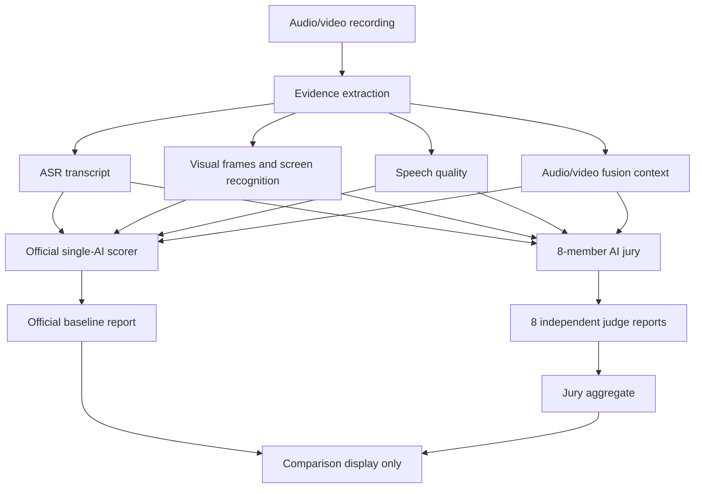
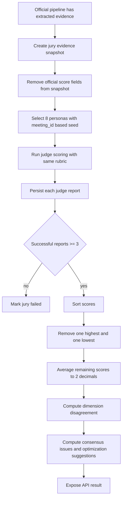

# AI Jury Review Implementation Plan

> **For agentic workers:** REQUIRED SUB-SKILL: Use superpowers:subagent-driven-development (recommended) or superpowers:executing-plans to implement this plan task-by-task. Steps use checkbox (`- [ ]`) syntax for tracking.

**Goal:** Add an 8-member AI jury review feature that independently scores the same evidence snapshot as the official single-AI scorer, then presents the official baseline score, jury disagreement, and a trimmed jury average.

**Architecture:** The official AI report and the AI jury are parallel consumers of the same extracted evidence. Jury members must not receive the official score, official dimensions, highlights, issues, or recommendations as prompt input. The official report is used only after jury scoring, for front-end comparison and aggregate difference calculation.

**Tech Stack:** FastAPI, Python service modules, OpenAI-compatible chat completions, JSON file persistence under `ai-scoring/uploads/results`, MySQL migration SQL, Vue 3 and Element Plus.

---

## Corrected Data Flow



## Runtime Logic



## Files

- Create: `ai-scoring/app/services/jury/__init__.py`
- Create: `ai-scoring/app/services/jury/personas.py`
- Create: `ai-scoring/app/services/jury/aggregate_service.py`
- Create: `ai-scoring/app/services/jury/snapshot_service.py`
- Create: `ai-scoring/app/services/jury/scoring_service.py`
- Create: `ai-scoring/tests/test_ai_jury_services.py`
- Create: `dockerrun/sql/backend-resources/create_ai_jury_tables.sql`
- Create: `cloudrun/sql/backend-resources/create_ai_jury_tables.sql`
- Create: `windowsrun/apps/sql/backend-resources/create_ai_jury_tables.sql`
- Modify: `ai-scoring/app/config.py`
- Modify: `ai-scoring/app/routers/scoring_router.py`
- Modify: `frontend/user/src/views/AiScoreResult.vue`

## Task 1: Core Jury Calculations

**Files:**
- Create: `ai-scoring/tests/test_ai_jury_services.py`
- Create: `ai-scoring/app/services/jury/__init__.py`
- Create: `ai-scoring/app/services/jury/personas.py`
- Create: `ai-scoring/app/services/jury/aggregate_service.py`

- [ ] **Step 1: Write failing tests**

Create tests that prove:

```python
def test_select_personas_is_stable_and_unique():
    selected_a = select_personas("meeting-42", count=8)
    selected_b = select_personas("meeting-42", count=8)
    assert [p["code"] for p in selected_a] == [p["code"] for p in selected_b]
    assert len({p["code"] for p in selected_a}) == 8

def test_trimmed_average_removes_highest_and_lowest():
    reports = [
        {"id": 1, "overall_score": 70},
        {"id": 2, "overall_score": 80},
        {"id": 3, "overall_score": 90},
        {"id": 4, "overall_score": 60},
    ]
    aggregate = aggregate_judge_reports(reports, official_score=78.25)
    assert aggregate["trimmed_average_score"] == 75.00
    assert aggregate["removed_low"]["id"] == 4
    assert aggregate["removed_high"]["id"] == 3
    assert aggregate["score_diff_from_official"] == -3.25
```

- [ ] **Step 2: Verify tests fail**

Run:

```bash
cd ai-scoring && python -m pytest tests/test_ai_jury_services.py -v
```

Expected: import errors for missing jury service modules.

- [ ] **Step 3: Implement minimal persona and aggregate services**

Implement deterministic persona selection from 16 predefined persona dictionaries and trimmed average aggregation.

- [ ] **Step 4: Verify tests pass**

Run:

```bash
cd ai-scoring && python -m pytest tests/test_ai_jury_services.py -v
```

Expected: all tests pass.

## Task 2: Evidence Snapshot Safety

**Files:**
- Modify: `ai-scoring/tests/test_ai_jury_services.py`
- Create: `ai-scoring/app/services/jury/snapshot_service.py`

- [ ] **Step 1: Write failing test**

Prove the jury snapshot excludes official score data:

```python
def test_jury_snapshot_excludes_official_ai_score():
    pipeline_result = {
        "meeting_id": "42",
        "ai_score": {"overall_score": 99, "critical_issues": ["anchor"]},
        "asr": {"transcript": "demo"},
        "speech_quality": {"speech_rate": {"global_chars_per_minute": 180}},
        "video_analysis": {"frame_count": 3},
        "fusion": {"summary": {"fusion_avg": 80}},
    }
    snapshot = build_jury_evidence_snapshot(pipeline_result, {"project_name": "Demo"})
    assert "ai_score" not in snapshot
    assert "official_score" not in snapshot
    assert snapshot["asr"]["transcript"] == "demo"
```

- [ ] **Step 2: Verify test fails**

Run the same pytest command. Expected: missing `build_jury_evidence_snapshot`.

- [ ] **Step 3: Implement snapshot builder**

Copy only `meeting_id`, `project_info`, `asr`, `speech_quality`, `video_analysis`, `video_camera_analysis`, `video_screen_analysis`, `fusion`, and limited metadata.

- [ ] **Step 4: Verify tests pass**

Run:

```bash
cd ai-scoring && python -m pytest tests/test_ai_jury_services.py -v
```

Expected: all tests pass.

## Task 3: Jury Scoring Service and API

**Files:**
- Create: `ai-scoring/app/services/jury/scoring_service.py`
- Modify: `ai-scoring/app/routers/scoring_router.py`
- Modify: `ai-scoring/app/config.py`

- [ ] Add settings: `AI_JURY_ENABLED`, `AI_JURY_COUNT`, `AI_JURY_MAX_WORKERS`.
- [ ] Use `AI_JURY_MAX_WORKERS=8` by default so all 8 judge reports can start in the same batch.
- [ ] Use `AI_JURY_PROVIDERS` for stable round-robin model channels, for example `deepseek,minimax`.
- [ ] Use `AI_JURY_MEMBER_TIMEOUT_SECONDS` and `AI_JURY_MEMBER_RETRIES` so one stuck judge cannot block the whole jury aggregate.
- [ ] Add `POST /api/ai/jury/{meeting_id}/start`.
- [ ] Add `GET /api/ai/jury/{meeting_id}/status`.
- [ ] Add `GET /api/ai/jury/{meeting_id}/result`.
- [ ] Store jury files under `uploads/results/jury/`.
- [ ] Trigger jury review after official result save only when enabled, without blocking official report generation.

## Task 4: Database Migration

**Files:**
- Create: `dockerrun/sql/backend-resources/create_ai_jury_tables.sql`
- Copy same migration to cloud and Windows deploy SQL resource folders.

- [ ] Create `ai_judge_persona`.
- [ ] Create `ai_jury_session`.
- [ ] Create `ai_jury_member`.
- [ ] Create `ai_judge_report`.
- [ ] Create `ai_jury_aggregate`.
- [ ] Seed 16 persona rows with `INSERT ... ON DUPLICATE KEY UPDATE`.

## Task 5: Frontend Jury Tab

**Files:**
- Modify: `frontend/user/src/views/AiScoreResult.vue`

- [ ] Add nav item `AI评审团`.
- [ ] Fetch `/api/ai/jury/{meeting_id}/result` after official report load.
- [ ] Show official score, raw jury average, trimmed jury average, removed highest/lowest, and score difference.
- [ ] Render 8 judge cards with persona label, score, and removed-high/removed-low badges.
- [ ] Render disagreement and consensus lists.
- [ ] If jury is missing, show a button to start generation.

## Task 6: Verification

- [ ] Run backend jury tests:

```bash
cd ai-scoring && python -m pytest tests/test_ai_jury_services.py -v
```

- [ ] Run existing lightweight video sampling test:

```bash
cd ai-scoring && python -m pytest tests/test_video_analysis_sampling.py -v
```

- [ ] Run frontend build:

```bash
cd frontend/user && npm run build
```

## Self-Review

- Spec coverage: The plan covers independent evidence input, 8 persona selection, no official-score prompt anchoring, trimmed average, DB schema, API, and front-end display.
- Placeholder scan: No implementation task relies on an undefined "later" behavior; API and table names are explicit.
- Type consistency: The plan consistently uses `jury_session`, `judge_report`, `trimmed_average_score`, `removed_high`, and `removed_low`.
