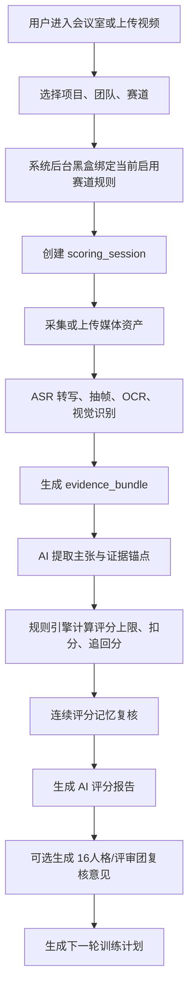
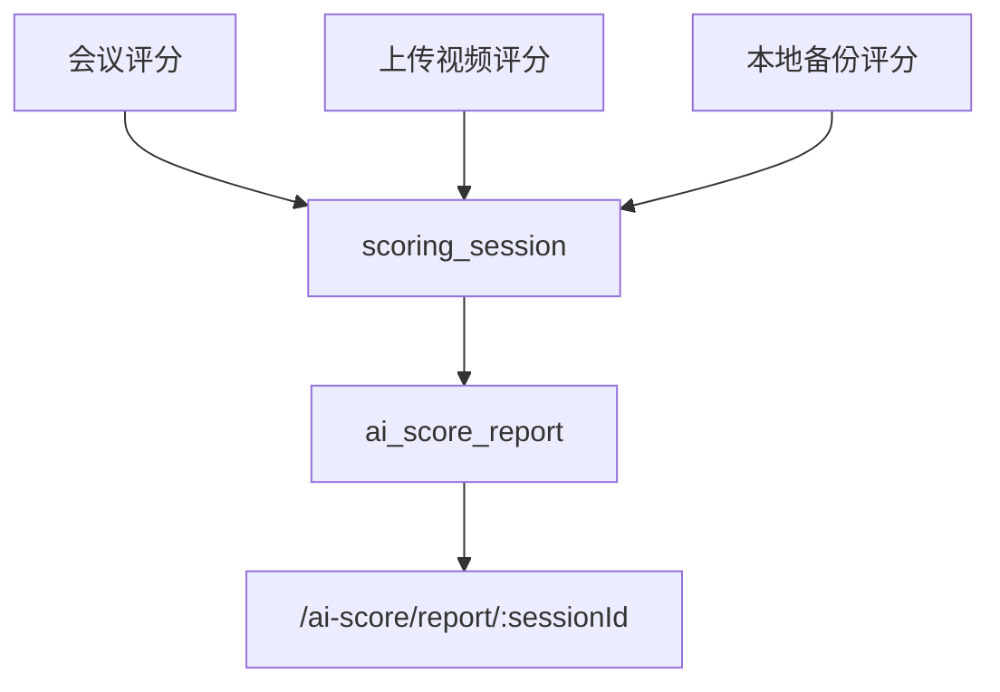

# AI Scoring Meeting Room Optimization Implementation Plan

> **For agentic workers:** REQUIRED SUB-SKILL: Use superpowers:subagent-driven-development (recommended) or superpowers:executing-plans to implement this plan task-by-task. Steps use checkbox (`- [ ]`) syntax for tracking.

**Goal:** 将 OREP 的会议室、录制、上传视频、AI 评分、连续评分记忆、评分报告和评审团能力升级为一条可追溯、可复现、黑盒保护评分规则的证据审查式评分流水线。

**Architecture:** 前端以“评分会话 scoring_session”为核心入口，会议评分和上传视频评分走同一套后端任务状态机，报告页以 `sessionId/reportId` 为主键，不再绑定 `meetingId`。后端保留 `ai_score_report` 作为最终报告表，同时新增评分会话、媒体资产、证据锚点、观察点评分、扣分项、赛道规则绑定、赛道证据 schema、评分指纹与缓存命中等过程数据；用户只选择赛道，系统后台自动绑定当前启用评分规则，不向用户暴露规则版本、权重、规则哈希和 prompt。

**Tech Stack:** Vue 3 + Vite + Element Plus + LiveKit client；Spring Boot 3 + MyBatis Plus + MySQL/H2 tests；Recording Bot Node.js + LiveKit/MediaRecorder；MinIO/local uploads；现有 AI scoring microservice callback。

---

## 0. 执行看板

后续每完成一项，必须在本表更新状态、验证命令和验证结果。未验证不能标记完成。

| 阶段 | 状态 | 目标 | 完成标记 | 验证记录 |
| --- | --- | --- | --- | --- |
| P0 | 已完成 | AI 评分按钮状态机和弹窗 | 已完成 | `cd frontend/user && npm run build` 通过；会议室和团队页已接入评分弹窗 |
| P1 | 已完成 | scoring_session 与黑盒赛道规则绑定 | 已完成 | `cd backend && mvn test` 通过；新增 session/rubric/snapshot 表、DTO 脱敏响应 |
| P2 | 已完成 | 评分状态 API 与前端轮询 | 已完成 | `AiScoreSessionControllerTest` 通过；新增 session 状态 API 和 `/ai-score/report/:sessionId` 路由 |
| P3 | 已完成 | 评分指纹骨架、证据快照 ID 与缓存命中 | 已完成 | `ScoringFingerprintServiceTest` 通过；相同输入稳定生成 fingerprint，已加入缓存命中骨架 |
| P4 | 已完成 | 媒体资产、本地录制备份与文件安全策略 | 已完成 | `cd backend && mvn test` 通过；新增 `ai_score_media_asset`、文件白名单、SHA-256 与本地存储骨架 |
| P5 | 已完成 | 上传视频评分入口 | 已完成 | `cd frontend/user && npm run build` 通过；新增 `/ai-score-upload` 页面和团队页“上传视频评分”入口 |
| P6 | 已完成 | ASR/OCR/抽帧证据清单与 evidence bundle | 已完成 | `cd backend && mvn test` 通过；新增正式证据快照、转写片段、关键帧、证据锚点和报告页证据状态 |
| P7 | 已完成 | v1.2 规则加载与赛道证据 schema | 已完成 | `cd backend && mvn test` 通过，68 tests, 0 failures；新增 active evidence schema、rubric resolver、session schema 绑定、schema fingerprint、SQL seed 与脱敏红线测试 |
| P8 | 已完成 | 规则引擎评分与扣分项结构化 | 已完成 | `cd backend && mvn test -Dtest=AiScoreStructuredEntityCompileTest,AiScoreStructuredResultValidatorTest,AiScoreRuleEngineTest,AiScoreStructuredResultServiceTest,AiScoreStructuredResultControllerTest,AiScoreSessionControllerTest,AiScoreEvidenceBundleControllerTest,AiScoreResponseRedactionTest,AiScoringSessionRedactionMappingTest` 通过，42 tests, 0 failures；`cd backend && mvn test` 通过，100 tests, 0 failures；新增结构化输出校验、确定性规则引擎、观察点/扣分项落库、session 结构化结果 endpoint、SQL/部署镜像一致性测试 |
| P9 | 已完成 | 连续评分记忆升级 | 已完成 | `cd backend && mvn test -Dtest=AiScoreStructuredResultValidatorTest,AiScoreRecoveryMemoryServiceTest,AiScoreStructuredResultServiceTest,AiScoreStructuredResultControllerTest,AiScoreRuleEngineTest,AiScoreResponseRedactionTest` 通过，52 tests, 0 failures；`cd backend && mvn test` 通过，121 tests, 0 failures；新增 recoveryClaims、上一轮扣分项解析、追回分上限裁定、恢复行落库、结构化报告脱敏回归 |
| P10 | 已完成 | AI 评分报告面板重构 | 已完成 | `cd backend && mvn test -Dtest=AiScoringSessionReportDetailTest,AiScoringSessionRedactionMappingTest,AiScoreSessionControllerTest` 通过，6 tests, 0 failures；`cd backend && mvn test` 通过，122 tests, 0 failures；`cd frontend/user && npm run build` 通过；报告页已接入结构化观察点、扣分项、恢复复核、证据锚点、为什么不是 100 和下一轮训练计划展示 |
| P11 | 已完成 | 16人格/评审团作为复核层 | 已完成 | `cd backend && mvn test -Dtest=AiJudgePersonaServiceTest,AiJuryReviewServiceTest,AiJuryReviewControllerTest,AiScoringSessionRedactionMappingTest` 通过，21 tests, 0 failures；`cd backend && mvn test` 通过，139 tests, 0 failures；`cd frontend/user && npm run build` 通过；评审团已迁移到 session/report 维度复核层，用户端不暴露 prompt、规则、权重或内部版本 |
| P12 | 已完成 | 黑盒泄露、一致性、权限和全链路专项验收 | 已完成 | `cd backend && mvn test -Dtest=AiScoreAccessControlServiceTest,AiScoreUserApiHardeningTest,AiScoreFingerprintCacheHardeningTest,AiScoreReportSessionNativeHardeningTest,AiScoreFailureStateHardeningTest,AiScoreSessionControllerTest,AiScoreUploadControllerTest,AiJuryReviewControllerTest,AiScoreResponseRedactionTest,AiScoringSessionRedactionMappingTest,AiScoreRecoveryMemoryServiceTest,AiScoreStructuredResultServiceTest` 通过，51 tests, 0 failures；`cd backend && mvn test` 通过，161 tests, 0 failures；`cd frontend/user && npm run build` 通过；已新增 P12 手工验收清单和前端 E2E 冒烟脚本（E2E 未运行：无 dev server） |
| P13 | 已完成 | 大视频稳定上传与异步压缩预处理 | 已完成 | `cd backend && mvn test` 通过，161 tests, 0 failures；`cd frontend/user && npm run build` 通过；5GB 内视频走流式上传资产登记，超过 5GB 视频走预处理 job、ffmpeg 压缩、完成后创建 scoring_session 和评分资产 |

---

## 1. 当前代码落点

**已存在能力：**

- 会议室页面：`frontend/user/src/views/MeetingRoom.vue`
- 项目团队与报告入口：`frontend/user/src/views/ProjectTeam.vue`
- AI 评分报告页面：`frontend/user/src/views/AiScoreResult.vue`
- 录制列表：`frontend/user/src/views/MyRecordings.vue`
- 路由：`frontend/user/src/router/index.js`
- 前端本地音频录制工具：`frontend/user/src/utils/audioRecorder.js`
- 前端媒体录制工具：`frontend/user/src/utils/mediaRecorder.js`
- 后端 AI 评分回调与报告下载：`backend/src/main/java/com/orep/backend/controller/AiScoreController.java`
- 后端录制控制：`backend/src/main/java/com/orep/backend/controller/RecordingController.java`
- 后端连续评分记忆：`backend/src/main/java/com/orep/backend/service/RoadshowMemoryAnalyzer.java`
- 后端证据锚点：`backend/src/main/java/com/orep/backend/service/RecordingEvidenceAnchorBuilder.java`
- AI 评审团：`backend/src/main/java/com/orep/backend/service/AiJudgePersonaService.java`
- AI 报告表：`backend/src/main/resources/sql/create_ai_score_report_table.sql`
- 评审团表：`backend/src/main/resources/sql/create_ai_jury_tables.sql`
- 连续记忆表：`backend/src/main/resources/sql/create_roadshow_memory_tables.sql`
- Recording Bot：`recording-bot/src/server.js`

**关键问题：**

- AI 评分目前更像“按 meetingId 回调落报告”，缺少可管理的评分任务。
- AI 报告路由目前仍偏 `meetingId`，无法天然覆盖上传视频评分和本地备份评分。
- 用户触发 AI 评分时缺少前置检查和二次确认。
- 上传视频评分没有和会议评分统一。
- 评分规则版本不能暴露给用户，需要后台黑盒绑定。
- 证据、抽帧、转写、扣分项和报告之间缺少统一的过程数据模型。
- 连续评分记忆目前主要依赖问题文本相似度，需要升级为 `deductionId + acceptanceCriteria + recoveryStatus`。
- 全赛道泛化不能只靠 42 份规则文本，还需要赛道证据 schema 描述“该赛道应采集、识别、验真的证据类型”。

---

## 2. 总体业务流



用户可见：项目、团队、赛道、评分来源、评分进度、报告、证据锚点、训练计划。  
用户不可见：内部规则版本、规则哈希、prompt、权重、评分公式细节、模型调用细节。

报告入口统一为 `sessionId/reportId`：



旧路由 `/ai-score/:meetingId` 仅作为兼容入口，进入后必须查询对应最新 `scoring_session` 并跳转到新报告路由。

---

## 3. 数据结构规划

### Task P1-A: 新增评分会话表

**Files:**

- Create: `backend/src/main/resources/sql/create_ai_scoring_session_tables.sql`
- Mirror create: `dockerrun/sql/backend-resources/create_ai_scoring_session_tables.sql`
- Create: `backend/src/main/java/com/orep/backend/entity/AiScoringSession.java`
- Create: `backend/src/main/java/com/orep/backend/mapper/AiScoringSessionMapper.java`

**Table: `ai_scoring_session`**

```sql
CREATE TABLE IF NOT EXISTS ai_scoring_session (
  id BIGINT PRIMARY KEY AUTO_INCREMENT,
  session_no VARCHAR(64) NOT NULL UNIQUE,
  source_type VARCHAR(32) NOT NULL,
  source_id BIGINT NULL,
  project_id BIGINT NULL,
  team_id BIGINT NULL,
  meeting_id BIGINT NULL,
  recording_id BIGINT NULL,
  track_id VARCHAR(64) NOT NULL,
  track_name VARCHAR(128) NOT NULL,
  rubric_id VARCHAR(128) NOT NULL,
  rubric_internal_version VARCHAR(64) NOT NULL,
  rubric_hash VARCHAR(128) NOT NULL,
  scoring_fingerprint VARCHAR(128) NOT NULL,
  status VARCHAR(32) NOT NULL,
  current_stage VARCHAR(64) NULL,
  progress_percent INT NOT NULL DEFAULT 0,
  use_history_memory TINYINT NOT NULL DEFAULT 1,
  jury_enabled TINYINT NOT NULL DEFAULT 0,
  error_message TEXT NULL,
  created_by BIGINT NULL,
  started_at DATETIME NULL,
  completed_at DATETIME NULL,
  created_at DATETIME NOT NULL DEFAULT CURRENT_TIMESTAMP,
  updated_at DATETIME NOT NULL DEFAULT CURRENT_TIMESTAMP ON UPDATE CURRENT_TIMESTAMP,
  INDEX idx_ai_scoring_session_meeting (meeting_id),
  INDEX idx_ai_scoring_session_team_project (project_id, team_id),
  INDEX idx_ai_scoring_session_status (status)
);
```

**验收标准：**

- `session_no` 对用户可见，`rubric_internal_version` 和 `rubric_hash` 仅后台使用。
- 同一项目同一团队可以生成多轮评分会话。
- `source_type` 支持 `meeting_recording`、`uploaded_video`、`local_backup`。

**验证：**

- Run: `cd backend && mvn test -Dtest=AiScoringSessionServiceTest`
- Expected: 创建会话、状态流转、同项目多轮会话均 PASS。

### Task P1-B: 新增赛道规则黑盒绑定表

**Files:**

- Create: `backend/src/main/java/com/orep/backend/entity/TrackRubricConfig.java`
- Create: `backend/src/main/java/com/orep/backend/mapper/TrackRubricConfigMapper.java`
- Create: `backend/src/main/java/com/orep/backend/service/TrackRubricConfigService.java`

**Table: `track_rubric_config`**

```sql
CREATE TABLE IF NOT EXISTS track_rubric_config (
  id BIGINT PRIMARY KEY AUTO_INCREMENT,
  track_id VARCHAR(64) NOT NULL,
  track_name VARCHAR(128) NOT NULL,
  rubric_id VARCHAR(128) NOT NULL,
  internal_version VARCHAR(64) NOT NULL,
  rubric_hash VARCHAR(128) NOT NULL,
  rubric_path VARCHAR(512) NOT NULL,
  status VARCHAR(32) NOT NULL,
  active_slot VARCHAR(128) NOT NULL,
  effective_from DATETIME NOT NULL,
  created_at DATETIME NOT NULL DEFAULT CURRENT_TIMESTAMP,
  updated_at DATETIME NOT NULL DEFAULT CURRENT_TIMESTAMP ON UPDATE CURRENT_TIMESTAMP,
  UNIQUE KEY uk_track_active_slot (track_id, active_slot)
);
```

`active_slot` 规则：

- active 规则：`active_slot='ACTIVE'`，同一赛道只能有一条。
- draft/deprecated 规则：`active_slot='DRAFT_{id or uuid}'` 或 `DEPRECATED_{id or uuid}`，允许同一赛道存在多条历史和草稿。
- 激活规则必须通过服务层事务完成：先停用旧 active，再启用新 active。

**业务规则：**

- 前端只传 `trackId` 或 `trackName`。
- 后端只允许绑定 `status='active'` 的规则。
- 如果赛道没有 active 规则，评分创建失败并提示“该赛道评分标准尚未配置，请联系管理员”。
- 普通用户 API 返回中不能包含 `internal_version`、`rubric_hash`、`rubric_path`。
- 所有用户端 API 必须返回 DTO，禁止直接返回包含内部字段的 entity。
- 管理员规则管理接口必须单独设计，不和用户端评分接口复用 response object。

**验证：**

- Run: `cd backend && mvn test -Dtest=TrackRubricConfigServiceTest`
- Expected:
  - 有 active 规则时成功绑定。
  - 无 active 规则时返回明确错误。
  - 对外 DTO 不包含内部规则字段。
  - 同一赛道不能同时存在两条 active 规则。
  - 同一赛道允许存在多条 draft/deprecated 规则。

### Task P1-C: 用户端 DTO 脱敏和权限边界

**Files:**

- Create: `backend/src/main/java/com/orep/backend/dto/AiScoringSessionUserResponse.java`
- Create: `backend/src/main/java/com/orep/backend/dto/AiScoreReportUserResponse.java`
- Create: `backend/src/main/java/com/orep/backend/dto/AiScoreReportAdminResponse.java`
- Create: `backend/src/main/java/com/orep/backend/service/AiScoreAccessControlService.java`
- Modify: `backend/src/main/java/com/orep/backend/controller/AiScoreController.java`

**用户端禁止泄露字段：**

```text
rubric_internal_version
rubric_hash
rubric_path
internal_version
prompt
prompt_version
weight
rule_formula
score_threshold
rule_source_text
```

**权限规则：**

- 创建评分会话前必须校验用户是否属于项目/团队或拥有对应管理权限。
- 查询评分会话、媒体资产、报告、证据锚点时必须校验项目/团队权限。
- 管理员可查内部字段，但必须走管理员 DTO 和管理员接口。

**验证：**

- Run: `cd backend && mvn test -Dtest=AiScoreAccessControlServiceTest,AiScoreResponseRedactionTest`
- Expected:
  - 普通用户响应全文扫描不包含内部敏感字段名。
  - A 团队用户不能读取 B 团队评分会话、媒体资产、报告。
  - 管理员接口可以读取内部规则元数据，用户接口不能读取。

---

## 4. P0: AI 评分按钮状态机和弹窗

**目标：** 先解决用户误点、重复评分、评分中重跑、评分覆盖的问题。

**Files:**

- Modify: `frontend/user/src/views/MeetingRoom.vue`
- Modify: `frontend/user/src/views/ProjectTeam.vue`
- Create: `frontend/user/src/components/ai-score/AiScoreControl.vue`
- Create: `frontend/user/src/components/ai-score/AiScoreStartDialog.vue`
- Create: `frontend/user/src/components/ai-score/AiScoreRunningDialog.vue`
- Create: `frontend/user/src/utils/aiScoreSession.js`

**状态机：**

```text
idle -> precheck -> scoring -> completed
idle -> precheck -> scoring -> failed
scoring -> cancelling -> cancelled
completed -> precheck
failed -> precheck
```

**前端交互：**

- 空闲时点击：打开开始评分弹窗。
- 弹窗展示：项目、团队、赛道、评分来源、是否引用历史记忆、是否生成评审团分析。
- 弹窗不展示：评分规则版本、规则哈希、prompt、权重。
- 评分中点击：打开运行中弹窗，选项为“查看进度、结束并生成已有证据报告、终止当前评分、重新开始评分、取消”。
- “重新开始评分”必须二次确认。

**会议室布局同步补强：**

- 主舞台区：优先展示屏幕共享、PPT、系统演示或项目实操画面。
- 参会人侧栏：展示成员视频和发言状态，不抢主舞台。
- 右侧证据状态栏：展示实时转写状态、服务器录制状态、本地备份状态、抽帧状态、AI 评分状态。
- 评分前置检查：未绑定项目、团队、赛道、没有录制源或上传源时，不允许直接开始评分。
- 采集异常提示：服务器录制失败、本地备份未授权、麦克风无音频、屏幕共享未开启时，需要明确提示影响。

**验证：**

- Run: `cd frontend/user && npm run build`
- Manual:
  - 打开 `/meeting/:id`。
  - 点击 AI 评分，确认没有规则版本选择项。
  - 开始评分后再次点击按钮，确认出现运行中弹窗。
  - 点击取消不改变评分状态。
  - 点击重新开始必须出现二次确认。
  - 会议室内能看到录制、转写、抽帧、AI 评分的状态，不需要进入报告页才知道是否采集中。

---

## 5. P2: 评分状态 API 与前端轮询

**目标：** 前端不再只查 `/api/ai-score/status/{meetingId}`，而是围绕 `sessionId/sessionNo` 查询评分任务；报告页不再绑定 `meetingId`，上传视频评分和会议评分共用同一个报告入口。

**Files:**

- Modify: `backend/src/main/java/com/orep/backend/controller/AiScoreController.java`
- Create: `backend/src/main/java/com/orep/backend/service/AiScoringSessionService.java`
- Create: `backend/src/main/java/com/orep/backend/dto/AiScoringSessionCreateRequest.java`
- Create: `backend/src/main/java/com/orep/backend/dto/AiScoringSessionStatusResponse.java`
- Modify: `frontend/user/src/utils/aiScoreSession.js`
- Modify: `frontend/user/src/router/index.js`
- Modify: `frontend/user/src/views/AiScoreResult.vue`

**Endpoints:**

```text
POST /api/ai-score/sessions
POST /api/ai-score/sessions/{sessionId}/start
POST /api/ai-score/sessions/{sessionId}/cancel
POST /api/ai-score/sessions/{sessionId}/finish-partial
POST /api/ai-score/sessions/{sessionId}/restart
GET  /api/ai-score/sessions/{sessionId}/status
GET  /api/ai-score/sessions/latest?projectId=&teamId=&trackId=
GET  /api/ai-score/reports/by-session/{sessionId}
GET  /api/ai-score/reports/by-report/{reportId}
```

**状态返回必须脱敏：**

```json
{
  "sessionId": 1,
  "sessionNo": "SC-20260623-000001",
  "status": "scoring",
  "currentStage": "frame_extract",
  "progressPercent": 45,
  "trackName": "新一代信息技术赛道",
  "sourceType": "meeting_recording",
  "useHistoryMemory": true,
  "juryEnabled": false
}
```

**路由规则：**

```text
/ai-score/report/:sessionId        新报告页主入口
/ai-score/report-id/:reportId      管理或分享场景的报告入口
/ai-score/:meetingId               旧兼容入口，只负责查找最新 session 并跳转
```

旧路由不能继续作为主要报告入口，因为上传视频评分没有 `meetingId`。

**验证：**

- Run: `cd backend && mvn test -Dtest=AiScoringSessionControllerTest`
- Run: `cd frontend/user && npm run build`
- Manual: 前端轮询状态能从 `precheck/scoring/completed/failed` 正确更新。
- Manual: 上传视频评分没有 `meetingId` 时，也能通过 `/ai-score/report/:sessionId` 打开报告。

---

## 6. P3: 评分指纹骨架、证据快照 ID 与缓存命中

**目标：** 在上传视频、媒体资产和证据流水线正式展开前，先定义评分指纹和证据快照边界，避免后续每个入口各自生成一套不可复现的数据。

**Files:**

- Create: `backend/src/main/java/com/orep/backend/service/ScoringFingerprintService.java`
- Create: `backend/src/main/java/com/orep/backend/entity/AiScoreEvidenceSnapshot.java`
- Create: `backend/src/main/java/com/orep/backend/mapper/AiScoreEvidenceSnapshotMapper.java`
- Create: `backend/src/main/java/com/orep/backend/dto/ScoringFingerprintInput.java`
- Modify: `backend/src/main/java/com/orep/backend/service/AiScoringSessionService.java`

**Table: `ai_score_evidence_snapshot`**

```sql
CREATE TABLE IF NOT EXISTS ai_score_evidence_snapshot (
  id BIGINT PRIMARY KEY AUTO_INCREMENT,
  session_id BIGINT NOT NULL,
  media_asset_hash VARCHAR(128) NULL,
  asr_snapshot_hash VARCHAR(128) NULL,
  frame_snapshot_hash VARCHAR(128) NULL,
  ocr_snapshot_hash VARCHAR(128) NULL,
  material_snapshot_hash VARCHAR(128) NULL,
  history_memory_snapshot_id BIGINT NULL,
  snapshot_status VARCHAR(32) NOT NULL,
  created_at DATETIME NOT NULL DEFAULT CURRENT_TIMESTAMP,
  INDEX idx_ai_score_evidence_snapshot_session (session_id)
);
```

**评分指纹组成：**

```text
trackId
rubricId
rubricHash
promptVersion
modelVersion
scoringConfigHash
mediaAssetHash
asrSnapshotHash
ocrSnapshotHash
frameSnapshotHash
materialSnapshotHash
historyMemorySnapshotId
```

**缓存命中策略：**

- 相同 fingerprint 且已有 completed 报告：默认返回已有报告。
- 用户点击“重新评分”时，如果 fingerprint 完全一致，弹窗提示“检测到与历史评分输入完全一致，系统将返回同一份评分结果”。
- 只有媒体、材料、历史记忆、active 规则或评分配置发生变化时，才生成新的评分任务。

**验证：**

- Run: `cd backend && mvn test -Dtest=ScoringFingerprintServiceTest,AiScoringSessionCacheTest`
- Expected:
  - 同一视频、同一材料、同一规则、同一历史记忆多次请求生成相同 fingerprint。
  - 相同 fingerprint 不重复生成 completed 报告。
  - 不同媒体或不同 active 规则生成不同 fingerprint。
  - 前端重复评分时出现缓存命中提示，而不是假装重新生成。

## 7. P4: 媒体资产和本地录制备份

**目标：** 服务器录制、浏览器本地备份、用户上传视频统一进入 `ai_score_media_asset`。

**Files:**

- Modify: `frontend/user/src/utils/mediaRecorder.js`
- Modify: `frontend/user/src/utils/audioRecorder.js`
- Create: `frontend/user/src/utils/localRecordingStore.js`
- Modify: `backend/src/main/java/com/orep/backend/controller/RecordingController.java`
- Modify: `recording-bot/src/server.js`

**Table: `ai_score_media_asset`**

```sql
CREATE TABLE IF NOT EXISTS ai_score_media_asset (
  id BIGINT PRIMARY KEY AUTO_INCREMENT,
  session_id BIGINT NOT NULL,
  asset_type VARCHAR(32) NOT NULL,
  source_type VARCHAR(32) NOT NULL,
  file_path VARCHAR(512) NOT NULL,
  mime_type VARCHAR(128) NULL,
  file_hash VARCHAR(128) NULL,
  duration_seconds INT NULL,
  has_audio TINYINT NOT NULL DEFAULT 0,
  has_video TINYINT NOT NULL DEFAULT 0,
  status VARCHAR(32) NOT NULL,
  created_at DATETIME NOT NULL DEFAULT CURRENT_TIMESTAMP,
  INDEX idx_ai_score_media_asset_session (session_id)
);
```

**本地备份策略：**

- 录制分片先进入 IndexedDB 或 OPFS。
- 上传成功后标记 synced。
- 上传失败保留本地分片，提示用户可重试。
- 不在前端永久保留敏感视频，超过保留期提示清理。

**验证：**

- Run: `cd frontend/user && npm run build`
- Run: `cd backend && mvn test -Dtest=AiScoreMediaAssetServiceTest`
- Manual:
  - 断开 Recording Bot 或模拟服务器录制失败。
  - 浏览器本地备份仍能保存并提示上传。
  - 上传完成后后端生成 `ai_score_media_asset` 记录。

---

## 8. P5: 上传视频评分入口

**目标：** 用户可以上传视频并 AI 评分，且和会议评分共用同一条 scoring_session 流水线。

**Files:**

- Create: `frontend/user/src/views/VideoScoreUpload.vue`
- Modify: `frontend/user/src/router/index.js`
- Create: `frontend/user/src/components/ai-score/VideoScoreUploadForm.vue`
- Modify: `backend/src/main/java/com/orep/backend/controller/AiScoreController.java`
- Create: `backend/src/main/java/com/orep/backend/controller/AiScoreUploadController.java`

**前端字段：**

- 项目
- 团队
- 赛道
- 上传视频
- 可选上传 PPT/PDF/商业计划书
- 首次评分 / 第 N 轮复评
- 是否引用历史评分记忆
- 是否生成评审团分析

**前端禁止字段：**

- 评分规则版本
- 评分权重
- 内部规则说明

**文件安全策略：**

- 视频格式白名单：`mp4`、`webm`、`mov`。
- 文件大小限制由后端配置控制，超限时明确提示。
- 上传后检查是否至少包含音频轨或视频轨；完全无可分析媒体时不进入评分。
- 转码、抽音频、生成缩略图失败时，`scoring_session` 进入可解释失败状态。
- 媒体保留期和删除策略必须写入后台配置，避免用户敏感路演材料无限期保存。

**验证：**

- Run: `cd frontend/user && npm run build`
- Run: `cd backend && mvn test -Dtest=AiScoreUploadControllerTest,AiScoreMediaAssetSecurityTest`
- Manual:
  - 打开 `/ai-score-upload`。
  - 上传一个小视频文件。
  - 选择赛道后直接创建评分任务。
  - Network 面板确认请求中没有规则版本字段。
  - 上传非法格式、超大文件、无音频视频文件时，系统明确失败且不创建可评分任务。

---

## 9. P6: 抽帧、OCR、ASR 证据清单模型

**目标：** 把转写片段、关键帧、OCR、视觉识别结果固化为可引用证据，而不是临时字符串。

**Files:**

- Create: `backend/src/main/java/com/orep/backend/entity/AiScoreTranscriptSegment.java`
- Create: `backend/src/main/java/com/orep/backend/entity/AiScoreFrame.java`
- Create: `backend/src/main/java/com/orep/backend/entity/AiScoreEvidenceAnchor.java`
- Create: `backend/src/main/java/com/orep/backend/service/AiScoreEvidenceService.java`
- Modify: `backend/src/main/java/com/orep/backend/service/RecordingEvidenceAnchorBuilder.java`
- Modify: `backend/src/main/java/com/orep/backend/service/ScoreEvidenceAnchorStore.java`

**抽帧策略：**

- 固定间隔抽帧。
- 画面变化抽帧。
- PPT 翻页抽帧。
- 系统演示操作抽帧。
- 转写关键词附近抽帧。
- 高风险片段抽帧。
- perceptual hash 去重。

**实时转写与正式评分转写分层：**

- 实时转写用于会议室体验、过程提示和临时记录。
- 正式 AI 评分必须基于固定 ASR snapshot，不能直接引用仍在变化的实时文本。
- ASR snapshot 生成后写入 `ai_score_evidence_snapshot.asr_snapshot_hash`。
- 报告证据锚点引用的是 snapshot segment id，而不是前端实时转写数组下标。

**赛道驱动抽帧：**

- 抽帧策略必须读取赛道证据 schema。
- 信息技术赛道优先捕获系统架构、代码/后台、接口调用、数据看板、部署环境、演示异常。
- 医学技术赛道优先捕获实验流程、样本/设备、检测结果、伦理/合规材料、数据图表。
- 餐饮赛道优先捕获制作流程、卫生操作、出品结果、成本/供应链材料、门店运营画面。
- 后续 42 赛道均通过 schema 扩展，不在代码里写死关键词。

**验证：**

- Run: `cd backend && mvn test -Dtest=RecordingEvidenceAnchorBuilderTest,ScoreEvidenceAnchorStoreTest`
- Manual:
  - 一条扣分项至少能打开 1 个真实证据锚点。
  - 不同扣分项不能全部指向同一个“大家好”片段。
  - 正式报告引用的是固定 ASR snapshot，不是变化中的实时转写。

---

## 10. P7: v1.2 赛道规则加载与赛道证据 schema

**目标：** 根据赛道后台自动加载规则，同时加载该赛道的证据 schema，避免 42 赛道退化成一套通用模板。

**Files:**

- Create: `backend/src/main/java/com/orep/backend/service/RubricResolverService.java`
- Create: `backend/src/main/java/com/orep/backend/dto/ResolvedRubric.java`
- Create: `backend/src/main/java/com/orep/backend/entity/TrackEvidenceSchema.java`
- Create: `backend/src/main/java/com/orep/backend/mapper/TrackEvidenceSchemaMapper.java`
- Create: `backend/src/main/java/com/orep/backend/service/TrackEvidenceSchemaService.java`

**Table: `track_evidence_schema`**

```sql
CREATE TABLE IF NOT EXISTS track_evidence_schema (
  id BIGINT PRIMARY KEY AUTO_INCREMENT,
  track_id VARCHAR(64) NOT NULL,
  schema_version VARCHAR(64) NOT NULL,
  material_types_json JSON NOT NULL,
  frame_targets_json JSON NOT NULL,
  demo_actions_json JSON NOT NULL,
  risk_patterns_json JSON NOT NULL,
  third_party_packaging_signals_json JSON NOT NULL,
  acceptable_evidence_levels_json JSON NOT NULL,
  status VARCHAR(32) NOT NULL,
  created_at DATETIME NOT NULL DEFAULT CURRENT_TIMESTAMP,
  updated_at DATETIME NOT NULL DEFAULT CURRENT_TIMESTAMP ON UPDATE CURRENT_TIMESTAMP,
  INDEX idx_track_evidence_schema_track (track_id, status)
);
```

**业务约束：**

- 用户只选择赛道，系统同时加载 active rubric 和 active evidence schema。
- evidence schema 可指导抽帧、OCR、视觉识别、材料解析和风险识别。
- schema 属于内部能力，用户端不展示 schema 原文。
- 面向用户的报告只展示证据结论，例如“现场演示证据不足”“数据无法验真”“疑似第三方包装风险”，不展示完整内部判断模板。

**验证：**

- Run: `cd backend && mvn test -Dtest=RubricResolverServiceTest,TrackEvidenceSchemaServiceTest`
- Expected:
  - 三个样板赛道：新一代信息技术、医学技术、餐饮，能加载不同 evidence schema。
  - 普通用户接口不返回 schema 原文。
  - 没有 active evidence schema 的赛道不能进入正式评分，只能提示后台配置缺失。

---

## 11. P8: 规则引擎评分与扣分项结构化

**目标：** 模型负责提取证据，规则引擎负责计算分数，避免模型自由发挥导致同一内容多次评分不一致。

**Files:**

- Create: `backend/src/main/java/com/orep/backend/service/AiScoreRuleEngine.java`
- Create: `backend/src/main/java/com/orep/backend/entity/AiScoreObservation.java`
- Create: `backend/src/main/java/com/orep/backend/entity/AiScoreDeduction.java`
- Modify: `backend/src/main/java/com/orep/backend/entity/AiScoreReport.java`
- Modify: `backend/src/main/java/com/orep/backend/controller/AiScoreController.java`

**评分公式：**

```text
rawScore = baseScore - currentDeductions
recoveredScore = verifiedRecoveries within previous maxRecoverablePoints
finalScore = min(currentScoreCap, rawScore + recoveredScore)
```

追回分约束：

- 追回分只能来自上一轮明确的 `deductionId`。
- 每个扣分项最多追回 `maxRecoverablePoints`。
- 追回分不能抵消本轮新增扣分项。
- 追回分不能突破本轮证据上限 `currentScoreCap`。
- 上轮问题全部修复，也不代表本轮可以到 100。

**扣分项结构：**

```json
{
  "deductionId": "TECH_DEMO_FAILURE_001",
  "observationCode": "tech_demo_stability",
  "deductedPoints": 6,
  "reason": "核心演示流程出现中断",
  "requiredFix": "完成稳定现场演示",
  "acceptanceCriteria": "本轮视频中能连续展示核心流程，且无明显报错或中断",
  "maxRecoverablePoints": 6,
  "evidenceLevel": "E3",
  "confidence": 0.72
}
```

**LLM 输出结构校验：**

- AI 模型输出必须经过 JSON schema 校验。
- 缺少 `deductionId`、`observationCode`、`evidenceAnchors`、`confidence` 等关键字段时，不允许进入规则引擎。
- 模型引用不存在的时间戳、frameId、segmentId 时，证据锚点标记为 invalid，不能作为加分或扣分依据。
- 结构化失败时允许重试；重试后仍失败，则 session 进入 `failed` 或 `partial_report_ready`，报告必须说明证据解析失败范围。

**验证：**

- Run: `cd backend && mvn test -Dtest=AiScoreRuleEngineTest`
- Cases:
  - 有证据但无法验真，进入分数上限。
  - 0 分触发条件命中时，该观察点不能给中高分。
  - 上轮扣分已验证修复，只追回 `maxRecoverablePoints` 内的分。
  - 上轮问题全修复但本轮 `currentScoreCap` 不足时，不能到 100。
  - 模型返回缺字段、乱格式、幻觉证据时，系统拒绝进入规则引擎或生成部分报告。

---

## 12. P9: 连续评分记忆升级

**目标：** 从“文本相似度判断问题是否复现”升级为“扣分项 ID + 验收标准 + 证据复核”。

**Files:**

- Modify: `backend/src/main/java/com/orep/backend/service/RoadshowMemoryAnalyzer.java`
- Create: `backend/src/main/java/com/orep/backend/service/DeductionRecoveryService.java`
- Modify: `backend/src/main/resources/sql/create_roadshow_memory_tables.sql`
- Modify: `dockerrun/sql/backend-resources/create_roadshow_memory_tables.sql`

**复评状态：**

```text
not_fixed
partially_fixed
fixed
invalid_fix
not_enough_evidence
```

**报告必须解释：**

- 上轮哪些扣分项已修复。
- 每项追回多少分。
- 哪些扣分项未修复。
- 本轮新增扣分项。
- 为什么修完上轮问题也不是 100。

**验证：**

- Run: `cd backend && mvn test -Dtest=RoadshowMemoryAnalyzerTest,DeductionRecoveryServiceTest`
- Manual:
- 造两轮评分数据。
- 第一轮扣 6 分，第二轮修复后只能追回最多 6 分。
- 第二轮新增问题不能被追回分抵消。
- 第二轮证据上限只有 85 分时，即使上轮问题全部修复，也不能超过 85。

---

## 13. P10: AI 评分报告面板重构

**目标：** 报告页从“展示分数”升级为“展示评分依据、证据锚点、为什么不是 100、连续改进情况”。

**Files:**

- Modify: `frontend/user/src/views/AiScoreResult.vue`
- Modify: `frontend/user/src/views/ProjectTeam.vue`
- Create: `frontend/user/src/components/ai-score/ScoreSummaryHeader.vue`
- Create: `frontend/user/src/components/ai-score/WhyNot100Panel.vue`
- Create: `frontend/user/src/components/ai-score/ObservationScoreCard.vue`
- Create: `frontend/user/src/components/ai-score/EvidenceAnchorList.vue`
- Create: `frontend/user/src/components/ai-score/ScoreChangePanel.vue`
- Create: `frontend/user/src/components/ai-score/TrainingPlanPanel.vue`
- Create: `frontend/user/src/components/ai-score/ReviewTaskPanel.vue`

**报告页用户可见字段：**

- 总分。
- 证据置信度。
- 评分一致性编号。
- 赛道。
- 评分来源。
- 维度分。
- 观察点评分。
- 证据锚点。
- 为什么不是 100。
- 上轮问题复核。
- 新增问题。
- 下一轮训练计划。

**报告页禁止字段：**

- 内部规则版本。
- 规则 hash。
- prompt。
- 规则文件路径。
- 具体权重表。
- 精确档位阈值。
- 内部观察点完整枚举。
- 规则原文。
- 可逆推出权重矩阵的计算细节。

**报告解释脱敏规则：**

- 可以说“现场演示证据不足”“数据无法验真”“缺少闭环记录”“疑似第三方包装风险”。
- 不可以展示“某内部观察点最高 3.0/5.0/7.0 分”这类完整档位上限表。
- 可以展示“本轮受证据上限限制，无法进入满分档”。
- 不可以展示内部 rule id、prompt 模板、完整规则文本。

**验证：**

- Run: `cd frontend/user && npm run build`
- Manual:
  - 打开 `/ai-score/report/:sessionId`。
  - 页面能看到“评分一致性编号”，看不到“v1.2 规则版本”。
  - 点击证据锚点打开的内容和扣分项相关，不再全部是重复转写片段。
  - “为什么不是100”能解释评分上限和缺失证据。
  - 页面文本和接口响应均不包含 `rubric_hash`、`rubric_path`、`internal_version`、`prompt`、`weight`。

---

## 14. P11: 16人格/评审团作为复核层

**目标：** 16人格和评审团只做复核视角、表达盲区、训练建议，不直接篡改基础分。

**Files:**

- Modify: `backend/src/main/java/com/orep/backend/service/AiJudgePersonaService.java`
- Modify: `backend/src/main/java/com/orep/backend/controller/AiJuryPersonaController.java`
- Modify: `frontend/user/src/views/AiScoreResult.vue`
- Create: `frontend/user/src/components/ai-score/JuryPerspectivePanel.vue`

**输入：**

- 基础评分报告。
- 证据锚点。
- 观察点扣分项。
- 赛道名称。
- 脱敏后的观察点结果。
- 脱敏后的风险标签。
- 不传内部规则全文，不传 prompt，不传精确权重。

**输出：**

- 不同评审视角的质疑点。
- 表达风险。
- 训练建议。
- 与基础评分的分歧说明。

**验证：**

- Run: `cd backend && mvn test -Dtest=AiJudgePersonaServiceTest`
- Manual:
  - 勾选生成评审团分析后，报告页出现评审团卡片。
  - 不勾选时不生成额外任务。
  - 评审团意见不覆盖 `overallScore`。
  - 评审团生成失败时，不影响基础评分报告。

---

## 15. P12: 黑盒泄露、一致性、权限和全链路专项验收

**目标：** 确认“会议评分、上传视频评分、多轮复评、报告展示、规则黑盒保护、评分一致性、权限隔离”全部闭环。P12 是上线前硬门槛，不是普通回归。

**Backend verification:**

```bash
cd backend
mvn test
```

**Frontend verification:**

```bash
cd frontend/user
npm run build
```

**Recording bot verification:**

```bash
cd recording-bot
npm install
node src/server.js
```

**Manual E2E checklist:**

- [ ] 从会议室开始录制。
- [ ] 开始 AI 评分，弹窗不展示评分规则版本。
- [ ] 评分中再次点击 AI 评分，出现运行中弹窗。
- [ ] 结束会议后能生成报告。
- [ ] 报告页展示评分一致性编号。
- [ ] 报告页展示证据锚点。
- [ ] 上传视频可以创建评分任务。
- [ ] 上传视频无 `meetingId` 时仍能进入 `/ai-score/report/:sessionId`。
- [ ] 同一项目同一团队第二轮评分能识别上轮扣分项。
- [ ] 修复项只能追回对应扣分，不能直接冲到 100。
- [ ] 新增扣分项会单独展示。
- [ ] 16人格/评审团只展示复核意见，不改基础分。

**Automated security and consistency checklist:**

- [ ] 黑盒泄露测试：普通用户所有 API 响应不得包含 `rubric_hash`、`rubric_path`、`internal_version`、`prompt`、`weight`、`rule_formula`、`score_threshold`。
- [ ] 指纹一致性测试：同一视频、同一转写、同一规则、同一历史记忆，多次请求得到同一 fingerprint。
- [ ] 缓存命中测试：相同 fingerprint 不重复生成新 completed 报告。
- [ ] 上传视频无 meetingId 测试：上传评分能生成报告，报告页不依赖 meetingId。
- [ ] 规则 active 唯一性测试：同一赛道不能同时存在两个 active，允许多个 draft/deprecated。
- [ ] 扣分追回测试：上一轮扣 6 分，本轮最多追回 6 分，且不能突破本轮 scoreCap。
- [ ] 证据锚点相关性测试：扣分项不能全部指向同一个默认转写片段。
- [ ] 失败恢复测试：ASR 失败、抽帧失败、上传中断、Recording Bot 失败时，session 状态必须可恢复或可解释失败。
- [ ] 权限测试：A 团队不能查看 B 团队的评分 session、媒体资产、报告。
- [ ] 赛道 schema 差异测试：新一代信息技术、医学技术、餐饮三个样板赛道走不同证据检查逻辑。

---

## 15. 完成标记规则

每个任务完成时，必须追加以下记录：

```markdown
**完成记录：**
- 完成时间：
- 修改文件：
- 后端验证：
- 前端验证：
- 手工验证：
- 已知风险：
- 下一步：
```

禁止只写“已完成”。没有验证记录的任务保持“进行中”。

### 本轮完成记录：P0-P3 地基优化

- 完成时间：2026-06-23 17:41 Asia/Shanghai
- 修改文件：
  - `backend/src/main/java/com/orep/backend/controller/AiScoreController.java`
  - `backend/src/main/java/com/orep/backend/service/AiScoringSessionService.java`
  - `backend/src/main/java/com/orep/backend/service/TrackRubricConfigService.java`
  - `backend/src/main/java/com/orep/backend/service/ScoringFingerprintService.java`
  - `backend/src/main/java/com/orep/backend/entity/AiScoringSession.java`
  - `backend/src/main/java/com/orep/backend/entity/TrackRubricConfig.java`
  - `backend/src/main/java/com/orep/backend/entity/AiScoreEvidenceSnapshot.java`
  - `backend/src/main/java/com/orep/backend/dto/AiScoringSessionCreateRequest.java`
  - `backend/src/main/java/com/orep/backend/dto/AiScoringSessionUserResponse.java`
  - `backend/src/main/java/com/orep/backend/dto/AiScoreReportUserResponse.java`
  - `backend/src/main/java/com/orep/backend/dto/ScoringFingerprintInput.java`
  - `backend/src/main/resources/sql/create_ai_scoring_session_tables.sql`
  - `dockerrun/sql/backend-resources/create_ai_scoring_session_tables.sql`
  - `frontend/user/src/utils/aiScoreSession.js`
  - `frontend/user/src/components/ai-score/AiScoreControl.vue`
  - `frontend/user/src/components/ai-score/AiScoreStartDialog.vue`
  - `frontend/user/src/components/ai-score/AiScoreRunningDialog.vue`
  - `frontend/user/src/router/index.js`
  - `frontend/user/src/views/MeetingRoom.vue`
  - `frontend/user/src/views/ProjectTeam.vue`
  - `frontend/user/src/views/AiScoreResult.vue`
- 后端验证：
  - `cd backend && mvn test -Dtest=ScoringFingerprintServiceTest,TrackRubricConfigServiceTest,AiScoringSessionServiceTest,AiScoreSessionControllerTest` 通过，9 tests, 0 failures。
  - `cd backend && mvn test` 通过，32 tests, 0 failures。
- 前端验证：
  - `cd frontend/user && npm run build` 通过。
- 手工验证：
  - 未启动浏览器逐页点击；本轮以编译和自动化测试验证为准。
- 已知风险：
  - 数据库需要执行 `create_ai_scoring_session_tables.sql` 后，新 session API 才能在真实环境落库。
  - 若 `track_rubric_config` 没有 active 记录，前端创建评分会提示“该赛道评分标准尚未配置，请联系管理员”。
  - 上传视频、抽帧、ASR/OCR、规则引擎仍属于 P4-P12，未在本轮实现。
- 下一步：
  - 进入 P4/P5：媒体资产、本地录制备份、上传视频评分入口。

### 本轮完成记录：P4-P5 媒体资产与上传视频评分入口

- 完成时间：2026-06-23 17:54 Asia/Shanghai
- 修改文件：
  - `backend/src/main/java/com/orep/backend/controller/AiScoreUploadController.java`
  - `backend/src/main/java/com/orep/backend/entity/AiScoreMediaAsset.java`
  - `backend/src/main/java/com/orep/backend/mapper/AiScoreMediaAssetMapper.java`
  - `backend/src/main/java/com/orep/backend/service/AiScoreMediaAssetService.java`
  - `backend/src/main/java/com/orep/backend/service/AiScoringSessionService.java`
  - `backend/src/main/resources/sql/create_ai_scoring_session_tables.sql`
  - `dockerrun/sql/backend-resources/create_ai_scoring_session_tables.sql`
  - `backend/src/test/java/com/orep/backend/controller/AiScoreUploadControllerTest.java`
  - `backend/src/test/java/com/orep/backend/service/AiScoreMediaAssetServiceTest.java`
  - `frontend/user/src/utils/aiScoreUpload.js`
  - `frontend/user/src/components/ai-score/VideoScoreUploadForm.vue`
  - `frontend/user/src/views/VideoScoreUpload.vue`
  - `frontend/user/src/router/index.js`
  - `frontend/user/src/views/ProjectTeam.vue`
- 后端验证：
  - `cd backend && mvn test -Dtest=AiScoreMediaAssetServiceTest,AiScoreUploadControllerTest` 通过，7 tests, 0 failures。
  - `cd backend && mvn test` 通过，39 tests, 0 failures。
- 前端验证：
  - `cd frontend/user && npm run build` 通过。
- 手工验证：
  - 未启动浏览器逐页点击；本轮以自动化测试和构建验证为准。
- 已知风险：
  - 本轮只做轻量 MIME/后缀判断，未接入 ffprobe 轨道解析。
  - 上传视频创建 session 和 media asset 后进入报告入口，但正式 ASR/OCR/抽帧/规则引擎仍未启动。
  - 会议录制资产已预留 `registerMeetingRecordingAsset` 服务能力，Recording Bot 与会议录制正式绑定 session 留到 P6/P7。
  - 真实环境需执行更新后的 `create_ai_scoring_session_tables.sql`，否则 `ai_score_media_asset` 无法落库。
- 下一步：
  - 进入 P6：ASR/OCR/抽帧证据清单与 evidence bundle，将上传视频和会议录制接入同一证据快照流水线。

### 本轮完成记录：P6 Evidence Bundle 证据快照

- 完成时间：2026-06-23 19:24 Asia/Shanghai
- 修改文件：
  - `backend/src/main/java/com/orep/backend/entity/AiScoreTranscriptSegment.java`
  - `backend/src/main/java/com/orep/backend/entity/AiScoreFrame.java`
  - `backend/src/main/java/com/orep/backend/entity/AiScoreEvidenceAnchor.java`
  - `backend/src/main/java/com/orep/backend/mapper/AiScoreTranscriptSegmentMapper.java`
  - `backend/src/main/java/com/orep/backend/mapper/AiScoreFrameMapper.java`
  - `backend/src/main/java/com/orep/backend/mapper/AiScoreEvidenceAnchorMapper.java`
  - `backend/src/main/java/com/orep/backend/dto/AiScoreEvidenceBundleResponse.java`
  - `backend/src/main/java/com/orep/backend/service/AiScoreEvidenceBundleService.java`
  - `backend/src/main/java/com/orep/backend/service/AiScoringSessionService.java`
  - `backend/src/main/java/com/orep/backend/controller/AiScoreController.java`
  - `backend/src/main/resources/sql/create_ai_scoring_session_tables.sql`
  - `dockerrun/sql/backend-resources/create_ai_scoring_session_tables.sql`
  - `dockerrun/docker-compose.offline.yml`
  - `backend/src/test/java/com/orep/backend/service/AiScoreEvidenceBundleServiceTest.java`
  - `backend/src/test/java/com/orep/backend/controller/AiScoreEvidenceBundleControllerTest.java`
  - `backend/src/test/java/com/orep/backend/controller/AiScoreSessionControllerTest.java`
  - `backend/src/test/java/com/orep/backend/service/AiScoringSessionServiceTest.java`
  - `frontend/user/src/utils/aiScoreEvidence.js`
  - `frontend/user/src/components/ai-score/EvidenceBundlePanel.vue`
  - `frontend/user/src/views/AiScoreResult.vue`
- 后端验证：
  - `cd backend && mvn test -Dtest=AiScoreEvidenceBundleServiceTest,AiScoreEvidenceBundleControllerTest,RecordingEvidenceAnchorBuilderTest,ScoreEvidenceAnchorStoreTest` 通过，11 tests, 0 failures。
  - `cd backend && mvn test -Dtest=AiScoreEvidenceBundleControllerTest,AiScoreSessionControllerTest,AiScoringSessionServiceTest` 通过，9 tests, 0 failures。
  - `cd backend && mvn test` 通过，48 tests, 0 failures。
- 前端验证：
  - `cd frontend/user && npm run build` 通过。
- 手工验证：
  - 未启动浏览器逐页点击；本轮以自动化测试和构建验证为准。
- 已知风险：
  - 本轮仍是确定性 mock ASR/OCR/frame 生成器，真实 ASR/OCR/抽帧接入留到后续媒体流水线。
  - P7 赛道证据 schema 尚未接入，因此抽帧原因仍是通用类型。
  - 历史兼容接口 `/api/ai-score/status/{meetingId}` 仍返回 legacy report entity，P6 新增 evidence API 已保持 DTO。
  - 已有 Docker MySQL 数据卷不会自动重跑 init scripts；新表需在已有环境手动执行更新后的 SQL。
- 下一步：
  - 进入 P7：v1.2 规则加载与赛道证据 schema，让不同赛道驱动不同证据采集目标。

### 本轮完成记录：P7 v1.2 规则加载与赛道证据 schema

- 完成时间：2026-06-23 22:29 Asia/Shanghai
- 修改文件：
  - `backend/src/main/java/com/orep/backend/entity/AiScoringSession.java`
  - `backend/src/main/java/com/orep/backend/entity/TrackEvidenceSchema.java`
  - `backend/src/main/java/com/orep/backend/mapper/TrackEvidenceSchemaMapper.java`
  - `backend/src/main/java/com/orep/backend/dto/ResolvedRubric.java`
  - `backend/src/main/java/com/orep/backend/dto/ScoringFingerprintInput.java`
  - `backend/src/main/java/com/orep/backend/service/TrackEvidenceSchemaService.java`
  - `backend/src/main/java/com/orep/backend/service/RubricResolverService.java`
  - `backend/src/main/java/com/orep/backend/service/ScoringFingerprintService.java`
  - `backend/src/main/java/com/orep/backend/service/AiScoringSessionService.java`
  - `backend/src/main/resources/sql/create_ai_scoring_session_tables.sql`
  - `backend/src/main/resources/sql/upgrade_ai_scoring_session_p7_schema.sql`
  - `dockerrun/sql/backend-resources/create_ai_scoring_session_tables.sql`
  - `dockerrun/sql/backend-resources/upgrade_ai_scoring_session_p7_schema.sql`
  - `dockerrun/docker-compose.offline.yml`
  - `dockerrun/docs/DOCKER_OFFLINE_DEPLOY.md`
  - `backend/src/test/java/com/orep/backend/service/TrackEvidenceSchemaServiceTest.java`
  - `backend/src/test/java/com/orep/backend/service/RubricResolverServiceTest.java`
  - `backend/src/test/java/com/orep/backend/service/AiScoringSessionServiceTest.java`
  - `backend/src/test/java/com/orep/backend/service/ScoringFingerprintServiceTest.java`
  - `backend/src/test/java/com/orep/backend/service/AiScoringSessionRedactionMappingTest.java`
  - `backend/src/test/java/com/orep/backend/controller/AiScoreResponseRedactionTest.java`
  - `backend/src/test/java/com/orep/backend/controller/AiScoreUploadControllerWebMvcTest.java`
- 后端能力：
  - 新增 `track_evidence_schema`，并为 `ai_scoring_session` 增加 `evidence_schema_id`、`evidence_schema_version` 内部字段。
  - fresh install 和 P7 upgrade SQL 均会创建 `track_evidence_schema`，并在不存在 active schema 时 seed 新一代信息技术、医学技术、餐饮三个 v1.2 样板 evidence schema。
  - 新增 `TrackEvidenceSchemaService`，提供新一代信息技术、医学技术、餐饮三个 v1.2 样板证据 schema，schema hash 覆盖赛道身份、版本和 6 类证据字段。
  - 新增 `RubricResolverService` 和 `ResolvedRubric`，评分会话创建时统一解析 active rubric + active evidence schema。
  - `AiScoringSessionService.createSession` 已从直接绑定 `TrackRubricConfigService` 改为绑定 `RubricResolverService`，session 内部保存 evidence schema 元数据。
  - `ScoringFingerprintService` 已纳入 `evidenceSchemaId`、`evidenceSchemaVersion`、`evidenceSchemaHash`，schema 变化会生成不同 fingerprint。
  - 上传视频 `sourceType` 统一枚举校验和别名归一；`uploaded_video`、`uploadedVideo`、`uploaded-video`、`uploaded video` 在媒体 hash 未接入 fingerprint 前均跳过 completed-cache，避免不同视频因 metadata 相同误命中旧 completed session。
  - 新增用户 API 脱敏红线测试，字段名级别阻断规则内部字段、证据 schema 字段、prompt、weight；普通报告正文中出现 `prompt`/`weight` 文本不误报。
  - 新增 `@WebMvcTest` 覆盖上传视频入口的 Spring MVC multipart、AuthInterceptor、Jackson 脱敏链路。
- 后端验证：
  - `cd backend && mvn test -Dtest=TrackEvidenceSchemaServiceTest,RubricResolverServiceTest,AiScoringSessionServiceTest,ScoringFingerprintServiceTest,AiScoreResponseRedactionTest,AiScoringSessionRedactionMappingTest,AiScoreSessionControllerTest,AiScoreUploadControllerTest,AiScoreUploadControllerWebMvcTest` 通过，31 tests, 0 failures。
  - `cd backend && mvn test` 通过，68 tests, 0 failures。
- 部署说明：
  - fresh install 会通过 `create_ai_scoring_session_tables.sql` 创建新表和字段。
  - 已有 MySQL `mysql_data` volume 不会自动重跑 `/docker-entrypoint-initdb.d`，需要按 `dockerrun/docs/DOCKER_OFFLINE_DEPLOY.md` 手动执行 `upgrade_ai_scoring_session_p7_schema.sql`。
- 手工验证：
  - 本轮为后端规则/schema 地基改造，未启动浏览器逐页点击；以自动化测试为准。
- 已知风险：
  - P7 只建立规则 + 证据 schema 绑定，不执行 P8 规则引擎算分。
  - 样板 evidence schema 目前 seed 3 个赛道，42 赛道完整 active schema 初始化仍需后续管理/导入流程。
  - 上传视频缓存暂时关闭 completed-cache 命中，待 P8/P9 将媒体 hash、ASR/OCR/frame hash 纳入 fingerprint 后再恢复精确缓存。
- 下一步：
  - 进入 P8：规则引擎评分与扣分项结构化，让模型输出证据，规则引擎负责稳定算分和扣分项生成。

---

### 本轮完成记录：P8 规则引擎评分与扣分项结构化

- 完成时间：2026-06-24 09:32 Asia/Shanghai
- 修改文件：
  - `backend/src/main/java/com/orep/backend/dto/AiScoreStructuredResultRequest.java`
  - `backend/src/main/java/com/orep/backend/dto/AiScoreRecoveryInput.java`
  - `backend/src/main/java/com/orep/backend/dto/AiScoreRuleEngineResult.java`
  - `backend/src/main/java/com/orep/backend/entity/AiScoreObservation.java`
  - `backend/src/main/java/com/orep/backend/entity/AiScoreDeduction.java`
  - `backend/src/main/java/com/orep/backend/entity/AiScoreReport.java`
  - `backend/src/main/java/com/orep/backend/mapper/AiScoreObservationMapper.java`
  - `backend/src/main/java/com/orep/backend/mapper/AiScoreDeductionMapper.java`
  - `backend/src/main/java/com/orep/backend/service/AiScoreStructuredResultValidator.java`
  - `backend/src/main/java/com/orep/backend/service/AiScoreRuleEngine.java`
  - `backend/src/main/java/com/orep/backend/service/AiScoreStructuredResultService.java`
  - `backend/src/main/java/com/orep/backend/controller/AiScoreController.java`
  - `backend/src/main/resources/sql/create_ai_scoring_session_tables.sql`
  - `backend/src/main/resources/sql/create_ai_score_report_table.sql`
  - `backend/src/main/resources/sql/alter_ai_score_report_add_score_calibration.sql`
  - `backend/src/main/resources/sql/upgrade_ai_scoring_p8_rule_engine.sql`
  - `dockerrun/sql/backend-resources/create_ai_scoring_session_tables.sql`
  - `dockerrun/sql/backend-resources/create_ai_score_report_table.sql`
  - `dockerrun/sql/backend-resources/alter_ai_score_report_add_score_calibration.sql`
  - `dockerrun/sql/backend-resources/upgrade_ai_scoring_p8_rule_engine.sql`
  - `dockerrun/docker-compose.offline.yml`
  - `dockerrun/docs/DOCKER_OFFLINE_DEPLOY.md`
  - `deploy/sql/backend-resources/create_ai_scoring_session_tables.sql`
  - `deploy/sql/backend-resources/create_ai_score_report_table.sql`
  - `deploy/sql/backend-resources/alter_ai_score_report_add_score_calibration.sql`
  - `deploy/sql/backend-resources/upgrade_ai_scoring_session_p7_schema.sql`
  - `deploy/sql/backend-resources/upgrade_ai_scoring_p8_rule_engine.sql`
  - `deploy/docker-compose.yml`
  - `deploy/docker-compose.prod.yml`
  - `deploy/docker-compose.release.yml`
  - `backend/src/test/java/com/orep/backend/service/AiScoreStructuredEntityCompileTest.java`
  - `backend/src/test/java/com/orep/backend/service/AiScoreStructuredResultValidatorTest.java`
  - `backend/src/test/java/com/orep/backend/service/AiScoreRuleEngineTest.java`
  - `backend/src/test/java/com/orep/backend/service/AiScoreStructuredResultServiceTest.java`
  - `backend/src/test/java/com/orep/backend/controller/AiScoreStructuredResultControllerTest.java`
  - `backend/src/test/java/com/orep/backend/controller/AiScoreSessionControllerTest.java`
  - `backend/src/test/java/com/orep/backend/controller/AiScoreEvidenceBundleControllerTest.java`
  - `backend/src/test/java/com/orep/backend/controller/AiScoreResponseRedactionTest.java`
- 后端能力：
  - 新增模型结构化结果 DTO 和 validator，要求 observation、deduction、证据等级、置信度、扣分原因、整改要求、验收标准、证据锚点等关键字段完整，非法分值、非法枚举、空证据锚点、幻觉 evidence anchor 会被拒绝。
  - 新增确定性 `AiScoreRuleEngine`，模型不再直接决定最终分；后端固定以 100 分为 base，证据上限由 observation scoreCap 计算，不读取模型提交的 rawTotalScore/finalScore 作为权威分数；后端按 `rawScore = baseScore - currentDeductions`、`recoveredScore = verifiedRecoveries within maxRecoverablePoints`、`finalScore = min(currentScoreCap, rawScore + recoveredScore)` 计算分数。
  - `calibrationJson` 会输出 `evidence_cap`、`current_deductions` 等原因，支撑报告解释“为什么不是 100”。
  - 新增 `ai_score_observation`、`ai_score_deduction` 实体、Mapper 和 SQL，扣分项结构化保存 `deductionId`、`reason`、`requiredFix`、`acceptanceCriteria`、`maxRecoverablePoints`、证据锚点等字段。
  - 新增 `AiScoreStructuredResultService`，把结构化结果应用到 session：校验证据锚点、运行规则引擎、写入 report、重建本轮 observation/deduction、更新 session 为 `completed/rule_engine_completed/100`。
  - 新增 `POST /api/ai-score/sessions/{sessionId}/structured-result` 后端集成入口，供 P8 测试和后续 AI 服务回调接入；该接口返回用户安全 DTO，不暴露 ruleEngineVersion、rubric hash、rubric path、internal version、prompt、weight。
  - 修复 deploy/dockerrun/backend SQL 镜像漂移，补齐 `deploy` compose 的 AI 评分 SQL 初始化挂载；旧 `score_calibration_json` 升级脚本改为幂等。
- 后端验证：
  - `cd backend && mvn test -Dtest=AiScoreStructuredEntityCompileTest,AiScoreStructuredResultValidatorTest,AiScoreRuleEngineTest,AiScoreStructuredResultServiceTest,AiScoreStructuredResultControllerTest,AiScoreSessionControllerTest,AiScoreEvidenceBundleControllerTest,AiScoreResponseRedactionTest,AiScoringSessionRedactionMappingTest` 通过，42 tests, 0 failures。
  - `cd backend && mvn test` 通过，100 tests, 0 failures。
- 部署说明：
  - fresh install 会通过 `create_ai_scoring_session_tables.sql` 和 `create_ai_score_report_table.sql` 创建 P8 表与报告字段。
  - 已有 MySQL `mysql_data` volume 不会自动重跑 `/docker-entrypoint-initdb.d`，需要按 `dockerrun/docs/DOCKER_OFFLINE_DEPLOY.md` 手动执行 `upgrade_ai_scoring_p8_rule_engine.sql`。
- 手工验证：
  - 本轮为后端规则引擎和结构化落库地基，未改前端页面；以自动化测试和 controller mock 测试为准。
- 已知风险：
  - `ai_score_report.meeting_id` 仍是历史 NOT NULL/UNIQUE 结构；P8 对无 meetingId 的 session 暂用 `-sessionId` 作为桥接，P10 需要迁移为 session-native report。
  - P8 接口是后端确定性集成点，不等于真实大模型回调；真实 LLM prompt、ASR/OCR/frame hash 进入 fingerprint、从上一轮扣分项自动构造 recovery 输入仍在 P9-P12。
- 下一步：
  - 进入 P10：AI 评分报告面板重构，把结构化扣分、恢复复核、证据锚点和“为什么不是 100”展示到报告页。

### 本轮完成记录：P9 连续评分记忆升级

- 计划文件：
  - `docs/superpowers/plans/2026-06-24-ai-scoring-p9-continuous-memory.md`
- 修改文件：
  - `backend/src/main/java/com/orep/backend/dto/AiScoreStructuredResultRequest.java`
  - `backend/src/main/java/com/orep/backend/service/AiScoreStructuredResultValidator.java`
  - `backend/src/main/java/com/orep/backend/service/AiScoreRecoveryMemoryService.java`
  - `backend/src/main/java/com/orep/backend/service/AiScoreStructuredResultService.java`
  - `backend/src/test/java/com/orep/backend/service/AiScoreStructuredResultValidatorTest.java`
  - `backend/src/test/java/com/orep/backend/service/AiScoreRecoveryMemoryServiceTest.java`
  - `backend/src/test/java/com/orep/backend/service/AiScoreStructuredResultServiceTest.java`
  - `backend/src/test/java/com/orep/backend/controller/AiScoreStructuredResultControllerTest.java`
- 后端能力：
  - 新增 `recoveryClaims` 结构，AI/流水线只能提交对上一轮扣分项的修复主张，不能携带规则版本、权重、prompt 或规则 hash。
  - 新增 `AiScoreRecoveryMemoryService`，按同项目、同团队、同赛道、当前 session 之前最近 completed session 查找上一轮扣分项。
  - 追回分只能来自真实存在的上一轮 `deductionId`，并受上一轮 `maxRecoverablePoints` 约束；`requestedRecoverPoints` 不能突破后端裁定上限。
  - 缺少 `projectId/teamId/trackId/sessionId` 的 session 不读取历史，避免 legacy 空字段误匹配。
  - `recoveryClaims[].evidenceAnchorIds` 已纳入当前 session 证据白名单，不能引用幻觉证据锚点。
  - 有 `recoveryClaims` 时不再允许通过方法参数 `recoveries` 绕过 P9 记忆裁判；仅保留无 `recoveryClaims` 的 P8 兼容 fallback。
  - 恢复行落入 `ai_score_deduction`，通过 `recovery_source_deduction_id` 关联旧扣分项，本轮新增扣分仍单独落库，不被恢复分吞掉。
  - `structuredResultJson` 不再包含任何 `version` key，减少后续报告页泄露内部评分管线信息的风险。
- 后端验证：
  - `cd backend && mvn test -Dtest=AiScoreStructuredResultValidatorTest,AiScoreRecoveryMemoryServiceTest,AiScoreStructuredResultServiceTest,AiScoreStructuredResultControllerTest,AiScoreRuleEngineTest,AiScoreResponseRedactionTest` 通过，52 tests, 0 failures。
  - `cd backend && mvn test` 通过，121 tests, 0 failures。
- 手工验证：
  - 本轮为后端连续评分记忆与追回分地基，未改前端页面；以自动化测试和 controller mock 测试为准。
- 已知边界：
  - P9 解决“上一轮扣分项如何被本轮证据验证并追回分”的确定性后端链路；报告页展示仍在 P10。
  - 真实 ASR/OCR/frame 证据质量、LLM 回调 prompt 编排和前端交互还需 P10-P12 继续接入。

### 本轮完成记录：P10 AI 评分报告面板重构

- 修改文件：
  - `backend/src/main/java/com/orep/backend/dto/AiScoreReportUserResponse.java`
  - `backend/src/main/java/com/orep/backend/service/AiScoringSessionService.java`
  - `backend/src/test/java/com/orep/backend/service/AiScoringSessionReportDetailTest.java`
  - `backend/src/test/java/com/orep/backend/controller/AiScoreSessionControllerTest.java`
  - `frontend/user/src/views/AiScoreResult.vue`
  - `frontend/user/src/components/ai-score/ScoreSummaryHeader.vue`
  - `frontend/user/src/components/ai-score/WhyNot100Panel.vue`
  - `frontend/user/src/components/ai-score/ObservationScoreCard.vue`
  - `frontend/user/src/components/ai-score/EvidenceAnchorList.vue`
  - `frontend/user/src/components/ai-score/ScoreChangePanel.vue`
  - `frontend/user/src/components/ai-score/TrainingPlanPanel.vue`
  - `frontend/user/src/components/ai-score/ReviewTaskPanel.vue`
- 后端能力：
  - `GET /api/ai-score/reports/by-session/{sessionId}` 和 `GET /api/ai-score/reports/by-report/{reportId}` 的用户响应新增结构化观察点、扣分项、证据锚点和恢复汇总。
  - 报告查询按 `reportId/sessionId` 读取 `ai_score_observation`、`ai_score_deduction`、`ai_score_evidence_anchor`。
  - `recovery_source_deduction_id` 非空的扣分行归类为上轮问题恢复复核，当前扣分与恢复行分开展示。
  - `scoreRecoverySummary` 汇总已修复数量、追回分、当前扣分、本轮新增问题和“为什么不是 100”原因。
  - DTO 不暴露 `rubricHash`、`rubricPath`、`internalVersion`、`prompt`、`weight`、内部 observation/deduction id 或完整规则阈值。
- 前端能力：
  - `/ai-score/report/:sessionId` 总览区新增评分一致性编号、赛道、来源、证据置信度、为什么不是 100、连续评分变化、观察点评分和复核任务。
  - 证据链区新增结构化证据锚点列表，点击后展示对应文本、来源和时间范围，避免全部落到默认片段。
  - 改进方案区新增下一轮训练计划，优先来自结构化扣分项的整改建议与验收标准。
  - `normalizeLegacyResult()` 和 `normalizeCompetitionDuration()` 渲染前递归过滤内部字段名，旧报告没有结构化字段时继续走 legacy 数据。
- 后端验证：
  - `cd backend && mvn test -Dtest=AiScoringSessionReportDetailTest,AiScoringSessionRedactionMappingTest,AiScoreSessionControllerTest` 通过，6 tests, 0 failures。
  - `cd backend && mvn test` 通过，122 tests, 0 failures。
- 前端验证：
  - `cd frontend/user && npm run build` 通过。
- 手工验证：
  - 本轮未启动浏览器做人工点选验证；以构建、Controller 测试和 DTO 脱敏单测为准。后续 P12 需要补 `/ai-score/report/:sessionId` 真实页面点检。
- 已知边界：
  - P10 只展示 P8/P9 已落库结构化结果，不重新计算分数，不改评分规则和模型调用。
  - 评审团复核面板仍沿用现有展示，正式 P11 再重构为复核层。

### 本轮完成记录：P11 16人格/评审团复核层

- 修改文件：
  - `backend/src/main/java/com/orep/backend/service/AiJudgePersonaService.java`
  - `backend/src/main/java/com/orep/backend/controller/AiJuryPersonaController.java`
  - `backend/src/main/java/com/orep/backend/service/AiJuryReviewService.java`
  - `backend/src/main/java/com/orep/backend/controller/AiJuryReviewController.java`
  - `backend/src/main/java/com/orep/backend/entity/AiJurySession.java`
  - `backend/src/main/java/com/orep/backend/entity/AiJuryMember.java`
  - `backend/src/main/java/com/orep/backend/entity/AiJudgeReport.java`
  - `backend/src/main/java/com/orep/backend/entity/AiJuryAggregate.java`
  - `backend/src/main/java/com/orep/backend/mapper/AiJurySessionMapper.java`
  - `backend/src/main/java/com/orep/backend/mapper/AiJuryMemberMapper.java`
  - `backend/src/main/java/com/orep/backend/mapper/AiJudgeReportMapper.java`
  - `backend/src/main/java/com/orep/backend/mapper/AiJuryAggregateMapper.java`
  - `backend/src/main/java/com/orep/backend/dto/AiJuryReviewUserResponse.java`
  - `backend/src/main/resources/sql/create_ai_jury_tables.sql`
  - `backend/src/main/resources/sql/alter_ai_jury_tables_p11.sql`
  - `dockerrun/sql/backend-resources/create_ai_jury_tables.sql`
  - `dockerrun/sql/backend-resources/alter_ai_jury_tables_p11.sql`
  - `backend/src/test/java/com/orep/backend/service/AiJudgePersonaServiceTest.java`
  - `backend/src/test/java/com/orep/backend/service/AiJuryReviewServiceTest.java`
  - `backend/src/test/java/com/orep/backend/controller/AiJuryReviewControllerTest.java`
  - `backend/src/test/java/com/orep/backend/service/AiScoringSessionRedactionMappingTest.java`
  - `frontend/user/src/views/AiScoreResult.vue`
  - `frontend/user/src/components/ai-score/JuryPerspectivePanel.vue`
  - `frontend/user/src/utils/aiJuryReview.js`
- 后端验证：
  - `cd backend && mvn test -Dtest=AiJudgePersonaServiceTest,AiJuryReviewServiceTest,AiJuryReviewControllerTest,AiScoringSessionRedactionMappingTest` 通过，21 tests, 0 failures。
  - `cd backend && mvn test` 通过，139 tests, 0 failures。
- 前端验证：
  - `cd frontend/user && npm run build` 通过。
- 手工验证：
  - 本轮未启动浏览器做人工点选验证；以构建、Controller 测试和 DTO 脱敏单测为准。
- 已知边界：
  - 本轮使用确定性本地复核生成器；真实多模型独立调用可在后续替换 service 内部实现，但 DTO 和脱敏边界不变。
  - 评审团持久化已实现，`startForSession` 写入 `ai_jury_session`/`ai_jury_member`/`ai_judge_report`/`ai_jury_aggregate`，`resultBySession` 从 DB 读取最新结果。

### 本轮完成记录：P12 黑盒泄露、一致性、权限和全链路专项验收

- 修改文件：
  - `backend/src/main/java/com/orep/backend/service/AiScoreAccessControlService.java`
  - `backend/src/main/java/com/orep/backend/controller/GlobalExceptionHandler.java`
  - `backend/src/main/java/com/orep/backend/controller/AiScoreController.java`
  - `backend/src/main/java/com/orep/backend/controller/AiScoreUploadController.java`
  - `backend/src/main/java/com/orep/backend/controller/AiJuryReviewController.java`
  - `backend/src/main/java/com/orep/backend/service/AiScoringSessionService.java`
  - `backend/src/test/java/com/orep/backend/service/AiScoreAccessControlServiceTest.java`
  - `backend/src/test/java/com/orep/backend/controller/GlobalExceptionHandlerTest.java`
  - `backend/src/test/java/com/orep/backend/controller/AiScoreUserApiHardeningTest.java`
  - `backend/src/test/java/com/orep/backend/service/AiScoreFingerprintCacheHardeningTest.java`
  - `backend/src/test/java/com/orep/backend/service/AiScoreReportSessionNativeHardeningTest.java`
  - `backend/src/test/java/com/orep/backend/service/AiScoreFailureStateHardeningTest.java`
  - `backend/src/test/java/com/orep/backend/service/AiScoreRecoveryMemoryServiceTest.java`
  - `backend/src/test/java/com/orep/backend/service/AiScoreStructuredResultServiceTest.java`
  - `backend/src/test/java/com/orep/backend/controller/AiScoreSessionControllerTest.java`
  - `backend/src/test/java/com/orep/backend/controller/AiScoreUploadControllerTest.java`
  - `backend/src/test/java/com/orep/backend/controller/AiScoreUploadControllerWebMvcTest.java`
  - `backend/src/test/java/com/orep/backend/controller/AiJuryReviewControllerTest.java`
  - `backend/src/test/java/com/orep/backend/controller/AiScoreResponseRedactionTest.java`
  - `backend/src/test/java/com/orep/backend/controller/AiScoreEvidenceBundleControllerTest.java`
  - `backend/src/test/java/com/orep/backend/controller/AiScoreStructuredResultControllerTest.java`
  - `frontend/user/playwright.config.js`
  - `frontend/user/tests/ai-score-hardening.spec.js`
  - `frontend/user/package.json`
  - `docs/superpowers/checklists/p12-ai-scoring-e2e-checklist.md`
- 后端验证：
  - `cd backend && mvn test -Dtest=AiScoreAccessControlServiceTest,AiScoreUserApiHardeningTest,AiScoreFingerprintCacheHardeningTest,AiScoreReportSessionNativeHardeningTest,AiScoreFailureStateHardeningTest,AiScoreSessionControllerTest,AiScoreUploadControllerTest,AiJuryReviewControllerTest,AiScoreResponseRedactionTest,AiScoringSessionRedactionMappingTest,AiScoreRecoveryMemoryServiceTest,AiScoreStructuredResultServiceTest` 通过，51 tests, 0 failures。
  - `cd backend && mvn test` 通过，161 tests, 0 failures。
- 前端验证：
  - `cd frontend/user && npm run build` 通过。
  - `cd frontend/user && npm run test:e2e:ai-score` 未运行（无 dev server 可用，Playwright spec 已提交）。
- 手工验证：
  - 使用 `docs/superpowers/checklists/p12-ai-scoring-e2e-checklist.md` 执行，待验收人填写。
- 已知边界：
  - P12 不新增真实 ASR/OCR/LLM 能力；真实媒体质量与模型质量仍需生产环境观测。
  - GlobalExceptionHandler 已新增 ResponseStatusException handler，403/404/401 不再被吞为 500。
  - AiScoreAccessControlService 已包含 SCHOOL_ADMIN 角色。

### 本轮完成记录：P13 大视频稳定上传与异步压缩预处理

- 修改文件：
  - `backend/src/main/java/com/orep/backend/controller/AiScoreMediaPreprocessController.java`
  - `backend/src/main/java/com/orep/backend/entity/AiScoreMediaPreprocessJob.java`
  - `backend/src/main/java/com/orep/backend/mapper/AiScoreMediaPreprocessJobMapper.java`
  - `backend/src/main/java/com/orep/backend/service/AiScoreMediaPreprocessService.java`
  - `backend/src/main/java/com/orep/backend/service/AiScoreMediaAssetService.java`
  - `backend/src/main/java/com/orep/backend/service/ProjectTeamService.java`
  - `backend/src/main/resources/application.yml`
  - `backend/src/main/resources/sql/create_ai_scoring_session_tables.sql`
  - `dockerrun/sql/backend-resources/create_ai_scoring_session_tables.sql`
  - `deploy/sql/backend-resources/create_ai_scoring_session_tables.sql`
  - `frontend/user/src/utils/aiScoreUpload.js`
  - `frontend/user/src/components/ai-score/VideoScoreUploadForm.vue`
  - `frontend/user/src/views/VideoScoreUpload.vue`
- 后端实现：
  - 5GB 内视频仍走直接上传评分入口，但保存改为流式写盘并同步计算 SHA-256，避免 `file.getBytes()` 把大文件一次性读入内存。
  - Spring multipart 上限提升到 20GB；直接评分资产仍限制 5GB，超过 5GB 自动进入预处理 job。
  - 新增 `ai_score_media_preprocess_job`，用于记录源视频、压缩状态、进度、产物路径、sessionId 和 mediaAssetId。
  - 新增 `/api/ai-score/preprocess-jobs` 创建预处理任务，`GET /api/ai-score/preprocess-jobs/{jobId}` 查询任务状态。
  - 后台使用 ffmpeg 压缩为标准 MP4，压缩完成后创建 `scoring_session`，再登记 `preprocessed_video` 评分资产。
  - 压缩产物仍超过 5GB 时任务失败并给出明确错误，避免资产登记假成功。
  - `create_ai_scoring_session_tables.sql` 已接入启动建表链路，并同步 deploy/dockerrun SQL 镜像。
- 前端实现：
  - 上传页保留原入口和黑盒赛道逻辑，不暴露规则版本、hash、prompt、权重。
  - 5GB 内视频走直接上传；超过 5GB 显示异步压缩提示，先上传源视频，再轮询预处理任务。
  - 上传页面文案增加“大文件上传/后台压缩中，请勿关闭页面”的状态提示。
  - 前端上传接口 timeout 提升到 30 分钟，避免 120 秒大文件上传误失败。
- 验证：
  - `cd backend && mvn test -Dtest=AiScoreMediaAssetServiceTest,AiScoreUploadControllerTest` 通过，7 tests, 0 failures。
  - `cd backend && mvn test` 通过，161 tests, 0 failures。
  - `cd frontend/user && npm run build` 通过。
- 已知边界：
  - 本轮是本地临时区 + 线程池异步压缩，尚未接 MinIO/对象存储和独立队列。
  - ffmpeg 进度当前按阶段展示，不解析实时帧进度；后续可接 `-progress pipe:1` 做更细粒度进度。
  - 超过 20GB 的源视频仍要求用户先本地压缩或拆分，避免应用服务器承载无限大文件。

---

## 17. 推荐执行顺序

第一批只做地基：

1. P0 AI 评分按钮状态机和弹窗。
2. P1 scoring_session、赛道规则黑盒绑定、DTO 脱敏和权限边界。
3. P2 评分状态 API、前端轮询、报告路由从 `meetingId` 改为 `sessionId/reportId`。
4. P3 评分指纹骨架、证据快照 ID 与缓存命中策略。

第二批做输入源统一：

5. P4 媒体资产、本地录制备份和文件安全策略。
6. P5 上传视频评分。
7. P6 ASR/OCR/抽帧证据清单与 evidence bundle。

第三批做评分可信度：

8. P7 v1.2 规则加载与赛道证据 schema。
9. P8 规则引擎评分与扣分项结构化。
10. P9 连续评分记忆升级。

第四批做报告和复核：

11. P10 AI 评分报告面板重构。
12. P11 16人格/评审团复核层。
13. P12 黑盒泄露、一致性、权限和全链路专项验收。

---

## 18. 关键边界

- 用户不能选择评分规则版本。
- 用户不能看到内部规则版本、规则 hash、prompt、权重和规则文件路径。
- 用户不能看到精确档位阈值、完整规则原文、内部观察点完整枚举、可逆推出权重的计算细节。
- 系统必须记录内部规则版本和评分指纹。
- 同一评分指纹应可复现。
- 相同 fingerprint 默认返回缓存报告或提示已有同一评分结果。
- AI 模型负责证据提取，规则引擎负责分数计算。
- 上传视频评分和会议评分必须共用 scoring_session。
- 报告页必须以 `sessionId/reportId` 为主，不能继续绑定 `meetingId`。
- 正式评分必须引用固定 ASR/OCR/frame snapshot，不能引用变化中的实时转写。
- 42 赛道必须通过 evidence schema 扩展证据识别逻辑，不能在代码里写死赛道关键词。
- 连续复评必须按扣分项和验收标准追回分数，不能按总分粗暴加分。
- 追回分不能抵消本轮新增扣分项，不能突破本轮证据上限。
- 16人格/评审团不能直接覆盖基础评分。
