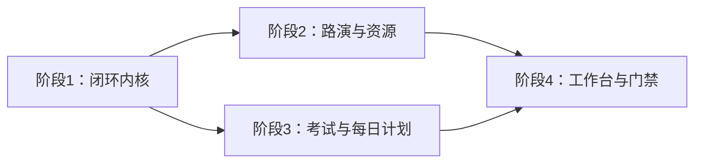

# OREP Unified Closed-Loop Program Implementation Plan

> **For agentic workers:** REQUIRED SUB-SKILL: Use superpowers:subagent-driven-development (recommended) or superpowers:executing-plans to implement this plan task-by-task. Steps use checkbox (`- [ ]`) syntax for tracking.

**Goal:** 将现有考试、每日计划、PPT/讲稿、路演和项目任务的独立循环，渐进式接入统一的检查、裁决、整改、复查与阶段门禁架构。

**Architecture:** 保留现有领域对象和 `ProjectTask` 执行体系，在 Spring Boot 后端新增统一闭环内核。各领域通过适配器向内核提交检查点、评估和证据；系统只生成整改草案，老师或被授权队长确认后发布正式任务；任务验收后回到领域复查。

**Tech Stack:** Java 21、Spring Boot 3.2、JdbcTemplate/MyBatis-Plus、MySQL 8、Vue 3、Element Plus、Node test runner、Playwright、Maven/JUnit 5。

---

## 1. 计划拆分与依赖

设计依据：[统一闭环架构设计](../specs/2026-07-17-orep-unified-closed-loop-architecture-design.md)。

本规格包含四个可以独立验收的子系统，不适合在一个超大变更中完成。按以下顺序执行：

1. [阶段 1：闭环内核与项目任务关联](2026-07-17-orep-closed-loop-phase-1-core.md)
2. [阶段 2：路演、PPT、讲稿和材料适配](2026-07-17-orep-closed-loop-phase-2-roadshow-resources.md)
3. [阶段 3：老师考试、重练与每日计划](2026-07-17-orep-closed-loop-phase-3-exam-daily-plan.md)
4. [阶段 4：角色工作台、项目看板与阶段门禁](2026-07-17-orep-closed-loop-phase-4-workbenches-gates.md)

依赖关系：



### 1.1 需求到阶段的追踪

| 已确认的架构要求 | 主实现阶段 | 最终验收位置 |
|---|---|---|
| 现状按方案 A 管理，向方案 C 演进，不采用纯方案 B | 阶段 1 建内核，阶段 2–3 保留领域对象并接适配器 | 阶段 4 全链路 E2E |
| 查后通过则结束；不通过则建议→改→演→再查 | 阶段 1 状态机与 recheck；阶段 2 路演轮次对账 | 阶段 2 验收场景 4–5 |
| 系统先给自动判定和证据，老师最终裁决 | 阶段 1 评估/追加式裁决 | 阶段 4 老师工作台 |
| 整改任务先生成草案，老师确认负责人、截止时间、重练范围后发布 | 阶段 1 草案发布；阶段 3 考试/计划适配 | 各阶段“无直接正式任务”测试 |
| 支持三种审核模式 | 阶段 1 保存策略；阶段 3 在考试/每日计划中执行 | 阶段 3 三模式验收 |
| 队长可预审普通任务、PPT 页、讲稿段落和每日计划 | 阶段 4 delegation 与工作台 | 阶段 4 权限 E2E |
| 正式考试、整套 PPT、完整路演、阶段门禁只能由老师最终裁决 | 阶段 2–4 固定策略与不可下放集合 | 阶段 4 负向权限测试 |
| 老师可明确授权队长终审一类普通任务 | 阶段 4 可撤销、限时 delegation | 阶段 4 delegation 单元/API 测试 |
| 老师可撤销系统自动通过 | 阶段 1 追加式撤销；阶段 3 自动通过模式 | 阶段 3 验收场景 9 |

## 2. 跨阶段固定约束

- 正式 `Project` 尚未建立前，`teamId` 必填、`projectId` 可空；禁止使用 `teamId` 伪造 `projectId`。
- 所有写接口必须校验 `tenantId`、`teamId`、当前用户和角色。
- `Decision` 追加写入，不允许覆盖或删除旧裁决。
- `ProjectTask` 不直接增加大量闭环字段，使用 `closed_loop_task_link` 关联表。
- 任务状态 `DONE` 不等于检查点 `PASSED`。
- 新适配器必须受配置开关保护，允许按租户或全局关闭。
- 每一阶段必须先写失败测试，再实现最小代码，再运行回归测试。
- 每一阶段数据库脚本必须同时维护：
  - `backend/src/main/resources/sql/`
  - `deploy/sql/backend-resources/`
  - `deploy/docker-compose.yml` 的初始化挂载或发布说明
- 当前目录不是 Git 工作树。执行人员应在真正 Git 工作树中实施并按任务提交；不得在此目录擅自初始化 Git。

## 2.1 实施节奏和并行边界

- 阶段 1 必须串行先完成；它定义所有后续适配器依赖的表、状态和 API。
- 阶段 2 与阶段 3 可在阶段 1 验收后并行开发，但数据库升级脚本和 `ClosedLoopController` 的改动必须分别集成，避免互相覆盖。
- 阶段 4 在阶段 2、3 的 API 契约稳定后开始；教师端和用户端 UI 可以并行，但最终 E2E 必须在同一集成环境执行。
- 每个阶段先在默认关闭开关下发布，再只对内部测试租户启用，验收通过后扩大范围。
- 每个阶段结束都形成独立回滚点；不得把四阶段合并成一次不可逆发布。

## 3. 发布开关

在 `backend/src/main/resources/application.yml` 中逐步加入：

```yaml
orep:
  closed-loop:
    enabled: false
    adapters:
      roadshow: false
      resource: false
      exam: false
      daily-plan: false
    stage-gates:
      enabled: false
```

对应环境变量：

```text
OREP_CLOSED_LOOP_ENABLED
OREP_CLOSED_LOOP_ADAPTERS_ROADSHOW
OREP_CLOSED_LOOP_ADAPTERS_RESOURCE
OREP_CLOSED_LOOP_ADAPTERS_EXAM
OREP_CLOSED_LOOP_ADAPTERS_DAILY_PLAN
OREP_CLOSED_LOOP_STAGE_GATES_ENABLED
```

## 4. 阶段验收门

### 阶段 1 验收门

- 能创建检查点、评估、裁决、问题和整改批次。
- 重复生成草案不会产生重复记录。
- 老师可以编辑并发布草案为现有 `ProjectTask`。
- 任务验收后只进入 `READY_FOR_RECHECK`，不会自动通过检查点。
- 并发裁决返回 HTTP 409。

### 阶段 2 验收门

- 完成一次路演评分后自动创建成果级检查点。
- AI 整改项进入草案，不直接成为正式任务。
- 下一轮路演能够区分已解决、持续存在和新增问题。
- PPT 页级问题能生成带页面和版本引用的整改任务。
- 讲稿与材料退回可以重新打开原任务或生成新草案。

### 阶段 3 验收门

- 区分自主测试和老师发布考试。
- 老师考试未通过时生成个人训练草案。
- 人工阅卷后重新计算通过建议，并等待老师最终裁决。
- 重考与上一轮考试、训练批次建立关联。
- 每日计划区分系统与老师来源，并支持自动、人工和建议三种审核模式。

### 阶段 4 验收门

- 老师、队长、学生看到不同工作台。
- 老师独占正式考试、整套 PPT、完整路演和阶段门禁最终裁决。
- 队长可预审，并仅在授权范围内终审普通任务。
- 项目看板解释当前门禁、轮次、未关闭问题和下一步。
- 阶段门禁可通过、驳回、撤销和重新打开。

## 5. 全量回归命令

```bash
cd backend
mvn test
```

预期：全部 JUnit 测试通过，失败数为 0。

```bash
cd frontend/user
node --test src/utils/*.test.js src/views/**/*.test.js
npm run build
```

预期：Node 测试失败数为 0，Vite 构建退出码为 0。

```bash
cd frontend/admin
npm run build
```

预期：管理端 Vite 构建退出码为 0。

阶段 4 完成后：

```bash
cd frontend/user
npx playwright test tests/closed-loop.spec.js
```

预期：老师、队长、学生闭环关键路径全部通过。

## 6. 回滚策略

- 先关闭对应 adapter 开关，再回滚应用版本。
- 新表和新增关联保留，不在应用回滚时删除。
- 旧考试、PPT、路演和任务页面继续读取原字段。
- 新前端只在 API 返回 `closedLoopEnabled=true` 时显示闭环功能。
- 禁止使用删除表或回写旧状态作为日常回滚方式。

## 7. 总体完成定义

- [ ] 阶段 1 验收门通过。
- [ ] 阶段 2 验收门通过。
- [ ] 阶段 3 验收门通过。
- [ ] 阶段 4 验收门通过。
- [ ] 全量后端测试通过。
- [ ] 用户端 Node 测试和构建通过。
- [ ] 管理端构建通过。
- [ ] Playwright 闭环路径通过。
- [ ] 配置开关默认关闭并完成灰度说明。
- [ ] 生产数据库脚本经过备份环境演练。
