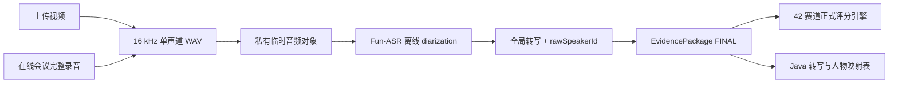

# 终版说话人分离与无分数人物证据设计

**日期：** 2026-07-14  
**状态：** 代码完成，等待真实 OSS/DashScope 长时验收  
**适用入口：** 上传视频评分、在线路演会后终版评分

## 1. 结论

两个入口的正式评分都必须使用完整录音产生的终版转写与全局说话人标签。在线会议的实时转写只是临时证据，不得成为终版人物归属。

人物识别层只输出事实和映射：

- 模型原始 `rawSpeakerId`。
- 发言时间区间、转写文本、置信度。
- 自报姓名、自报岗位、花名册匹配候选。
- 匹配来源、状态和人工 revision。

人物层不再输出“表达/逻辑/创新/答辩/团队”数值分，不使用默认 60 分，不写入正式总分、扣分账目或个人能力画像。

## 2. 取舍方案

### 方案 A：延续实时 ASR，由 LLM 根据交接话术拆人

优点是改动少。缺点是会把同一音轨全部写成 `SPEAKER_0`，并可能根据内容虚构人物边界。拒绝采用。

### 方案 B：上传视频离线分离，在线会议仍使用实时标签

优点是会后速度快。缺点是两个入口的报告可靠性不一致，无法共用同一契约和人工修正机制。拒绝采用。

### 方案 C：两个入口都用完整录音生成终版分离（采用）

实时结果保留作临时体验与故障审计；会后将完整派生 WAV 上传到私有临时对象，通过短时签名 URL 调用离线 Fun-ASR diarization，再作为正式评分的转写事实。

## 3. 终版数据流



## 4. 私有临时对象

- 只上传派生 WAV，不上传原始视频。
- 对象名使用 UUID，不含项目、姓名、赛道或 session ID。
- bucket 必须私有，仅生成短时 GET URL。
- 签名 URL 不记录、不入库、不进证据 hash。
- 成功、失败、超时都在 `finally` 删除；删除失败有有限重试和脱敏审计事件。
- `FINAL_RECORDED_DIARIZATION_ENABLED=false` 时不会上传任何音频。
- 开关开启但配置不完整或云端失败时，终版流程明确失败，不静默退回伪造的单人转写。

## 5. 模型调用契约

Fun-ASR 任务必须开启：

```json
{
  "diarization_enabled": true,
  "timestamp_alignment_enabled": true,
  "speaker_count": "optional_hint_only"
}
```

`speaker_count` 只是提示，不裁剪供应商返回的人数。结果必须含有效时间戳；若整场有足够发言但仍没有任何 `speaker_id`，标记 `evidence_incomplete` 并阻止“人物分离已成功”。

## 6. 并发与性能

完成 WAV 后同时启动：

1. 终版离线 ASR + diarization。
2. 视频批次分析。

ASR 完成后立即执行语音质量分析，视频分支仍可继续。融合和正式评分等待两分支完成。不减少帧、ASR 内容、评分 tokens、15 个观测点或 9 位评委。

## 7. 无分数人物证据

删除隐藏个人评分语义：

- 不再调用提示词生成个人 0～100 数值维度。
- 不允许根据交接话术对模型原始声音簇做二次虚构拆分。
- 不再产生默认 60 分。
- 新字段使用 `speakerEvidence`，不使用 `speakerScores`。
- 历史 `roadshow_speaker_score.dimensions_json` 保留审计，但新流不再写入，能力画像不再读取该字段。
- 个人训练诊断如需重建，必须是另一个明示为“非正式分”的产品功能，不在本流程内暗中产生。

## 8. Java 持久化

- `ai_score_transcript_segment.speaker_label` 保存供应商全局 raw speaker。
- `ai_score_speaker_identity` 保存显示名称、团队角色、来源、状态、置信度和 revision。
- completed 回调重放时转写分段幂等替换；自动人物候选只更新 `AUTO` 记录，不覆盖 `CONFIRMED/REJECTED`。
- 报告 API 使用同一套字段服务两种来源。

## 9. 失败处理

- 对象上传失败：`final_asr_object_upload_failed`。
- Fun-ASR 提交或轮询失败：`final_asr_provider_failed`。
- 结果 JSON 下载/解析失败：`final_asr_result_invalid`。
- 无有效时间戳：`final_asr_timeline_invalid`。
- 无说话人标签：转写可用，但 diarization 状态为 `evidence_incomplete`，页面不宣称已分人。
- 临时对象删除失败：记录对象 key hash 和审计事件，禁止记录签名 URL。

## 10. 验收门禁

- 上传与在线会后路径都调用同一个终版 ASR 入口。
- 云端开关关闭时 0 音频外发。
- 开关开启时只上传 WAV，对象在成功和失败后均删除。
- Fun-ASR 请求明确开启 diarization 和时间对齐。
- 两种来源的 raw speaker 通过 Java completed 回调落库。
- 流水线、回调、PDF 和 Java 新写入不再出现 `speaker_scores` 或个人数值维度。
- 正式总分、42 赛道规则、扣分账目和预测区间回归一致。
- ASR 与视频分析真实时间重叠，不增加一个串行长耗时阶段。
