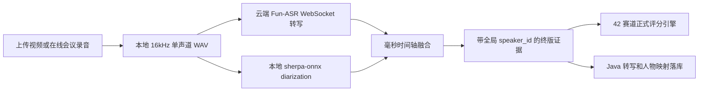

# 本地说话人分离与云端流式分析设计

**日期：** 2026-07-14  
**状态：** 用户已确认，立即实施  
**适用入口：** 上传视频评分、在线会议实时分析与会后终版评分

## 1. 设计结论

OSS 不属于产品运行依赖。音频始终从本地评分服务通过 WebSocket 直接发送至阿里云 Fun-ASR；说话人分离在本地完成。上传视频和在线会议会后终版共用同一套完整 WAV、同一本地 diarization 引擎和同一时间轴融合算法。

实时阶段继续输出临时转写和实时分析，但不宣称人物归属已经最终确定。会议结束后，以完整录音重新生成全局 `SPEAKER_n`，覆盖终版报告中的人物证据；它不产生任何分数。

## 2. 方案选择

### 方案 A：阿里非实时 Fun-ASR + OSS

能获得云端说话人分离，但要求云端可下载文件，与本地部署、实时流传输的产品架构不一致，拒绝作为正式路径。

### 方案 B：云端实时 Fun-ASR 直接给人物标签

无需 OSS，但阿里官方能力表标明实时模型不支持说话人分离，无法满足人物区分，拒绝采用。

### 方案 C：云端实时转写 + 本地 diarization（采用）

云端只负责实时/文件流式转写；本地使用 sherpa-onnx 的 Pyannote segmentation 与 3D-Speaker 中文声纹模型完成完整录音分离。两者按时间轴合并，符合本地部署与单轨现场路演。

## 3. 数据流

## 4. 本地模型

- 运行时：`sherpa-onnx>=1.10.28`，正式锁定当前可用的 `1.13.4`。
- 分段模型：`sherpa-onnx-pyannote-segmentation-3-0/model.int8.onnx`。
- 声纹模型：`3dspeaker_speech_eres2net_base_sv_zh-cn_3dspeaker_16k.onnx`。
- 输入：16 kHz、单声道、float32。
- 说话人数默认未知（`num_clusters=-1`），不得用团队人数强制指定。
- 长录音聚类距离阈值默认 `1.0`；这是基于本次 54 分钟真实路演从 `0.8` 校准而来的长时音色漂移基线。
- 原始簇累计有效发言不足 5 秒时不公布为人物，其时间段保持“发言人待确认”。
- 稳定簇按首次出现重新编为连续的 `SPEAKER_0..n`；自动模式超过 16 个稳定簇时明确失败，不发布异常人数。
- 模型必须在部署阶段预置并校验 SHA256；运行时不得临时联网下载。

## 5. 时间轴融合

对每条 ASR segment 计算它与全部 diarization turn 的重叠毫秒数：

1. 选择重叠时间最长的 speaker。
2. 最大重叠必须覆盖 ASR segment 至少 35%。
3. 第一与第二候选过于接近（最大候选不足两者总和的 60%）时标记 `OVERLAP`，不强行归人。
4. 无有效重叠时保持 `rawSpeakerId=null`。
5. 不拆分或改写转写文本，不根据“下面有请”等语义推断人物。
6. 输出保留 ASR 原时间戳、diarization turn、融合覆盖率和证据来源。

## 6. 并发与性能

完成 WAV 后并行执行云端 ASR、本地 diarization 和视觉分析。语音质量等待 ASR；融合等待 ASR 与 diarization；正式评分等待全部证据完成。

本地 diarization 使用单个模型实例处理一条完整录音，避免切片后 speaker_id 漂移。不同评分会话由有界信号量限制并发，默认一台本地节点同时运行一个 diarization 任务；云端 ASR 分片与视觉批次维持现有有限并发，不减少内容。

## 7. 失败处理

- 模型缺失或校验失败：`local_diarization_model_missing` / `local_diarization_model_invalid`。
- 引擎不可用：`local_diarization_engine_unavailable`。
- 处理超时：`local_diarization_timeout`。
- 未检测到人物簇：转写可用，人物证据标记 `evidence_incomplete`；不得伪造单人标签。
- 自动稳定簇数异常：`local_diarization_cluster_count_implausible:<count>`，不写入 Java 或前端。
- 任一完整录音 ASR 分片失败：`long_audio_chunk_failed:<index>:<reason>`，不将缺片转写宣称为完整结果。
- 严格终版模式下本地分离失败时终版任务失败并可重试，不静默回退到语义猜人。
- 云端 ASR 和本地 diarization 均只产证据，不改变正式评分权威。

## 8. 配置与部署

新增：

- `LOCAL_SPEAKER_DIARIZATION_ENABLED=true`
- `LOCAL_DIARIZATION_SEGMENTATION_MODEL`
- `LOCAL_DIARIZATION_EMBEDDING_MODEL`
- `LOCAL_DIARIZATION_CLUSTER_THRESHOLD=1.0`
- `LOCAL_DIARIZATION_MIN_CLUSTER_DURATION_SECONDS=5`
- `LOCAL_DIARIZATION_MAX_DETECTED_SPEAKERS=16`
- `LOCAL_DIARIZATION_TIMEOUT_SECONDS=900`
- `LOCAL_DIARIZATION_MAX_CONCURRENCY=1`

删除正式运行对 `TEMP_AUDIO_OSS_*`、`oss2` 和 `FINAL_RECORDED_DIARIZATION_ENABLED` 的依赖。模型安装脚本只在部署阶段执行，并输出文件 SHA256 供部署清单固化。

## 9. 验收

- 静态扫描正式路径不存在 OSS、签名 URL 或非实时 file URL 上传。
- 上传视频和在线会议终版使用同一个本地 diarization 接口。
- 云端 ASR 与本地 diarization 在真实时间上重叠。
- 本地模型返回全局、有序、非负的 speaker turns。
- 融合不改变 ASR 文本和时间戳，不产生分数。
- Java received `speakerEvidence` 可幂等落库并保护人工修正。
- 指定 55 分钟视频完成真实跑测，记录音频时长、人物簇数量、各人物发言时长、分离耗时、全流水线耗时和失败点。

## 10. 2026-07-14 真实视频验证结果

- 输入：473 MB H.264/AAC 单轨视频，音频 54 分 30.6 秒。
- WAV 转码：16 kHz / 单声道 / PCM16，1.4 秒。
- 本地 diarization：整段推理 268.6 秒，实时系数 0.082。
- 原始阈值验证：`0.5` 产生 71 个原始簇，`0.8` 产生 33 个，均被证明不适合该长录音。
- 最终基线：`1.0` 产生 15 个原始簇；去除累计不足 5 秒的短暂簇后公布 8 个稳定簇。
- 全流水线：801.3 秒（13 分 21 秒）；246 个 ASR 段、109 帧视觉证据。
- 人物归属：131 段 `IDENTIFIED_CLUSTER`，113 段 `UNKNOWN`，2 段 `OVERLAP`。未确定部分保持未确定，没有语义猜人。
- 大模型三阶段 completion tokens 合计 9,860，未出现 8,001 token 截断。
- 首轮全流水线暴露旧语音质量模块不兼容 `speaker=None`，已用回归测试修复后完整重跑通过。
