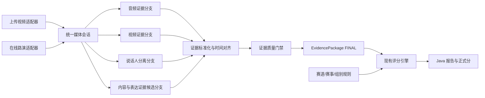
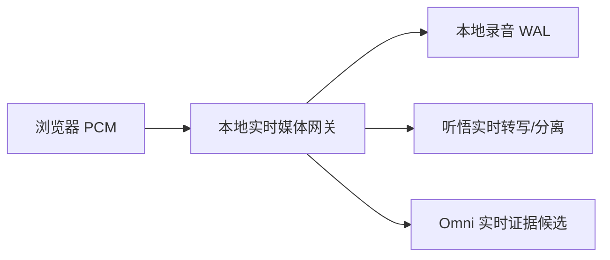
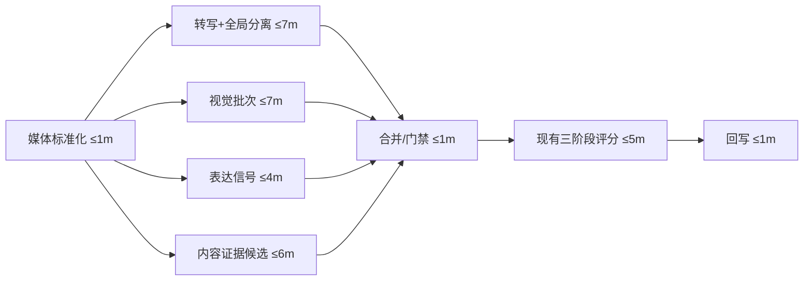

# 统一媒体证据流水线与现场说话人识别开发设计

**版本：** 1.0  
**日期：** 2026-07-14  
**状态：** 实施中；检查点 1～3 已完成本地代码与自动化验收，真实云模型影子放量仍受门禁限制  
**适用入口：** 上传视频评分、在线路演实时采集  
**性能目标：** 60 分钟媒体从上传完成或会议结束起，上传视频 P95 不超过 15 分钟，在线路演 P95 不超过 12 分钟

## 1. 决策结论

本次不建设第二套评分流，也不让音频、视频或说话人模型直接决定分数。上传视频与在线路演共用一套逻辑上的媒体证据流水线，只保留两个来源适配器：

- `UPLOAD_VIDEO`：从完整文件批量读取音频、视频和媒体元数据。
- `LIVE_ROADSHOW`：从实时 PCM、关键帧和本地录制文件持续读取媒体数据。

两种来源最终必须生成同一版本的 `EvidencePackage`。证据包冻结并通过完整性门禁后，才交给现有 Python 评分主流程。正式分数、维度分、结构化扣分、保守提分区间和待办关联仍由现有评分规则与规则执行器产生。

严格边界如下：

1. 媒体层负责回答“发生了什么、谁在说、证据在哪里、证据是否可靠”。
2. 媒体层不得回答“应该得几分、扣几分、最多追回几分”。
3. 评分层可以引用媒体层冻结的事实证据，但媒体层不能修改评分层输出。
4. 实时模型只生成临时证据候选，不在会中反复生成正式分数。
5. 上传视频的说话人分离替换现有 ASR 调用，不作为额外串行步骤追加。
6. 在线路演把证据处理前移到会议进行期间，会议结束后只做终结、校正、冻结和正式评分。

## 2. 当前实现与需要解决的问题

### 2.1 当前主流程

`ai-scoring/app/services/pipeline_service.py` 当前在一个流程函数内依次执行：

1. 音频转码。
2. 实时转写复用或完整文件 ASR。
3. 语音质量分析。
4. 视频帧分析。
5. 音视频融合。
6. 五维大模型评分。
7. 分发言人分析。
8. 能力画像。
9. 报告生成和 Java 回调。

这一实现存在四类问题：

- 证据准备、评分和报告生成职责混在同一个函数中，难以并行、恢复和单独重试。
- 当前文件 ASR 使用 `fun-asr-realtime-2026-02-28`，实际不返回说话人标签，缺失时统一写成 `SPEAKER_0`。
- `transcribe_long_audio` 按五分钟分片；如果直接在每片打开说话人分离，不同分片的 `speaker_id` 会重新编号，无法表示全场同一个人。
- `speaker_scoring_service.py` 会产生个人维度分，容易与“说话人识别只负责证据元数据”的新边界混淆。

### 2.2 已有能力必须复用

本次不推倒重来，必须复用：

- Java 已有 `ai_score_media_asset`、`ai_score_transcript_segment`、`ai_score_frame`、`ai_score_evidence_anchor`、`ai_score_evidence_snapshot`。
- Java 已有会话、媒体资产、报告、观察点、扣分账目和终态保护。
- Python 已有音频转换、视频抽帧、视觉批次分析、三阶段五维输出、规则执行、回调重试。
- 前端已有完整视频播放、按时间定位转写、事件时间轴和角色修正入口。
- 42 个赛道版本化规则、缺证据封顶、正式扣分与诊断建议分离的口径保持不变。

## 3. 范围与非目标

### 3.1 本期范围

- 建立统一媒体输入、证据候选、说话人片段和证据包契约。
- 上传与在线两种来源共享同一个证据编排器、合并器、质量门禁和持久化协议。
- 上传视频使用支持长音频说话人分离的离线 ASR，转写与分离一次完成。
- 在线路演支持实时音频推流、临时说话人分离、实时证据候选和会后校正。
- 说话人身份支持角色自动匹配、一次人工修正和后续整场传播。
- 证据提取与视觉分析有限并发，不减少分片、帧、提示内容和报告字段。
- 全链路可观测、可恢复、可降级、可按会话回滚。

### 3.2 非目标

- 不修改 42 个赛道规则、分值预算或扣分公式。
- 不让实时模型输出用户可见正式分数。
- 不承诺在完全没有身份锚点时自动知道真实姓名。
- 不把临时发言人标签覆盖为不可审计的最终身份。
- 不建设永久“黄金技术样本集”；首期使用真实会话回归、人工抽查和运营指标。
- 不把本地 3D-Speaker 作为首期唯一主通道；它作为严格私有部署和云故障备用能力。
- 不在本期重做评分结果、待办和依据页的信息架构。

## 4. 术语与权威边界

### 4.1 说话人分离与身份识别

- **说话人分离（diarization）：** 判断每段声音属于哪个匿名声音簇，输出 `SPEAKER_0/1/2`。
- **身份识别（identification）：** 把匿名声音簇映射到姓名或团队角色。
- **身份锚点：** 自我介绍、明确交接语、项目人员名单、视频嘴部活动、人工确认或经授权保存的同项目声纹。

没有任何身份锚点时，系统最多稳定输出“1 号发言人/2 号发言人”，不得猜姓名。

### 4.2 权威数据

- 原始音频、原始视频和媒体 hash 是媒体事实。
- 原始 `speaker_id` 是模型事实，人工修正不得覆盖原值。
- `EvidencePackage` 是评分输入事实快照。
- Java 报告 API 中的最终分是用户端权威分。
- 实时证据候选、个人训练诊断分和多人格评委分均不得覆盖权威分。

## 5. 总体架构



### 5.1 组件边界

建议新增 Python 包 `app/services/media_evidence/`，避免继续扩大 `pipeline_service.py`：

```text
media_evidence/
  contracts.py               统一输入、候选、证据包契约与校验
  orchestrator.py            DAG 编排、并发、检查点和恢复
  source_upload.py           上传文件适配器
  source_live.py             实时流和会中缓存适配器
  asr_provider.py            ASR/说话人分离提供商接口
  dashscope_recorded.py      上传视频离线 Fun-ASR 实现
  tingwu_realtime.py         在线路演听悟实时实现
  local_diarization.py       3D-Speaker 备用接口
  speaker_reconciliation.py  跨片、会后全局和身份映射
  evidence_merge.py          去重、时间对齐和来源合并
  quality_gate.py            覆盖率、时间戳、完整性和禁分检查
  metrics.py                 阶段耗时、重试、用量和质量指标
```

`pipeline_service.run_scoring_pipeline` 保留为兼容入口，但内部改为：

1. 调用统一证据编排器。
2. 获得冻结的 `EvidencePackage`。
3. 适配成现有 `score_roadshow` 输入。
4. 执行现有三阶段评分。
5. 生成报告并回调 Java。

### 5.2 评分边界的代码约束

证据层契约禁止出现以下字段：

- `overall_score`
- `dimension_score`
- `deducted_points`
- `max_recoverable_points`
- `predicted_score`
- `score_impact`

现有视频分析内部的 `gesture.score`、`posture.score` 等字段在进入证据包时必须转换为 `signalValue`、`confidence` 或 `severity`。证据层输出校验器发现禁用字段时直接拒绝冻结证据包。

`speaker_scoring_service.py` 不属于统一证据层。它若继续保留，只能作为训练诊断输出，不能参与官方团队总分、扣分账目或证据包 hash。

## 6. 两种来源的统一处理

### 6.1 统一输入契约

```json
{
  "sessionId": "26",
  "sessionCode": "SC-20260713171229621",
  "sourceType": "UPLOAD_VIDEO",
  "trackId": "track-new-generation-it",
  "trackRuleVersion": "2026.07",
  "durationMs": 3300000,
  "teamSizeHint": 4,
  "speakerCountHint": 5,
  "media": {
    "audioFormat": "pcm",
    "sampleRate": 16000,
    "channels": 1,
    "videoAvailable": true
  },
  "roster": [],
  "processingVersion": "media-evidence-v1"
}
```

`speakerCountHint` 与 `teamSizeHint` 必须分开。现场可能出现主持人、评委或指导老师，团队人数不能被当成绝对说话人数。

### 6.2 上传视频适配器

上传路径执行：

1. 校验媒体 hash、容器、轨道、真实编码、时长和旋转信息。
2. 一次性生成 16 kHz 单声道标准音频，保存原媒体到标准音频的时间偏移。
3. 同时启动：离线转写+说话人分离、视觉批次、表达信号、内容证据候选。
4. ASR 使用整场音频的全局说话人分离结果；禁止对五分钟分片独立分离后直接拼接 `speaker_id`。
5. 如果提供商只能分片，必须额外提取声纹向量并进行跨片全局聚类，之后才生成终版标签。
6. 全部分支完成后，合并成终版证据包。

### 6.3 在线路演适配器

在线路径执行：

1. 浏览器把单声道 PCM 只发送给本地实时媒体网关一次。
2. 本地网关用独立队列分发到：本地录音、实时说话人分离、实时证据候选和既有关键帧采集。
3. 本地录音是最高优先级，不得因任何云连接阻塞或丢失。
4. 实时输出一律标记为 `PROVISIONAL`。
5. 会议结束后，使用完整录音、最终实时转写和全局声音簇做一次标签校正。
6. 终版证据包与上传视频产生完全相同的结构。

### 6.4 “同一流程”的实现含义

两种来源不强制使用同一个模型端点，因为实时和离线模型能力不同；它们必须共享：

- 相同的输入领域模型。
- 相同的证据候选协议。
- 相同的说话人状态协议。
- 相同的合并、去重、质量门禁和 hash 算法。
- 相同的 Java 持久化结构。
- 相同的评分输入适配器。
- 相同的报告 API 展示模型。

来源差异只能封装在适配器和 provider 内，不能扩散到评分、报告和前端组件。

## 7. 实时媒体网关设计

### 7.1 单生产者、多消费者



每个音频块包含：

```json
{
  "sessionId": "26",
  "sequence": 1823,
  "startMs": 364600,
  "endMs": 364856,
  "format": "pcm_s16le",
  "sampleRate": 16000,
  "channels": 1,
  "payloadHash": "sha256:..."
}
```

### 7.2 队列优先级

- 本地录音队列：不可丢弃，写盘失败立即标记媒体故障。
- 听悟队列：有界缓冲、保持顺序、支持短断线重连。
- Omni 队列：允许暂停证据候选，不得反压录音和听悟。
- 关键帧队列：按现有场景变化和最大帧数策略选择，不能因实时模型拥塞增加浏览器内存。

### 7.3 背压与断线

- 每个消费者有独立连接、ACK、最后确认序号和重连计数。
- 网关保留短时环形缓冲以及完整本地录音，云端断线不丢原始事实。
- 供应商不支持历史音频重放时，实时结果允许出现缺口，但会后必须从完整录音补齐。
- 前端 WebSocket 断开后，服务端明确记录最后收到的 `sequence`，禁止重复片段静默写入转写。
- 同一 `sequence + payloadHash` 幂等；序号相同但 hash 不同视为数据冲突。

## 8. 模型与部署策略

### 8.1 上传视频主通道

使用支持长音频说话人分离的离线 Fun-ASR：

- 一次获得转写、句子/词时间戳和 `speaker_id`。
- 开启 `diarization_enabled`。
- `speaker_count` 只作为参考值。
- 60 分钟音频低于官方建议的两小时说话人分离上限。

离线接口要求模型可访问的 HTTP/HTTPS URL。本地部署不需要对外开放本地服务，采用私有 OSS 临时对象：

1. 仅上传派生的单声道音频，不上传原始视频。
2. 私有桶、随机对象名、最小权限 STS/RAM。
3. 短时签名 GET URL。
4. 成功、失败和超时均删除对象。
5. 定时清理任务兜底删除遗留对象。
6. 数据库和日志不保存完整签名 URL。

严格禁止音频出域时切换到本地 provider，不得偷偷使用云端。

### 8.2 在线路演主通道

- 听悟实时记录：负责实时转写与临时说话人分离，无需公网本地文件 URL。
- Qwen3.5 Omni Realtime：只负责实时内容、表达和事件证据候选，不产分。
- 本地完整录音：作为会后补齐和审计事实。

Omni 连接按约八分钟轮换，使用结构化阶段摘要承接上下文，避免长会话历史音频反复计费和延迟上升。输出只开文本，不生成音频回复。

### 8.3 本地备用通道

使用 ModelScope 3D-Speaker/CAM++ 或后续验证通过的本地组件完成：

- VAD。
- 语音切片。
- 说话人 embedding。
- 聚类。
- 可选重叠语音检测。
- 可选音视频联合分离。

本地通道首期作为 feature flag 下的备用，不在未做真实硬件基准前承诺与云通道相同速度。

## 9. 说话人状态与身份映射

### 9.1 原始标签不可变

`rawSpeakerId` 永远保存模型原值。显示名称和角色作为独立映射：

```json
{
  "rawSpeakerId": "SPEAKER_2",
  "displayName": "2号选手",
  "matchedName": "李明",
  "normalizedRole": "AI算法工程师",
  "identityConfidence": 0.81,
  "mappingSource": "handoff_and_roster",
  "mappingStatus": "AUTO_MAPPED"
}
```

### 9.2 状态优先级

1. `PROVISIONAL`：实时匿名聚类。
2. `FINAL_ANONYMOUS`：会后声音簇已稳定，但身份未知。
3. `AUTO_MAPPED`：根据自我介绍、交接、名单或视频自动映射。
4. `CONFIRMED`：人工确认，优先级最高。
5. `REJECTED`：人工否定的自动映射，不得被同版本算法重新写回。

### 9.3 身份锚点优先级

1. 人工确认。
2. 明确自我介绍。
3. 已确认的同项目声纹匹配，且用户已授权复用。
4. 明确交接语句与人员名单联合匹配。
5. 视频嘴部活动与画面人物联合匹配。
6. 仅根据内容风格推断的角色，必须低置信度展示为“疑似”。

### 9.4 特殊场景

- 两人同时说话：标记 `OVERLAP`，不能整段强制归属一人。
- 发言短于有效声纹窗口：标记 `INSUFFICIENT_AUDIO`。
- 同一人因扩音、距离或麦克风变化被拆成两簇：会后全局 embedding 合并。
- 不同声音过于相似：保留匿名标签并提示人工确认。
- 主持人/评委发言：不得因超出团队人数而删除。

## 10. 统一证据契约

### 10.1 证据候选

```json
{
  "evidenceId": "ev-...",
  "type": "transcript|speaker_turn|visual|delivery|content_claim|contradiction",
  "startMs": 120300,
  "endMs": 134800,
  "rawSpeakerId": "SPEAKER_2",
  "text": "算法准确率达到92%",
  "sourceRef": "transcript:83",
  "confidence": 0.86,
  "state": "PROVISIONAL",
  "provider": "tingwu",
  "modelVersion": "...",
  "inputHash": "sha256:..."
}
```

### 10.2 终版证据包

```json
{
  "contractVersion": "media-evidence-v1",
  "sessionId": "26",
  "sourceType": "LIVE_ROADSHOW",
  "status": "FINAL",
  "transcriptSegments": [],
  "speakerTurns": [],
  "speakerIdentities": [],
  "visualEvidence": [],
  "deliverySignals": [],
  "contentEvidence": [],
  "integrity": {
    "audioCoverage": 0.98,
    "videoCoverage": 0.94,
    "timestampMonotonic": true,
    "diarizationStatus": "completed",
    "detectedSpeakerCount": 5,
    "unresolvedSpeakerCount": 2,
    "overlapSegmentCount": 3
  },
  "snapshotHash": "sha256:...",
  "processingMetrics": {}
}
```

### 10.3 hash 规则

- hash 输入使用规范 JSON：固定字段顺序、UTF-8、统一数字精度、排除临时 URL 和日志字段。
- 人工修改显示名称后产生新证据包版本，不覆盖旧 snapshot。
- 同一输入、同一模型版本、同一配置应生成相同结构顺序。
- 评分任务记录使用的 `snapshotHash`，保证报告可以追溯到具体证据版本。

## 11. Java 数据模型与接口

### 11.1 复用表

- `ai_score_media_asset`：媒体事实。
- `ai_score_transcript_segment`：终版转写片段，`speaker_label` 保存原始标签。
- `ai_score_frame`：关键帧事实。
- `ai_score_evidence_anchor`：面向评分和报告的证据锚点。
- `ai_score_evidence_snapshot`：证据包版本与 hash。

### 11.2 建议新增表

`ai_score_speaker_identity`：

- `session_id`
- `raw_speaker_label`
- `display_name`
- `matched_name`
- `normalized_role`
- `identity_confidence`
- `mapping_source`
- `mapping_status`
- `voiceprint_ref`（仅保存经授权的内部引用，不保存外部 URL）
- `created_at/updated_at`

唯一键为 `(session_id, raw_speaker_label)`。

`ai_score_evidence_stage_job`：

- `session_id`
- `stage_key`
- `attempt_no`
- `provider`
- `status`
- `input_hash/output_hash`
- `started_at/completed_at/duration_ms`
- `error_code/error_message`
- `metrics_json`

用于阶段级恢复、性能统计和故障排查。不能只依赖 Python 本地进度 JSON。

### 11.3 数据库迁移原则

- 所有迁移必须幂等，兼容已存在的会话和报告。
- SQL 同步维护应用资源与部署镜像目录。
- 新列允许旧报告为空，前端必须有兼容回退。
- 不修改已有正式分和扣分表的历史数据。
- 说话人映射删除使用状态标记，保留审计记录。

### 11.4 回调契约

增加中间状态 `evidence_ready`，不代表评分完成：

```json
{
  "status": "processing",
  "currentStage": "evidence_ready",
  "progressPercent": 62,
  "evidenceContractVersion": "media-evidence-v1",
  "evidenceSnapshotHash": "sha256:...",
  "evidenceIntegrity": {},
  "processingMetrics": {}
}
```

终态完成回调继续携带正式评分结果，并增加证据 snapshot 引用。Python 判定回调成功仍必须同时校验 HTTP 2xx 和业务 `code == 200`。

## 12. 状态机与进度

统一状态：

```text
QUEUED
MEDIA_INGESTING
MEDIA_NORMALIZING
EVIDENCE_EXTRACTING
EVIDENCE_FINALIZING
EVIDENCE_READY
SCORING
REPORT_GENERATING
WRITING_BACK
COMPLETED
FAILED
RESULT_WRITEBACK_FAILED
```

规则：

- 证据阶段失败不能伪装成评分失败。
- `EVIDENCE_READY` 后证据 hash 冻结，评分只读。
- `COMPLETED` 和 `FAILED` 不被旧进度覆盖。
- `FAILED` 允许运维重放有效 `COMPLETED` 恢复报告。
- 百分比只增不减，但不能长期使用虚假 95%；每个阶段同时显示真实状态和最近心跳。
- 子任务超时和重试不重置总进度。

## 13. 并发 DAG 与性能预算

### 13.1 上传视频



关键路径预算：

```text
1 + max(7, 7, 4, 6) + 1 + 5 + 1 = 15 分钟
```

这是发布门槛，不是通过减少帧、分片、维度、评委或文本得到的目标。

### 13.2 在线路演

会中并行完成实时转写、临时分离、关键帧和证据候选。会议结束后的预算：

```text
录音封存与模型终结             ≤1 分钟
说话人校正、视频汇总、候选汇总 ≤4 分钟（并行）
证据合并与门禁                 ≤1 分钟
现有三阶段评分                 ≤5 分钟
回写                           ≤1 分钟
总计                           ≤12 分钟
```

### 13.3 并发限制

- ASR/说话人主任务：每会话 1 个全局任务，避免重复计费和标签冲突。
- 视觉批次默认并发 3，保留原批次失败逐帧恢复。
- 内容证据候选按时间窗有限并发，输出按时间排序。
- 三阶段评分 A→B→C 有依赖，保持顺序；不为追求速度破坏契约。
- 每个供应商有独立 token bucket、并发信号量和熔断器。
- 全局并发可配置，超过容量的会话排队，不用无限线程拖垮全部任务。

## 14. 容错、重试与降级

| 故障 | 主处理 | 降级 | 禁止行为 |
|---|---|---|---|
| 实时听悟断线 | 重连并记录缺口 | 会后完整录音离线分离 | 中断本地录音 |
| Omni 断线 | 保存断点、轮换连接 | 使用转写生成候选；正式评分照常 | 把缺失候选当 0 分 |
| 上传离线 ASR 超时 | 阶段级重试/软超时启动备用 | 旧 ASR + 本地说话人分离 | 全流程从头重跑 |
| 单视觉批次失败 | 重试该批；逐帧恢复 | 标记具体失败帧 | 静默减少帧数 |
| 说话人标签漂移 | 会后全局重聚类 | 保留匿名标签 | 强行映射姓名 |
| 重叠语音 | 标记 overlap | 保留双方待确认 | 整段归给一个人 |
| 证据门禁失败 | 只重跑缺失阶段 | 明确 `evidence_incomplete` | 生成伪完整报告 |
| 评分 A 阶段失败 | 只重跑 A | `review_required`，分数为空 | 技术失败写成 0 分 |
| B/C 截断 | 只重跑失败阶段 | 保留核心分并标记报告待补 | 缩减模块冒充成功 |
| Java 回写失败 | Outbox/指数退避 | `RESULT_WRITEBACK_FAILED` | 日志写成功、页面停 95% |

重试请求必须有幂等键：`sessionId + stageKey + inputHash + processingVersion`。

## 15. 安全、隐私和数据生命周期

- 本地录音、原视频和派生音频分别登记媒体资产和 hash。
- 云端只传当前能力所需最小数据；上传说话人分离只传单声道派生音频。
- API Key、AccessKey 和签名 URL 不写入数据库、前端、异常栈或普通日志。
- 临时 OSS 对象私有、短时签名、任务结束删除、定时兜底清理。
- 声纹属于敏感生物特征；跨场复用必须由租户策略和用户授权控制。
- 未授权时，任务完成后只保存匿名 speaker label 和转写，不保存可跨场匹配的 embedding。
- 提供 `CLOUD_AUDIO_PROCESSING_ENABLED` 等部署开关；关闭后禁止自动回退云端。

## 16. 可观测性

每个阶段至少记录：

- `session_id/stage_key/attempt/provider/model_version`
- 输入时长、字节数、分片数、帧数
- 排队、网络、推理、合并耗时
- 重试次数、错误码、熔断状态
- 音频/视频覆盖率
- 检测说话人数、未解析身份数、重叠片段数
- completion tokens、截断检测和输出完整性
- 证据包 hash、评分使用的 snapshot hash
- 回调 HTTP 状态和业务码

日志禁止输出：完整音频 URL、访问凭证、原始 PCM、完整用户转写和绝对敏感路径。

关键指标：

- `evidence_pipeline_duration_seconds`
- `scoring_pipeline_duration_seconds`
- `end_to_report_duration_seconds`
- `speaker_label_churn_count`
- `speaker_identity_manual_correction_rate`
- `evidence_coverage_ratio`
- `provider_retry_total`
- `result_writeback_failure_total`

## 17. 前端与用户语义

- 会中可以显示“临时转写/发言人待确认/实时证据整理中”，不得显示正式评分已完成。
- 会议结束后，只有 `EvidencePackage FINAL` 才进入正式纪要和评分依据页。
- 临时 speaker label 与终版映射不同是允许的，界面应显示“已校正”，不制造数据被篡改的印象。
- 一次人工修正更新本场所有对应片段；原始标签在审计字段中保留。
- 说话人分离失败时，报告仍可完成，但人物转写显示“本场未完成说话人分离”，不得伪装成一个人发言。
- 最终用户仍只看到一个正式 AI 分数；证据流水线的置信度和内部模型分不作为第二套分数展示。

## 18. 兼容、迁移与回滚

### 18.1 兼容

- 旧报告没有 `speakerIdentities` 时继续显示原始 `speaker_label` 或“待确认”。
- 成功回调原有字段保持，新增字段均可选；Java 完成迁移后再设为必填门禁。
- `score_roadshow` 对外签名先保持，通过适配器读取证据包。
- 旧的本地结果 JSON 可重放，不要求重新跑视频。

### 18.2 功能开关

- `UNIFIED_EVIDENCE_PIPELINE_ENABLED`
- `UPLOAD_DIARIZATION_PROVIDER`
- `LIVE_DIARIZATION_ENABLED`
- `LIVE_OMNI_EVIDENCE_ENABLED`
- `LOCAL_DIARIZATION_FALLBACK_ENABLED`
- `SPEAKER_IDENTITY_REUSE_ENABLED`

所有开关必须支持按会话覆盖，便于影子运行和问题会话回退。

### 18.3 回滚

- 新证据流只影子写入时不影响旧评分结果。
- 主流量切换后，发现性能、完整性或身份错误可按会话切回旧 ASR/证据入口。
- 回滚不能删除已经产生的新证据 snapshot。
- 数据库迁移采用向前兼容，不以删除列回滚。

## 19. 分批开发顺序与检查点

### 检查点 0：基线与契约冻结

- 记录当前真实长视频每阶段耗时、分片、帧、tokens、结果字段完整度。
- 冻结 `media-evidence-v1` 契约和禁分字段。
- 不改变生产结果。

### 检查点 1：统一证据核心

- 实现 contracts、source adapter、orchestrator、snapshot hash 和 quality gate。
- 用现有 ASR/视觉结果验证上传与在线可生成相同证据包结构。
- 评分仍走旧入口。

### 检查点 2：上传视频说话人分离影子流

- 接入离线 Fun-ASR 和临时 OSS。
- 新结果只保存影子证据，不影响正式报告。
- 用真实一小时视频验证速度、覆盖率和 speaker label 稳定性。

### 检查点 3：在线实时影子流

- 接入实时媒体网关、听悟和 Omni 证据候选。
- 验证断网、重连、背压和会议结束终结。
- 会中结果仍不进入正式评分。

### 检查点 4：统一证据包接入评分

- `pipeline_service` 从冻结证据包构建现有评分输入。
- 证明相同旧证据产生的正式分和扣分契约不发生无解释变化。
- 隔离个人 speaker score。

### 检查点 5：Java 持久化与前端身份修正

- 持久化 stage job、speaker identity、snapshot hash 和 integrity。
- 一次修正全场传播，报告 API 返回终版人物转写。

### 检查点 6：有限放量

- 影子运行 → 10% → 30% → 100%。
- 任一阶段违反性能、完整性或稳定性门禁，停止扩大流量并回退。

## 20. 发布验收标准

### 20.1 功能

1. 上传与在线最终产生相同 `media-evidence-v1` 顶层字段。
2. 证据包不存在官方分、扣分或提分字段。
3. 原始 speaker label 与身份映射分离保存。
4. 人工修正一次后全场生效且可审计。
5. 说话人分离失败不伪造成 `SPEAKER_0` 单人事实。
6. 评分使用的 evidence snapshot hash 可追溯。

### 20.2 完整性

1. 输入分片、选中帧和输出证据逐项可对账。
2. 15 个观测点、9 位评委和三阶段报告内容不缩水。
3. 失败批次不静默丢弃。
4. JSON 截断不进入成功结果。

### 20.3 性能

1. 60 分钟上传视频从上传完成到报告：受控真实回归每次不超过 15 分钟；形成足够样本后 P95 不超过 15 分钟。
2. 60 分钟在线路演从会议结束到报告：受控真实回归不超过 12 分钟。
3. 不允许无状态地停在 95% 超过阶段心跳阈值。
4. 性能达标不得通过减少帧、转写内容、评分维度或报告模块实现。

### 20.4 稳定性

1. 任一云连接失败不影响本地完整录音。
2. 子任务可以阶段级重试和恢复，不从第一步重跑。
3. Java 完成和失败终态不被旧进度覆盖。
4. 完成回调失败可自动重试并明确进入回写失败状态。
5. 同一幂等键重复执行不会重复落库或重复计费。

## 21. 关键风险结论

本方案的最大风险不是模型是否“能识别人”，而是以下工程边界被破坏：

1. 把匿名聚类误当成真实姓名。
2. 把分片内 speaker ID 直接跨片拼接。
3. 把实时临时结果当成终版事实。
4. 把证据模型的内部信号分混入官方分数。
5. 为增加说话人分离又串行增加一轮全音频处理。
6. 云端慢或断线时反压本地录音。
7. 为追求 15 分钟静默减少输入或报告内容。
8. 回调业务失败被 HTTP 200 掩盖。

开发与评审必须围绕这八项风险设置自动化门禁，而不是只检查页面是否出现了人物名称。
