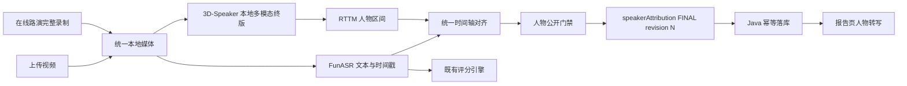

# 本地 3D-Speaker 权威人物转写设计

**日期：** 2026-07-15  
**状态：** 已批准，进入实施  
**适用入口：** 上传视频评分、在线路演实时预览与会后终版  
**替代范围：** 替代 LR-ASD + SFace 自研链式人物注册作为公开人物终版；不替代 FunASR 文本、评分引擎或报告业务契约

## 1. 决策结论

采用 ModelScope 3D-Speaker 的多模态说话人日志流水线作为本地权威人物引擎。它用 CAM++ 声纹、TalkNet 主动说话检测、IR101 人脸特征和音视频联合聚类生成全场 RTTM。FunASR 继续生成完整文本与时间戳；系统用统一毫秒时间轴把 RTTM 人物区间贴回 ASR 分段。

实时会议只公开 `PROVISIONAL/UNKNOWN` 标签。会议结束后，完整本地录制与上传视频使用同一个 3D-Speaker 终版入口。只有终版快照通过人物数、覆盖率、冲突、时间轴、修订号和评分隔离门禁，才允许覆盖页面人物标签。

## 2. 已确认问题与根因

1. 现有 LR-ASD 负责“画面中的哪张脸正在说话”，并不负责跨 55 分钟保持人物身份。
2. SFace 短轨迹链式合并会被远距离、侧脸、站坐切换和错误桥接污染。本次真实视频的 768 条短轨迹最终形成 8 个相互污染的视觉簇；它们不是 8 个人。
3. 把声学簇、短脸轨迹或固定位置直接显示为人物都是语义错误。同一人可能有多个声学簇，也可能在讲台与座位之间移动。
4. 通过降低相似度阈值或强制聚成 4 类不能解决污染，还会把临时入镜者错误塞给选手。
5. 当前前端空白的直接原因曾是 Java 旧实例、旧数据库结构和未回写终版转写；该问题已经通过修订快照与终态保护修复，新的提供商必须继续遵守相同契约。

## 3. 方案比较

### 方案 A：继续修改 LR-ASD/SFace 链式聚类

改动小，但身份模型弱、阈值依赖素材、链式污染不可控。拒绝作为终版。

### 方案 B：只用 CAM++ 或音频 diarization

部署简单、可实时，但远场单轨音频容易把同一人拆簇，无法利用可见口型，也难处理画外声音。仅保留为缺视频时的降级证据。

### 方案 C：3D-Speaker 音视频联合终版 + 实时临时标签（采用）

核心算法复用成熟开源实现；上传和会后终版统一；临时入镜者可以成为额外开放集簇；证据不足可以保留未知。代价是需要独立运行时、离线终结阶段和真实硬件门禁。

## 4. 权威边界

- 3D-Speaker 只回答“匿名人物在什么时间说话”。
- FunASR 只回答“说了什么”并给出文本时间戳。
- 自我介绍锚点只把匿名人物映射到 `1～4 号选手`；没有明确锚点时显示“发言人待确认”，不得按位置猜测。
- 音频、视频、声纹、人脸、人物数量均不得产生或改变分数。
- 42 赛道版本化规则、结构化扣分、预测区间和总分完全沿用现有 Python 权威评分流。
- 3D-Speaker 失败时不回退到旧的 8 簇公开结果；转写照常显示，人物保持 `UNKNOWN`。

## 5. 总体架构



## 6. 运行时与平台策略

3D-Speaker 必须运行在与主评分虚拟环境隔离的目录，固定上游提交、模型 SHA-256 和依赖锁。运行时只接受本地绝对视频/音频路径，不上传 OSS、不保存人脸向量到业务数据库。

### 6.1 标准交付

- 生产标准：Ubuntu 22.04、x86_64、Python 3.10/3.11、FFmpeg、NVIDIA CUDA。
- Windows：使用 WSL2 + Ubuntu + NVIDIA CUDA；不承诺原生 PowerShell 运行官方 Bash 流水线。
- Apple Silicon：使用原生 arm64 Python 与 ONNX CPU Provider；官方代码没有 MPS/CoreML 支持，因此只作为开发和单任务部署，速度必须实测。
- 纯 CPU：允许但不作为长视频时效承诺配置。

### 6.2 资源预算

- 视觉 ONNX 权重约 310.5 MB，CAM++ 约 26.7 MB。
- 单任务预算：CPU RAM 4～6 GB；GPU VRAM 安全预算 6 GB；临时磁盘 5～10 GB。
- 完整 OREP 单任务建议：16 GB RAM 最低、32 GB RAM 稳定；生产显卡建议 8～12 GB VRAM。
- 每个任务使用独立工作目录；模型只读共享；中间文件在成功、失败和超时后清理。

## 7. Python 组件边界

新增组件：

```text
app/services/media_evidence/
  three_d_speaker_contract.py   RTTM 解析、毫秒区间、诊断与规范化
  three_d_speaker_client.py     无 shell 注入的本地子进程、超时、资源回执
  three_d_speaker_provider.py   上传/会后统一 provider 与失败降级
  final_speaker_attribution.py  RTTM + ASR 对齐、自我介绍锚定、终版快照
scripts/
  setup_3d_speaker_runtime.sh   固定版本、模型哈希、隔离环境与健康检查
  three_d_speaker_worker.py     单任务工作区、官方 stage 3～5、RTTM JSON 输出
  validate_3d_speaker_video.py  真实视频、资源、覆盖率和准确率门禁
```

`pipeline_service.py` 只负责并发调度：完整 ASR 与 3D-Speaker 同时运行；人物引擎不得串在评分之后，也不得减少 ASR、视频证据或评分内容。

## 8. 数据契约

本地 worker 输出：

```json
{
  "contractVersion": "3d-speaker-local-v1",
  "status": "completed",
  "provider": "local_3d_speaker",
  "turns": [
    {
      "turnId": "3DSPK_TURN_1",
      "startMs": 18560,
      "endMs": 24700,
      "rawSpeakerId": "3DSPK_1",
      "sourceClusterId": "3DSPK_1",
      "speakerVerification": "JOINT_AUDIO_VISUAL"
    }
  ],
  "diagnostics": {
    "speakerClusterCount": 4,
    "turnCount": 246,
    "speechDurationMs": 1920000,
    "processingDurationMs": 600000,
    "peakRssBytes": 4294967296
  }
}
```

禁止伪造 provider 没有给出的置信度。`JOINT_AUDIO_VISUAL` 表示证据来源，不等价于 100% 准确。

终版 `speakerAttribution` 沿用现有 Java 契约：`revision/status/clock/people/turns/segments/diagnostics`。原始 `rawSpeakerId/sourceClusterId` 永久保留；显示人物映射独立存在；旧 revision 不能覆盖新 revision。

## 9. 人物与 ASR 对齐

1. 以 ASR 段和 RTTM turn 的交集时长为主权重。
2. 单一人物覆盖达到 60% 且领先第二候选至少 20 个百分点时，标记 `PROVISIONAL`。
3. 覆盖不足、交叠发言或并列时标记 `UNKNOWN`，保留候选，不强分配。
4. 相邻同人物、间隔不超过 300 ms 的 RTTM turn 可合并；不得跨人物合并。
5. “我是/我是一号/二号/三号/四号选手”等明确自我介绍可以建立 contestant slot 锚点；冲突锚点全部降级并记录诊断。
6. 没有明确编号时只显示匿名发言人，不按画面横坐标、座位或首次出现顺序冒充选手编号。

## 10. 上传与在线流程

### 上传视频

媒体标准化后同时启动 FunASR、3D-Speaker和既有视觉证据分支。全部证据完成后先冻结人物快照，再执行Java终版回调。人物失败不阻止文本和评分，但报告明确显示“人物证据不足”。

### 在线路演

实时字幕和临时声纹标签保持 `PROVISIONAL`，不得写为稳定人物。会议结束后对本地完整录制运行同一 3D-Speaker provider，以更高 revision 幂等覆盖临时标签。实时断线不影响本地录制；终版可重放。

## 11. 公开门禁

终版人物快照必须同时满足：

- worker 状态 `completed`，RTTM 非空、时间单调且不越界；
- ASR 文字覆盖率不低于 85%；其余段明确为 `UNKNOWN`；
- 重复 contestant slot 为 0，冲突自我介绍为 0；
- 预期 4 人仅用于告警：识别 4 人可进入候选，少于或多于 4 人必须结合画外/临时人物诊断，不能自动截断；
- 真实长视频人工抽查开场、自我介绍、四次换人、随机中段和结束段；
- 评分总分、五维分、扣分账目与人物引擎启停前完全一致；
- revision 单调，失败/旧回调不能覆盖终版；
- 页面转写总数与数据库终版 segment 数一致。

## 12. 失败、安全与可观测性

- 命名失败码：`3d_speaker_runtime_missing/model_missing/timeout/invalid_rttm/process_failed/resource_limit`。
- 子进程使用参数数组，禁止 `shell=True`；路径必须是已存在的本地媒体文件。
- 运行日志不得输出人脸向量、完整ASR文本、密钥或用户路径中的业务标题。
- 每阶段记录耗时、退出码、峰值 RSS、输入时长、cluster 数、turn 数和覆盖率。
- 失败后保留脱敏诊断 JSON，删除视频副本、WAV副本、embedding pickle 和临时帧。
- 模型文件启动时校验 SHA-256；哈希不一致拒绝运行。
- 许可证清单包含3D-Speaker、TalkNet、IR101、CAM++及所有模型页面版本。

## 13. 审核与验收

自动化必须覆盖 RTTM 解析、越界、乱序、重复、恶意标签、超时、失败降级、修订覆盖、人物对齐、自我介绍冲突、评分隔离和回调幂等。

真实验收使用 `/Users/liuyixing/Movies/Videos/e9df998256bca0a6cbba604c1390330e.mp4`：视频事实为从头到尾四位参赛者。只有系统输出四个稳定联合人物簇、246段转写可见、抽查人物归属可接受且评分仍为49.5，才允许把3D-Speaker人物结果写回会话26。任何一项不通过都保留当前安全UNKNOWN快照，并在审核报告中写明实测差距。

