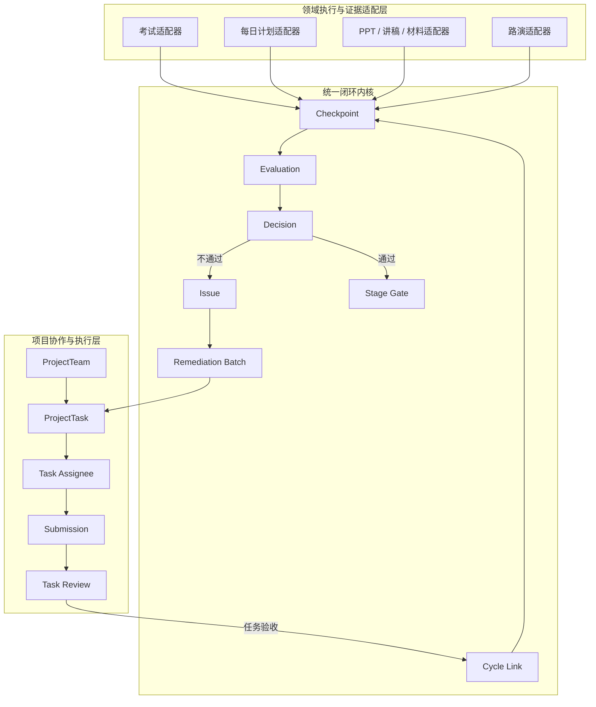
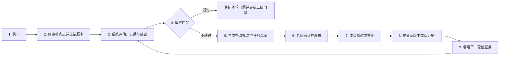

# OREP 统一闭环架构设计规格

日期：2026-07-17  
状态：已完成分段设计确认，等待用户审阅正式规格  
架构基准：**现状属于方案 A，目标向方案 C 演进，不采用纯方案 B**

## 1. 背景与问题

OREP 当前已经具备课程学习、考试、项目团队任务、PPT 生成与修复、讲稿与材料审核、在线路演、录像、AI 评分、整改建议和复评等能力。

当前问题不是完全没有闭环，而是各领域分别形成了自己的局部循环：

- 考试：作答、判分、错题本、再次考试。
- 项目任务：分配、提交、审核、退回、重新提交。
- 材料：提交、审核、退回修改。
- PPT：生成、质量检查、优化队列、单页修复、重新质检。
- 路演：演练、AI 评分、整改项、团队任务、再次演练。

这些局部循环使用不同的状态、对象和审核规则，不能统一回答以下项目管理问题：

- 某项整改任务为什么产生？
- 它来自哪次考试、哪页 PPT、哪段讲稿或哪轮路演？
- 它要关闭哪个问题？
- 现在是第几轮整改？
- 任务完成后应该回到哪个检查点？
- 上一轮问题是否关闭，还是仍然存在？
- 当前项目为什么还不能进入下一阶段？
- 谁做出了最终通过或不通过的裁决？

因此，本设计不重写各领域，而是在现有领域对象和 `ProjectTask` 之间增加统一闭环内核。

## 2. 设计目标

### 2.1 业务目标

1. 建立“执行—检查—判定—建议—整改—复查”的持续循环。
2. 支持系统自动判定与老师人工判定协同。
3. 支持系统根据问题和证据生成整改任务草案。
4. 整改草案必须经过老师确认后才能成为正式团队任务；老师可授权队长发布指定类型的普通任务。
5. 支持个人、多人和团队三种任务承接范围。
6. 区分任务验收和领域检查点通过。
7. 支持多轮整改、问题继承、新问题发现和历史对比。
8. 支持项目阶段门禁，解释为什么当前阶段尚未通过。

### 2.2 技术目标

1. 保留现有考试、PPT、路演、材料和任务系统。
2. 通过领域适配器接入统一内核。
3. 所有正式裁决、撤销和重新打开行为可追溯。
4. 防止重复生成任务、并发覆盖裁决和旧版本触发错误复查。
5. 支持分阶段迁移，不要求一次性切换全部领域。

## 3. 非目标

本设计不包含：

- 重写现有考试引擎。
- 重写 AI PPT 生成与页面修复引擎。
- 重写 AI 路演评分规则。
- 替换现有 `ProjectTask`、任务提交和任务审核体系。
- 重新设计课程内容管理和教师上传课程流程。
- 定义所有赛道的具体通过分数和评分标准；这些由模板或老师配置。
- 本阶段直接实现前端页面、数据库迁移或 API。

## 4. 已确认的治理原则

### 4.1 判定权

系统先给出自动判定、证据和建议；老师拥有最终裁决权。

老师可以：

- 通过。
- 驳回。
- 要求重新执行。
- 撤销系统自动通过。

老师做出人工裁决或撤销时必须填写原因。所有裁决均追加记录，不覆盖历史。

### 4.2 整改任务生成

系统根据问题和证据生成整改任务草案，但草案不立即生效。

老师需要确认：

- 负责人或团队。
- 截止时间。
- 整改范围。
- 验收标准。
- 复查策略。

老师确认后，草案才发布为正式 `ProjectTask`。老师可授权队长处理指定类型的普通任务草案。

### 4.3 承接范围

- 学生考试和个人每日计划：分配给具体学生。
- PPT 单页、讲稿段落、操作演练：可分配给一个或多个成员。
- 整套 PPT、完整路演和团队协作问题：分配给团队，并指定主负责人。
- 个人问题可升级为团队任务。
- 团队问题可拆分为多个个人任务。

### 4.4 审核模式

检查点支持三种审核模式：

1. `MANUAL_FINAL_REQUIRED`：必须人工终审。
2. `AUTO_PASS_AUDITABLE`：系统通过后自动完成，老师可追溯撤销。
3. `ADVISORY_ONLY`：系统只给建议，不形成正式通过判定。

默认规则：

- 老师发布的正式考试：必须由老师最终裁决；试卷配置只决定系统建议和是否需要逐题人工阅卷。
- 整套 PPT：必须人工终审。
- 完整路演：必须人工终审。
- 项目阶段门禁：必须人工终审。
- 日常自主测试：可自动通过。
- 普通每日计划：可自动通过。
- 老师手动发布的任务：由老师逐项选择审核模式。

### 4.5 队长权限

队长可以：

- 预审普通任务。
- 预审 PPT 页。
- 预审讲稿段落。
- 预审每日计划。
- 提出通过或退回建议。
- 拆分任务、调整成员和跟踪执行。
- 在老师明确授权时终审某一类普通任务。

队长不能最终裁决：

- 老师发布的正式考试。
- 整套 PPT。
- 完整路演。
- 项目阶段门禁。

## 5. 总体架构



### 5.1 领域适配层职责

领域适配器负责：

- 定义被检查的专业对象。
- 读取领域数据。
- 执行或触发领域评估。
- 生成证据引用与冻结快照。
- 定义复查所需的新版本或新执行轮次。
- 在复查后对比上一轮和当前轮结果。

领域适配器不负责：

- 直接发布正式整改任务。
- 覆盖老师裁决。
- 管理通用任务状态。
- 决定项目阶段是否最终通过。

### 5.2 统一闭环内核职责

闭环内核负责：

- 检查点及其轮次。
- 系统评估结果。
- 审核模式。
- 正式裁决。
- 问题与证据。
- 整改批次和任务草案。
- 新旧轮次关系。
- 阶段门禁。
- 审计、撤销和重新打开。

### 5.3 项目协作层职责

项目协作层继续复用现有：

- `ProjectTeam`
- `ProjectTask`
- `ProjectTaskAssignee`
- `ProjectTaskSubmission`
- `ProjectSubmissionAsset`
- `ProjectSubmissionLink`
- 任务审核和材料审核

它负责谁来做、什么时候做、提交什么和任务是否验收，不负责替代考试、PPT 质检或路演复评。

### 5.4 Project 上下文兼容规则

现有代码中 `ProjectTeam` 已经存在，但正式 `Project` 聚合尚未建立。闭环内核按以下方式兼容迁移：

- `teamId` 始终必填，保证当前项目团队能够立即接入。
- `projectId` 在正式 Project 上线前允许为空。
- 不允许使用 `teamId` 伪造 `projectId`，避免后续数据语义冲突。
- Project 上线后，通过明确的团队—项目绑定关系回填 `projectId`。
- 同一团队未来承载多个项目时，新的检查点必须同时绑定 `projectId` 和 `teamId`。
- 阶段门禁只有在正式 Project 上线后才作为项目级强制门禁启用；此前仅提供团队级闭环看板。

## 6. 统一主循环



统一原则：

> 任务完成只代表整改动作已被验收；原检查点是否通过，必须由领域重新验证。

例如：

- 修改 PPT 第 5 页任务完成后，必须重新进行页面质检或整套 PPT 审核。
- 路演整改任务全部完成后，必须重新演练和评分。
- 考试训练任务完成后，必须参加关联重考。
- 每日计划返工任务完成后，必须重新提交完成证据并按原审核策略复查。

## 7. 检查点层级

### 7.1 对象级检查点

用于最小可整改对象，例如：

- 一道错题。
- 一页 PPT。
- 一段讲稿。
- 一个每日计划项。
- 一个路演评分维度。

### 7.2 成果级检查点

用于一次完整成果，例如：

- 一次考试。
- 整套 PPT。
- 完整讲稿。
- 一天计划。
- 一次演练。

### 7.3 阶段级门禁

用于项目阶段，例如：

- 训练营通过。
- 材料就绪。
- 允许正式路演。
- 项目结项。

下级检查点全部通过不代表上级自动通过。成果级和阶段级可以要求老师人工终审。老师否决系统聚合结论时必须填写理由。

## 8. 核心对象

### 8.1 Checkpoint

主要字段：

- `id`
- `projectId`
- `teamId`
- `domainType`
- `level`
- `subjectType`
- `subjectId`
- `subjectVersion`
- `cycleNo`
- `reviewMode`
- `passPolicySnapshot`
- `status`
- `parentCheckpointId`
- `createdBy`
- `createdAt`

作用：定义检查什么、检查哪个版本、使用什么审核模式以及当前属于第几轮。

### 8.2 Evaluation

主要字段：

- `id`
- `checkpointId`
- `evaluatorType`
- `result`
- `score`
- `confidence`
- `ruleId`
- `ruleVersion`
- `evidenceSnapshot`
- `recommendation`
- `status`
- `createdAt`

作用：保存系统或人工评估事实。评估不等于最终裁决。

### 8.3 Decision

主要字段：

- `id`
- `checkpointId`
- `decisionType`
- `decisionSource`
- `decidedBy`
- `reason`
- `basedOnEvaluationId`
- `supersedesDecisionId`
- `createdAt`

决策类型包括：

- `PASSED`
- `FAILED`
- `REWORK_REQUIRED`
- `REVOKED`

Decision 只追加，不覆盖。

### 8.4 Issue

主要字段：

- `id`
- `checkpointId`
- `originCycleNo`
- `category`
- `severity`
- `title`
- `description`
- `sourceRef`
- `evidenceSnapshot`
- `acceptanceCriteria`
- `status`
- `repeatedFailureCount`
- `parentIssueId`
- `createdAt`
- `closedAt`

问题状态包括：

- `OPEN`
- `IN_REMEDIATION`
- `READY_FOR_RECHECK`
- `RESOLVED`
- `REOPENED`
- `WAIVED`

### 8.5 RemediationBatch

主要字段：

- `id`
- `checkpointId`
- `cycleNo`
- `status`
- `generatedBy`
- `reviewedBy`
- `reviewComment`
- `publishedAt`
- `createdAt`

状态包括：

- `SYSTEM_DRAFT`
- `TEACHER_REVIEW`
- `PARTIAL`
- `PUBLISHED`
- `COMPLETED`
- `CANCELLED`

### 8.6 ProjectTask 闭环扩展

现有任务增加或通过关联表保存：

- `checkpointId`
- `remediationBatchId`
- `issueId`
- `cycleNo`
- `sourceRef`
- `targetRef`
- `targetBaselineVersion`
- `acceptanceCriteria`
- `recheckPolicy`
- `assigneeScope`
- `draftSource`

### 8.7 CycleLink

主要字段：

- `previousCheckpointId`
- `currentCheckpointId`
- `triggerType`
- `triggerTaskIds`
- `reopenedIssueIds`
- `newIssueIds`
- `resolvedIssueIds`
- `createdAt`

作用：表达上一轮和下一轮之间的关系。

### 8.8 StageGate

主要字段：

- `id`
- `projectId`
- `gateType`
- `reviewMode`
- `requiredCheckpointPolicy`
- `status`
- `systemRecommendation`
- `finalDecisionId`
- `openedAt`
- `closedAt`

## 9. 状态模型

### 9.1 检查点状态

```text
CREATED
  → ASSESSING
  → AWAITING_DECISION
  → PASSED
  → FAILED
  → REMEDIATING
  → READY_FOR_RECHECK
  → 下一轮 CREATED
```

异常状态：

- `ASSESSMENT_FAILED`
- `REOPENED`
- `CANCELLED`

### 9.2 整改任务状态

```text
SYSTEM_DRAFT
  → TEACHER_REVIEW
  → PUBLISHED
  → IN_PROGRESS
  → SUBMITTED
  → PRE_REVIEWED
  → TASK_ACCEPTED
  → READY_FOR_RECHECK
```

退回分支：

```text
SUBMITTED / PRE_REVIEWED
  → CHANGES_REQUESTED
  → IN_PROGRESS
```

### 9.3 任务与检查点关系

- `TASK_ACCEPTED` 不自动设置 Checkpoint 为 `PASSED`。
- 所有关联整改任务验收后，Checkpoint 才可以进入 `READY_FOR_RECHECK`。
- 领域适配器完成复查后创建新的 Evaluation。
- 正式 Decision 决定新一轮通过或继续整改。

## 10. 领域适配设计

### 10.1 考试域

#### 10.1.1 考试来源

新增明确来源：

- `SELF_PRACTICE`
- `TEACHER_ASSIGNMENT`

老师发布考试需要保存：

- 发布者。
- 目标学生或团队。
- 通过分数。
- 审核模式。
- 截止时间。
- 允许重考次数。
- 未通过后的默认训练策略。

#### 10.1.2 自主测试

默认流程：

1. 学生自主开始考试。
2. 系统自动判分；需要人工阅卷的题目进入待阅卷。
3. 未通过时进入错题本和个人练习建议。
4. 默认不生成团队正式任务。
5. 老师可以主动把问题升级为项目任务。

#### 10.1.3 老师发布考试

默认流程：

1. 学生完成老师发布考试。
2. 系统自动判分并提供错题证据。
3. 人工题由老师阅卷。
4. 按通过分数形成系统建议。
5. 根据审核模式形成正式裁决。
6. 未通过时生成个人训练任务草案。
7. 老师确认训练范围、负责人和截止时间。
8. 训练任务验收后开放或安排重考。
9. 重考创建新 ExamAttempt，并通过 CycleLink 关联上一轮。

人工阅卷完成后必须重新计算正式通过结果，不能只把状态设为 `submitted`。

### 10.2 每日计划域

每日计划来源：

- `SYSTEM`
- `TEACHER`

每日计划至少保存：

- 日期。
- 时间段。
- 来源。
- 关联课程、考试、任务或问题。
- 负责人。
- 完成证据要求。
- 审核模式。
- 验收标准。
- 当前轮次。

流程：

1. 系统生成或老师添加计划。
2. 学生执行并提交完成证明。
3. 系统按规则自动判断。
4. 根据审核模式自动完成或等待人工审核。
5. 未通过时保留原计划失败记录。
6. 创建关联原计划的新整改任务草案。
7. 老师确认后发布。
8. 学生重新执行并提交新证据。

不得通过覆盖原计划来表示返工。

### 10.3 PPT、讲稿与材料域

可检查范围：

- PPT 单页。
- 多页范围。
- 整套 PPT。
- 讲稿段落。
- 完整讲稿。
- 普通项目材料。

流程：

1. 生成或人工编辑成果版本。
2. 系统质检形成 Evaluation 和 Issue。
3. 根据审核模式进入老师审核。
4. 不通过时按页、段落或整套成果生成整改草案。
5. 老师确认负责人和修改范围。
6. 成员修改后提交新版本。
7. 新版本不能覆盖旧版本。
8. 复查必须使用新的 `subjectVersion`。

现有 PPT 优化队列属于领域内部技术队列。只有老师确认需要团队执行时，才转为正式 `ProjectTask`。

PPT 页级任务示例：

- `sourceRef`：`ppt-task:107/page:5/version:3`
- `targetRef`：`ppt-task:107/page:5`
- `acceptanceCriteria`：补充三项量化收益，通过页面质量检查并通过老师预审。

### 10.4 路演域

每次演练必须创建独立轮次，不能覆盖上一轮评分。

流程：

1. 团队完成第 N 轮演练。
2. 保存录像、转写、评分和证据时间线。
3. 系统生成评估、问题和建议。
4. 老师做正式裁决。
5. 未通过时生成整改批次。
6. 一个路演问题可以拆为多个跨域任务：
   - PPT 修改。
   - 讲稿修改。
   - 个人表达训练。
   - 操作训练。
   - 团队计时演练。
7. 所有整改任务验收后，检查点进入待复评。
8. 团队进行第 N+1 轮演练。
9. 复评区分：
   - 已关闭问题。
   - 仍然存在的问题。
   - 本轮新增问题。
10. 达到项目路演门槛且老师通过后，解除“允许正式路演”门禁。

## 11. 项目管理工作台

### 11.1 老师工作台

集中展示：

- 待最终裁决。
- 待发布整改草案。
- 待处理阶段门禁。
- 系统自动通过后的抽查与撤销。
- 连续多轮失败。
- 严重问题。
- 队长升级事项。

### 11.2 队长工作台

集中展示：

- 团队任务分配。
- 普通任务预审。
- PPT 页和讲稿段落预审。
- 每日计划预审。
- 逾期、阻塞和无人承接任务。
- 老师授权的普通任务终审。

### 11.3 学生工作台

集中展示：

- 今日计划。
- 系统计划与老师计划的来源。
- 自己负责的整改任务。
- 退回原因。
- 问题证据。
- 验收标准。
- 允许修改的范围。
- 当前状态：执行中、已提交、已验收、等待复查、检查点通过。

### 11.4 项目闭环看板

项目看板需要回答：

- 当前处于哪个阶段门禁？
- 当前是第几轮整改？
- 有多少问题未关闭？
- 哪些问题连续多轮失败？
- 整改任务完成了多少？
- 哪些任务逾期或阻塞？
- 下一步需要完成什么才能进入复评？
- 当前为什么不能进入下一阶段？

## 12. 权限矩阵

| 动作 | 系统 | 学生 | 队长 | 老师 |
|---|---|---|---|---|
| 生成评估和整改草案 | 可以 | 不可以 | 不可以 | 可手动补充 |
| 修改草案并发布 | 不可以 | 不可以 | 老师授权时 | 可以 |
| 执行与提交 | 不可以 | 本人任务 | 本人/团队任务 | 必要时 |
| 普通任务预审 | 只给建议 | 不可以 | 可以 | 可以 |
| 普通任务终审 | 不可以 | 不可以 | 明确授权时 | 可以 |
| 正式考试终审 | 不可以 | 不可以 | 只能建议 | 最终裁决 |
| 整套 PPT 终审 | 不可以 | 不可以 | 只能建议 | 最终裁决 |
| 完整路演终审 | 不可以 | 不可以 | 只能建议 | 最终裁决 |
| 项目阶段门禁 | 提供建议 | 不可以 | 只能申请 | 最终裁决 |

队长预审不是强制增加一道流程。老师可以配置：

- 跳过队长预审。
- 队长建议后老师终审。
- 授权队长终审普通任务。

## 13. 异常与一致性设计

### 13.1 重复生成草案

使用 `checkpointId + cycleNo + issueId` 作为幂等键。重复调用返回已有草案，不重复创建任务。

### 13.2 并发审核

Decision、整改批次和任务审核使用版本号或乐观锁。

老师和队长同时提交时：

- 第一个合法提交成功。
- 后提交者收到版本冲突。
- 界面刷新最新状态。
- 不能静默覆盖裁决。

### 13.3 旧版本提交

任务保存 `targetBaselineVersion`。

如果提交物不是基于当前允许修改的版本：

- 可以保留为历史提交。
- 不触发正式复查。
- 提示成员基于最新版本重新提交或由老师确认合并。

### 13.4 AI 评估失败

检查点进入 `ASSESSMENT_FAILED`。

允许：

- 重试。
- 切换模型或规则版本。
- 切换为人工判定。
- 降级为 `ADVISORY_ONLY`。

AI 失败不能自动判定为通过或不通过。

### 13.5 任务部分发布失败

整改批次进入 `PARTIAL`。

- 已成功创建的任务保持有效。
- 未创建任务可以继续发布。
- 幂等键防止重复。
- 不对已发布任务进行整体回滚。

### 13.6 撤销自动通过

追加 `REVOKED` Decision。

- 原通过记录保留。
- Checkpoint 进入 `REOPENED`。
- 老师必须填写原因。
- 根据原因创建新 Issue 或重新打开旧 Issue。
- 创建新的整改批次。

### 13.7 连续多轮失败

达到可配置失败次数后：

- 增加 `repeatedFailureCount`。
- 提升问题严重度。
- 通知老师。
- 建议扩大整改范围、调整负责人、增加人工指导或重新定义目标。

系统不能无限自动复制相同任务。

### 13.8 来源对象归档或删除

闭环保存：

- 不可变 `sourceRef`。
- 证据冻结快照。
- 领域对象版本。

归档不删除闭环审计。物理删除需要单独的数据保留策略，不在普通业务操作中开放。

### 13.9 通知失败

核心事务先提交，通知通过 Outbox 异步发送。

通知失败：

- 不回滚裁决或任务发布。
- 自动重试。
- 超过阈值进入运维告警。

## 14. 事件与集成边界

建议使用领域事件连接内核与现有模块：

- `ExamAttemptSubmitted`
- `ExamManualReviewCompleted`
- `DailyPlanEvidenceSubmitted`
- `PptQualityCheckCompleted`
- `PptVersionPublished`
- `ScriptVersionSubmitted`
- `RoadshowScoringCompleted`
- `ProjectTaskAccepted`
- `CheckpointDecisionRecorded`
- `RemediationBatchPublished`
- `CheckpointReadyForRecheck`
- `StageGateDecisionRecorded`

事件必须包含：

- `eventId`
- `projectId`
- `teamId`
- `subjectType`
- `subjectId`
- `subjectVersion`
- `occurredAt`
- `actorId`
- `correlationId`

事件消费者必须幂等。

## 15. 渐进式迁移方案

### 阶段 1：闭环内核与任务关联

- 新增 Checkpoint、Evaluation、Decision、Issue、RemediationBatch、CycleLink 和 StageGate。
- 为现有 ProjectTask 增加闭环关联。
- 建立老师整改草案审核入口。
- 暂不改变现有领域流程。

### 阶段 2：路演与资源接入

- 接入 AI 路演整改项。
- 接入 PPT 质量检查和页面修复。
- 接入讲稿与材料审核。
- 验证跨域任务、多轮复评和问题继承。

选择这一阶段优先，是因为现有路演和 PPT 已经具备较深的局部闭环。

### 阶段 3：考试与每日计划

- 增加老师考试发布关系。
- 增加考试来源。
- 增加失败训练计划草案。
- 增加重考轮次关联。
- 建立独立 DailyPlan 对象。
- 增加计划来源、证据和审核模式。

### 阶段 4：项目阶段门禁

- 训练营通过门禁。
- 材料就绪门禁。
- 允许正式路演门禁。
- 项目结项门禁。
- 项目闭环总览和审计。

## 16. 验收测试

### 16.1 老师发布考试未通过

期望：

- 正确读取通过分数。
- 自动题判分与人工题阅卷合并。
- 生成个人训练草案。
- 老师确认后发布。
- 重考关联上一轮考试和训练批次。

### 16.2 自主测试未通过

期望：

- 进入错题本和个人练习建议。
- 默认不创建团队任务。
- 老师可手动升级。

### 16.3 PPT 单页退回

期望：

- 只生成页级整改任务。
- `sourceRef` 和 `targetRef` 指向正确页面和版本。
- 提交新版本，不覆盖旧版本。
- 任务验收后重新质检。

### 16.4 整套 PPT 终审未通过

期望：

- 可拆分多个页级、讲稿或团队任务。
- 全部任务完成后，整套 PPT 仍处于待复查。
- 老师终审通过后才关闭成果级检查点。

### 16.5 路演跨域整改

期望：

- 一个整改批次拆分 PPT、讲稿、个人训练和团队演练任务。
- 所有任务保留同一个问题来源和批次。
- 任务完成后进入下一轮演练，而不是直接通过路演检查点。

### 16.6 复评出现新问题

期望：

- 旧问题可关闭、继续或重新打开。
- 新问题独立创建。
- 保存发现轮次。
- 不覆盖上一轮问题和证据。

### 16.7 撤销自动通过

期望：

- 追加撤销记录。
- 老师必须填写原因。
- 重新打开检查点。
- 创建新的整改批次。

### 16.8 并发审核

期望：

- 只能一个裁决成功写入当前版本。
- 后提交者收到冲突提示。
- 不覆盖老师最终裁决。

### 16.9 连续多轮失败

期望：

- 失败次数累积。
- 达到阈值后升级给老师。
- 不无限复制相同任务。

### 16.10 阶段门禁

期望：

- 展示下级检查点、未关闭问题和未完成整改。
- 系统给出可解释建议。
- 老师做最终裁决。
- 裁决可追溯、可撤销。

## 17. 可观测性与审计

关键指标：

- 每个领域检查点数量。
- 平均整改轮次。
- 首轮通过率。
- 连续多轮失败比例。
- 系统判定与老师裁决差异率。
- 系统自动通过被撤销比例。
- 整改草案发布率。
- 任务按时完成率。
- 任务验收到检查点复查的等待时长。
- 各项目阶段门禁停留时长。

审计记录至少包含：

- 谁创建检查点。
- 使用什么规则版本。
- 系统给出了什么评估。
- 老师或队长做了什么操作。
- 为什么通过、退回或撤销。
- 生成了哪些问题和任务。
- 哪个提交物关闭了哪个问题。
- 哪一轮复查最终通过。

## 18. 安全与权限

- 所有操作必须校验 tenant、project、team 和角色范围。
- 学生只能查看自己有权限的任务、计划、考试和团队证据。
- 队长只能管理所在团队。
- 老师只能管理其教学或项目范围。
- AI 服务不能直接形成老师专属最终裁决。
- 证据快照可能包含视频、转写和学生作答，需要沿用现有资源访问控制。
- Decision、证据和审核意见属于审计数据，不允许普通用户删除。

## 19. 成功标准

设计落地后，平台应能对任意失败项回答：

1. 哪个领域对象没有通过？
2. 使用了什么规则和证据？
3. 谁做出了正式裁决？
4. 产生了哪些问题？
5. 系统生成了哪些整改草案？
6. 老师发布了哪些正式任务？
7. 任务分配给谁？
8. 提交了哪个新版本或新证据？
9. 当前是第几轮整改？
10. 哪些问题已关闭、仍存在或新出现？
11. 什么时候可以再次检查？
12. 为什么项目阶段仍未通过？

如果这些问题都能从统一闭环中直接回答，则方案 C 的核心目标达成。

## 20. 最终设计决策摘要

- 保留各领域专业对象，不采用纯通用流程引擎。
- 使用统一闭环内核管理检查、裁决、问题、整改和复查。
- 使用现有 ProjectTask 执行正式整改。
- 系统只生成任务草案，老师确认后发布。
- 老师拥有正式考试、整套 PPT、完整路演和阶段门禁的最终裁决权。
- 队长可以预审并在明确授权时终审普通任务。
- 任务完成不等于检查点通过。
- 所有新版本、新轮次和撤销操作保留历史。
- 从路演和资源域开始渐进接入，再建设考试、每日计划和阶段门禁。
